# Instalasi MySQL

## Menggunakan Termux
1. Berikan akses termux ke memori internal .
==termux-setup-storage==
2. Muncul pop up untuk meminta izin akses ke memori internal.
==klik izinkan/allow acces==
3. Lakukan update dan sekaligus upgrade paket.
==pkg upgrade && upgrade -y==
4. Jika ada konfirmasi untuk melanjutkan instalasi.  Silahkan klik y dan enter.
5. Install aplikasi MariaDB.
==pkg install mariadb==
6. Memberikan akses aman ke MySQL.
==mysql_safe==
7. Hentikan proses
==Ctrl + z==
8. Masuk ke dalam admin
==mysql -u root==

## Referensi Vidio YouTube


# Penggunaan Awal MySQL
## Struktur Query
```
mysql -u root
```
## Hasil Query
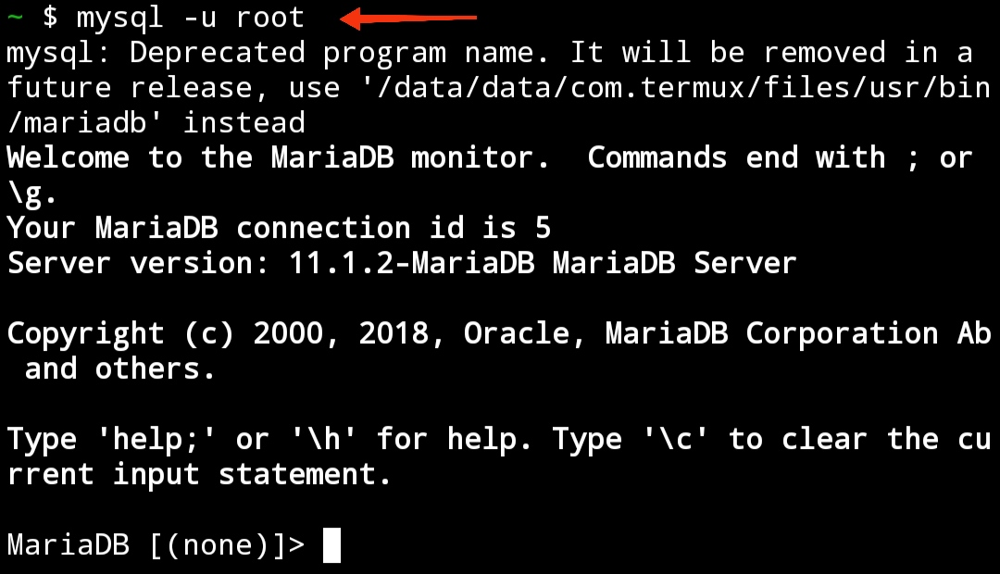

## Analisis mysql -u root

## `mysql:` 
Ini adalah perintah untuk mengakses shell MySQL, yaitu antarmuka command-line untuk berinteraksi dengan server MySQL.

## `-u root:`
Parameter ini menentukan pengguna (user) yang akan digunakan untuk masuk ke server MySQL. Dalam hal ini, "root" adalah nama pengguna yang diberikan, dan "root" adalah tingkat tertinggi dengan hak akses penuh.

## Kesimpulan mysql -u root 
`mysql -u root` memberikan akses penuh ke server MySQL dengan menggunakan pengguna "root", yang memiliki hak akses maksimum. Penggunaan perintah ini perlu hati-hati untuk menghindari risiko keamanan.


# Database
## Membuat Database
Untuk membuat database di SQL, Anda dapat menggunakan perintah `CREATE DATABASE` dengan menentukan nama database yang diinginkan. Pastikan untuk memiliki hak akses yang sesuai, dan verifikasi pembuatan database dengan perintah `SHOW DATABASE`S. Pengetahuan tentang sintaks SQL dan hak akses server diperlukan untuk menjalankan operasi ini dengan sukses.

**Contoh:**
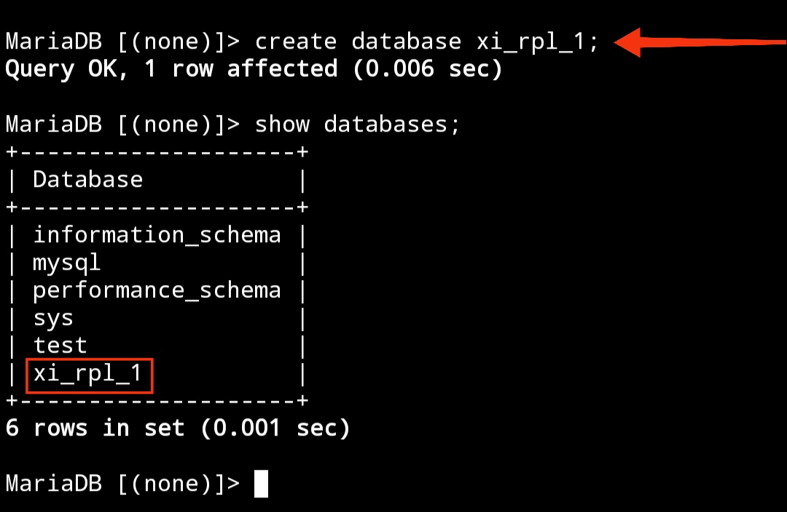

## Menampilkan Database
Untuk menampilkan daftar database di MySQL, Anda dapat menggunakan perintah SQL `SHOW DATABASES;`. Perintah ini memberikan gambaran keseluruhan database yang tersedia di server MySQL. Pastikan pengguna yang digunakan memiliki izin untuk melihat database, dan gunakan perintah ini melalui antarmuka command-line atau alat manajemen database seperti phpMyAdmin.

**Contoh:**


## Menghapus Database 
Untuk menghapus sebuah database di SQL, Anda dapat menggunakan perintah `DROP DATABASE`. Namun, perlu diingat bahwa tindakan ini permanen dan akan menghapus seluruh data di dalam database tersebut. Pastikan Anda memiliki backup data yang dibutuhkan sebelum melanjutkan.

**Contoh:**
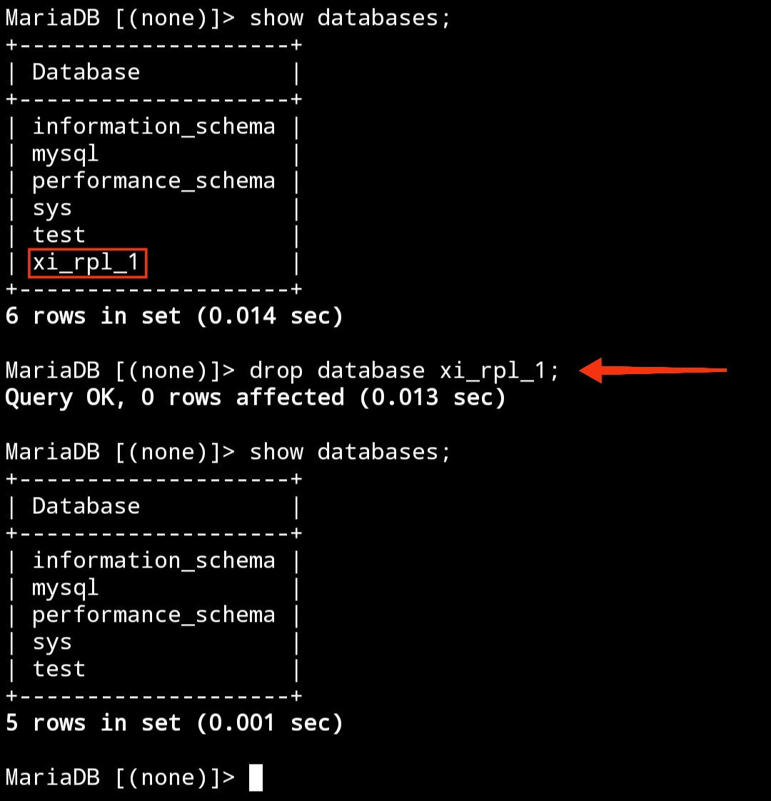

## Menggunakan Database 
perintah `USE` digunakan untuk beralih atau menggunakan sebuah database tertentu di server. Perintah ini sangat berguna ketika Anda bekerja dengan beberapa database di server MySQL dan ingin fokus pada satu database dalam sesi tertentu.

**Contoh:**

# Tipe Data
## Angka

- ==INT:== Untuk menyimpan nilai bilangan bulat (integer). Misalnya, INT dapat digunakan untuk menyimpan angka seperti 1, 100, -10, dan sebagainya.
- ==DECIMAL:==Digunakan untuk menyimpan nilai desimal presisi tinggi, cocok untuk perhitungan finansial atau keuangan.
- ==FLOAT dan DOUBLE:==Digunakan untuk menyimpan nilai desimal dengan presisi floating-point. DOUBLE memiliki presisi lebih tinggi dibandingkan FLOAT.
- ==TINYIN, SMALLINT,== ==MEDIUMINT==, dan ==BIGINT:==Tipe data ini menyimpan bilangan bulat dengan ukuran yang berbeda-beda.

**Contoh:**
```sql
CREATE TABLE contoh_tabel (
    id INT,
    harga DECIMAL(10, 2),
    jumlah_barang TINYINT
);
```
**Hasil:**
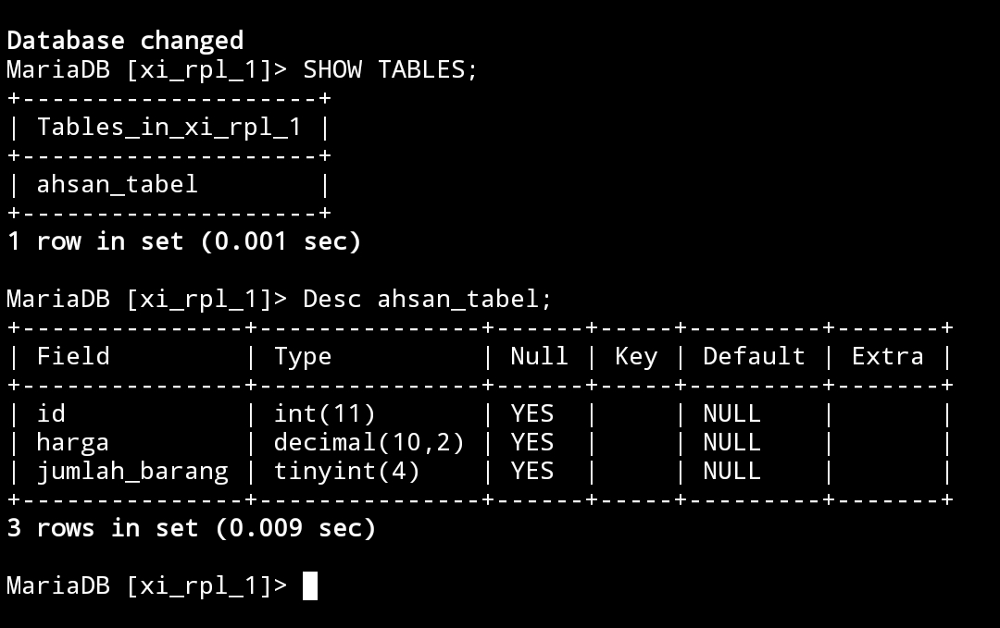

---

## Teks

- ==CHAR(N)==Menyimpan string karakter tetap dengan panjang N. Contoh: ==CHAR(10)==akan menyimpan string dengan panjang tepat 10 karakter.
- ==VARCHAR(N):== Menyimpan string karakter dengan panjang variabel maksimal N. Misalnya, ==VARCHAR(255)==dapat menyimpan string hingga 255 karakter, tetapi sebenarnya hanya menyimpan panjang yang diperlukan plus beberapa overhead.
- ==TEXT:==Digunakan untuk menyimpan teks dengan panjang variabel, tanpa batasan panjang tertentu. Cocok untuk data teks yang panjangnya tidak terduga.
- ==ENUM:==Memungkinkan Anda mendefinisikan set nilai yang mungkin dan membatasi kolom hanya dapat mengambil salah satu dari nilai tersebut.
- ==SET:==Mirip dengan ENUM, namun dapat menyimpan satu atau lebih nilai dari himpunan yang telah ditentukan.

**Contoh:**
```sql
CREATE TABLE ahsan01tabel (
    nama CHAR(50),
    alamat VARCHAR(100),
    catatan TEXT,
    status ENUM('Aktif', 'Non-Aktif')
);
```
**Hasil:**
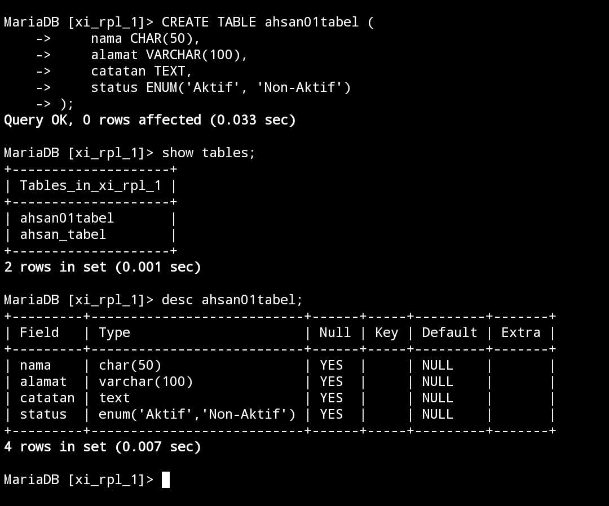

---
## Tanggal

 
- ==DATE== :  Menyimpan nilai tanggal dengan format YYYY-MM-DD.

- ==TIME==: Menyimpan nilai waktu dengan format HH:MM:SS.

- ==DATETIME: ==Menggabungkan nilai tanggal dan waktu dengan format YYYY-MM-DD HH:MM:SS.

- ==TIMESTAMP: ==Sama seperti DATETIME, tetapi dengan kelebihan diatur secara otomatis saat data dimasukkan atau diubah.

**Contoh:**
```sql
CREATE TABLE tangga_tabel (
    tanggal DATE,
    waktu TIME,
    datetimekolom DATETIME,
    timestampkolom TIMESTAMP
);
```
**Hasil:**


Dalam contoh ini, kolom **==tanggal==** akan menyimpan nilai tanggal, **==waktu==** menyimpan nilai waktu, ==**datetimekolom**== menyimpan kombinasi tanggal dan waktu, dan **==timestampkolom==** akan secara otomatis diatur saat data dimasukkan atau diubah.

---

## Boolean

- ==BOOL / BOOLEAN / TINYINT(1):== Digunakan untuk menyimpan nilai boolean, yang dapat mewakili kebenaran atau kesalahan. Representasi nilai benar adalah 1, sedangkan nilai salah direpresentasikan sebagai 0. Meskipun nilai selain 0 dianggap benar, secara umum, ketiganya seringkali digunakan secara bergantian. Seringkali, ketika Anda mendeklarasikan kolom sebagai BOOL atau BOOLEAN, MySQL mengonversinya secara otomatis menjadi TINYINT(1), yang juga dapat digunakan untuk menyimpan nilai boolean dengan 0 untuk false dan 1 untuk true.

1. Menggunakan `BOOLEAN` :
```sql
CREATE TABLE boolean_tabel (
    title VARCHAR(255),
    completed BOOLEAN
);
```
Hasil `BOOLEAN` :


Dalam contoh diatas, kita mendefinisikan kolom `completed` sebagai tipe data `BOOLEAN`. Ini merupakan cara yang sah dan umum digunakan di MySQL. Nilai yang dapat disimpan dalam kolom ini adalah `TRUE` atau `FALSE`, atau dalam representasi angka, 1 atau 0.

---

 2. Menggunakan `BOOL` :
```sql
CREATE TABLE bool_tabel (
    title VARCHAR(255),
    completed BOOL
);
```
Hasil `BOOL` :


Dalam contoh ini, kita menggunakan `BOOL` sebagai tipe data untuk kolom `completed`. Perlu dicatat bahwa MySQL secara otomatis mengonversi `BOOL` menjadi `TINYINT(1)`. Oleh karena itu, pada dasarnya, ini setara dengan contoh pertama. Namun, beberapa pengembang lebih suka menggunakan `BOOLEAN` untuk kejelasan.

---

3. Menggunakan `TINYINT(1)` :
```sql
CREATE TABLE tinyint_tabel (
    title VARCHAR(255),
    completed TINYINT(1)
);
```
Hasil `TINYINT` :
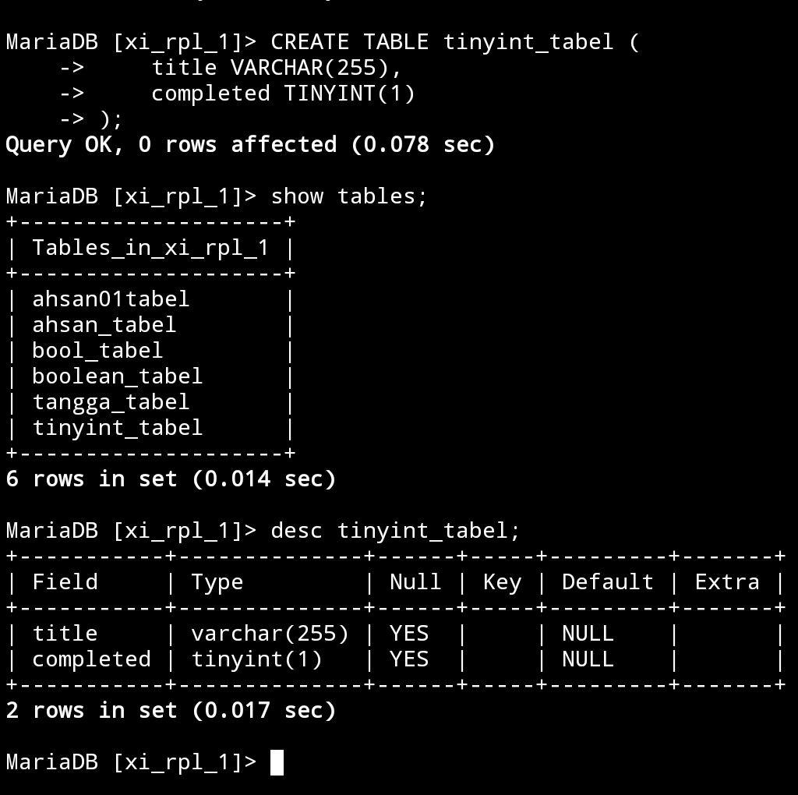

Dalam contoh ini, kita menggunakan `TINYINT(1)` sebagai tipe data untuk kolom `completed`. Ini adalah pendekatan yang valid karena MySQL mengonversi `BOOL` menjadi `TINYINT(1)` secara otomatis. Dalam hal ini, nilai yang dapat disimpan adalah 1 untuk `TRUE` dan 0 untuk `FALSE`.

---

# Tabel
## Membuat Tabel
### Struktur Query
```sql
CREATE TABLE [nama_tabel] ( 
Nama_kolom1 tipe_data(ukuran) (tipe_constrait) ,
Nama_kolom2 tipe_data(ukuran) (tipe_constrait) ,
Nama_kolom3 tipe_data(ukuran) (tipe_constrait) ,
);
```
### Contoh Query
```sql
CREATE TABLE pelanggan ( 
id_pelanggan int(4)PRIMARY KEY NOT NULL , nama_depan varchar(25) NOT NULL , nama_belakang varchar(25) NOT NULL , no_telp char(12)UNIQUE  
);
```
### Hasil

### Analisis
1. `CREATE TABLE pelanggan (` : perintah untuk membuat sebuah tabel dengan nama "pelanggan".
2. `id_pelanggan int(4) PRIMARY KEY NOT NULL` : Ini mendefinisikan kolom "`id_pelanggan`" sebagai tipe data integer dengan panjang maksimum 4 digit. Kata kunci "`PRIMARY KEY`" menandakan bahwa kolom ini adalah kunci utama (`primary key`) untuk tabel ini, sehingga nilainya harus unik dan tidak boleh kosong (`NOT NULL`).
3. `nama_depan varchar(25) NOT NULL` : Ini mendefinisikan kolom "nama_depan" sebagai tipe data `varchar` (karakter variabel) dengan panjang maksimum 25 karakter. Kata kunci "`not null`" menandakan bahwa kolom ini tidak boleh kosong.
4. `nama_belakang varchar(25) NOT NULL` : Ini mendefinisikan kolom "`nama_belakang`" dengan tipe data `varchar` dan panjang maksimum 25 karakter. Sama seperti sebelumnya, kata kunci "`not null`" menandakan bahwa kolom ini tidak boleh kosong.
5. `no_telp char(12) UNIQUE` : Ini mendefinisikan kolom "`no_telp`" sebagai tipe data char (karakter) dengan panjang tepat 12 karakter. Kata kunci "`UNIQUE`" menandakan bahwa nilai di kolom ini harus unik untuk setiap baris dalam tabel.
### Kesimpulan
Perintah-perintah tersebut digunakan untuk membuat tabel "pelanggan" dalam basis data. Tabel ini memiliki kolom-kolom: "id_pelanggan" sebagai kunci utama dengan panjang maksimum 4 digit, "nama_depan" dengan panjang maksimum 25 karakter, "nama_belakang" dengan panjang maksimum 25 karakter, dan "no_telp" dengan panjang tepat 12 karakter yang harus unik untuk setiap baris dalam tabel.

---
## Tampilkan Struktur Tabel
### Struktur Query
```sql
desc [nama_tabel];
```
### Contoh Query
```sql
desc pelanggan;
```
### Hasil

### Analisis
`desc pelanggan;`= Perintah ini akan memberikan informasi tentang struktur tabel "pelanggan", termasuk nama kolom, tipe data kolom, dan informasi lainnya seperti nilai default atau constraint yang terkait dengan kolom tersebut.
### Kesimpulan
Perintah "`desc pelanggan`" adalah singkatan dari "describe pelanggan" yang digunakan dalam SQL untuk mendapatkan informasi tentang struktur tabel "pelanggan". Ini memberikan detail tentang kolom-kolom dalam tabel, seperti nama kolom, tipe data, dan constraint yang terkait.

---
## Menampilkan Daftar Tabel
### Struktur Query
```sql
Show tables;
```
### Hasil
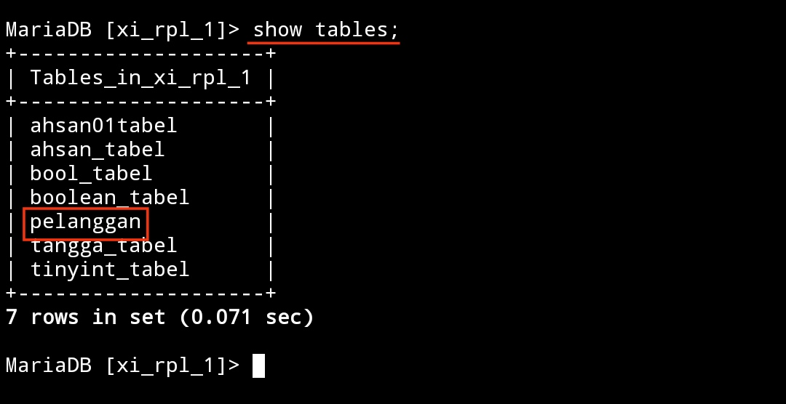
### Analisis
`Show tables;` = Perintah "SHOW TABLES;" digunakan dalam SQL untuk menampilkan semua tabel yang ada dalam basis data yang sedang digunakan.
### Kesimpulan
Perintah "SHOW TABLES;" digunakan dalam SQL untuk menampilkan daftar semua tabel yang ada dalam basis data yang sedang digunakan. Ini membantu pengguna untuk melihat tabel-tabel yang tersedia dan memilih tabel yang ingin mereka akses atau manipulasi lebih lanjut dalam basis data.

---
## QnA

>[! faq]- Perbedaan PRIMERY KEYY dan UNIQUE!
>PRIMARY KEY: Mirip seperti nomor identitas yang unik bagi setiap baris, tak boleh kosong.
>UNIQUE: Lebih seperti nomor yang bisa digunakan untuk keperluan lain, harus unik tapi bisa juga kosong.

>[! faq]- Mengapa Hanya Kolom Id Pelanggan yang menggunakan Constraint "PRIMARY KEY"?
>Karena kolom ID pelanggan berperan sebagai identitas unik untuk setiap entitas pelanggan dalam basis data.

>[! faq]- Mengapa pada kolom no_telp yang menggunakan tipe data CHAR bukan VARCHAR?
>Karena nomor telepon biasanya memiliki panjang karakter yang tetap, sehingga menggunakan tipe data CHAR yang tetap panjang lebih efisien daripada VARCHAR yang panjangnya bervariasi.

>[! faq]- Mengapa Hanya kolom no_telp yang menggunakan constraint "UNIQUE"?
>Karena nomor telepon harus unik untuk setiap entitas dalam basis data, memastikan tidak ada duplikasi dengan menggunakan constraint "UNIQUE" pada kolom no_telp adalah penting.

>[! faq]- Mengapa kolom no_telp tidak memakai constraint " NOT NULL", sementara kolom lainnya Menggunakan constraint tersebut?
>Karena nomor telepon mungkin tidak selalu tersedia atau tidak wajib diisi dalam setiap entitas, oleh karena itu constraint "NOT NULL" tidak digunakan untuk kolom no_telp.

# Insert & Select
## Insert
### Insert 1 Baris

#### Struktur
```sql
Insert into [nama_table]
Values (data_1,data_2,data_3,data_4);
```
#### Contoh
```sql
INSERT INTO pelanggan Values (1, "Ahsan","putra",'0879377266');
```
#### Hasil
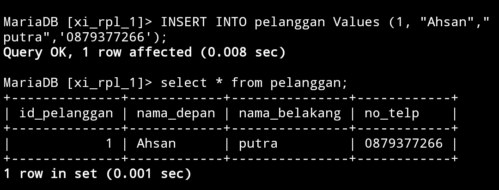
#### Analisis
`INSERT INTO pelanggan Values (1, "Ahsan","putra",'0879377266');` = digunakan dalam SQL untuk memasukkan data ke dalam tabel "pelanggan". Dalam pernyataan ini:
Angka 1 dimasukkan ke dalam kolom "id_pelanggan".
Kata "Ahsan" dimasukkan ke dalam kolom "nama_depan".
Kata "putra" dimasukkan ke dalam kolom "nama_belakang".
Nomor "0879377266" dimasukkan ke dalam kolom "no_telp".
Perintah ini akan menyisipkan satu baris data baru ke dalam tabel "pelanggan" dengan nilai-nilai yang ditentukan dalam urutan yang sesuai dengan struktur kolom tabel.
#### Kesimpulan
digunakan untuk menyisipkan data baru ke dalam tabel "pelanggan". Data yang dimasukkan adalah ID pelanggan, nama depan, nama belakang, dan nomor telepon.

---
### Insert lebih 1 Baris
#### Struktur
```
INSERT INTO(NAMA_TABLE)
Values (data_1,data_2,data_4),
(data_1,data_2,data_3,data_4);
```

#### Contoh
```sql
INSERT INTO pelanggan Values 
(2, "taufiq","adiguna",'087928736'),(3,"fatur","rahman",'082673647'),(4,"alfahrezi","Raihan",'08237647');
```
#### Hasil

#### Analisis
`(2, "taufiq","adiguna",'087928736'),` = untuk menambah data seperti id_pelanggan: 2, nama_depan: 'taufiq', nama_belakang: 'adiguna', no_telp: '087928736' pada tabel.
`(3,"fatur","rahman",'082673647'),` = untuk menambah data seperti id_pelanggan: 3, nama_depan: 'fatur', nama_belakang: 'rahman', no_telp: '082673647' pada tabel.
`(4,"alfahrezi","Raihan",'08237647');` = untuk menambah data seperti id_pelanggan: 4, nama_depan: 'alfahrezi', nama_belakang: 'Raihan', no_telp: '08237647' pada tabel.
#### Kesimpulan
digunakan untuk memasukkan beberapa baris data sekaligus ke dalam tabel "pelanggan". Namun, perlu diperhatikan bahwa nilai-nilai yang dimasukkan harus sesuai dengan tipe data dan format yang diharapkan untuk setiap kolom.

---
## Select
### **Select all table**
#### Struktur

```mysql
SELECT * FROM [NAMA_TABLE];
```

#### Contoh
```MySQL
SELECT * FROM pelanggan;
```

#### Hasil


#### Analisis
`SELECT * FROM pelanggan;` : `SELECT` Memilih data dari basis data, `*` (Asterisk) Memilih semua kolom dalam tabel yang ditentukan, `FROM` Menentukan tabel mana yang ingin Anda ambil data dari. `pelanggan` Nama tabel yang diambil data dari.

#### Kesimpulan 
Pernyataan `SELECT * FROM pelanggan;` digunakan untuk memilih semua kolom dari tabel bernama "pelanggan" dalam basis data yang digunakan.

---
### **Select field spesifik**
#### Struktur 
```mysql
SELECT NAMA_KOLOM_1, NAMA_KOLOM_2, NAMA_KOLOM_N FROM PELANGGAN;
```

#### Contoh
```mysql
SELECT id_pelanggan, nama_depan, nama_belakang FROM PELANGGAN;
```

#### Hasil
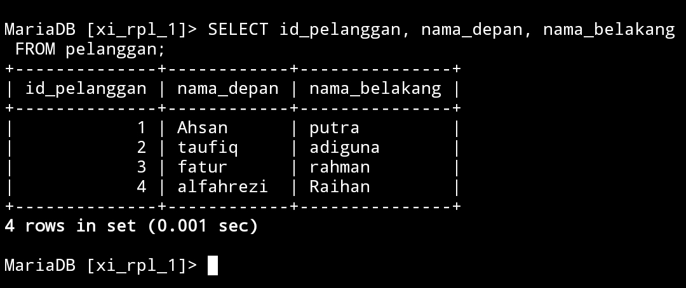

#### Analisis
 `SELECT id_pelanggan, nama_depan, nama_belakang FROM PELANGGAN;`  : digunakan untuk memilih kolom-kolom tertentu, yaitu `Id_pelanggan`, `nama_depan`, dan `nama_belakang`, dari tabel "`PELANGGAN`" dalam basis data yang sedang digunakan.

#### Kesimpulan 
Kesimpulan dari pernyataan `SELECT id_pelanggan, nama_depan, nama_belakang FROM PELANGGAN;` adalah digunakan untuk memilih kolom-kolom tertentu, dari tabel "PELANGGAN" dalam basis data yang sedang digunakan.

---
### **Select kondisi "where"**
#### Struktur
```mysql
SELECT Nama_Kolom FROM Nama_Table WHERE Id_Pelanggan=2; 
```

#### Contoh
```mysql
SELECT nama_depan FROM pelanggan WHERE Id_Pelanggan=1;
```

#### Hasil 

#### Analisis
`SELECT nama_depan FROM pelanggan WHERE Id_Pelanggan=1;` : `SELECT`: Pernyataan yang digunakan untuk memilih kolom atau nilai dari tabel. `Nama_depan`: Nama kolom yang ingin ditampilkan dalam hasil kueri. `FROM`: Kata kunci yang menunjukkan tabel yang digunakan untuk mengambil data. `pelanggan`: Nama tabel dari mana data akan diambil. `WHERE`: Kata kunci yang digunakan untuk menerapkan kondisi pada kueri. `Id_Pelanggan`: Nama kolom yang menjadi subjek kondisi dalam klausa WHERE. `=`: Operator perbandingan yang digunakan untuk memeriksa kesamaan antara dua nilai. `1`: Nilai yang digunakan dalam kondisi WHERE untuk memeriksa kesamaan dengan kolom `Id_Pelanggan`.  `;`: Tanda akhir pernyataan SQL yang menunjukkan akhir perintah.

Jadi, secara keseluruhan, pernyataan tersebut memilih nilai `nama_depan` dari tabel "pelanggan" di mana nilai kolom `Id_Pelanggan` sama dengan 1.
#### Kesimpulan
Pernyataan SQL `SELECT nama_depan FROM pelanggan WHERE Id_Pelanggan=1;` secara jelas digunakan untuk mengambil nilai dari kolom `nama_depan` dari tabel "pelanggan" di mana nilai kolom `Id_Pelanggan` sama dengan 1. Ini berarti pernyataan ini mengembalikan nama depan dari pelanggan yang memiliki ID pelanggan tertentu, yaitu 1, dari basis data yang sedang digunakan. Jadi, kesimpulannya adalah bahwa pernyataan ini secara spesifik memungkinkan pengambilan data yang ditargetkan berdasarkan kondisi yang ditentukan.

---
# Update

## Struktur query 
```sql
UPDATE nama_tabel SET nama_kolom WHERE kondisi;
```

## Contoh query 
```sql
UPDATE pelanggan SET no_telp="081532438" WHERE id_pelanggan="1";
```
## Hasil
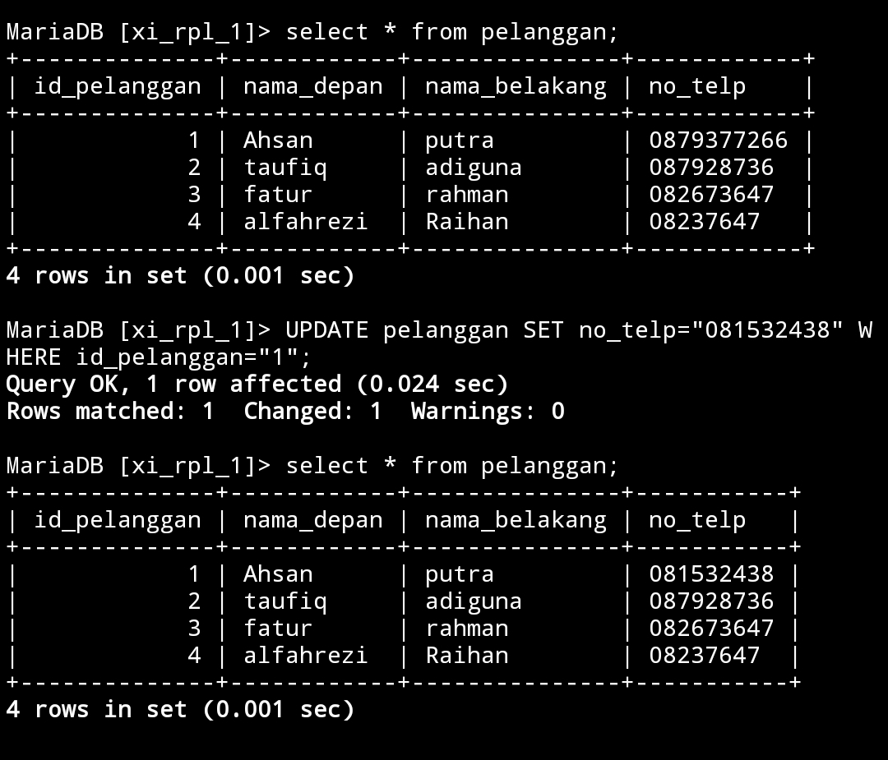
## Analisis
`UPDATE pelanggan` : Menginstruksikan database untuk memperbarui data dalam tabel "`pelanggan`".
`SET no_telp="081532438"` : Menetapkan nilai kolom "`no_telp`" menjadi "081532438" untuk baris yang memenuhi kondisi yang ditetapkan selanjutnya.
`where id_pelanggan="1"` : Menentukan kondisi di mana perubahan harus diterapkan, dalam hal ini, hanya pada baris di mana nilai kolom "`id_pelanggan`" adalah "1".
## Kesimpulan
perintah SQL `UPDATE` digunakan untuk memperbarui data dalam sebuah tabel berdasarkan kondisi yang ditentukan. Dalam contoh ini, perintah `UPDATE` digunakan untuk mengubah nomor telepon pelanggan dengan ID 1 menjadi "081532438" dalam tabel pelanggan. Perintah ini memungkinkan pengelolaan dan pembaruan data yang efisien dalam database

---
# Delete Data
## Struktur query 
```sql
DELETE FROM nama_tabel WHERE kondisi;
```
## Contoh query
```sql
DELETE FROM pelanggan WHERE id_pelanggan="1";
```
## Hasil
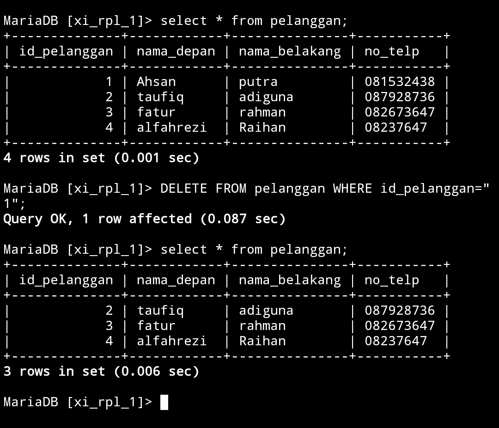
## Analisis
`DELETE FROM pelanggan` : Menginstruksikan database untuk menghapus data dari tabel "pelanggan".
`WHERE id_pelanggan="1"` : Menetapkan kondisi di mana penghapusan harus diterapkan, dalam hal ini, hanya pada baris di mana nilai kolom "id_pelanggan" adalah "1".
### Kesimpulan
perintah SQL `DELETE` digunakan untuk menghapus data dari sebuah tabel berdasarkan kondisi yang ditetapkan. Dalam contoh ini, perintah `DELETE` digunakan untuk menghapus entri pelanggan dengan ID 1 dari tabel pelanggan. Perintah ini memungkinkan pengelolaan dan penghapusan data yang efisien dalam database.

---
# Delete Tabel
## Struktur query
```sql
drop table nama_table;
```
## Contoh query
```sql
drop table putra_table;
```

## Hasil

## Analisis
`drop table putra_table;` : digunakan untuk menghapus tabel yang bernama `putra_table` dari database.
## Kesimpulan
Perintah `DROP TABLE putra_table;` menghapus tabel `putra_table` secara permanen dari database, sehingga semua data yang ada di dalamnya akan hilang.

---
---