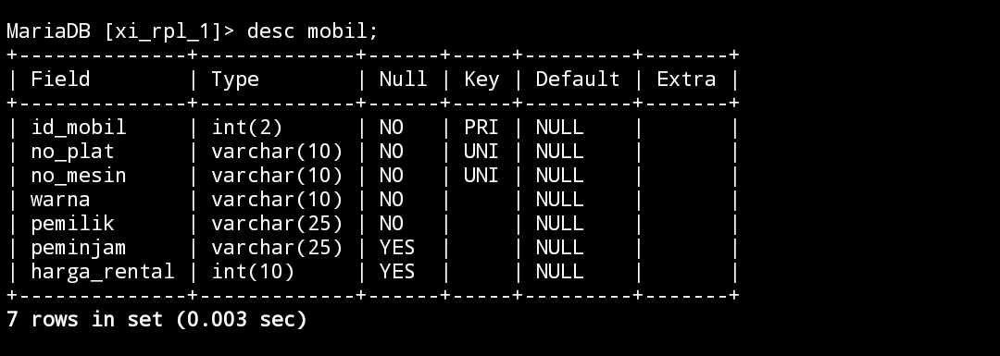
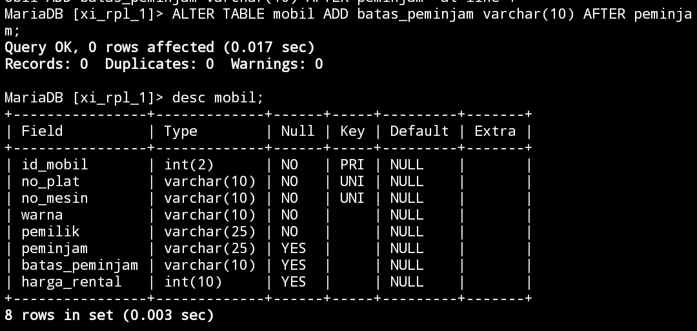

# Menambahkan kolom
>[!Info] INI SEBELUM MENAMBAHKAN ALTER
>

## Struktur query
```mysql
ALTER TABLE nama_tabel ADD nama_kolom varchar(10) AFTER nama_kolom;
```
## Contoh query
```mysql
ALTER TABLE mobil ADD batas_peminjam varchar(10) AFTER peminjam;
```
## Hasil

## Analisis
## Kesimpulan
## Tambahan
### Kode
```mysql
UPDATE mobil SET batas_peminjam="2024-04-24" WHERE peminjam IS NOT Null;
```
### Hasil


# Mengubah nama kolom
## Struktur query
## Contoh query
```mysql
ALTER TABLE mobil RENAME COLUMN batas_peminjam TO deadline;
```
## Hasil
## Analisis 
## kesimpulan
# Mengubah tipe data kolom
## Struktur query
## Contoh query
```mysql

```
## Hasil
## Analisis 
## kesimpulan
# Menambahkan constraint
## Struktur query
## Contoh query
```mysql

```
## Hasil
## Analisis 
## kesimpulan
# Menambahkan constraint
## Struktur query
## Contoh query
```mysql

```
## Hasil
## Analisis 
## kesimpulan