## AND
### Struktur query
```MySQL
SELECT nama_kolom1,nama_kolom2 FROM nama_tabel WHERE kondisi(1) AND kondisi(2)
```
### Contoh query
```sql
SELECT warna,pemilik FROM mobil WHERE warna="hitam" AND pemilik="Ahsan";
```
### Hasil
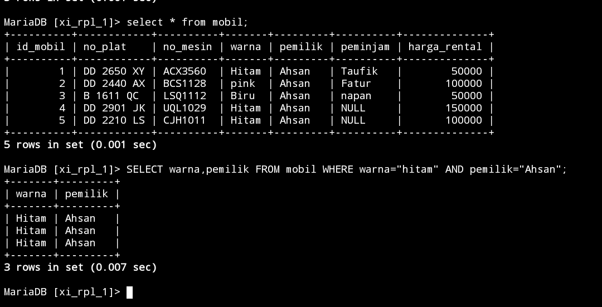
### Analisis
`SELECT warna,pemilik FROM mobil WHERE warna="hitam" AND pemilik="Ahsan";` 
- `SELECT` : Kata kunci yang digunakan untuk memilih kolom atau nilai dari tabel, 
- `warna, pemilik` : Nama kolom yang ingin ditampilkan dalam hasil query, 
- `FROM` : Kata kunci yang menunjukkan tabel yang digunakan untuk mengambil data, 
- `mobil` : Nama tabel dari mana data akan diambil, 
- `WHERE` : Kata kunci yang digunakan untuk menerapkan kondisi pada kueri, 
- `warna="hitam"` : Kondisi di mana nilai kolom `warna` harus sama dengan "hitam", 
- `AND` : Operator logika yang digunakan untuk menggabungkan dua atau lebih kondisi,
- `pemilik="Ahsan"` : Kondisi di mana nilai kolom `pemilik` harus sama dengan "Ahsan".
### Kesimpulan
`SELECT warna, pemilik FROM mobil WHERE warna="hitam" AND pemilik="Ahsan";` digunakan untuk memilih nilai dari kolom "warna" dan "pemilik" dari tabel "mobil" di mana nilai kolom "warna" adalah "hitam" dan nilai kolom "pemilik" adalah "Ahsan".

---
## OR
### Struktur query
```MySQL
SELECT nama_kolom1,nama_kolom2 FROM nama_tabel WHERE kondisi(1) OR kondisi(2)
```
### Contoh query
```sql
SELECT warna,pemilik FROM mobil WHERE warna="hitam" OR pemilik="Ahsan";
```
### Hasil
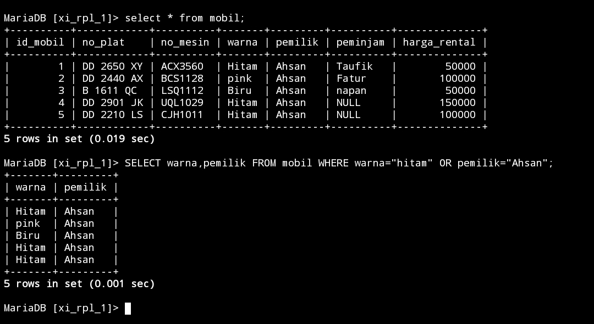
### Analisis
`SELECT warna,pemilik FROM mobil WHERE warna="hitam" OR pemilik="Ahsan";`  
- `SELECT` : Kata kunci yang digunakan untuk memilih kolom atau nilai dari tabel, 
- `warna, pemilik` : Nama kolom yang ingin ditampilkan dalam hasil query, 
- `FROM` : Kata kunci yang menunjukkan tabel yang digunakan untuk mengambil data, 
- `mobil` : Nama tabel dari mana data akan diambil, `WHERE` : Kata kunci yang digunakan untuk menerapkan kondisi pada query, 
- `warna="hitam" OR pemilik="Ahsan"` : Kondisi di mana nilai kolom `warna` harus sama dengan "hitam" atau nilai kolom `pemilik` harus sama dengan "Ahsan".
### Kesimpulan
`SELECT warna, pemilik FROM mobil WHERE warna="hitam" OR pemilik="Ahsan";` digunakan untuk memilih nilai dari kolom "warna" dan "pemilik" dari tabel "mobil" di mana nilai kolom "warna" adalah "hitam" atau nilai kolom "pemilik" adalah "Ahsan".

---
## BETWEEN
### Struktur query
```MySQL
SELECT * FROM nama_tabel WHERE nama_kolom BETWEEN nilai AND nilai;
```
### Contoh query
```sql
SELECT * FROM mobil WHERE harga_rental BETWEEN 100000 AND 200000;
```
### Hasil
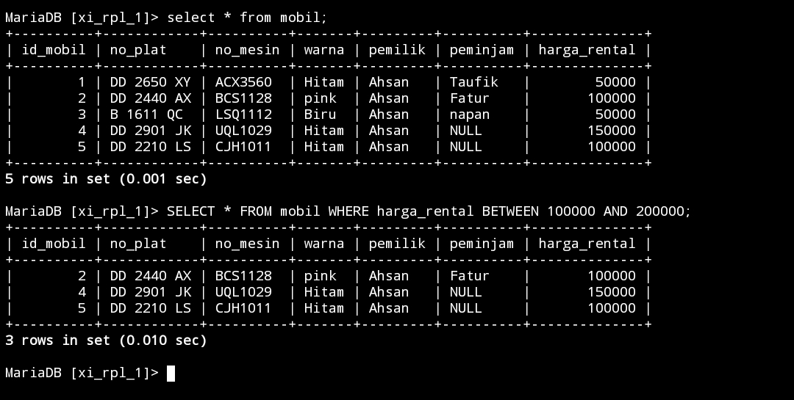
### Analisis
`SELECT * FROM mobil WHERE harga_rental BETWEEN 100000 AND 200000;` 
- `SELECT` : Kata kunci yang digunakan untuk memilih kolom atau nilai dari tabel, 
- `*` : Tanda asterisk yang digunakan dalam SELECT untuk menunjukkan bahwa semua kolom dalam tabel akan dipilih, 
- `FROM` : Kata kunci yang menunjukkan tabel yang digunakan untuk mengambil data, 
- `mobil` : Nama tabel dari mana data akan diambil, `WHERE` : Kata kunci yang digunakan untuk menerapkan kondisi pada query, 
- `harga_rental BETWEEN 100000 AND 200000` : Kondisi di mana nilai kolom harga_rental berada di antara (termasuk) 100.000 dan 200.000.
### Kesimpulan
 `SELECT * FROM mobil WHERE harga_rental BETWEEN 100000 AND 200000;` digunakan untuk memilih semua kolom dari tabel "mobil" di mana nilai kolom harga_rental berada di antara (termasuk) 100.000 dan 200.000.
 
---
## NOT BETWEEN
### Struktur query
```MySQL
SELECT * FROM nama_tabel WHERE nama_kolom NOT BETWEEN nilai AND nilai;
```
### Contoh query
```sql
SELECT * FROM mobil WHERE harga_rental NOT BETWEEN 100000 AND 200000;
```
### Hasil
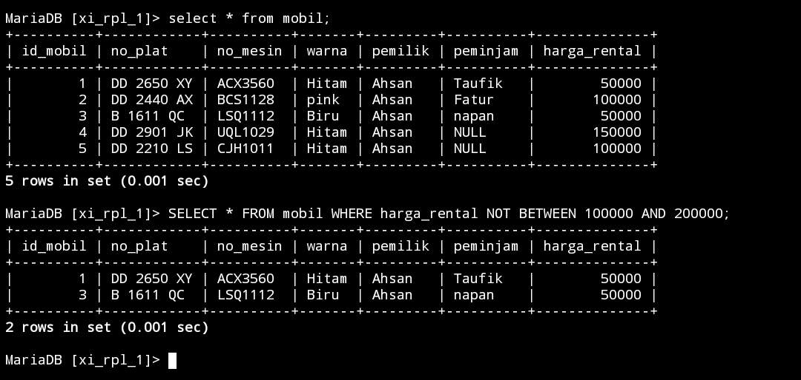
### Analisis
`SELECT * FROM mobil WHERE harga_rental NOT BETWEEN 100000 AND 200000;` 
- `SELECT` : Kata kunci yang digunakan untuk memilih kolom atau nilai dari tabel, 
- `*` : Tanda asterisk yang digunakan dalam SELECT untuk menunjukkan bahwa semua kolom dalam tabel akan dipilih, 
- `FROM` : Kata kunci yang menunjukkan tabel yang digunakan untuk mengambil data, 
- `mobil` : Nama tabel dari mana data akan diambil, 
- `WHERE` : Kata kunci yang digunakan untuk menerapkan kondisi pada query, 
- `harga_rental NOT BETWEEN 100000 AND 200000` : Kondisi di mana nilai kolom harga_rental tidak berada di antara (termasuk) 100.000 dan 200.000.
### Kesimpulan
 `SELECT * FROM mobil WHERE harga_rental NOT BETWEEN 100000 AND 200000;` digunakan untuk memilih semua kolom dari tabel "mobil" di mana nilai kolom harga_rental tidak berada di antara (termasuk) 100.000 dan 200.000.
 
---
## <=
### Struktur query
```MySQL
SELECT * FROM nama_tabel WHERE nama_kolom <=nilai;
```
### Contoh query
```sql
SELECT * FROM mobil WHERE harga_rental <=50000;
```
### Hasil
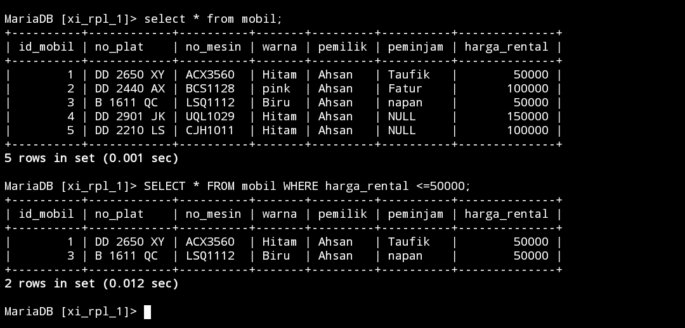
### Analisis
`SELECT * FROM mobil WHERE harga_rental <=50000;` 
- `SELECT` : Kata kunci yang digunakan untuk memilih kolom atau nilai dari tabel,
- `*` : Tanda asterisk yang digunakan dalam SELECT untuk menunjukkan bahwa semua kolom dalam tabel akan dipilih, 
- `FROM` : Kata kunci yang menunjukkan tabel yang digunakan untuk mengambil data, 
- `mobil` : Nama tabel dari mana data akan diambil, `WHERE` : Kata kunci yang digunakan untuk menerapkan kondisi pada query, 
- `harga_rental <=50000` : Kondisi di mana nilai kolom harga_rental kurang dari atau sama dengan 50.000.
### Kesimpulan
 `SELECT * FROM mobil WHERE harga_rental <=50000;` digunakan untuk memilih semua kolom dari tabel "mobil" di mana nilai kolom harga_rental kurang dari atau sama dengan 50.000.
 
---
## >=
### Struktur query
```MySQL
SELECT * FROM nama_tabel WHERE nama_kolom >=nilai;
```
### Contoh query
```sql
SELECT * FROM mobil WHERE harga_rental >=50000;
```
### Hasil
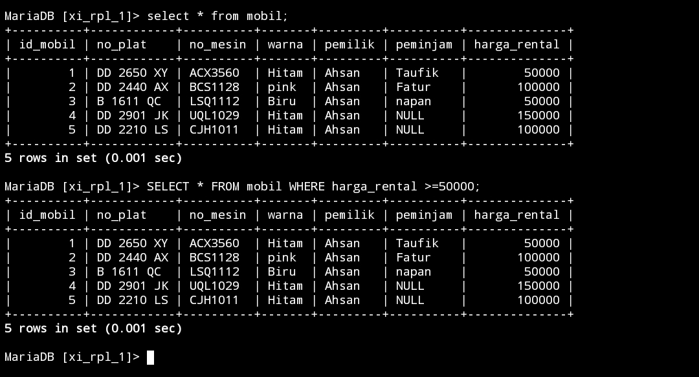
### Analisis
`SELECT * FROM mobil WHERE harga_rental >=50000;` 
- `SELECT` : Kata kunci yang digunakan untuk memilih kolom atau nilai dari tabel, 
- `*` : Tanda asterisk yang digunakan dalam SELECT untuk menunjukkan bahwa semua kolom dalam tabel akan dipilih, 
- `FROM` : Kata kunci yang menunjukkan tabel yang digunakan untuk mengambil data, 
- `mobil` : Nama tabel dari mana data akan diambil, 
- `WHERE` : Kata kunci yang digunakan untuk menerapkan kondisi pada query, 
- `harga_rental >=50000` : Kondisi di mana nilai kolom harga_rental lebih besar dari atau sama dengan 50.000.
### Kesimpulan
 `SELECT * FROM mobil WHERE harga_rental >=50000;` digunakan untuk memilih semua kolom dari tabel "mobil" di mana nilai kolom harga_rental lebih besar dari atau sama dengan 50.000.

---
## <>
### Struktur query
```MySQL
SELECT * FROM nama_tabel WHERE nama_kolom <> nilai;
```
### Contoh query
```sql
SELECT * FROM mobil WHERE harga_rental <> 50000;
```
### Hasil

### Analisis
`SELECT * FROM mobil WHERE harga_rental <> 50000;` 
- `SELECT` : Kata kunci yang digunakan untuk memilih kolom atau nilai dari tabel, 
- `*` : Tanda asterisk yang digunakan dalam SELECT untuk menunjukkan bahwa semua kolom dalam tabel akan dipilih, 
- `FROM` : Kata kunci yang menunjukkan tabel yang digunakan untuk mengambil data, 
- `mobil` : Nama tabel dari mana data akan diambil, 
- `WHERE` : Kata kunci yang digunakan untuk menerapkan kondisi pada query, 
- `harga_rental <> 50000` : Kondisi di mana nilai kolom harga_rental tidak sama dengan 50.000.
### Kesimpulan
 `SELECT * FROM mobil WHERE harga_rental <> 50000;` digunakan untuk memilih semua kolom dari tabel "mobil" di mana nilai kolom harga_rental tidak sama dengan 50.000.

---
## !=
### Struktur query
```MySQL
SELECT * FROM nama_tabel WHERE nama_kolom != nilai;
```
### Contoh query
```sql
SELECT * FROM mobil WHERE harga_rental != 50000;
```
### Hasil
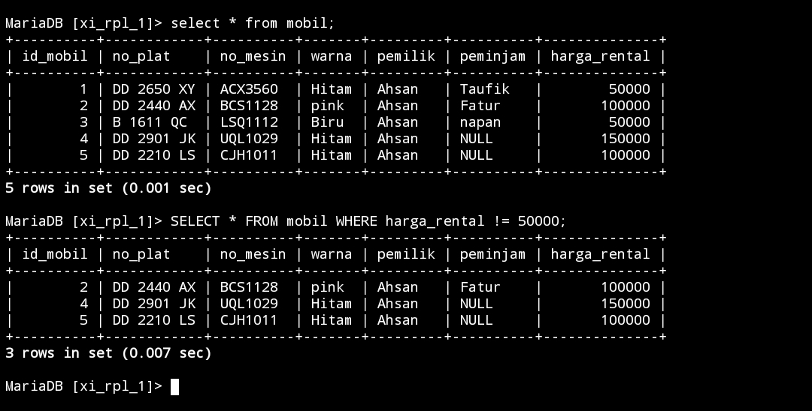
### Analisis
`SELECT * FROM mobil WHERE harga_rental != 50000;`
- `SELECT` : Kata kunci yang digunakan untuk memilih kolom atau nilai dari tabel, 
- `*` : Tanda asterisk yang digunakan dalam SELECT untuk menunjukkan bahwa semua kolom dalam tabel akan dipilih, 
- `FROM` : Kata kunci yang menunjukkan tabel yang digunakan untuk mengambil data, 
- `mobil` : Nama tabel dari mana data akan diambil, 
- `WHERE` : Kata kunci yang digunakan untuk menerapkan kondisi pada query, 
- `harga_rental != 50000` : Kondisi di mana nilai kolom harga_rental tidak sama dengan 50.000.
### Kesimpulan
 `SELECT * FROM mobil WHERE harga_rental != 50000;` digunakan untuk memilih semua kolom dari tabel "mobil" di mana nilai kolom harga_rental tidak sama dengan 50.000.

---
## TANTANGAN
### Struktur query
```MySQL

select nama_kolom from nama_tabel WHERE kondisi;
```
### Contoh query
```sql
select pemilik from mobil where pemilik="Ahsan";
```
### Hasil
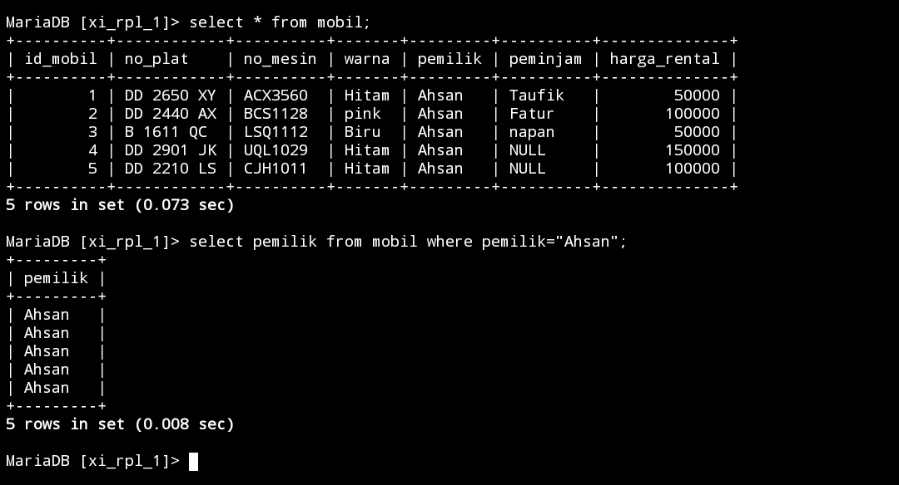
### Analisis
`select pemilik from mobil where pemilik="Ahsan";` 
- `SELECT` : Kata kunci yang digunakan untuk memilih kolom atau nilai dari tabel, 
- `pemilik` : Nama kolom yang ingin ditampilkan dalam hasil query, 
- `FROM` : Kata kunci yang menunjukkan tabel yang digunakan untuk mengambil data,
- `mobil` : Nama tabel dari mana data akan diambil, 
- `WHERE` : Kata kunci yang digunakan untuk menerapkan kondisi pada query, 
- `pemilik="Ahsan"` : Kondisi di mana nilai kolom pemilik harus sama dengan "Ahsan".
### Kesimpulan
 `SELECT pemilik FROM mobil WHERE pemilik="Ahsan";` digunakan untuk memilih nilai dari kolom "pemilik" dari tabel "mobil" di mana nilai kolom "pemilik" sama dengan "Ahsan".

---
## IN
### Struktur query
```MySQL
SELECT * FROM nama_tabel WHERE nama_kolom IN ('kondisi(1)','kondisi(2)');
```
### Contoh query
```MySQL
SELECT * FROM mobil WHERE warna IN('pink','Hitam');
```
### Hasil
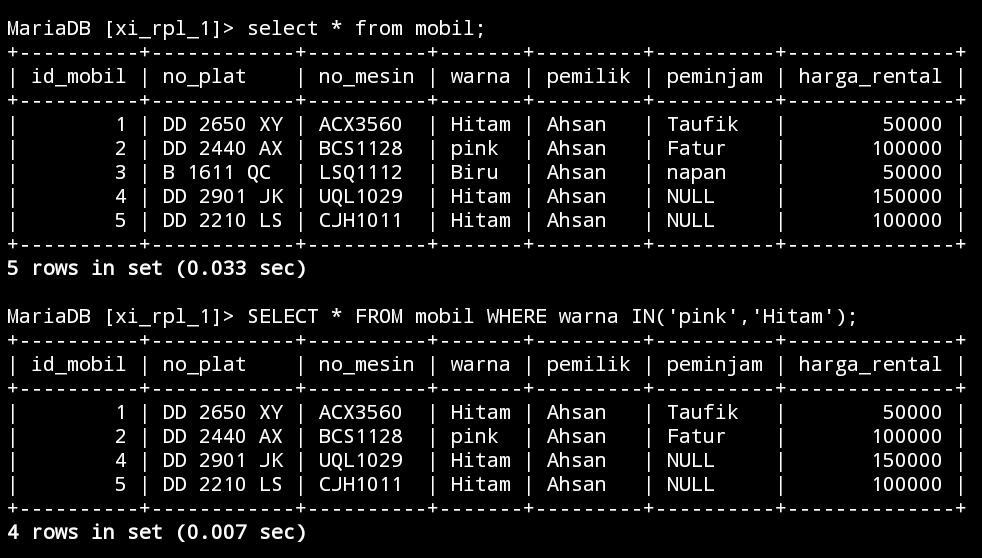
### Analisis
`SELECT * FROM mobil WHERE warna IN('pink','Hitam');`
- `SELECT` : Digunakan untuk memilih kolom atau nilai dari tabel, 
- `*` : Tanda asterisk yang digunakan dalam SELECT untuk menunjukkan bahwa semua kolom dalam tabel akan dipilih, 
- `FROM` : Digunakan untuk menunjukkan tabel yang digunakan untuk mengambil data,
- `mobil` : Nama tabel dari mana data akan diambil, 
- `WHERE` : Digunakan untuk menerapkan kondisi pada query, 
- `warna IN('pink','Hitam')` : Kondisi di mana nilai kolom warna adalah 'pink' atau 'Hitam'.
### Kesimpulan
 `SELECT * FROM mobil WHERE warna IN('pink','Hitam');` digunakan untuk memilih semua kolom dari tabel "mobil" di mana nilai kolom warna adalah 'pink' atau 'Hitam'.
 
---
## IN+AND
### Struktur query
```MySQL
SELECT * FROM nama_tabel WHERE nama_kolom IN ('nilai(1)','nilai(2)') AND kondisi = nilai;
```
### Contoh query
```MySQL
SELECT * FROM mobil WHERE warna IN ('Hitam','Biru') AND harga_rental = 50000;
```
### Hasil
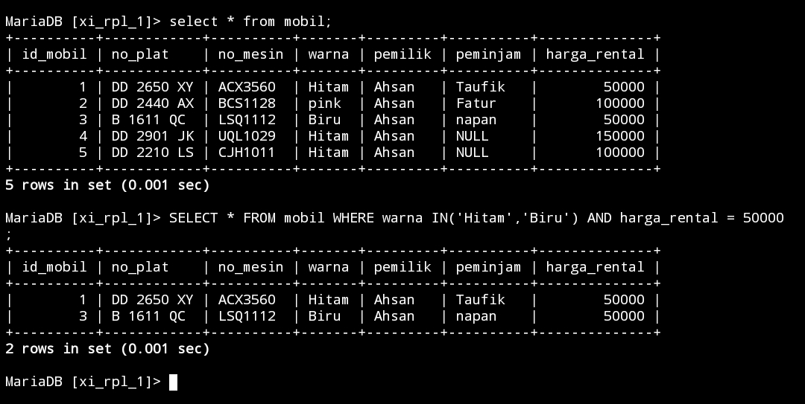
### Analisis
`SELECT * FROM mobil WHERE warna IN ('Hitam','Biru') AND harga_rental = 50000;` 
- `SELECT` : Digunakan untuk memilih kolom atau nilai dari tabel, 
- `*` : Tanda asterisk yang digunakan dalam SELECT untuk menunjukkan bahwa semua kolom dalam tabel akan dipilih, 
- `FROM` : Digunakan untuk menunjukkan tabel yang digunakan untuk mengambil data, 
- `mobil` : Nama tabel dari mana data akan diambil, 
- `WHERE` : Digunakan untuk menerapkan kondisi pada query, 
- `warna IN ('Hitam','Biru')` : Kondisi di mana nilai kolom warna adalah 'Hitam' atau 'Biru', `AND` : Operator logika yang digunakan untuk menggabungkan dua atau lebih kondisi, 
- `harga_rental = 50000` : Kondisi di mana nilai kolom harga_rental adalah 50000.
### Kesimpulan
 `SELECT * FROM mobil WHERE warna IN ('Hitam','Biru') AND harga_rental = 50000;` digunakan untuk memilih semua kolom dari tabel "mobil" di mana nilai kolom warna adalah 'Hitam' atau 'Biru', dan nilai kolom harga_rental adalah 50000.
 
---
## IN+OR
### Struktur query
```MySQL
SELECT * FROM nama_tabel WHERE nama_kolom IN ('nilai(1)','nilai(2)') OR kondisi = nilai;
```
### Contoh query
```MySQL
SELECT * FROM mobil WHERE warna IN ('Hitam','Biru') OR harga_rental = 50000;
```
### Hasil
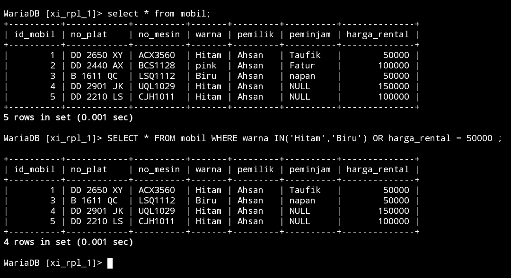
### Analisis
`SELECT * FROM mobil WHERE warna IN ('Hitam','Biru') OR harga_rental = 50000;` 
- `SELECT` : Digunakan untuk memilih kolom atau nilai dari tabel, 
- `*` : Tanda asterisk yang digunakan dalam SELECT untuk menunjukkan bahwa semua kolom dalam tabel akan dipilih, 
- `FROM` : Digunakan untuk menunjukkan tabel yang digunakan untuk mengambil data,
- `mobil` : Nama tabel dari mana data akan diambil, 
- `WHERE` : Digunakan untuk menerapkan kondisi pada query,
- `warna IN ('Hitam','Biru')` : Kondisi di mana nilai kolom warna adalah 'Hitam' atau 'Biru', 
- `OR` : Operator logika yang digunakan untuk menggabungkan dua atau lebih kondisi, 
- `harga_rental = 50000` : Kondisi di mana nilai kolom harga_rental adalah 50000.
### Kesimpulan
 `SELECT * FROM mobil WHERE warna IN ('Hitam','Biru') OR harga_rental = 50000;` digunakan untuk memilih semua kolom dari tabel "mobil" di mana nilai kolom warna adalah 'Hitam' atau 'Biru', atau nilai kolom harga_rental adalah 50000.

---
## IN+AND+OPERATOR
### Struktur query
OPERATOR ==`>`==
```MySQL
SELECT * FROM nama_tabel WHERE nama_kolom IN ('nilai(1)','nilai(2)') AND kondisi > nilai;
```

OPERATOR ==`<`==
```MySQL
SELECT * FROM nama_tabel WHERE nama_kolom IN ('nilai(1)','nilai(2)') AND kondisi < nilai;
```
### Contoh query
OPERATOR ==`>`==
```MySQL
SELECT * FROM mobil WHERE warna IN ('Hitam','Biru') AND harga_rental > 50000;
```

OPERATOR ==`<`==
```MySQL
SELECT * FROM mobil WHERE warna IN ('Hitam','Biru') AND harga_rental < 100000;
```
### Hasil
OPERATOR ==`>`==
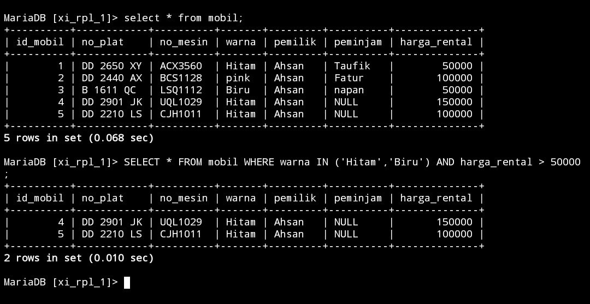

OPERATOR ==`<`==
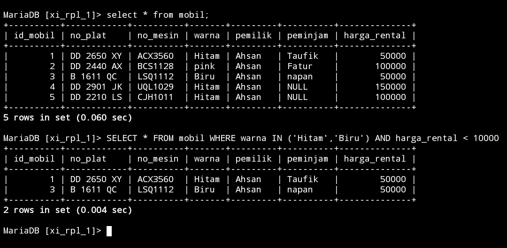

### Analisis
`SELECT * FROM mobil WHERE warna IN ('Hitam','Biru') AND harga_rental > 50000;` ,
`SELECT * FROM mobil WHERE warna IN ('Hitam','Biru') AND harga_rental < 100000;`
- `SELECT` : Digunakan untuk memilih kolom atau nilai dari tabel, 
- `*` : Tanda asterisk yang digunakan dalam SELECT untuk menunjukkan bahwa semua kolom dalam tabel akan dipilih
- `FROM` : Digunakan untuk menunjukkan tabel yang digunakan untuk mengambil data, 
- `mobil` : Nama tabel dari mana data akan diambil, 
- `WHERE` : Digunakan untuk menerapkan kondisi pada query,
- `warna IN ('Hitam','Biru')` : Kondisi di mana nilai kolom warna adalah 'Hitam' atau 'Biru',
- `AND` : Operator logika yang digunakan untuk menggabungkan dua atau lebih kondisi, 
- `harga_rental > 50000` : Kondisi di mana nilai kolom harga_rental lebih besar dari 50000,
- `harga_rental < 100000` : Kondisi di mana nilai kolom harga_rental kurang dari 100000.
### Kesimpulan
bahwa kondisi `harga_rental > 50000` memilih data di mana harga sewa mobil lebih dari 50000, sementara kondisi `harga_rental < 100000` memilih data di mana harga sewa mobil kurang dari 100000.

---
## LIKE
### MENCARI AWALAN
#### Struktur query
```MySQL
SELECT * FROM nama_tabel WHERE nama_kolom LIKE 'nilai%';
```
#### Contoh query
```MySQL
SELECT * FROM mobil WHERE peminjam LIKE 'T%';
```
#### Hasil
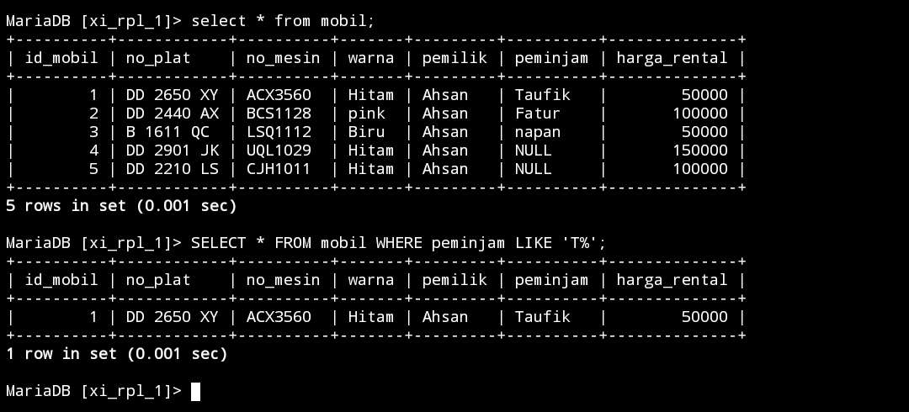
#### Analisis
`SELECT * FROM mobil WHERE peminjam LIKE 'T%';` 
- `SELECT` : Digunakan untuk memilih kolom atau nilai dari tabel, 
- `*` : Tanda asterisk yang digunakan dalam SELECT untuk menunjukkan bahwa semua kolom dalam tabel akan dipilih, 
- `FROM` : Digunakan untuk menunjukkan tabel yang digunakan untuk mengambil data,
- `mobil` : Nama tabel dari mana data akan diambil, 
- `WHERE` : Digunakan untuk menerapkan kondisi pada query,
- `peminjam LIKE 'T%'` : Kondisi di mana nilai kolom peminjam dimulai dengan huruf 'T'.
#### Kesimpulan
 `SELECT * FROM mobil WHERE peminjam LIKE 'T%';` digunakan untuk memilih semua kolom dari tabel "mobil" di mana nilai kolom peminjam dimulai dengan huruf 'T'.

---
### MENCARI AKHIRAN
#### Struktur query
```MySQL
SELECT * FROM nama_tabel WHERE nama_tabel LIKE '%nilai';
```
#### Contoh query
```MySQL
SELECT * FROM mobil WHERE peminjam LIKE '%N';
```
#### Hasil

#### Analisis
`SELECT * FROM mobil WHERE peminjam LIKE '%N';` 
- `SELECT` : Digunakan untuk memilih kolom atau nilai dari tabel, 
- `*` : Tanda asterisk yang digunakan dalam SELECT untuk menunjukkan bahwa semua kolom dalam tabel akan dipilih, 
- `FROM` : Digunakan untuk menunjukkan tabel yang digunakan untuk mengambil data,
- `mobil` : Nama tabel dari mana data akan diambil, 
- `WHERE` : Digunakan untuk menerapkan kondisi pada query,
- `peminjam LIKE '%N'` : Kondisi di mana nilai kolom peminjam diakhiri dengan huruf 'N'.
#### Kesimpulan
 `SELECT * FROM mobil WHERE peminjam LIKE '%N';`  digunakan untuk memilih semua kolom dari tabel "mobil" di mana nilai kolom peminjam diakhiri dengan huruf 'N'.

---
### MENCARI AWALAN & AKHIRAN
#### Struktur query
```MySQL
SELECT * FROM nama_tabel WHERE nama_kolom LIKE 'huruf_awal%huruf_akhir';
```
#### Contoh query
```MySQL
SELECT * FROM mobil WHERE peminjam LIKE 'f%r';
```
#### Hasil

#### Analisis
`SELECT * FROM mobil WHERE peminjam LIKE 'f%r';`
- `SELECT` : Digunakan untuk memilih kolom atau nilai dari tabel,
- `*` : Tanda asterisk yang digunakan dalam SELECT untuk menunjukkan bahwa semua kolom dalam tabel akan dipilih, 
- `FROM` : Digunakan untuk menunjukkan tabel yang digunakan untuk mengambil data,
- `mobil` : Nama tabel dari mana data akan diambil, 
- `WHERE` : Digunakan untuk menerapkan kondisi pada query, 
- `peminjam LIKE 'f%r'` : Kondisi di mana nilai kolom peminjam dimulai dengan 'f' dan diakhiri dengan 'r', dengan karakter apa pun di antara keduanya.
#### Kesimpulan
 `SELECT * FROM mobil WHERE peminjam LIKE 'f%r';` digunakan untuk memilih semua kolom dari tabel "mobil" di mana nilai kolom peminjam dimulai dengan 'f' dan diakhiri dengan 'r', dengan karakter apa pun di antara keduanya.

---
### MENCARI BERDASARKAN TOTAL KARAKTER
#### Struktur query
```MySQL
SELECT * FROM nama_tabel WHERE nama_kolom LIKE 'kondisi';
```

```MySQL
SELECT * FROM nama_tabel WHERE nama_kolom LIKE 'kondisi';
```
#### Contoh query
```MySQL
SELECT * FROM mobil WHERE warna LIKE 'H____';
```

```MySQL
SELECT * FROM mobil WHERE peminjam LIKE '_____';
```
#### Hasil
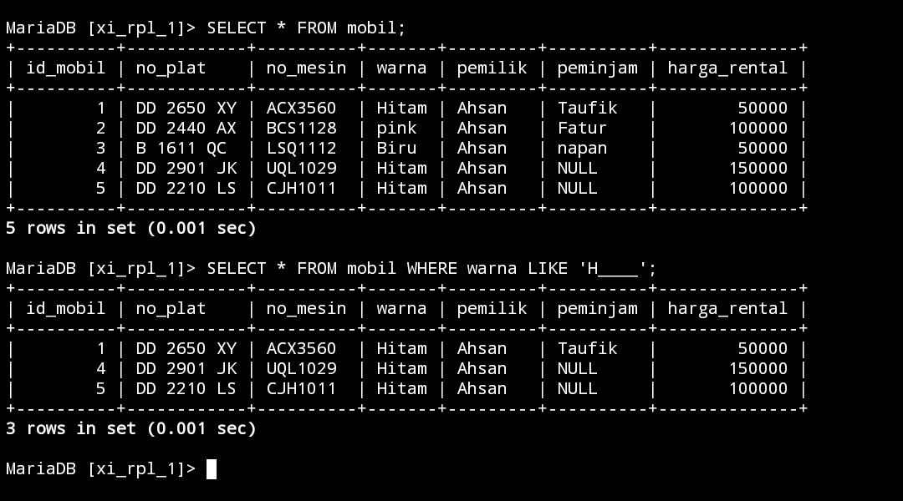

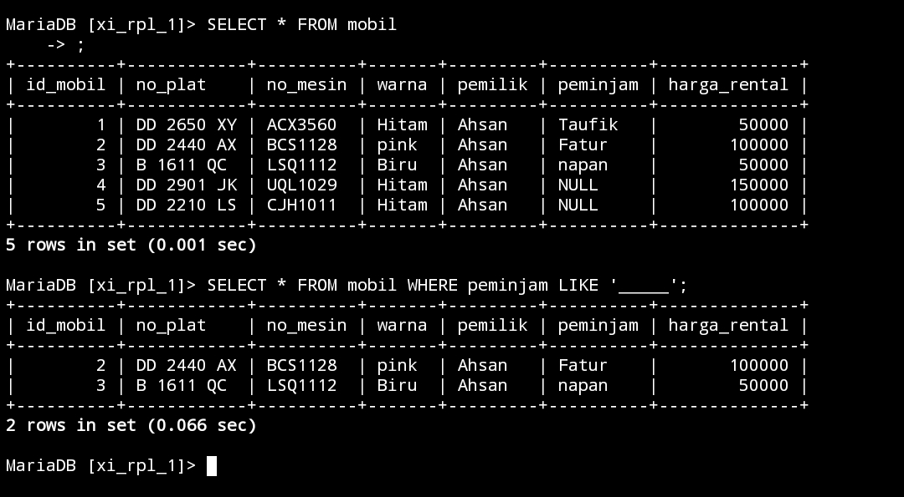
#### Analisis
`SELECT * FROM mobil WHERE warna LIKE 'H____';` , `SELECT * FROM mobil WHERE peminjam LIKE '_____';` 
- `SELECT` : Digunakan untuk memilih kolom atau nilai dari tabel, 
- `*` : Tanda asterisk yang digunakan dalam SELECT untuk menunjukkan bahwa semua kolom dalam tabel akan dipilih, 
- `FROM` : Digunakan untuk menunjukkan tabel yang digunakan untuk mengambil data,
- `mobil` : Nama tabel dari mana data akan diambil, 
- `WHERE` : Digunakan untuk menerapkan kondisi pada query, 
- `warna LIKE 'H____'` : Kondisi di mana nilai kolom warna dimulai dengan 'H', diikuti oleh empat karakter apa pun, 
- `peminjam LIKE '_____'` : Kondisi di mana nilai kolom peminjam memiliki panjang tepat lima karakter.
#### Kesimpulan
`SELECT * FROM mobil WHERE warna LIKE 'H____';` digunakan untuk memilih semua kolom dari tabel "mobil" di mana nilai kolom `warna` dimulai dengan 'H' dan diikuti oleh empat karakter apa pun.
`SELECT * FROM mobil WHERE peminjam LIKE '_____';` digunakan untuk memilih semua kolom dari tabel "mobil" di mana nilai kolom `peminjam` memiliki panjang tepat lima karakter.

---
### KOMBINASI
#### Struktur query
```MySQL
SELECT * FROM nama_tabel WHERE nama_kolom LIKE '__kondisi%';
```

```MySQL
SELECT * FROM nama_tabel WHERE nama_kolom LIKE '_kondisi%';
```
#### Contoh query
```MySQL
SELECT * FROM mobil WHERE warna LIKE '__t%';
```

```MySQL
select * from mobil where peminjam like '_a%';
```
#### Hasil
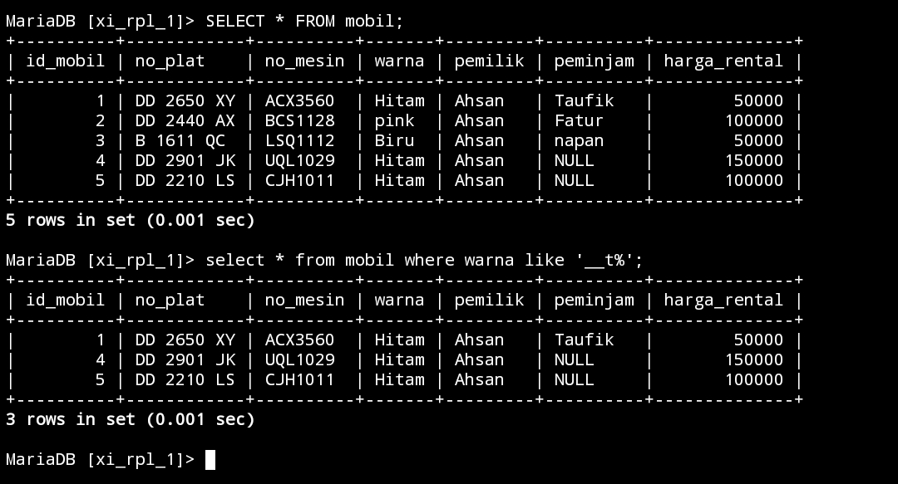

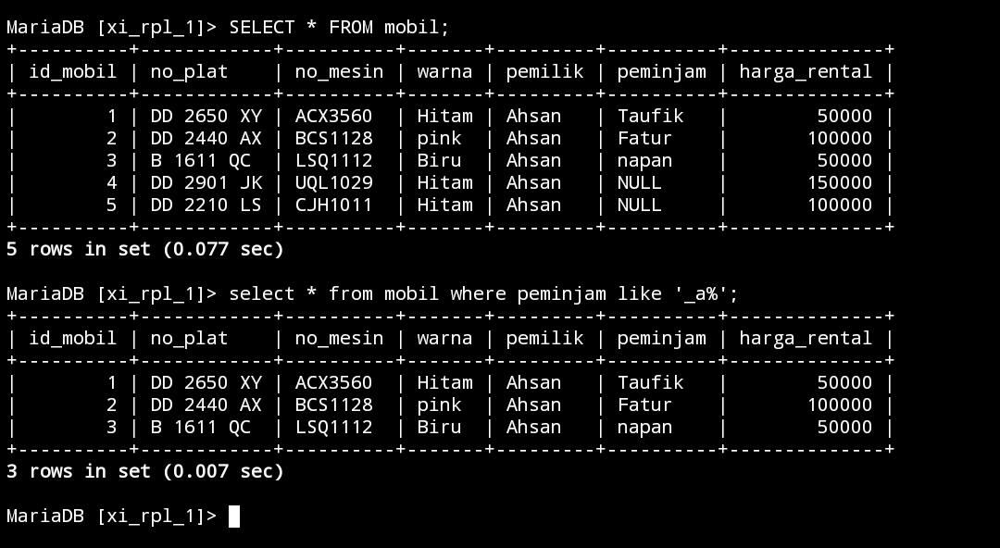
#### Analisis
`SELECT * FROM mobil WHERE warna LIKE '__t%';` , `select * from mobil where peminjam like '_a%';` 
- `SELECT` : Digunakan untuk memilih kolom atau nilai dari tabel, 
- `*` : Tanda asterisk yang digunakan dalam SELECT untuk menunjukkan bahwa semua kolom dalam tabel akan dipilih, 
- `FROM` : Digunakan untuk menunjukkan tabel yang digunakan untuk mengambil data,
- `mobil` : Nama tabel dari mana data akan diambil, 
- `WHERE` : Digunakan untuk menerapkan kondisi pada query, 
- `warna LIKE '__t%'` : Kondisi di mana nilai kolom warna memiliki dua karakter di awal, diikuti oleh 't', dan kemudian diikuti oleh nol atau lebih karakter apa pun,
- `peminjam like '_a%'` : Kondisi di mana nilai kolom peminjam memiliki satu karakter di awal, diikuti oleh 'a', dan kemudian diikuti oleh nol atau lebih karakter apa pun.
#### Kesimpulan
`SELECT * FROM mobil WHERE warna LIKE '__t%';` digunakan untuk memilih data dari tabel "mobil" di mana nilai kolom `warna` memiliki dua karakter di awal, diikuti oleh 't', dan kemudian diikuti oleh nol atau lebih karakter apa pun.
`SELECT * FROM mobil WHERE peminjam LIKE '_a%';` digunakan untuk memilih data dari tabel "mobil" di mana nilai kolom `peminjam` memiliki satu karakter di awal, diikuti oleh 'a', dan kemudian diikuti oleh nol atau lebih karakter apa pun.

---
### NOT LIKE
#### Struktur query
```MySQL
SELECT * FROM nama_tabel WHERE nama_kolom NOT LIKE 'kondisi%';
```
#### Contoh query
```MySQL
SELECT * FROM mobil WHERE warna NOT LIKE 'H%';
```
#### Hasil
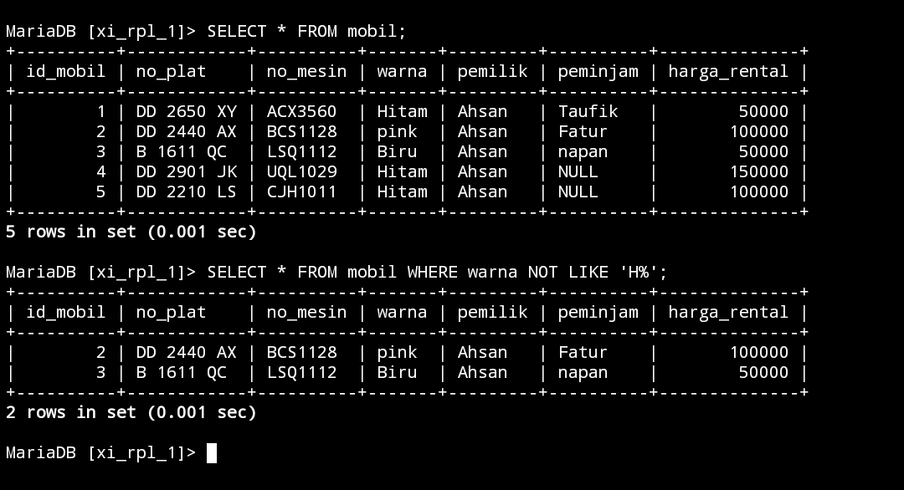

#### Analisis
`SELECT * FROM mobil WHERE warna NOT LIKE 'H%';` 
- `SELECT` : Digunakan untuk memilih kolom atau nilai dari tabel, 
- `*` : Tanda asterisk yang digunakan dalam SELECT untuk menunjukkan bahwa semua kolom dalam tabel akan dipilih, 
- `FROM` : Digunakan untuk menunjukkan tabel yang digunakan untuk mengambil data,
- `mobil` : Nama tabel dari mana data akan diambil, 
- `WHERE` : Digunakan untuk menerapkan kondisi pada query, 
- `warna NOT LIKE 'H%'` : Kondisi di mana nilai kolom warna tidak dimulai dengan 'H'. 
#### Kesimpulan
 `SELECT * FROM mobil WHERE warna NOT LIKE 'H%';` digunakan untuk memilih data dari tabel "mobil" di mana nilai kolom warna tidak dimulai dengan 'H'.
 
---

## NULL & NOT NULL
### MENCARI DATA KOSONG
#### Struktur query
```MySql
SELECT * FROM nama_tabel WHERE nama_kolom IS NULL;
```
#### Contoh query
```MySql
SELECT * FROM mobil WHERE peminjam IS NULL;
```
#### Hasil
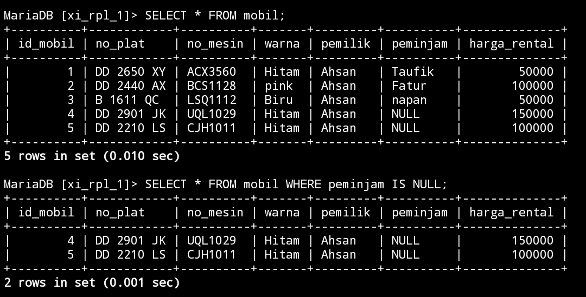

#### Analisis
- `SELECT` : Digunakan untuk memilih kolom atau nilai dari tabel, 
- `*` : Tanda asterisk yang digunakan dalam SELECT untuk menunjukkan bahwa semua kolom dalam tabel akan dipilih,
- `FROM` : Digunakan untuk menunjukkan tabel yang digunakan untuk mengambil data, 
- `mobil` : Nama tabel dari mana data akan diambil, 
- `WHERE` : Digunakan untuk menerapkan kondisi pada query, 
- `peminjam IS NULL` : Kondisi di mana nilai kolom peminjam adalah NULL, yang berarti tidak ada nilai yang diberikan.
#### Kesimpulan
`SELECT * FROM mobil WHERE peminjam IS NULL;` digunakan untuk memilih data dari tabel "mobil" di mana nilai kolom peminjam adalah NULL, atau tidak ada nilai yang diberikan.
 
---
### MENCARI DATA YANG TIDAK KOSONG
#### Struktur query
```MySql
SELECT * FROM nama_tabel WHERE nama_kolom IS NOT NULL;
```
#### Contoh query
```MySql
SELECT * FROM mobil WHERE peminjam IS NOT NULL;
```
#### Hasil
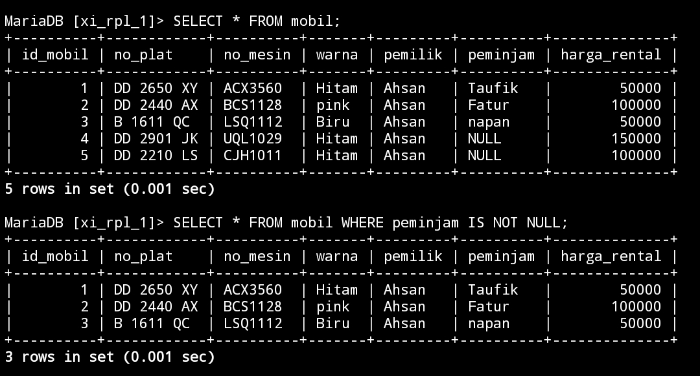

#### Analisis
- `SELECT` : Digunakan untuk memilih kolom atau nilai dari tabel, 
- `*` : Tanda asterisk yang digunakan dalam SELECT untuk menunjukkan bahwa semua kolom dalam tabel akan dipilih,
- `FROM` : Digunakan untuk menunjukkan tabel yang digunakan untuk mengambil data, 
- `mobil` : Nama tabel dari mana data akan diambil, 
- `WHERE` : Digunakan untuk menerapkan kondisi pada query, 
- `peminjam IS NOT NULL` : Kondisi di mana nilai kolom peminjam bukan NULL, yang berarti memiliki nilai yang diberikan.
#### Kesimpulan
`SELECT * FROM mobil WHERE peminjam IS NOT NULL;` digunakan untuk memilih data dari tabel "mobil" di mana nilai kolom peminjam bukan NULL, atau memiliki nilai yang diberikan.

---
## ORDER BY
### MENGURUTKAN DATA DARI DATA TERKECIL
#### Struktur query
```mySQL
SELECT * FROM nama_tabel ORDER BY nama_kolom ASC;
```
#### Contoh query
```mySQL
SELECT * FROM mobil ORDER BY harga_rental ASC;
```
#### Hasil
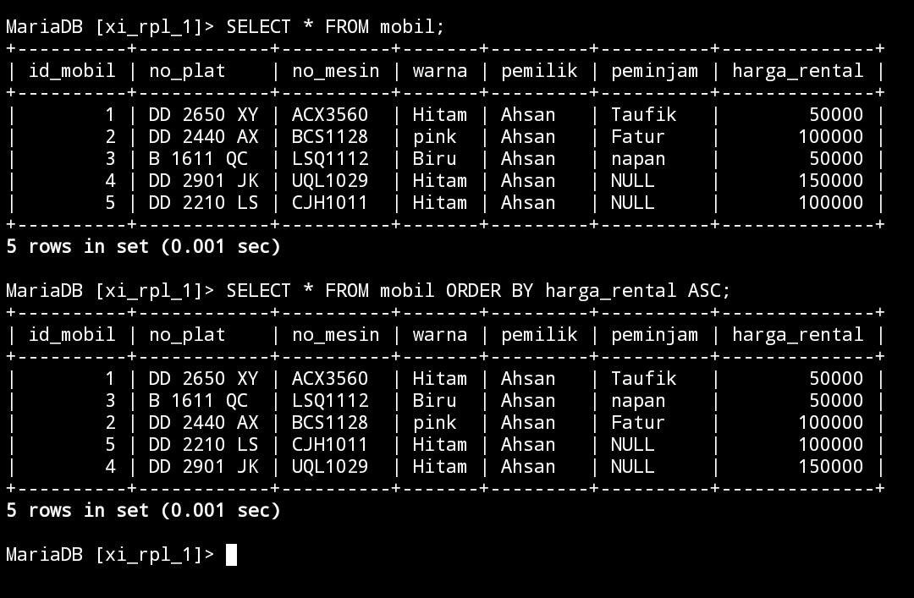
#### Analisis
- `SELECT` : Digunakan untuk memilih kolom atau nilai dari tabel,
- `*` : Tanda asterisk yang digunakan dalam SELECT untuk menunjukkan bahwa semua kolom dalam tabel akan dipilih, 
- `FROM` : Digunakan untuk menunjukkan tabel yang digunakan untuk mengambil data, 
- `mobil` : Nama tabel dari mana data akan diambil, 
- `ORDER BY` : Kata kunci yang digunakan untuk mengurutkan hasil query, 
- `harga_rental ASC` : Mengurutkan hasil kueri berdasarkan kolom harga_rental secara ascending (dari nilai terkecil hingga terbesar).

#### Kesimpulan
 `SELECT * FROM mobil ORDER BY harga_rental ASC;` digunakan untuk memilih semua data dari tabel "mobil" dan mengurutkannya berdasarkan harga sewa (harga_rental) secara ascending, yang berarti dari harga terendah hingga tertinggi.
 
---
### MENGURUTKAN DATA DARI DATA TERBESAR
#### Struktur query
```mySQL
SELECT * FROM nama_tabel ORDER BY nama_kolom DESC;
```
#### Contoh query
```mySQL
SELECT * FROM mobil ORDER BY harga_rental DESC;
```
#### Hasil
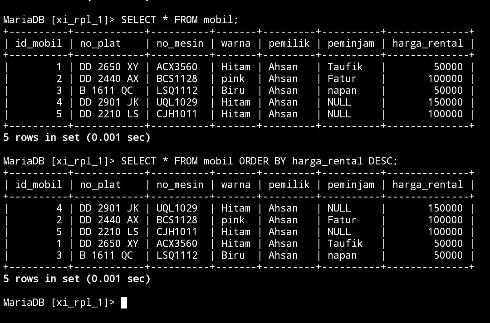

#### Analisis
- `SELECT` : Digunakan untuk memilih kolom atau nilai dari tabel, 
- `*` : Tanda asterisk yang digunakan dalam SELECT untuk menunjukkan bahwa semua kolom dalam tabel akan dipilih, 
- `FROM` : Digunakan untuk menunjukkan tabel yang digunakan untuk mengambil data, 
- `mobil` : Nama tabel dari mana data akan diambil, 
- `ORDER BY` : Kata kunci yang digunakan untuk mengurutkan hasil query, 
- `harga_rental DESC` : Mengurutkan hasil kueri berdasarkan kolom harga_rental secara descending (dari nilai terbesar hingga terkecil).

#### Kesimpulan
`SELECT * FROM mobil ORDER BY harga_rental DESC;` digunakan untuk memilih semua data dari tabel "mobil" dan mengurutkannya berdasarkan harga sewa (harga_rental) secara descending, yaitu dari harga terbesar hingga terkecil.

---
## DISTINCT
### Struktur query
```mySQL
SELECT DISTINCT(nama_kolom) FROM nama_tabel;
```

```mySQL
SELECT DISTINCT(nama_kolom) FROM nama_tabel ORDER BY nama_kolom DESC;
```
### Contoh query
```mySQL
SELECT DISTINCT(warna) FROM mobil;
```

```mySQL
SELECT DISTINCT(harga_rental) FROM mobil ORDER BY harga_rental DESC;
```
### Hasil
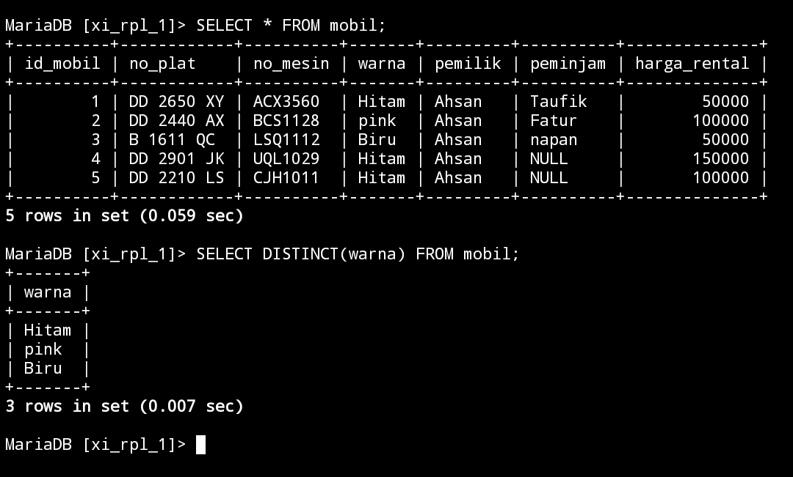

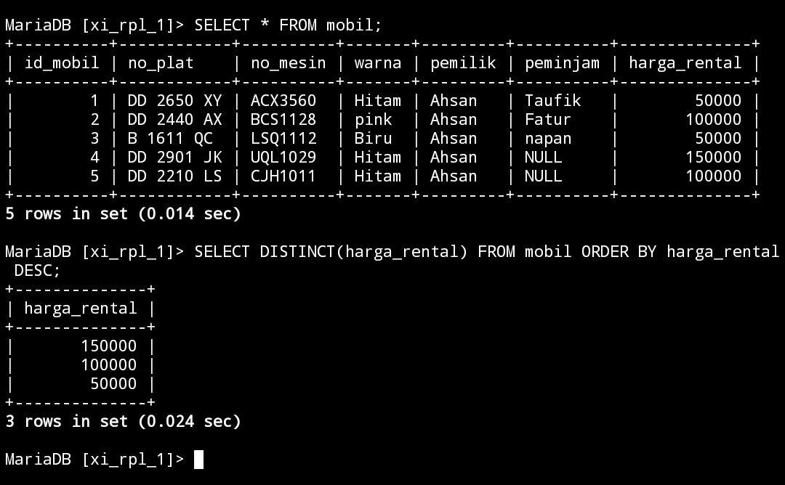
### Analisis
- `SELECT` : Kata kunci yang digunakan untuk memilih kolom atau nilai dari tabel, 
- `DISTINCT(warna)` : Mengambil nilai unik dari kolom warna. Ini berarti jika ada nilai yang sama dalam kolom warna, hanya satu nilai unik akan dipilih, 
- `FROM` : Kata kunci yang menunjukkan tabel yang digunakan untuk mengambil data, 
- `mobil` : Nama tabel dari mana data akan diambil.

- `SELECT` : Kata kunci yang digunakan untuk memilih kolom atau nilai dari tabel, 
- `DISTINCT(harga_rental)` : Mengambil nilai unik dari kolom `harga_rental`. Ini berarti jika ada nilai yang sama dalam kolom `harga_rental`, hanya satu nilai unik akan dipilih,
- `FROM` : Kata kunci yang menunjukkan tabel yang digunakan untuk mengambil data, 
- `mobil` : Nama tabel dari mana data akan diambil, 
- `ORDER BY` : Kata kunci yang digunakan untuk mengurutkan hasil query,
- `harga_rental DESC` : Mengurutkan hasil kueri berdasarkan kolom `harga_rental` secara descending (dari nilai terbesar hingga terkecil).
### Kesimpulan
 `SELECT DISTINCT(warna) FROM mobil;` digunakan untuk memilih semua nilai unik dari kolom warna dalam tabel "mobil".

 `SELECT DISTINCT(harga_rental) FROM mobil ORDER BY harga_rental DESC;` digunakan untuk memilih semua nilai unik dari kolom harga_rental dalam tabel "mobil" dan mengurutkannya secara descending, yaitu dari nilai terbesar hingga terkecil.
 
---

## CONCAT, CONCAT_WS, AS
### Menggabungkan kolom tanpa pemisah
### Struktur query
```mySQL
SELECT CONCAT(kolom1,kolom2) FROM nama_tabel;
```
### Contoh query 
```mySQL
SELECT CONCAT(pemilik,warna) FROM mobil;
```
### Hasil
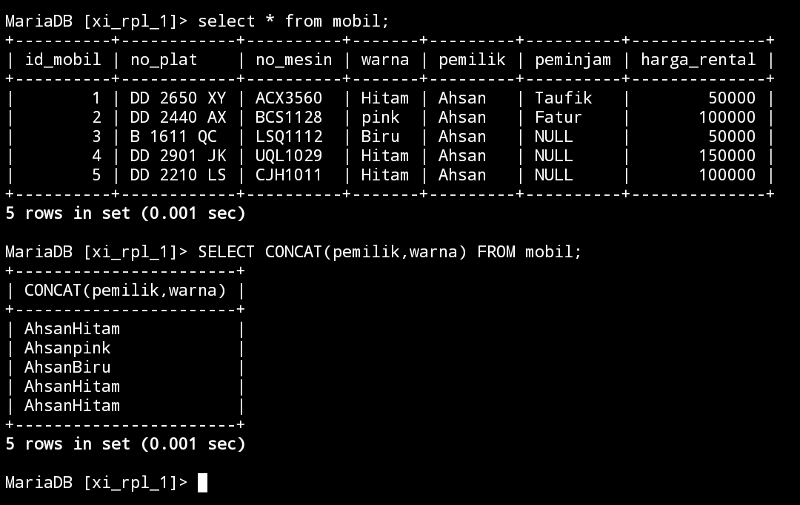
### Analisis
- `SELECT`: Kata kunci yang digunakan untuk memilih data dari database,
- `CONCAT`: Fungsi yang digunakan untuk menggabungkan dua atau lebih string bersama-sama,
- `pemilik`: Nama kolom dalam tabel "mobil" yang mewakili pemilik mobil,
- `warna`: Kolom lain dalam tabel "mobil" yang mewakili warna mobil,
- `FROM mobil`: Menentukan tabel dari mana data harus diambil, dalam hal ini, tabel "mobil".
### Kesimpulan
Query tersebut menghasilkan kolom baru yang berisi hasil penggabungan antara nama pemilik mobil dan warna mobil dari setiap baris dalam tabel "mobil".

### Menggabungkan kolom dengan pemisah
### Struktur query
```mySQL
SELECT CONCAT_WS("-",kolom1,kolom2,kolom3) FROM nama_tabel;
```
### Contoh query 
```mysql
SELECT CONCAT_WS("-",id_mobil,no_plat,no_mesin) FROM mobil;
```
### Hasil
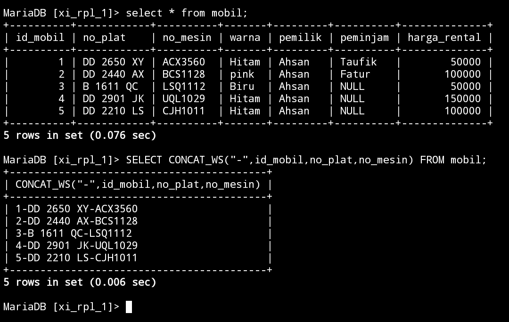
### Analisis
- `SELECT` : Kata kunci yang digunakan untuk memilih data dari database. 
- `CONCAT_WS` : Fungsi yang digunakan untuk menggabungkan nilai-nilai string dengan menggunakan separator tertentu,
- `"-"` : Separator yang akan digunakan untuk menggabungkan nilai-nilai string, 
- `id_mobil` : Kolom dalam tabel "mobil" yang menyimpan ID unik untuk setiap mobil, 
- `no_plat` : Kolom lain dalam tabel "mobil" yang menyimpan nomor plat mobil,
- `no_mesin` : Kolom lain dalam tabel "mobil" yang menyimpan nomor mesin mobil, 
- `FROM mobil` : Menentukan tabel dari mana data harus diambil, dalam hal ini, tabel "mobil".
### Kesimpulan
Query tersebut menghasilkan kolom baru yang berisi hasil penggabungan nilai ID mobil, nomor plat, dan nomor mesin dari setiap baris dalam tabel "mobil", dengan menggunakan tanda "-" sebagai separator.
### Memberikan nama kolom alias
### Struktur query 
```mySQL
SELECT CONCAT_WS("+",kolom1,kolom2) AS COLLAB FROM nama_tabel;
```
### Contoh query 
```mysQl
SELECT CONCAT_WS("+",pemilik,peminjam) AS COLLAB FROM mobil;
```
### Hasil
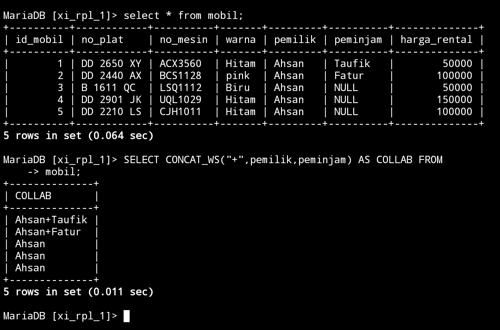
### Analisis
- `SELECT` : Kata kunci yang digunakan untuk memilih data dari database.
- `CONCAT_WS` : Fungsi yang digunakan untuk menggabungkan nilai-nilai string dengan menggunakan separator tertentu, 
- `"+"` : Separator yang akan digunakan untuk menggabungkan nilai-nilai string,
- `id_mobil` : Kolom dalam tabel "mobil" yang menyimpan ID unik untuk setiap mobil, 
- `no_plat` : Kolom lain dalam tabel "mobil" yang menyimpan nomor plat mobil, 
- `no_mesin` : Kolom lain dalam tabel "mobil" yang menyimpan nomor mesin mobil,
- `FROM mobil` : Menentukan tabel dari mana data harus diambil, dalam hal ini, tabel "mobil".
### Kesimpulan
Query tersebut menghasilkan kolom baru yang berisi hasil penggabungan nilai ID mobil, nomor plat, dan nomor mesin dari setiap baris dalam tabel "mobil", dengan menggunakan tanda "-" sebagai separator.
## VIEW
### Membuat tabel virtual
#### Struktur query
```mysql
CREATE VIEW nama_tabel_virtual AS SELECT kolom1, kolom2, kolom3, kolom3 FROM nama_tabel WHERE kolom IS NULL;
```
#### Contoh query
```MySQL
CREATE VIEW info_no_plat AS SELECT id_mobil, no_plat, pemilik, peminjam FROM mobil WHERE peminjam IS NULL;
```
#### Hasil
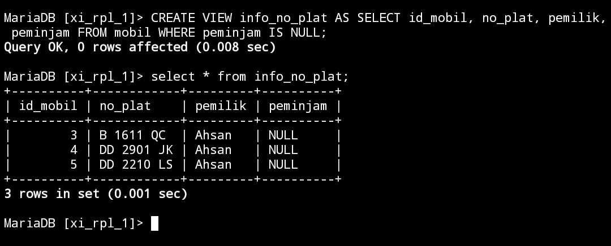
#### Analisis
- `CREATE VIEW` : Ini adalah perintah untuk membuat sebuah view dalam database, 
- `info_no_plat` : Nama yang diberikan untuk view yang akan dibuat,
- `AS` : Menghubungkan perintah CREATE VIEW dengan SELECT statement yang mendefinisikan isi dari view, 
- `SELECT` : Kata kunci yang digunakan untuk memilih data dari database, 
- `id_mobil, no_plat, pemilik, peminjam` : Kolom-kolom yang akan dimasukkan ke dalam view, 
- `FROM mobil` : Menentukan tabel dari mana data harus diambil, dalam hal ini, tabel "mobil", 
- `WHERE peminjam IS NULL` : Kondisi yang menyaring baris-baris dari tabel "mobil" di mana nilai kolom "peminjam" adalah NULL.
#### Kesimpulan
Perintah tersebut membuat sebuah view bernama `"info_no_plat"` yang menampilkan kolom `"id_mobil"`, `"no_plat"`, `"pemilik"`, dan `"peminjam"` dari tabel `"mobil",` tetapi hanya untuk baris-baris di mana kolom `"peminjam"` memiliki nilai `NULL`.
### Menampilkan tabel virtual
#### Struktur query
```mysql
SELECT * FROM nama_tabel_virtual;
```
#### Contoh query
```mysql
SELECT * FROM info_no_plat;
```
#### Hasil
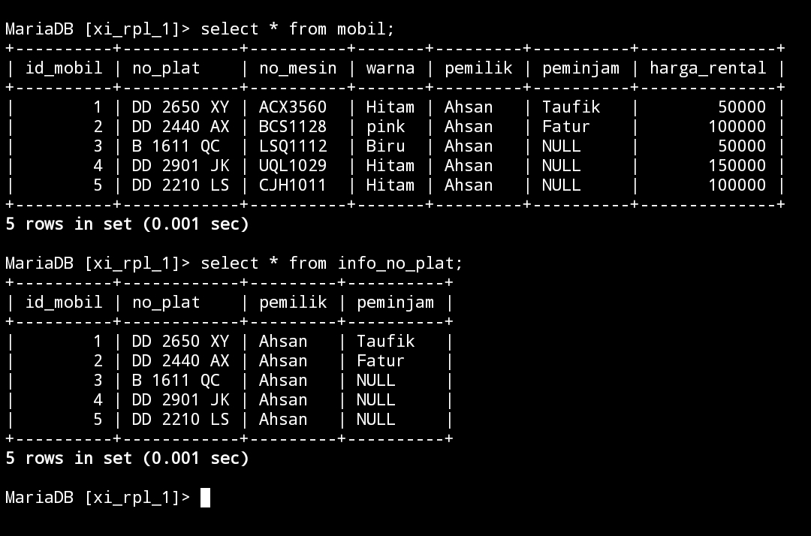
#### Analisis
- `SELECT` : Ini adalah perintah untuk memilih semua kolom dari tabel atau view yang ditentukan,
- `FROM info_no_plat`: Ini menentukan sumber data dari mana SELECT akan mengambil data, dalam hal ini, view `"info_no_plat"`.
#### Kesimpulan
Perintah SELECT tersebut bertujuan untuk menampilkan semua kolom dari view `"info_no_plat"`.
### Menghapus tabel virtual
#### Struktur query
```mysql
DROP VIEW nama_tabel_virtual;
```
#### Contoh query
```mysql
DROP VIEW info_no_plat;
```
#### Hasil
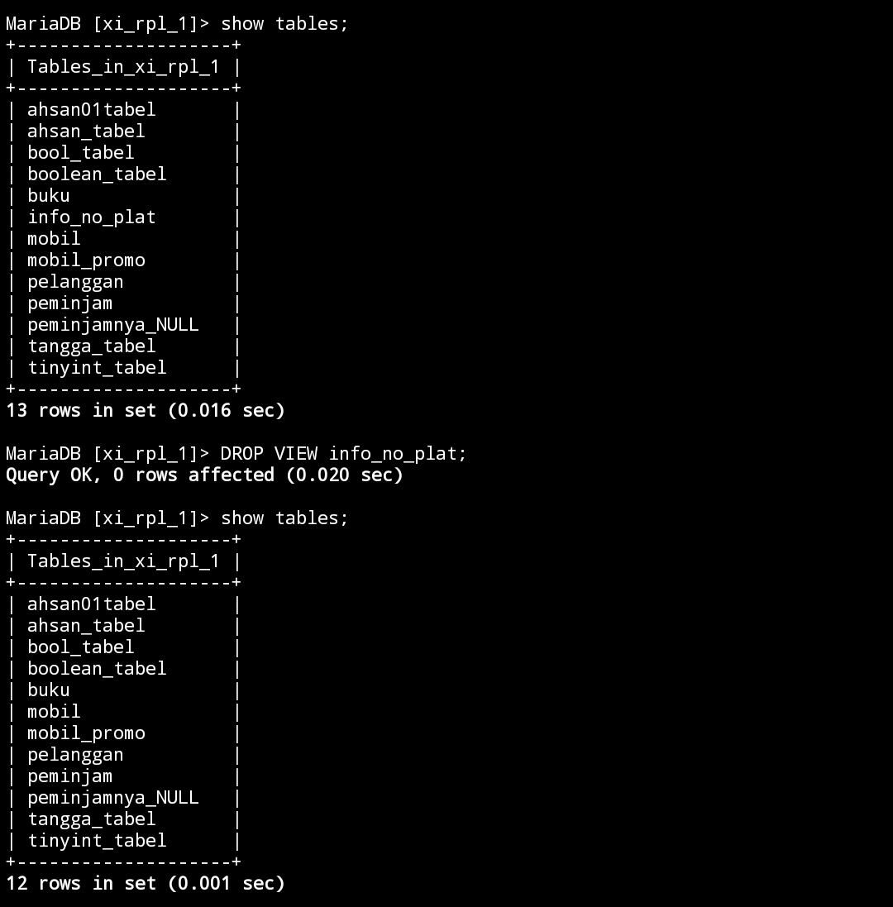
#### Analisis
- `DROP VIEW` : Ini adalah perintah untuk menghapus sebuah view dari database, 
- `info_no_plat` : Nama view yang akan dihapus.
#### Kesimpulan
Perintah tersebut bertujuan untuk menghapus view bernama `"info_no_plat"` dari database.
## TANTANGAN
### NO 1
>[!info]
>BUATKAN TABEL VIRTUAL DAN TAMPILKAN ISI DATANYA YANG MANA PEMINJAMANNYA ITU TIDAK ADA.
#### Kode Program
```mySQL
CREATE VIEW peminjamnya_NULL AS SELECT id_mobil , no_plat , peminjam , harga_rental FROM mobil WHERE peminjam IS NULL;
```
#### Hasil
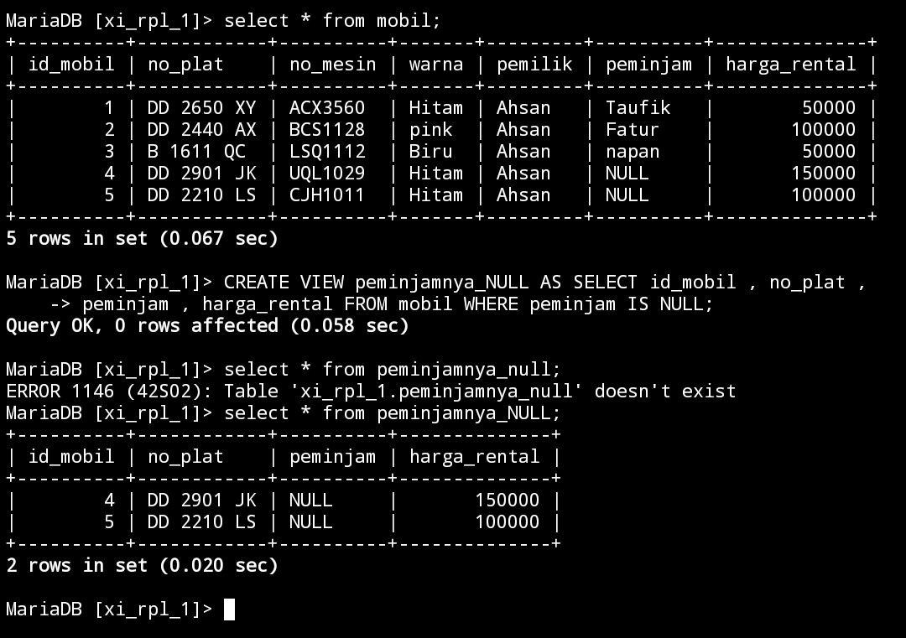

### NO 2
>[!info]
>UPDATE ATAU GANTI SALAH SATU DATA PIMINJAM DARI TABEL MOBIL DENGAN NILAI NULL, TAMPILKAN ISI DATA PADA TABEL VIRTUAL, HASILNYA AKAN ADA 3 DATA PADA TABEL VIRTUAL.
#### Kode Program
```mySQL
UPDATE mobil SET peminjam=NULL WHERE id_mobil="3";
```
#### Hasil
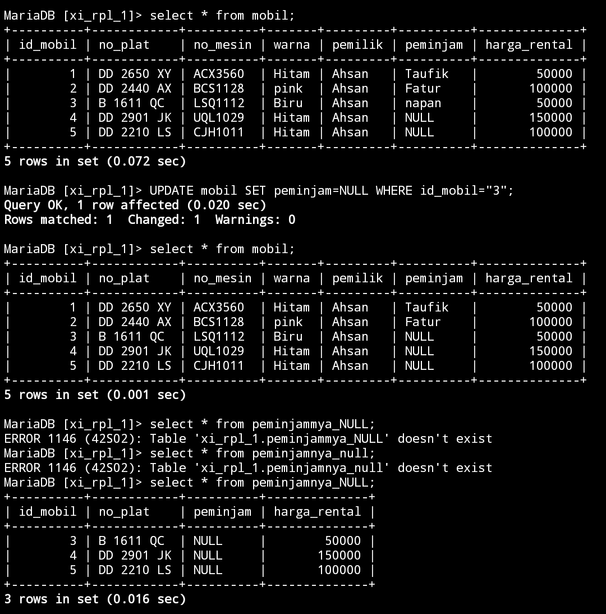

### NO 3
>[!info]
>BERIKAN KESIMPULAN KENAPA TABEL VIRTUAL DIBUAT.

#### Kesimpulannya

## AGREGASI
### Sum
#### Struktur query
```mysql

```
#### Contoh query
```mysql
SELECT SUM(harga_rental)AS total FROM mobil;
```
#### Hasil
#### Analisis
#### Kesimpulan
### Count
#### Struktur query
```mysql

```
#### Contoh query
```mysql
SELECT COUNT(peminjam) FROM mobil
```
#### Hasil
#### Analisis
#### Kesimpulan
### Min
#### Struktur query
```mysql

```
#### Contoh query
```mysql
SELECT MIN(harga_rental) AS MINIMAL FROM mobil;
```
#### Hasil
#### Analisis
#### Kesimpulan
### Max
#### Struktur query
```mysql

```
#### Contoh query
```mysql
SELECT MAX(harga_rental) AS MIXIMAL FROM mobil;
```
#### Hasil
#### Analisis
#### Kesimpulan

### AVG
#### Struktur query
```mysql

```
#### Contoh query
```mysql
SELECT AVG(harga_rental) AS RATA_RATA FROM mobil;
```
#### Hasil
#### Analisis
#### Kesimpulan