## AND
### Struktur query
```MySQL
SELECT nama_kolom1,nama_kolom2 FROM nama_tabel WHERE kondisi(1) AND kondisi(2)
```
### Contoh query
```sql
SELECT warna,pemilik FROM mobil WHERE warna="hitam" AND pemilik="Ahsan";
```
### Hasil

### Analisis
`SELECT warna,pemilik FROM mobil WHERE warna="hitam" AND pemilik="Ahsan";` 
- `SELECT` : Kata kunci yang digunakan untuk memilih kolom atau nilai dari tabel, 
- `warna, pemilik` : Nama kolom yang ingin ditampilkan dalam hasil query, 
- `FROM` : Kata kunci yang menunjukkan tabel yang digunakan untuk mengambil data, 
- `mobil` : Nama tabel dari mana data akan diambil, 
- `WHERE` : Kata kunci yang digunakan untuk menerapkan kondisi pada kueri, 
- `warna="hitam"` : Kondisi di mana nilai kolom `warna` harus sama dengan "hitam", 
- `AND` : Operator logika yang digunakan untuk menggabungkan dua atau lebih kondisi,
- `pemilik="Ahsan"` : Kondisi di mana nilai kolom `pemilik` harus sama dengan "Ahsan".
### Kesimpulan
`SELECT warna, pemilik FROM mobil WHERE warna="hitam" AND pemilik="Ahsan";` digunakan untuk memilih nilai dari kolom "warna" dan "pemilik" dari tabel "mobil" di mana nilai kolom "warna" adalah "hitam" dan nilai kolom "pemilik" adalah "Ahsan".

---
## OR
### Struktur query
```MySQL
SELECT nama_kolom1,nama_kolom2 FROM nama_tabel WHERE kondisi(1) OR kondisi(2)
```
### Contoh query
```sql
SELECT warna,pemilik FROM mobil WHERE warna="hitam" OR pemilik="Ahsan";
```
### Hasil

### Analisis
`SELECT warna,pemilik FROM mobil WHERE warna="hitam" OR pemilik="Ahsan";`  
- `SELECT` : Kata kunci yang digunakan untuk memilih kolom atau nilai dari tabel, 
- `warna, pemilik` : Nama kolom yang ingin ditampilkan dalam hasil query, 
- `FROM` : Kata kunci yang menunjukkan tabel yang digunakan untuk mengambil data, 
- `mobil` : Nama tabel dari mana data akan diambil, `WHERE` : Kata kunci yang digunakan untuk menerapkan kondisi pada query, 
- `warna="hitam" OR pemilik="Ahsan"` : Kondisi di mana nilai kolom `warna` harus sama dengan "hitam" atau nilai kolom `pemilik` harus sama dengan "Ahsan".
### Kesimpulan
`SELECT warna, pemilik FROM mobil WHERE warna="hitam" OR pemilik="Ahsan";` digunakan untuk memilih nilai dari kolom "warna" dan "pemilik" dari tabel "mobil" di mana nilai kolom "warna" adalah "hitam" atau nilai kolom "pemilik" adalah "Ahsan".

---
## BETWEEN
### Struktur query
```MySQL
SELECT * FROM nama_tabel WHERE nama_kolom BETWEEN nilai AND nilai;
```
### Contoh query
```sql
SELECT * FROM mobil WHERE harga_rental BETWEEN 100000 AND 200000;
```
### Hasil

### Analisis
`SELECT * FROM mobil WHERE harga_rental BETWEEN 100000 AND 200000;` 
- `SELECT` : Kata kunci yang digunakan untuk memilih kolom atau nilai dari tabel, 
- `*` : Tanda asterisk yang digunakan dalam SELECT untuk menunjukkan bahwa semua kolom dalam tabel akan dipilih, 
- `FROM` : Kata kunci yang menunjukkan tabel yang digunakan untuk mengambil data, 
- `mobil` : Nama tabel dari mana data akan diambil, `WHERE` : Kata kunci yang digunakan untuk menerapkan kondisi pada query, 
- `harga_rental BETWEEN 100000 AND 200000` : Kondisi di mana nilai kolom harga_rental berada di antara (termasuk) 100.000 dan 200.000.
### Kesimpulan
 `SELECT * FROM mobil WHERE harga_rental BETWEEN 100000 AND 200000;` digunakan untuk memilih semua kolom dari tabel "mobil" di mana nilai kolom harga_rental berada di antara (termasuk) 100.000 dan 200.000.
 
---
## NOT BETWEEN
### Struktur query
```MySQL
SELECT * FROM nama_tabel WHERE nama_kolom NOT BETWEEN nilai AND nilai;
```
### Contoh query
```sql
SELECT * FROM mobil WHERE harga_rental NOT BETWEEN 100000 AND 200000;
```
### Hasil

### Analisis
`SELECT * FROM mobil WHERE harga_rental NOT BETWEEN 100000 AND 200000;` 
- `SELECT` : Kata kunci yang digunakan untuk memilih kolom atau nilai dari tabel, 
- `*` : Tanda asterisk yang digunakan dalam SELECT untuk menunjukkan bahwa semua kolom dalam tabel akan dipilih, 
- `FROM` : Kata kunci yang menunjukkan tabel yang digunakan untuk mengambil data, 
- `mobil` : Nama tabel dari mana data akan diambil, 
- `WHERE` : Kata kunci yang digunakan untuk menerapkan kondisi pada query, 
- `harga_rental NOT BETWEEN 100000 AND 200000` : Kondisi di mana nilai kolom harga_rental tidak berada di antara (termasuk) 100.000 dan 200.000.
### Kesimpulan
 `SELECT * FROM mobil WHERE harga_rental NOT BETWEEN 100000 AND 200000;` digunakan untuk memilih semua kolom dari tabel "mobil" di mana nilai kolom harga_rental tidak berada di antara (termasuk) 100.000 dan 200.000.
 
---
## <=
### Struktur query
```MySQL
SELECT * FROM nama_tabel WHERE nama_kolom <=nilai;
```
### Contoh query
```sql
SELECT * FROM mobil WHERE harga_rental <=50000;
```
### Hasil

### Analisis
`SELECT * FROM mobil WHERE harga_rental <=50000;` 
- `SELECT` : Kata kunci yang digunakan untuk memilih kolom atau nilai dari tabel,
- `*` : Tanda asterisk yang digunakan dalam SELECT untuk menunjukkan bahwa semua kolom dalam tabel akan dipilih, 
- `FROM` : Kata kunci yang menunjukkan tabel yang digunakan untuk mengambil data, 
- `mobil` : Nama tabel dari mana data akan diambil, `WHERE` : Kata kunci yang digunakan untuk menerapkan kondisi pada query, 
- `harga_rental <=50000` : Kondisi di mana nilai kolom harga_rental kurang dari atau sama dengan 50.000.
### Kesimpulan
 `SELECT * FROM mobil WHERE harga_rental <=50000;` digunakan untuk memilih semua kolom dari tabel "mobil" di mana nilai kolom harga_rental kurang dari atau sama dengan 50.000.
 
---
## >=
### Struktur query
```MySQL
SELECT * FROM nama_tabel WHERE nama_kolom >=nilai;
```
### Contoh query
```sql
SELECT * FROM mobil WHERE harga_rental >=50000;
```
### Hasil

### Analisis
`SELECT * FROM mobil WHERE harga_rental >=50000;` 
- `SELECT` : Kata kunci yang digunakan untuk memilih kolom atau nilai dari tabel, 
- `*` : Tanda asterisk yang digunakan dalam SELECT untuk menunjukkan bahwa semua kolom dalam tabel akan dipilih, 
- `FROM` : Kata kunci yang menunjukkan tabel yang digunakan untuk mengambil data, 
- `mobil` : Nama tabel dari mana data akan diambil, 
- `WHERE` : Kata kunci yang digunakan untuk menerapkan kondisi pada query, 
- `harga_rental >=50000` : Kondisi di mana nilai kolom harga_rental lebih besar dari atau sama dengan 50.000.
### Kesimpulan
 `SELECT * FROM mobil WHERE harga_rental >=50000;` digunakan untuk memilih semua kolom dari tabel "mobil" di mana nilai kolom harga_rental lebih besar dari atau sama dengan 50.000.

---
## <>
### Struktur query
```MySQL
SELECT * FROM nama_tabel WHERE nama_kolom <> nilai;
```
### Contoh query
```sql
SELECT * FROM mobil WHERE harga_rental <> 50000;
```
### Hasil

### Analisis
`SELECT * FROM mobil WHERE harga_rental <> 50000;` 
- `SELECT` : Kata kunci yang digunakan untuk memilih kolom atau nilai dari tabel, 
- `*` : Tanda asterisk yang digunakan dalam SELECT untuk menunjukkan bahwa semua kolom dalam tabel akan dipilih, 
- `FROM` : Kata kunci yang menunjukkan tabel yang digunakan untuk mengambil data, 
- `mobil` : Nama tabel dari mana data akan diambil, 
- `WHERE` : Kata kunci yang digunakan untuk menerapkan kondisi pada query, 
- `harga_rental <> 50000` : Kondisi di mana nilai kolom harga_rental tidak sama dengan 50.000.
### Kesimpulan
 `SELECT * FROM mobil WHERE harga_rental <> 50000;` digunakan untuk memilih semua kolom dari tabel "mobil" di mana nilai kolom harga_rental tidak sama dengan 50.000.

---
## !=
### Struktur query
```MySQL
SELECT * FROM nama_tabel WHERE nama_kolom != nilai;
```
### Contoh query
```sql
SELECT * FROM mobil WHERE harga_rental != 50000;
```
### Hasil

### Analisis
`SELECT * FROM mobil WHERE harga_rental != 50000;`
- `SELECT` : Kata kunci yang digunakan untuk memilih kolom atau nilai dari tabel, 
- `*` : Tanda asterisk yang digunakan dalam SELECT untuk menunjukkan bahwa semua kolom dalam tabel akan dipilih, 
- `FROM` : Kata kunci yang menunjukkan tabel yang digunakan untuk mengambil data, 
- `mobil` : Nama tabel dari mana data akan diambil, 
- `WHERE` : Kata kunci yang digunakan untuk menerapkan kondisi pada query, 
- `harga_rental != 50000` : Kondisi di mana nilai kolom harga_rental tidak sama dengan 50.000.
### Kesimpulan
 `SELECT * FROM mobil WHERE harga_rental != 50000;` digunakan untuk memilih semua kolom dari tabel "mobil" di mana nilai kolom harga_rental tidak sama dengan 50.000.

---
## Tantangan
### Struktur query
```MySQL

select nama_kolom from nama_tabel WHERE kondisi;
```
### Contoh query
```sql
select pemilik from mobil where pemilik="Ahsan";
```
### Hasil

### Analisis
`select pemilik from mobil where pemilik="Ahsan";` 
- `SELECT` : Kata kunci yang digunakan untuk memilih kolom atau nilai dari tabel, 
- `pemilik` : Nama kolom yang ingin ditampilkan dalam hasil query, 
- `FROM` : Kata kunci yang menunjukkan tabel yang digunakan untuk mengambil data,
- `mobil` : Nama tabel dari mana data akan diambil, 
- `WHERE` : Kata kunci yang digunakan untuk menerapkan kondisi pada query, 
- `pemilik="Ahsan"` : Kondisi di mana nilai kolom pemilik harus sama dengan "Ahsan".
### Kesimpulan
 `SELECT pemilik FROM mobil WHERE pemilik="Ahsan";` digunakan untuk memilih nilai dari kolom "pemilik" dari tabel "mobil" di mana nilai kolom "pemilik" sama dengan "Ahsan".

---
## Tantangan Login
### Struktur query
```mysql
SELECT nama_kolom1 FROM nama_tabel WHERE kondisi;
```
### Contoh query
```mysql
SELECT nama FROM Akun WHERE id=1;
```
### Hasil
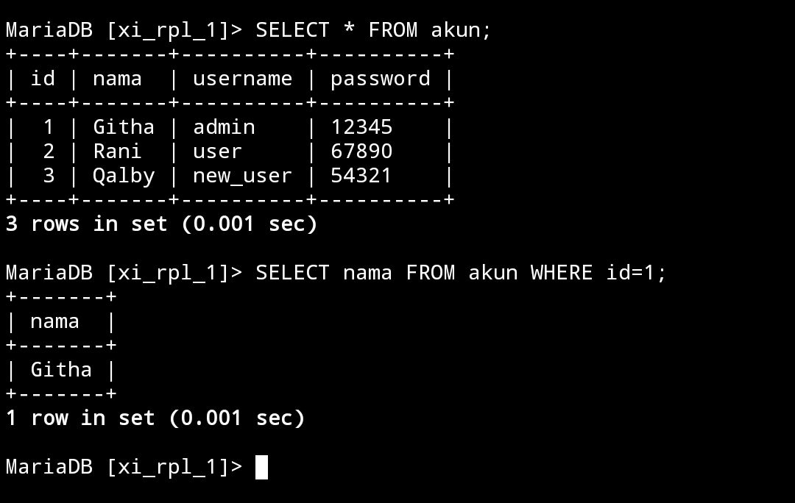
### Analisis
1. `SELECT`:
   - Kata kunci `SELECT` digunakan untuk menentukan kolom mana yang ingin kita ambil dari tabel
   - Dalam kasus ini, kolom yang ingin diambil adalah `nama`

2. `FROM Akun`:
   - Kata kunci `FROM` digunakan untuk menentukan tabel dari mana kita akan mengambil data
   - Dalam kasus ini, tabel yang digunakan adalah `Akun`

3. `WHERE id=1`:
   - Kata kunci `WHERE` digunakan untuk menyaring baris berdasarkan kondisi tertentu
   - Dalam kasus ini, kondisinya adalah `id=1`, yang berarti hanya baris yang memiliki nilai kolom `id` sama dengan 1 yang akan dipilih
### Kesimpulan
`SELECT nama FROM Akun WHERE id=1;` mengambil nilai kolom `nama` dari tabel `Akun` untuk baris yang memiliki `id` sama dengan 1.

---
## IN
### Struktur query
```MySQL
SELECT * FROM nama_tabel WHERE nama_kolom IN ('kondisi(1)','kondisi(2)');
```
### Contoh query
```MySQL
SELECT * FROM mobil WHERE warna IN('pink','Hitam');
```
### Hasil

### Analisis
`SELECT * FROM mobil WHERE warna IN('pink','Hitam');`
- `SELECT` : Digunakan untuk memilih kolom atau nilai dari tabel, 
- `*` : Tanda asterisk yang digunakan dalam SELECT untuk menunjukkan bahwa semua kolom dalam tabel akan dipilih, 
- `FROM` : Digunakan untuk menunjukkan tabel yang digunakan untuk mengambil data,
- `mobil` : Nama tabel dari mana data akan diambil, 
- `WHERE` : Digunakan untuk menerapkan kondisi pada query, 
- `warna IN('pink','Hitam')` : Kondisi di mana nilai kolom warna adalah 'pink' atau 'Hitam'.
### Kesimpulan
 `SELECT * FROM mobil WHERE warna IN('pink','Hitam');` digunakan untuk memilih semua kolom dari tabel "mobil" di mana nilai kolom warna adalah 'pink' atau 'Hitam'.
 
---
## IN+AND
### Struktur query
```MySQL
SELECT * FROM nama_tabel WHERE nama_kolom IN ('nilai(1)','nilai(2)') AND kondisi = nilai;
```
### Contoh query
```MySQL
SELECT * FROM mobil WHERE warna IN ('Hitam','Biru') AND harga_rental = 50000;
```
### Hasil

### Analisis
`SELECT * FROM mobil WHERE warna IN ('Hitam','Biru') AND harga_rental = 50000;` 
- `SELECT` : Digunakan untuk memilih kolom atau nilai dari tabel, 
- `*` : Tanda asterisk yang digunakan dalam SELECT untuk menunjukkan bahwa semua kolom dalam tabel akan dipilih, 
- `FROM` : Digunakan untuk menunjukkan tabel yang digunakan untuk mengambil data, 
- `mobil` : Nama tabel dari mana data akan diambil, 
- `WHERE` : Digunakan untuk menerapkan kondisi pada query, 
- `warna IN ('Hitam','Biru')` : Kondisi di mana nilai kolom warna adalah 'Hitam' atau 'Biru', `AND` : Operator logika yang digunakan untuk menggabungkan dua atau lebih kondisi, 
- `harga_rental = 50000` : Kondisi di mana nilai kolom harga_rental adalah 50000.
### Kesimpulan
 `SELECT * FROM mobil WHERE warna IN ('Hitam','Biru') AND harga_rental = 50000;` digunakan untuk memilih semua kolom dari tabel "mobil" di mana nilai kolom warna adalah 'Hitam' atau 'Biru', dan nilai kolom harga_rental adalah 50000.
 
---
## IN+OR
### Struktur query
```MySQL
SELECT * FROM nama_tabel WHERE nama_kolom IN ('nilai(1)','nilai(2)') OR kondisi = nilai;
```
### Contoh query
```MySQL
SELECT * FROM mobil WHERE warna IN ('Hitam','Biru') OR harga_rental = 50000;
```
### Hasil

### Analisis
`SELECT * FROM mobil WHERE warna IN ('Hitam','Biru') OR harga_rental = 50000;` 
- `SELECT` : Digunakan untuk memilih kolom atau nilai dari tabel, 
- `*` : Tanda asterisk yang digunakan dalam SELECT untuk menunjukkan bahwa semua kolom dalam tabel akan dipilih, 
- `FROM` : Digunakan untuk menunjukkan tabel yang digunakan untuk mengambil data,
- `mobil` : Nama tabel dari mana data akan diambil, 
- `WHERE` : Digunakan untuk menerapkan kondisi pada query,
- `warna IN ('Hitam','Biru')` : Kondisi di mana nilai kolom warna adalah 'Hitam' atau 'Biru', 
- `OR` : Operator logika yang digunakan untuk menggabungkan dua atau lebih kondisi, 
- `harga_rental = 50000` : Kondisi di mana nilai kolom harga_rental adalah 50000.
### Kesimpulan
 `SELECT * FROM mobil WHERE warna IN ('Hitam','Biru') OR harga_rental = 50000;` digunakan untuk memilih semua kolom dari tabel "mobil" di mana nilai kolom warna adalah 'Hitam' atau 'Biru', atau nilai kolom harga_rental adalah 50000.

---
## IN+AND+OPERATOR
### Struktur query
OPERATOR ==`>`==
```MySQL
SELECT * FROM nama_tabel WHERE nama_kolom IN ('nilai(1)','nilai(2)') AND kondisi > nilai;
```

OPERATOR ==`<`==
```MySQL
SELECT * FROM nama_tabel WHERE nama_kolom IN ('nilai(1)','nilai(2)') AND kondisi < nilai;
```
### Contoh query
OPERATOR ==`>`==
```MySQL
SELECT * FROM mobil WHERE warna IN ('Hitam','Biru') AND harga_rental > 50000;
```

OPERATOR ==`<`==
```MySQL
SELECT * FROM mobil WHERE warna IN ('Hitam','Biru') AND harga_rental < 100000;
```
### Hasil
OPERATOR ==`>`==


OPERATOR ==`<`==


### Analisis
`SELECT * FROM mobil WHERE warna IN ('Hitam','Biru') AND harga_rental > 50000;` ,
`SELECT * FROM mobil WHERE warna IN ('Hitam','Biru') AND harga_rental < 100000;`
- `SELECT` : Digunakan untuk memilih kolom atau nilai dari tabel, 
- `*` : Tanda asterisk yang digunakan dalam SELECT untuk menunjukkan bahwa semua kolom dalam tabel akan dipilih
- `FROM` : Digunakan untuk menunjukkan tabel yang digunakan untuk mengambil data, 
- `mobil` : Nama tabel dari mana data akan diambil, 
- `WHERE` : Digunakan untuk menerapkan kondisi pada query,
- `warna IN ('Hitam','Biru')` : Kondisi di mana nilai kolom warna adalah 'Hitam' atau 'Biru',
- `AND` : Operator logika yang digunakan untuk menggabungkan dua atau lebih kondisi, 
- `harga_rental > 50000` : Kondisi di mana nilai kolom harga_rental lebih besar dari 50000,
- `harga_rental < 100000` : Kondisi di mana nilai kolom harga_rental kurang dari 100000.
### Kesimpulan
bahwa kondisi `harga_rental > 50000` memilih data di mana harga sewa mobil lebih dari 50000, sementara kondisi `harga_rental < 100000` memilih data di mana harga sewa mobil kurang dari 100000.

---
## LIKE
### MENCARI AWALAN
#### Struktur query
```MySQL
SELECT * FROM nama_tabel WHERE nama_kolom LIKE 'nilai%';
```
#### Contoh query
```MySQL
SELECT * FROM mobil WHERE peminjam LIKE 'T%';
```
#### Hasil

#### Analisis
`SELECT * FROM mobil WHERE peminjam LIKE 'T%';` 
- `SELECT` : Digunakan untuk memilih kolom atau nilai dari tabel, 
- `*` : Tanda asterisk yang digunakan dalam SELECT untuk menunjukkan bahwa semua kolom dalam tabel akan dipilih, 
- `FROM` : Digunakan untuk menunjukkan tabel yang digunakan untuk mengambil data,
- `mobil` : Nama tabel dari mana data akan diambil, 
- `WHERE` : Digunakan untuk menerapkan kondisi pada query,
- `peminjam LIKE 'T%'` : Kondisi di mana nilai kolom peminjam dimulai dengan huruf 'T'.
#### Kesimpulan
 `SELECT * FROM mobil WHERE peminjam LIKE 'T%';` digunakan untuk memilih semua kolom dari tabel "mobil" di mana nilai kolom peminjam dimulai dengan huruf 'T'.

---
### MENCARI AKHIRAN
#### Struktur query
```MySQL
SELECT * FROM nama_tabel WHERE nama_tabel LIKE '%nilai';
```
#### Contoh query
```MySQL
SELECT * FROM mobil WHERE peminjam LIKE '%N';
```
#### Hasil

#### Analisis
`SELECT * FROM mobil WHERE peminjam LIKE '%N';` 
- `SELECT` : Digunakan untuk memilih kolom atau nilai dari tabel, 
- `*` : Tanda asterisk yang digunakan dalam SELECT untuk menunjukkan bahwa semua kolom dalam tabel akan dipilih, 
- `FROM` : Digunakan untuk menunjukkan tabel yang digunakan untuk mengambil data,
- `mobil` : Nama tabel dari mana data akan diambil, 
- `WHERE` : Digunakan untuk menerapkan kondisi pada query,
- `peminjam LIKE '%N'` : Kondisi di mana nilai kolom peminjam diakhiri dengan huruf 'N'.
#### Kesimpulan
 `SELECT * FROM mobil WHERE peminjam LIKE '%N';`  digunakan untuk memilih semua kolom dari tabel "mobil" di mana nilai kolom peminjam diakhiri dengan huruf 'N'.

---
### MENCARI AWALAN & AKHIRAN
#### Struktur query
```MySQL
SELECT * FROM nama_tabel WHERE nama_kolom LIKE 'huruf_awal%huruf_akhir';
```
#### Contoh query
```MySQL
SELECT * FROM mobil WHERE peminjam LIKE 'f%r';
```
#### Hasil

#### Analisis
`SELECT * FROM mobil WHERE peminjam LIKE 'f%r';`
- `SELECT` : Digunakan untuk memilih kolom atau nilai dari tabel,
- `*` : Tanda asterisk yang digunakan dalam SELECT untuk menunjukkan bahwa semua kolom dalam tabel akan dipilih, 
- `FROM` : Digunakan untuk menunjukkan tabel yang digunakan untuk mengambil data,
- `mobil` : Nama tabel dari mana data akan diambil, 
- `WHERE` : Digunakan untuk menerapkan kondisi pada query, 
- `peminjam LIKE 'f%r'` : Kondisi di mana nilai kolom peminjam dimulai dengan 'f' dan diakhiri dengan 'r', dengan karakter apa pun di antara keduanya.
#### Kesimpulan
 `SELECT * FROM mobil WHERE peminjam LIKE 'f%r';` digunakan untuk memilih semua kolom dari tabel "mobil" di mana nilai kolom peminjam dimulai dengan 'f' dan diakhiri dengan 'r', dengan karakter apa pun di antara keduanya.

---
### MENCARI BERDASARKAN TOTAL KARAKTER
#### Struktur query
```MySQL
SELECT * FROM nama_tabel WHERE nama_kolom LIKE 'kondisi';
```

```MySQL
SELECT * FROM nama_tabel WHERE nama_kolom LIKE 'kondisi';
```
#### Contoh query
```MySQL
SELECT * FROM mobil WHERE warna LIKE 'H____';
```

```MySQL
SELECT * FROM mobil WHERE peminjam LIKE '_____';
```
#### Hasil


#### Analisis
`SELECT * FROM mobil WHERE warna LIKE 'H____';` , `SELECT * FROM mobil WHERE peminjam LIKE '_____';` 
- `SELECT` : Digunakan untuk memilih kolom atau nilai dari tabel, 
- `*` : Tanda asterisk yang digunakan dalam SELECT untuk menunjukkan bahwa semua kolom dalam tabel akan dipilih, 
- `FROM` : Digunakan untuk menunjukkan tabel yang digunakan untuk mengambil data,
- `mobil` : Nama tabel dari mana data akan diambil, 
- `WHERE` : Digunakan untuk menerapkan kondisi pada query, 
- `warna LIKE 'H____'` : Kondisi di mana nilai kolom warna dimulai dengan 'H', diikuti oleh empat karakter apa pun, 
- `peminjam LIKE '_____'` : Kondisi di mana nilai kolom peminjam memiliki panjang tepat lima karakter.
#### Kesimpulan
`SELECT * FROM mobil WHERE warna LIKE 'H____';` digunakan untuk memilih semua kolom dari tabel "mobil" di mana nilai kolom `warna` dimulai dengan 'H' dan diikuti oleh empat karakter apa pun.
`SELECT * FROM mobil WHERE peminjam LIKE '_____';` digunakan untuk memilih semua kolom dari tabel "mobil" di mana nilai kolom `peminjam` memiliki panjang tepat lima karakter.

---
### KOMBINASI
#### Struktur query
```MySQL
SELECT * FROM nama_tabel WHERE nama_kolom LIKE '__kondisi%';
```

```MySQL
SELECT * FROM nama_tabel WHERE nama_kolom LIKE '_kondisi%';
```
#### Contoh query
```MySQL
SELECT * FROM mobil WHERE warna LIKE '__t%';
```

```MySQL
select * from mobil where peminjam like '_a%';
```
#### Hasil


#### Analisis
`SELECT * FROM mobil WHERE warna LIKE '__t%';` , `select * from mobil where peminjam like '_a%';` 
- `SELECT` : Digunakan untuk memilih kolom atau nilai dari tabel, 
- `*` : Tanda asterisk yang digunakan dalam SELECT untuk menunjukkan bahwa semua kolom dalam tabel akan dipilih, 
- `FROM` : Digunakan untuk menunjukkan tabel yang digunakan untuk mengambil data,
- `mobil` : Nama tabel dari mana data akan diambil, 
- `WHERE` : Digunakan untuk menerapkan kondisi pada query, 
- `warna LIKE '__t%'` : Kondisi di mana nilai kolom warna memiliki dua karakter di awal, diikuti oleh 't', dan kemudian diikuti oleh nol atau lebih karakter apa pun,
- `peminjam like '_a%'` : Kondisi di mana nilai kolom peminjam memiliki satu karakter di awal, diikuti oleh 'a', dan kemudian diikuti oleh nol atau lebih karakter apa pun.
#### Kesimpulan
`SELECT * FROM mobil WHERE warna LIKE '__t%';` digunakan untuk memilih data dari tabel "mobil" di mana nilai kolom `warna` memiliki dua karakter di awal, diikuti oleh 't', dan kemudian diikuti oleh nol atau lebih karakter apa pun.
`SELECT * FROM mobil WHERE peminjam LIKE '_a%';` digunakan untuk memilih data dari tabel "mobil" di mana nilai kolom `peminjam` memiliki satu karakter di awal, diikuti oleh 'a', dan kemudian diikuti oleh nol atau lebih karakter apa pun.

---
### NOT LIKE
#### Struktur query
```MySQL
SELECT * FROM nama_tabel WHERE nama_kolom NOT LIKE 'kondisi%';
```
#### Contoh query
```MySQL
SELECT * FROM mobil WHERE warna NOT LIKE 'H%';
```
#### Hasil


#### Analisis
`SELECT * FROM mobil WHERE warna NOT LIKE 'H%';` 
- `SELECT` : Digunakan untuk memilih kolom atau nilai dari tabel, 
- `*` : Tanda asterisk yang digunakan dalam SELECT untuk menunjukkan bahwa semua kolom dalam tabel akan dipilih, 
- `FROM` : Digunakan untuk menunjukkan tabel yang digunakan untuk mengambil data,
- `mobil` : Nama tabel dari mana data akan diambil, 
- `WHERE` : Digunakan untuk menerapkan kondisi pada query, 
- `warna NOT LIKE 'H%'` : Kondisi di mana nilai kolom warna tidak dimulai dengan 'H'. 
#### Kesimpulan
 `SELECT * FROM mobil WHERE warna NOT LIKE 'H%';` digunakan untuk memilih data dari tabel "mobil" di mana nilai kolom warna tidak dimulai dengan 'H'.
 
---

## NULL & NOT NULL
### MENCARI DATA KOSONG
#### Struktur query
```MySql
SELECT * FROM nama_tabel WHERE nama_kolom IS NULL;
```
#### Contoh query
```MySql
SELECT * FROM mobil WHERE peminjam IS NULL;
```
#### Hasil


#### Analisis
- `SELECT` : Digunakan untuk memilih kolom atau nilai dari tabel, 
- `*` : Tanda asterisk yang digunakan dalam SELECT untuk menunjukkan bahwa semua kolom dalam tabel akan dipilih,
- `FROM` : Digunakan untuk menunjukkan tabel yang digunakan untuk mengambil data, 
- `mobil` : Nama tabel dari mana data akan diambil, 
- `WHERE` : Digunakan untuk menerapkan kondisi pada query, 
- `peminjam IS NULL` : Kondisi di mana nilai kolom peminjam adalah NULL, yang berarti tidak ada nilai yang diberikan.
#### Kesimpulan
`SELECT * FROM mobil WHERE peminjam IS NULL;` digunakan untuk memilih data dari tabel "mobil" di mana nilai kolom peminjam adalah NULL, atau tidak ada nilai yang diberikan.
 
---
### MENCARI DATA YANG TIDAK KOSONG
#### Struktur query
```MySql
SELECT * FROM nama_tabel WHERE nama_kolom IS NOT NULL;
```
#### Contoh query
```MySql
SELECT * FROM mobil WHERE peminjam IS NOT NULL;
```
#### Hasil


#### Analisis
- `SELECT` : Digunakan untuk memilih kolom atau nilai dari tabel, 
- `*` : Tanda asterisk yang digunakan dalam SELECT untuk menunjukkan bahwa semua kolom dalam tabel akan dipilih,
- `FROM` : Digunakan untuk menunjukkan tabel yang digunakan untuk mengambil data, 
- `mobil` : Nama tabel dari mana data akan diambil, 
- `WHERE` : Digunakan untuk menerapkan kondisi pada query, 
- `peminjam IS NOT NULL` : Kondisi di mana nilai kolom peminjam bukan NULL, yang berarti memiliki nilai yang diberikan.
#### Kesimpulan
`SELECT * FROM mobil WHERE peminjam IS NOT NULL;` digunakan untuk memilih data dari tabel "mobil" di mana nilai kolom peminjam bukan NULL, atau memiliki nilai yang diberikan.

---
## ORDER BY & LIMIT
### MENGURUTKAN DATA DARI DATA TERKECIL
#### Struktur query
```mySQL
SELECT * FROM nama_tabel ORDER BY nama_kolom ASC;
```
#### Contoh query
```mySQL
SELECT * FROM mobil ORDER BY harga_rental ASC;
```
#### Hasil

#### Analisis
- `SELECT` : Digunakan untuk memilih kolom atau nilai dari tabel,
- `*` : Tanda asterisk yang digunakan dalam SELECT untuk menunjukkan bahwa semua kolom dalam tabel akan dipilih, 
- `FROM` : Digunakan untuk menunjukkan tabel yang digunakan untuk mengambil data, 
- `mobil` : Nama tabel dari mana data akan diambil, 
- `ORDER BY` : Kata kunci yang digunakan untuk mengurutkan hasil query, 
- `harga_rental ASC` : Mengurutkan hasil kueri berdasarkan kolom harga_rental secara ascending (dari nilai terkecil hingga terbesar).

#### Kesimpulan
 `SELECT * FROM mobil ORDER BY harga_rental ASC;` digunakan untuk memilih semua data dari tabel "mobil" dan mengurutkannya berdasarkan harga sewa (harga_rental) secara ascending, yang berarti dari harga terendah hingga tertinggi.
 
---
### MENGURUTKAN DATA DARI DATA TERBESAR
#### Struktur query
```mySQL
SELECT * FROM nama_tabel ORDER BY nama_kolom DESC;
```
#### Contoh query
```mySQL
SELECT * FROM mobil ORDER BY harga_rental DESC;
```
#### Hasil


#### Analisis
- `SELECT` : Digunakan untuk memilih kolom atau nilai dari tabel, 
- `*` : Tanda asterisk yang digunakan dalam SELECT untuk menunjukkan bahwa semua kolom dalam tabel akan dipilih, 
- `FROM` : Digunakan untuk menunjukkan tabel yang digunakan untuk mengambil data, 
- `mobil` : Nama tabel dari mana data akan diambil, 
- `ORDER BY` : Kata kunci yang digunakan untuk mengurutkan hasil query, 
- `harga_rental DESC` : Mengurutkan hasil kueri berdasarkan kolom harga_rental secara descending (dari nilai terbesar hingga terkecil).

#### Kesimpulan
`SELECT * FROM mobil ORDER BY harga_rental DESC;` digunakan untuk memilih semua data dari tabel "mobil" dan mengurutkannya berdasarkan harga sewa (harga_rental) secara descending, yaitu dari harga terbesar hingga terkecil.

---
### LIMIT
#### Struktur query
```mysql
SELECT * FROM nama_tabel WHERE nama_kolom1 = ”kondisi_kolom1” ORDER BY nama_kolom2 ASC LIMIT 2;
```
#### Contoh query
```mysql
SELECT * FROM mobil WHERE warna="Hitam" ORDER BY harga_rental ASC LIMIT 2;
```
#### Hasil
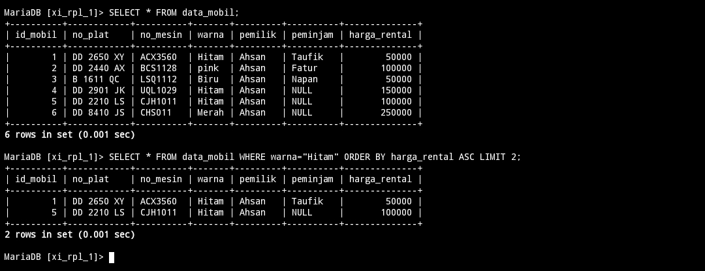
#### Analisis
Mari kita analisis langkah per langkah:

1. `SELECT * FROM mobil:` Ini adalah perintah SQL yang digunakan untuk memilih semua kolom dari tabel "`mobil`".

2. `WHERE warna="Hitam"`: Ini adalah klausa `WHERE` yang memfilter baris-baris di mana nilai kolom "`warna`" adalah "`Hitam`".

3. `ORDER BY harga_rental ASC`: Ini adalah klausa `ORDER BY` yang mengurutkan hasil berdasarkan kolom "`harga_rental`" secara menaik (`ASC`).

4. LIMIT 2: Ini adalah klausa `LIMIT` yang membatasi jumlah baris hasil yang dikembalikan menjadi 2 baris.
#### Kesimpulan
Perintah `SELECT * FROM mobil WHERE warna="Hitam" ORDER BY harga_rental ASC LIMIT 2;` akan mengambil dua baris data dari tabel "`mobil`" di mana nilai kolom "`warna`" adalah "`Hitam`", diurutkan dari harga sewa mobil yang terendah. Pastikan data yang dikembalikan sesuai dengan kebutuhan aplikasi Anda.

---
## DISTINCT
### Struktur query
```mySQL
SELECT DISTINCT(nama_kolom) FROM nama_tabel;
```

```mySQL
SELECT DISTINCT(nama_kolom) FROM nama_tabel ORDER BY nama_kolom DESC;
```
### Contoh query
```mySQL
SELECT DISTINCT(warna) FROM mobil;
```

```mySQL
SELECT DISTINCT(harga_rental) FROM mobil ORDER BY harga_rental DESC;
```
### Hasil


### Analisis
- `SELECT` : Kata kunci yang digunakan untuk memilih kolom atau nilai dari tabel, 
- `DISTINCT(warna)` : Mengambil nilai unik dari kolom warna. Ini berarti jika ada nilai yang sama dalam kolom warna, hanya satu nilai unik akan dipilih, 
- `FROM` : Kata kunci yang menunjukkan tabel yang digunakan untuk mengambil data, 
- `mobil` : Nama tabel dari mana data akan diambil.

- `SELECT` : Kata kunci yang digunakan untuk memilih kolom atau nilai dari tabel, 
- `DISTINCT(harga_rental)` : Mengambil nilai unik dari kolom `harga_rental`. Ini berarti jika ada nilai yang sama dalam kolom `harga_rental`, hanya satu nilai unik akan dipilih,
- `FROM` : Kata kunci yang menunjukkan tabel yang digunakan untuk mengambil data, 
- `mobil` : Nama tabel dari mana data akan diambil, 
- `ORDER BY` : Kata kunci yang digunakan untuk mengurutkan hasil query,
- `harga_rental DESC` : Mengurutkan hasil kueri berdasarkan kolom `harga_rental` secara descending (dari nilai terbesar hingga terkecil).
### Kesimpulan
 `SELECT DISTINCT(warna) FROM mobil;` digunakan untuk memilih semua nilai unik dari kolom warna dalam tabel "mobil".

 `SELECT DISTINCT(harga_rental) FROM mobil ORDER BY harga_rental DESC;` digunakan untuk memilih semua nilai unik dari kolom harga_rental dalam tabel "mobil" dan mengurutkannya secara descending, yaitu dari nilai terbesar hingga terkecil.
 
---

## CONCAT, CONCAT_WS, AS
### Menggabungkan kolom tanpa pemisah
### Struktur query
```mySQL
SELECT CONCAT(kolom1,kolom2) FROM nama_tabel;
```
### Contoh query 
```mySQL
SELECT CONCAT(pemilik,warna) FROM mobil;
```
### Hasil

### Analisis
- `SELECT`: Kata kunci yang digunakan untuk memilih data dari database,
- `CONCAT`: Fungsi yang digunakan untuk menggabungkan dua atau lebih string bersama-sama,
- `pemilik`: Nama kolom dalam tabel "mobil" yang mewakili pemilik mobil,
- `warna`: Kolom lain dalam tabel "mobil" yang mewakili warna mobil,
- `FROM mobil`: Menentukan tabel dari mana data harus diambil, dalam hal ini, tabel "mobil".
### Kesimpulan
Query tersebut menghasilkan kolom baru yang berisi hasil penggabungan antara nama pemilik mobil dan warna mobil dari setiap baris dalam tabel "mobil".

### Menggabungkan kolom dengan pemisah
### Struktur query
```mySQL
SELECT CONCAT_WS("-",kolom1,kolom2,kolom3) FROM nama_tabel;
```
### Contoh query 
```mysql
SELECT CONCAT_WS("-",id_mobil,no_plat,no_mesin) FROM mobil;
```
### Hasil

### Analisis
- `SELECT` : Kata kunci yang digunakan untuk memilih data dari database. 
- `CONCAT_WS` : Fungsi yang digunakan untuk menggabungkan nilai-nilai string dengan menggunakan separator tertentu,
- `"-"` : Separator yang akan digunakan untuk menggabungkan nilai-nilai string, 
- `id_mobil` : Kolom dalam tabel "mobil" yang menyimpan ID unik untuk setiap mobil, 
- `no_plat` : Kolom lain dalam tabel "mobil" yang menyimpan nomor plat mobil,
- `no_mesin` : Kolom lain dalam tabel "mobil" yang menyimpan nomor mesin mobil, 
- `FROM mobil` : Menentukan tabel dari mana data harus diambil, dalam hal ini, tabel "mobil".
### Kesimpulan
Query tersebut menghasilkan kolom baru yang berisi hasil penggabungan nilai ID mobil, nomor plat, dan nomor mesin dari setiap baris dalam tabel "mobil", dengan menggunakan tanda "-" sebagai separator.
### Memberikan nama kolom alias
### Struktur query 
```mySQL
SELECT CONCAT_WS("+",kolom1,kolom2) AS COLLAB FROM nama_tabel;
```
### Contoh query 
```mysQl
SELECT CONCAT_WS("+",pemilik,peminjam) AS COLLAB FROM mobil;
```
### Hasil

### Analisis
- `SELECT` : Kata kunci yang digunakan untuk memilih data dari database.
- `CONCAT_WS` : Fungsi yang digunakan untuk menggabungkan nilai-nilai string dengan menggunakan separator tertentu, 
- `"+"` : Separator yang akan digunakan untuk menggabungkan nilai-nilai string,
- `id_mobil` : Kolom dalam tabel "mobil" yang menyimpan ID unik untuk setiap mobil, 
- `no_plat` : Kolom lain dalam tabel "mobil" yang menyimpan nomor plat mobil, 
- `no_mesin` : Kolom lain dalam tabel "mobil" yang menyimpan nomor mesin mobil,
- `FROM mobil` : Menentukan tabel dari mana data harus diambil, dalam hal ini, tabel "mobil".
### Kesimpulan
Query tersebut menghasilkan kolom baru yang berisi hasil penggabungan nilai ID mobil, nomor plat, dan nomor mesin dari setiap baris dalam tabel "mobil", dengan menggunakan tanda "-" sebagai separator.
## VIEW
### Membuat tabel virtual
#### Struktur query
```mysql
CREATE VIEW nama_tabel_virtual AS SELECT kolom1, kolom2, kolom3, kolom3 FROM nama_tabel WHERE kolom IS NULL;
```
#### Contoh query
```MySQL
CREATE VIEW info_no_plat AS SELECT id_mobil, no_plat, pemilik, peminjam FROM mobil WHERE peminjam IS NULL;
```
#### Hasil

#### Analisis
- `CREATE VIEW` : Ini adalah perintah untuk membuat sebuah view dalam database, 
- `info_no_plat` : Nama yang diberikan untuk view yang akan dibuat,
- `AS` : Menghubungkan perintah CREATE VIEW dengan SELECT statement yang mendefinisikan isi dari view, 
- `SELECT` : Kata kunci yang digunakan untuk memilih data dari database, 
- `id_mobil, no_plat, pemilik, peminjam` : Kolom-kolom yang akan dimasukkan ke dalam view, 
- `FROM mobil` : Menentukan tabel dari mana data harus diambil, dalam hal ini, tabel "mobil", 
- `WHERE peminjam IS NULL` : Kondisi yang menyaring baris-baris dari tabel "mobil" di mana nilai kolom "peminjam" adalah NULL.
#### Kesimpulan
Perintah tersebut membuat sebuah view bernama `"info_no_plat"` yang menampilkan kolom `"id_mobil"`, `"no_plat"`, `"pemilik"`, dan `"peminjam"` dari tabel `"mobil",` tetapi hanya untuk baris-baris di mana kolom `"peminjam"` memiliki nilai `NULL`.
### Menampilkan tabel virtual
#### Struktur query
```mysql
SELECT * FROM nama_tabel_virtual;
```
#### Contoh query
```mysql
SELECT * FROM info_no_plat;
```
#### Hasil

#### Analisis
- `SELECT` : Ini adalah perintah untuk memilih semua kolom dari tabel atau view yang ditentukan,
- `FROM info_no_plat`: Ini menentukan sumber data dari mana SELECT akan mengambil data, dalam hal ini, view `"info_no_plat"`.
#### Kesimpulan
Perintah SELECT tersebut bertujuan untuk menampilkan semua kolom dari view `"info_no_plat"`.
### Menghapus tabel virtual
#### Struktur query
```mysql
DROP VIEW nama_tabel_virtual;
```
#### Contoh query
```mysql
DROP VIEW info_no_plat;
```
#### Hasil

#### Analisis
- `DROP VIEW` : Ini adalah perintah untuk menghapus sebuah view dari database, 
- `info_no_plat` : Nama view yang akan dihapus.
#### Kesimpulan
Perintah tersebut bertujuan untuk menghapus view bernama `"info_no_plat"` dari database.
## TANTANGAN
### NO 1
>[!info]
>BUATKAN TABEL VIRTUAL DAN TAMPILKAN ISI DATANYA YANG MANA PEMINJAMANNYA ITU TIDAK ADA.
#### Kode Program
```mySQL
CREATE VIEW peminjamnya_NULL AS SELECT id_mobil , no_plat , peminjam , harga_rental FROM mobil WHERE peminjam IS NULL;
```
#### Hasil


### NO 2
>[!info]
>UPDATE ATAU GANTI SALAH SATU DATA PIMINJAM DARI TABEL MOBIL DENGAN NILAI NULL, TAMPILKAN ISI DATA PADA TABEL VIRTUAL, HASILNYA AKAN ADA 3 DATA PADA TABEL VIRTUAL.
#### Kode Program
```mySQL
UPDATE mobil SET peminjam=NULL WHERE id_mobil="3";
```
#### Hasil


### NO 3
>[!info]
>BERIKAN KESIMPULAN KENAPA TABEL VIRTUAL DIBUAT.
#### Kesimpulannya
Tabel virtual dibuat untuk menyediakan pandangan yang terstruktur dan terpusat pada subset data tertentu dari tabel "mobil". Dalam hal ini, tabel virtual "peminjamnya_NULL" hanya akan menampilkan data mobil yang belum dipinjam, yaitu data yang memiliki nilai null di kolom "peminjam". Hal ini memungkinkan untuk melakukan query atau analisis lebih lanjut terhadap data tersebut tanpa harus memodifikasi struktur tabel asli "mobil". Dengan menggunakan VIEW, dapat mempermudah penggunaan dan akses data yang sesuai dengan kebutuhan tertentu.
## AGREGASI
### Sum
#### Struktur query
```mysql
SELECT SUM(nama_kolom) AS nama_alias FROM nama_tabel;
```
#### Contoh query
```mysql
SELECT SUM(harga_rental) AS total FROM mobil;
```
#### Hasil
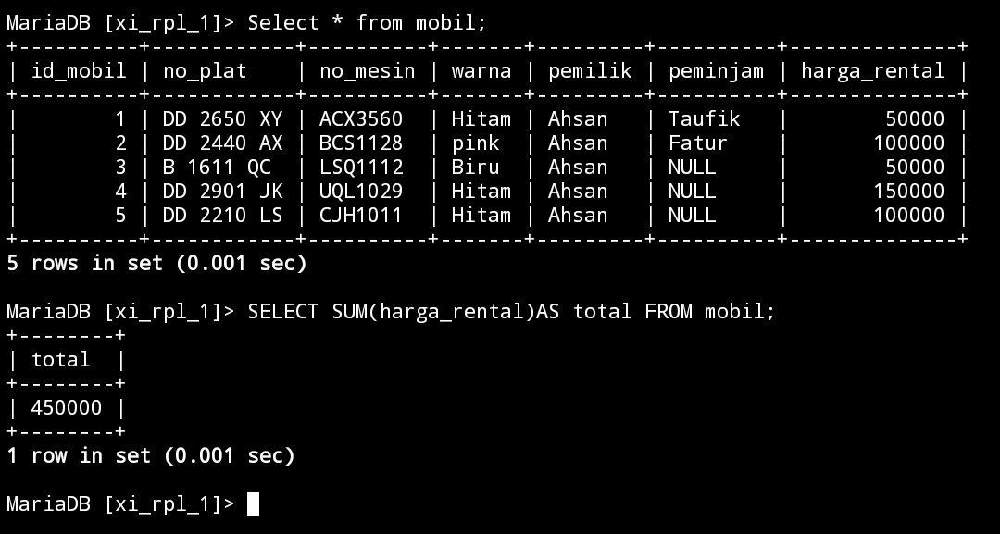
#### Analisis
1. `SELECT`: Ini adalah perintah SQL yang digunakan untuk memilih data dari tabel atau melakukan operasi seperti penghitungan atau pengelompokan.
2. `SUM(harga_rental)`: Ini adalah fungsi agregasi yang digunakan untuk menjumlahkan nilai-nilai dalam kolom "harga_rental".
3. `AS total`: Ini adalah bagian dari perintah yang memberikan nama alias "total" pada hasil perhitungan yang diberikan oleh fungsi SUM(harga_rental).
4. `FROM mobil`: Ini adalah klausa yang menunjukkan bahwa data yang dipilih akan diambil dari tabel bernama "mobil".
#### Kesimpulan
Perintah SQL tersebut digunakan untuk menghitung total harga rental dari semua mobil yang ada dalam tabel "mobil" dan menampilkan hasilnya dengan nama alias "total".
### Count
#### Struktur query
```mysql
SELECT count(nama_kolom) FROM nama_tabel;
```
#### Contoh query
```mysql
SELECT COUNT(pemilik) FROM mobil;
```

```mysql
SELECT COUNT(peminjam) FROM mobil;
```
#### Hasil
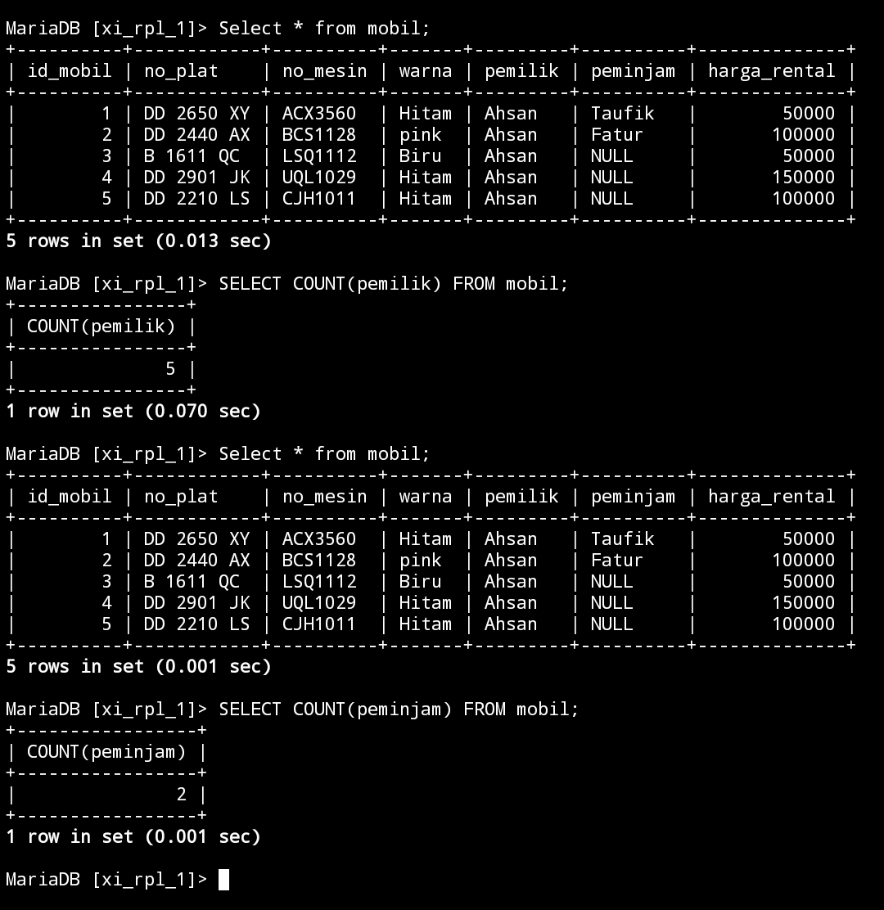
#### Analisis
1. `SELECT`: Ini adalah perintah SQL yang digunakan untuk memilih data dari tabel atau melakukan operasi seperti penghitungan atau pengelompokan.

2. `COUNT(pemilik)`: Ini adalah fungsi agregasi yang digunakan untuk menghitung jumlah baris dalam kolom "pemilik" yang memiliki nilai tidak null. 

3. `FROM mobil`: Ini adalah klausa yang menunjukkan bahwa data yang dipilih akan diambil dari tabel bernama "mobil".
#### Kesimpulan
Perintah SQL tersebut digunakan untuk menghitung jumlah entri dalam kolom "pemilik" yang memiliki nilai tidak null dalam tabel "mobil".
### Min
#### Struktur query
```mysql
SELECT MIN(nama_kolom) AS nama_alias FROM nama_tabel;
```
#### Contoh query
```mysql
SELECT MIN(harga_rental) AS MINIMAL FROM mobil;
```
#### Hasil
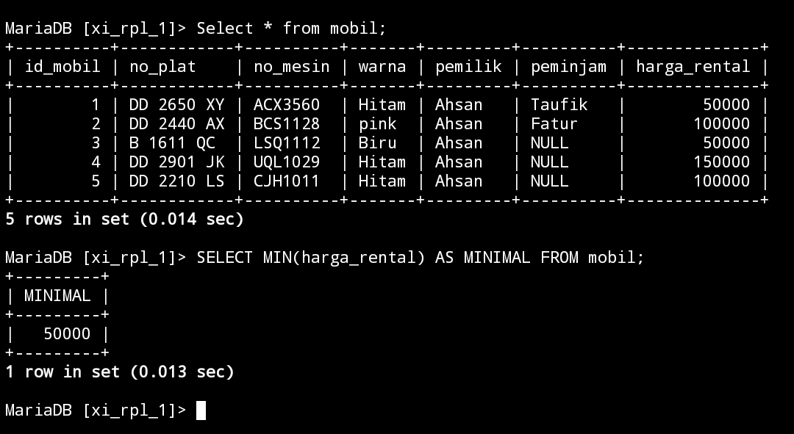
#### Analisis
1. `SELECT`: Perintah SQL yang digunakan untuk memilih data dari tabel atau melakukan operasi seperti penghitungan atau pengelompokan.

2. `MIN(harga_rental)`: Fungsi agregasi yang digunakan untuk mencari nilai terkecil dari kolom "harga_rental".

3. `AS MINIMAL`: Nama alias yang diberikan pada hasil perhitungan nilai terkecil tersebut.

4. `FROM mobil`: Klausa yang menunjukkan bahwa data yang dipilih akan diambil dari tabel bernama "mobil".
#### Kesimpulan
Perintah SQL tersebut digunakan untuk mencari nilai terkecil dari kolom "harga_rental" dalam tabel "mobil" dan menampilkannya dengan nama alias "MINIMAL".
### Max
#### Struktur query
```mysql
SELECT MAX(nama_kolom) AS nama_alias FROM nama_tabel;
```
#### Contoh query
```mysql
SELECT MAX(harga_rental) AS MIXIMAL FROM mobil;
```
#### Hasil
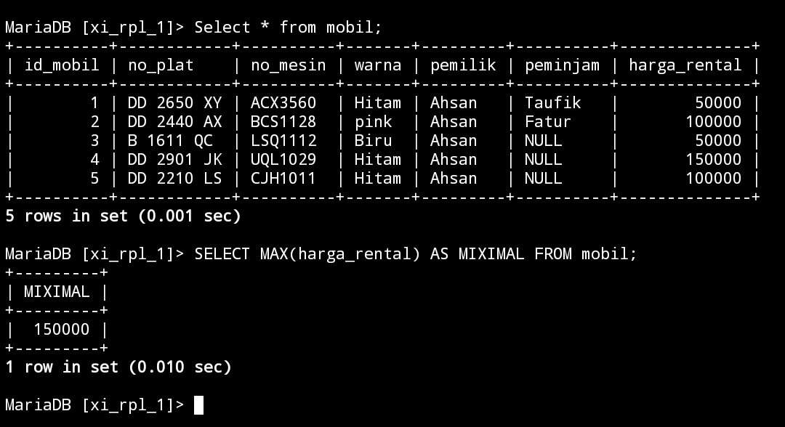
#### Analisis
1. `SELECT`: Ini adalah perintah SQL yang digunakan untuk memilih data dari tabel atau melakukan operasi seperti penghitungan atau pengelompokan.

2. `MAX(harga_rental)`: Ini adalah fungsi agregasi yang digunakan untuk mencari nilai terbesar dari kolom "harga_rental".

3. `AS MIXIMAL`: Ini adalah bagian dari perintah yang memberikan nama alias "MIXIMAL" pada hasil perhitungan nilai terbesar tersebut.

4. `FROM mobil`: Ini adalah klausa yang menunjukkan bahwa data yang dipilih akan diambil dari tabel bernama "mobil".
#### Kesimpulan
Perintah SQL tersebut digunakan untuk mencari nilai terbesar dari kolom "harga_rental" dalam tabel "mobil" dan menampilkannya dengan nama alias "MIXIMAL".
### AVG
#### Struktur query
```mysql
SELECT AVG(nama_kolom) AS nama_alias FROM nama_tabel;
```
#### Contoh query
```mysql
SELECT AVG(harga_rental) AS RATA_RATA FROM mobil;
```
#### Hasil
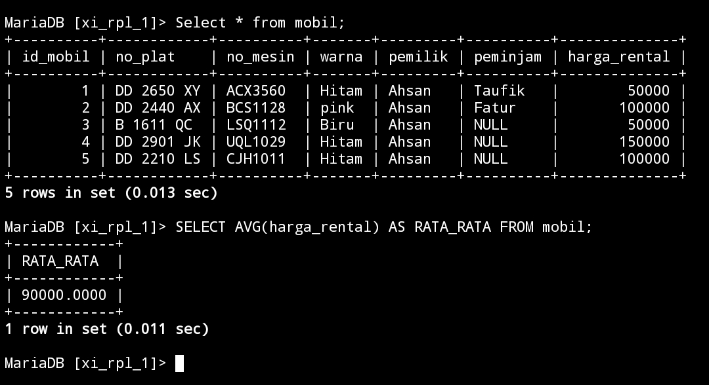
#### Analisis
1. `SELECT`: Ini adalah perintah SQL yang digunakan untuk memilih data dari tabel atau melakukan operasi seperti penghitungan atau pengelompokan.

2. `AVG(harga_rental)`: Ini adalah fungsi agregasi yang digunakan untuk menghitung rata-rata dari nilai-nilai dalam kolom "harga_rental".

3. `AS RATA_RATA`: Ini adalah bagian dari perintah yang memberikan nama alias "RATA_RATA" pada hasil perhitungan rata-rata tersebut.

4. `FROM mobil`: Ini adalah klausa yang menunjukkan bahwa data yang dipilih akan diambil dari tabel bernama "mobil".
#### Kesimpulan
Perintah SQL tersebut digunakan untuk menghitung rata-rata harga rental dari semua mobil yang ada dalam tabel "mobil" dan menampilkan hasilnya dengan nama alias "RATA_RATA".

# Hasil Relasi
## Data tabel pegawai
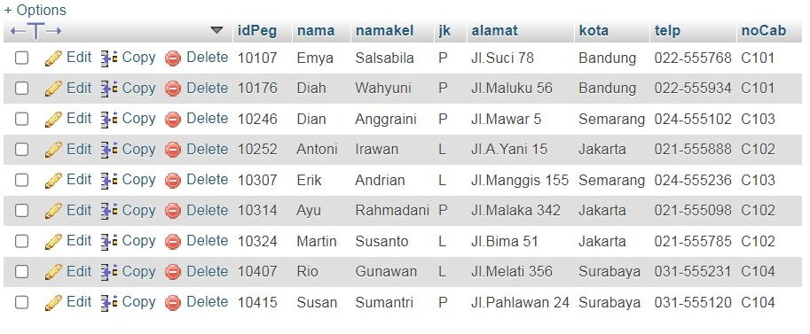

## Perubahan struktur tabel
### Before

### After


## Perubahan data tabel
### Pegawai
#### Before

#### After 
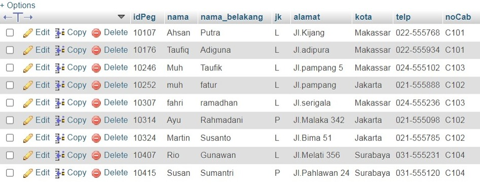

### Cabang
#### Before
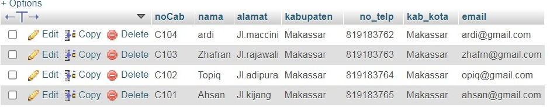
#### After


## Hasil Relasi (Designer)
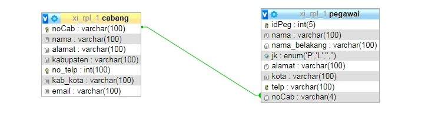

## Query relasi dan hasil
### Query relasi
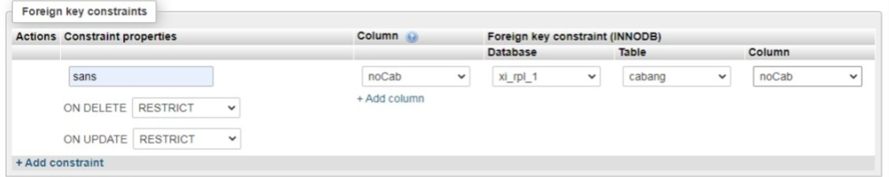
### hasil


# GROUP BY & HAVING
## 1.tampilkan jumlah data mobil dan kelompok kan berdasarkan warna nya sesuai dengan tabel mobil kalian.

### Struktur Query
```mysql
select data 2,COUNT(Data 1) AS nama_sementara FROM nama_tabel GROUP BY data 2;
```
### Query
```mysql
select warna,COUNT(id_mobil) AS Jumlah_Data_Mobil FROM data_mobil GROUP BY warna;
```
### Hasil

### Analisis
- `SELECT warna, COUNT(id_mobil) AS Jumlah_Data_Mobil`: Menginstruksikan database untuk memilih kolom `warna` dan menghitung jumlah `id_mobil` untuk setiap kelompok warna, dengan hasil perhitungan diberi alias `Jumlah_Data_Mobil`.
- `FROM data_mobil`: Menentukan tabel `data_mobil` sebagai sumber data untuk query ini.
- `GROUP BY warna`: Mengelompokkan baris dalam tabel berdasarkan nilai dalam kolom `warna`. Untuk setiap kelompok (setiap warna), fungsi `COUNT(id_mobil)` menghitung jumlah baris dalam kelompok tersebut.
### Kesimpulan 
Query ini digunakan untuk mendapatkan jumlah mobil berdasarkan warna dari tabel `data_mobil`. Dengan mengelompokkan data berdasarkan kolom `warna` dan menggunakan fungsi agregat `COUNT(id_mobil)`, kita dapat mengetahui berapa banyak mobil dari setiap warna yang ada dalam tabel tersebut. Hasilnya disajikan dengan dua kolom: `warna` dan `Jumlah_Data_Mobil`.
___
## 2.berdasarkan query ini tampilkan yang lebih BESAR dari 3 atau sama dengan 3 pemilik mobil nya

### Struktur Query
```mysql
select data 3,COUNT(id_mobil) AS nama_sementara from nama_tabel GROUP BY data 3 HAVING COUNT(data 1) >= 3;
```
### Query
```mysql
select pemilik,COUNT(id_mobil) AS jumlah_mobil from data_mobil GROUP BY pemilik HAVING COUNT(id_mobil) >= 3;
```
### Hasil
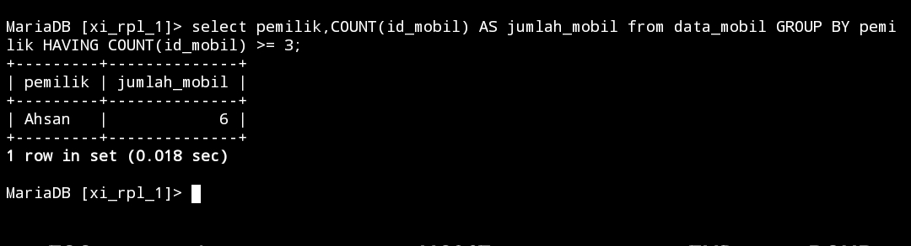
### Analisis
- `SELECT pemilik, COUNT(id_mobil) AS jumlah_mobil` : Menginstruksikan database untuk memilih kolom `pemilik` dan menghitung jumlah `id_mobil` untuk setiap kelompok pemilik, dengan hasil perhitungan diberi alias `jumlah_mobil`.
- `FROM data_mobil`: Menentukan tabel `data_mobil` sebagai sumber data untuk query ini.
- `GROUP BY pemilik`: Mengelompokkan baris dalam tabel berdasarkan nilai dalam kolom `pemilik`. Untuk setiap kelompok (setiap pemilik), fungsi `COUNT(id_mobil)` menghitung jumlah baris dalam kelompok tersebut.
- `HAVING COUNT(id_mobil) >= 3`: Menyaring hasil sehingga hanya kelompok yang memiliki `COUNT(id_mobil)` sama dengan atau lebih besar dari 3 yang disertakan dalam hasil akhir.
### Kesimpulan
Query ini digunakan untuk mendapatkan daftar pemilik yang memiliki setidaknya 3 mobil. Dengan mengelompokkan data berdasarkan kolom `pemilik` dan menggunakan fungsi agregat `COUNT(id_mobil)`, kita dapat mengetahui jumlah mobil yang dimiliki oleh setiap pemilik. Klausa `HAVING` memastikan bahwa hanya pemilik dengan 3 atau lebih mobil yang disertakan dalam hasil.
___
## 3.tampilkan smua pemilik dengan jumlah mobilnya yang memiliki atau sama dengan 3 mobil
###  Struktur Query
```mysql
SELECT nama_data,COUNT(nama_data) AS nama_sementara FROM nama_tabel GROUP BY nama_data;
```
### Query
```mysql
SELECT pemilik, 
COUNT(id_mobil) AS jumlah_mobil 
FROM mobil GROUP BY pemilik;
```
### Hasil
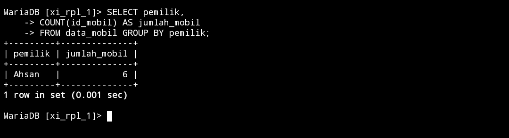
### Analisis
`SELECT pemilik, COUNT(id_mobil) AS jumlah_mobil`: Menginstruksikan database untuk memilih kolom `pemilik` dan menghitung jumlah `id_mobil` untuk setiap kelompok `pemilik`, dengan hasil perhitungan diberi alias `jumlah_mobil`.
`FROM mobil`: Menentukan tabel `mobil` sebagai sumber data untuk query ini.
`GROUP BY pemilik`: Mengelompokkan baris dalam tabel berdasarkan nilai dalam kolom `pemilik`. Untuk setiap kelompok (setiap pemilik), fungsi `COUNT(id_mobil)` menghitung jumlah baris dalam kelompok tersebut.
### Kesimpulan
Query ini digunakan untuk mendapatkan jumlah mobil yang dimiliki oleh setiap pemilik. Dengan mengelompokkan data berdasarkan kolom `pemilik` dan menggunakan fungsi agregat `COUNT(id_mobil),` kita dapat mengetahui jumlah mobil yang dimiliki oleh setiap pemilik. Hasilnya disajikan dengan dua kolom: `pemilik` dan `jumlah_mobil`.
___
## 4.berdasarkan query yang ada pada praktikum 5 bagian 7 tampilkan data pada table mobil dengan mengelompokkan berdasarkan pemiliknya.hitung menggunakan sum total pendapatan pemilik berdasarkan harga rental

### Struktur Query
```mysql
select data 3,SUM(data 5) AS nama_sementara from nama_tabel GROUP BY data 3;
```
### Query
```mysql
select pemilik,SUM(harga_rental) AS jumlah_pendapatan from data_mobil GROUP BY pemilik;
```
### Hasil
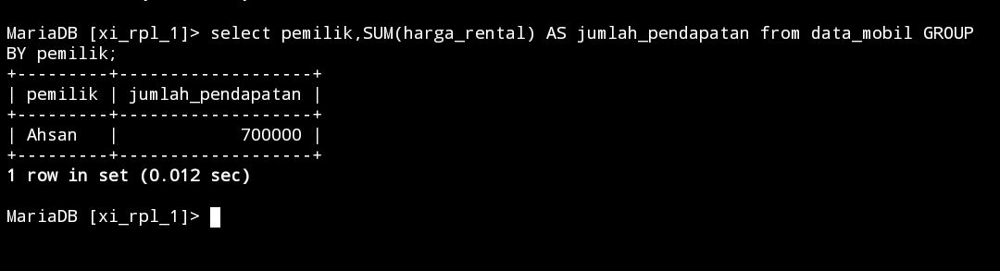
### Analisis
- `SELECT pemilik, SUM(harga_rental) AS jumlah_pendapatan`: Menginstruksikan database untuk memilih kolom `pemilik` dan menjumlahkan nilai `harga_rental` untuk setiap kelompok pemilik, dengan hasil perhitungan diberi alias jumlah_pendapatan.
- `FROM data_mobil`: Menentukan tabel `data_mobil` sebagai sumber data untuk query ini.
- `GROUP BY pemilik`: Mengelompokkan baris dalam tabel berdasarkan nilai dalam kolom `pemilik`. Untuk setiap kelompok (setiap pemilik), fungsi `SUM(harga_rental)` menjumlahkan nilai `harga_rental` dalam kelompok tersebut.
### Kesimpulan
Query ini digunakan untuk mendapatkan jumlah total pendapatan dari `harga_rental` untuk setiap pemilik mobil. Dengan mengelompokkan data berdasarkan kolom `pemilik` dan menggunakan fungsi agregat `SUM(harga_rental)`, kita dapat mengetahui total pendapatan rental yang diperoleh oleh masing-masing pemilik. Hasilnya disajikan dalam dua kolom: `pemilik` dan `jumlah_pendapatan`.
___
## 5. Berdasarkan praktikum 5 query no 8 tampilkan jumlah pemasukan pemilik berdasarkan harga rental kelompokkan berdasarkan pemiliknya dan seleksi yang total pemasukannya atau harga rentalnya mencapai lebih besar atau sama dengan 300k

### Struktur Query
```mysql
select data_mobil,SUM(data_mobil) AS nama_sementara from nama_tabel GROUP BY data_mobil HAVING SUM(data_mobil) >= 300000;
```
### Query
```mysql
select pemilik,SUM(harga_rental) AS jumlah_pemasukan from data_mobil GROUP BY pemilik HAVING SUM(harga_rental) >= 300000;
```
### Hasil

### Analisis
- `SELECT pemilik, SUM(harga_rental) AS jumlah_pemasukan`: Menginstruksikan database untuk memilih kolom `pemilik` dan menjumlahkan nilai `harga_rental` untuk setiap kelompok pemilik, dengan hasil perhitungan diberi alias `jumlah_pemasukan`.
- `FROM data_mobil`: Menentukan tabel `data_mobil` sebagai sumber data untuk query ini.
- `GROUP BY pemilik`: Mengelompokkan baris dalam tabel berdasarkan nilai dalam kolom `pemilik`. Untuk setiap kelompok (setiap pemilik), fungsi `SUM(harga_rental)` menjumlahkan nilai `harga_rental` dalam kelompok tersebut.
- `HAVING SUM(harga_rental) >= 300000`: Menyaring hasil sehingga hanya kelompok yang memiliki jumlah total `harga_rental` lebih besar atau sama dengan 300000 yang disertakan dalam hasil akhir.
### Kesimpulan
Query ini digunakan untuk mendapatkan pemilik mobil yang memiliki jumlah total pendapatan dari `harga_rental` sebesar atau lebih dari 300000. Dengan mengelompokkan data berdasarkan kolom `pemilik` dan menggunakan fungsi agregat `SUM(harga_rental)`, kita dapat mengetahui total pendapatan rental yang diperoleh oleh masing-masing pemilik dan menyaring hanya yang memenuhi syarat tertentu (>= 300000). Hasilnya disajikan dalam dua kolom: `pemilik` dan `jumlah_pemasukan`.
___
## 6. Berdasarkan praktikum 6 no 12 tampilkan rata rata pemasukan pemilik mobil kelompokkan berdasarkan pemiliknya
### Struktur Query
```mysql
select nama_data,AVG(nama_data) AS nama_sementara from nama_tabel GROUP BY nama_data;
```
### Query 
```mysql
select pemilik,AVG(harga_rental) AS rata_pemasukam from data_mobil GROUP BY pemilik;
```
### Hasil

### Analisis
- `SELECT pemilik, AVG(harga_rental) AS rata_pemasukan`: Instruksi untuk memilih kolom `pemilik` dan menghitung rata-rata `harga_rental` untuk setiap kelompok `pemilik`, dengan hasil perhitungan diberi alias `rata_pemasukan`. 
- `FROM data_mobil`: Menentukan tabel `data_mobil` sebagai sumber data untuk query ini.
- `GROUP BY pemilik`: Mengelompokkan baris dalam tabel berdasarkan nilai unik dalam kolom `pemilik`. Fungsi `AVG(harga_rental`) diterapkan pada setiap kelompok untuk menghitung rata-rata `harga_rental` dalam kelompok tersebut.
### Kesimpulan
Query ini digunakan untuk menghitung rata-rata pendapatan (`harga_rental`) untuk setiap pemilik mobil (`pemilik`) berdasarkan data yang tersimpan dalam tabel `data_mobil`. Dengan mengelompokkan data berdasarkan kolom `pemilik` dan menggunakan fungsi agregat `AVG(harga_rental)`, kita dapat mengetahui rata-rata pendapatan rental yang diperoleh oleh setiap pemilik mobil. Hasilnya disajikan dalam dua kolom: `pemilik` dan `rata_pemasukan`.
___
## 7. Berdasarkan praktikum 5 no 16 tampilkan pemasukan  terbesar dan pemasukan terkecil kelompokkan berdasarkan pemiliknya dan seleksi data pemilik yg tampil atau memiliki jumlah mobil lebih besar dari 1.

### Struktur
```mysql
select nama_data,MAX(nama_data) AS nama_sementara,MIN(nama_data) AS nama_sementara from nama_tabel GROUP BY nama_data HAVING COUNT(nama_data) >= 1;
```
### Query
```mysql
select pemilik,MAX(harga_rental) AS Pemasukan_Terbesar ,MIN(harga_rental) AS pemasukan_terkecil from data_mobil GROUP BY pemilik HAVING COUNT(harga_rental) >= 1;
```
### Hasil

### Analisis

 - `SELECT`: Memilih kolom untuk ditampilkan dalam hasil query.
 - `pemilik`: Kolom yang menunjukkan pemilik dari mobil.
 - `MAX(harga_rental) AS Pemasukan_Terbesar`: Menggunakan fungsi agregat `MAX` untuk menemukan nilai terbesar dari kolom `harga_rental` dalam setiap grup `pemilik`. Hasilnya diberi alias `Pemasukan_Terbesar`.
 - `MIN(harga_rental) AS Pemasukan_Terkecil`: Menggunakan fungsi agregat `MIN` untuk menemukan nilai terkecil dari kolom `harga_rental` dalam setiap grup `pemilik`. Hasilnya diberi alias `Pemasukan_Terkecil`.
- `FROM data_mobil`: Menentukan tabel `data_mobil` sebagai sumber data untuk query.
- `GROUP BY pemilik`: Mengelompokkan hasil query berdasarkan kolom `pemilik`. Setiap pemilik akan menjadi satu grup terpisah.
- `HAVING`: Filter yang digunakan setelah pengelompokan (`GROUP BY`).
-  `COUNT(harga_rental) >= 1`: Menggunakan fungsi agregat `COUNT` untuk menghitung jumlah entri `harga_rental` dalam setiap grup `pemilik` dan hanya menyertakan grup yang memiliki setidaknya satu entri `harga_rental`.
### Kesimpulan
Query ini bertujuan untuk menampilkan setiap pemilik mobil, bersama dengan nilai tertinggi (`Pemasukan_Terbesar`) dan terendah (`Pemasukan_Terkecil`) dari harga rental mobil mereka, hanya jika mereka memiliki setidaknya satu harga rental yang tercatat.