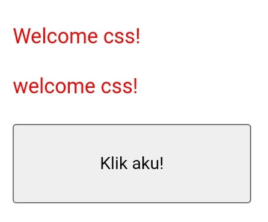
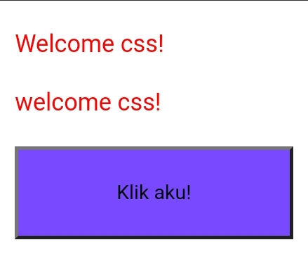
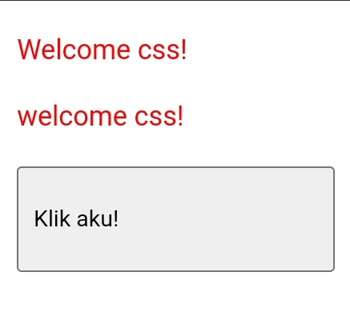
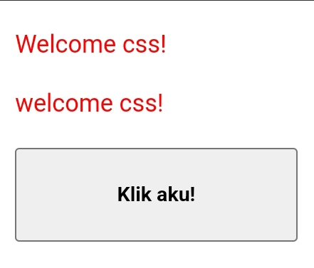

# Anatomi CSS
# Pertemuan Pertama


# Percobaan Kedua
## Kode CSS
```css
Button {
width: 150px;
height: 50px;
color: yellow;
background-color: #7949FF;
text-align: left;
font-weight: bold;
}
```

---
## background-color
### Before


### After


---
## text-align
### Before

### After


---
## font-wight
### Before

### After


---
# Cara Pemanggilan CSS
# Selector

# Materi Font

## Text-align
### Penjelasan

### Kode Program

### Hasil

---
## Text-decoration
### Penjelasan

### Kode Program

### Hasil

---
## Text-transfrom
### Penjelasan

### Kode Program

### Hasil

---
## Text-indent
### Penjelasan

### Kode Program

### Hasil

---
## Letter-spacing
### Penjelasan

### Kode Program

### Hasil

---
## Line-height
### Penjelasan

### Kode Program

### Hasil

---
## Word-spacing
### Penjelasan

### Kode Program

### Hasil

---
---
# Materi Background
## Background-image
### Penjelasan

### Kode Program

### Hasil

---
## Background-size
### Penjelasan

### Kode Program

### Hasil

---
## Background-repeat
### Penjelasan

### Kode Program

### Hasil

---
## Background-attachment
### Penjelasan

### Kode Program

### Hasil

---
## Background-position
### Penjelasan

### Kode Program

### Hasil

---
---
# Materi Font

## Font-size
### Penjelasan

### Kode Program

### Hasil

---
## Font-style
### Penjelasan

### Kode Program

### Hasil

---
## Font-weight
### Penjelasan

### Kode Program

### Hasil

---
## Font-family
### Penjelasan

### Kode Program

### Hasil

---
---
