# Anatomi CSS

## Selecktor
Selektor dalam CSS adalah pola yang digunakan untuk memilih elemen HTML di mana aturan gaya akan diterapkan, seperti nama elemen, kelas, id, atau atribut lainnya. Ini memungkinkan Anda untuk menargetkan dan memodifikasi tampilan elemen-elemen spesifik pada halaman web Anda.

## Property
Property dalam CSS adalah atribut yang digunakan untuk mengatur tampilan elemen HTML, seperti warna, ukuran, dan tata letak.

## Property Value
Property value dalam CSS adalah nilai yang ditentukan untuk suatu properti CSS, seperti warna, ukuran, atau posisi. Misalnya, untuk properti `color`, property value bisa berupa nama warna (contohnya `red`), kode warna (contohnya `#00FF00`), atau fungsi warna (contohnya `rgb(255, 0, 0)`).

# Pertemuan Pertama
## Penjelasan
Program di bawah merupakan kode HTML dengan sedikit tambahan CSS di dalamnya. `<style>` tag menandakan dimulainya kode CSS. Selector `p` mengarah pada elemen "p" di dalam dokumen HTML, yaitu elemen paragraf. Deklarasi gaya CSS { `color: red;` } menetapkan properti color ke nilai "`red`", sehingga teks dalam elemen paragraf akan ditampilkan dengan warna merah. Tag penutup `</style>` menandai akhir kode CSS. Di dalam `<body>`, terdapat dua elemen paragraf `<p>` dengan teks "Walcome CSS!". Karena telah dideklarasikan di CSS untuk memiliki warna merah, maka teks di dalam kedua elemen paragraf tersebut akan ditampilkan dalam warna merah.

## Kode Program
```html
<!DOCTYPE html>
<html>
  <head>
    <title>Percobaan Pertama CSS</title>
    <style>
    p {
      color: red;
    }
    </style>
  </head>
  <body>
    <p>Walcome CSS!</p>
    <p>Walcome CSS!</p>
  </body>
</html>
```

## Hasil
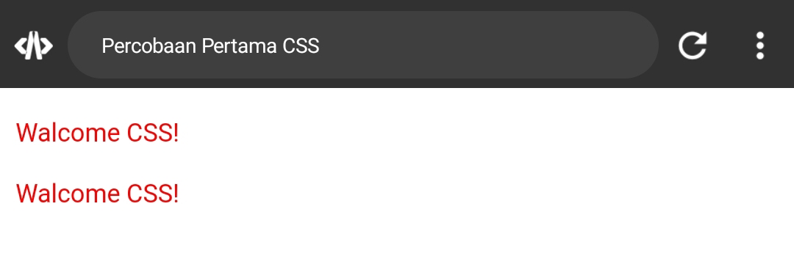

# Percobaan Kedua
## Kode CSS

```css
Button {
width: 150px;
height: 50px;
color: yellow;
background-color: #7949FF;
text-align: left;
font-weight: bold;
}
```

---
## background-color
### Before


### After


---
## text-align
### Before

### After


---
## font-wight
### Before

### After


---
# Cara Pemanggilan CSS
## Pemanggilan CSS Eksternal
**Eksternal**: Ini adalah metode yang paling umum dan direkomendasikan. Anda dapat menghubungkan file CSS eksternal ke halaman HTML menggunakan tag `<link>` di dalam bagian `<head>` dari dokumen HTML, seperti yang telah dijelaskan sebelumnya.
### Contoh Kode Program
**Kode HTML**
```html
<!DOCTYPE html>
<html>
  <head>
    <title>belajar panggilan css</title>
    <link rel="stylesheet" href="Style.css">
  </head>
  
  <body>
   <p>ini menggunakan pemanggilan external</p>
  </body>
  
</html>
```
**Kode CSS**
```css
p {
  color: red;
}
```
## Pemanggilan CSS Internal 
**Internal**: Anda juga dapat memasukkan CSS langsung ke dalam dokumen HTML menggunakan tag `<style>` di dalam bagian `<head>` atau langsung di dalam elemen HTML menggunakan atribut `style`. Ini sering digunakan untuk styling yang bersifat lokal dan spesifik untuk satu halaman.
### Contoh Kode Program
```html
<html>
  <head>
    <title>belajar panggilan css</title>
    <style>
    p {
    color : red
    }
    </style>
  </head>
  
  <body>
   <p>ini menggunakan pemanggilan internal</p>
  </body>
  
</html>
```

## Pemanggilan CSS inline
**Inline**: Anda juga dapat menentukan styling langsung di dalam elemen HTML menggunakan atribut `style`. Ini biasanya digunakan untuk styling yang sangat spesifik untuk satu elemen.
### Contoh Kode Program
```html
<!DOCTYPE html>
<html>
  <head>
    <title>belajar panggilan css</title>
  </head>
  
  <body>
   <p style="color:red;">ini menggunakan pemanggilan inline</p>
  </body>
  
</html>
```

# Selector
## Selector Elemen
**Selector Elemen** : Selector ini memilih semua elemen HTML dengan nama elemennya. Misalnya, jika Anda menggunakan `p` sebagai selector, maka semua elemen paragraf dalam dokumen HTML akan dipilih.

## Selector Class
**Selector Kelas** : Digunakan untuk memilih elemen berdasarkan kelas tertentu yang diberikan kepada elemen tersebut. Untuk menggunakan selector kelas, Anda harus menambahkan titik (.) di depan nama kelas. Contoh: `.kelas` akan memilih semua elemen yang memiliki kelas "kelas".

## Selector Id
**Selector ID** : Memilih elemen berdasarkan ID uniknya. Untuk menggunakan selector ID, Anda harus menambahkan tanda pagar (#) di depan nama ID. Contoh: `#id` akan memilih elemen dengan ID "id".

---
# Materi Text
## Text-align
### Penjelasan
Properti `text-align` dalam CSS digunakan untuk mengatur penataan horizontal teks dalam sebuah elemen HTML. Ini memungkinkan Anda untuk mengontrol posisi teks dalam elemen tersebut.

Nilai yang umum digunakan untuk `text-align` termasuk:

- `left`: Alirkan teks ke kiri.
- `right`: Alirkan teks ke kanan.
- `center`: Alirkan teks ke tengah.
- `justify`: Meratakan teks ke kiri dan kanan, dengan menyesuaikan spasi antarkata untuk mengisi lebar elemen.
- `justify-all`: Sama seperti `justify`, namun juga meratakan spasi antarkata pada baris terakhir.

Misalnya, menggunakan `text-align: center;` akan membuat teks berada di tengah elemen HTML yang sesuai, baik itu div, paragraf, atau elemen teks lainnya.

### Kode Program
```html
<p style="text-align:right;">menggunakan text align right</p>
```

### Hasil
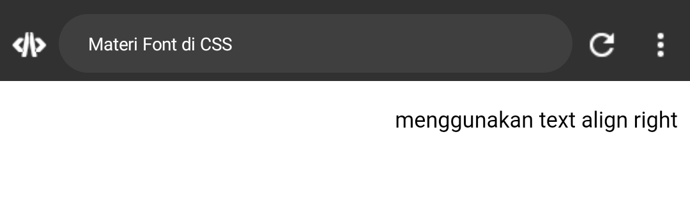

### Kesimpulan
Properti text-align dalam CSS memberikan kemampuan untuk mengatur penataan horizontal teks dalam elemen HTML. Dengan lima nilai yang umum digunakan, yaitu left, right, center, justify, dan justify-all, properti ini memberikan fleksibilitas dalam menyesuaikan posisi teks sesuai dengan kebutuhan desain halaman web. Dengan menggunakan nilai yang sesuai, pengembang dapat menciptakan tata letak yang estetis dan mudah dibaca bagi pengguna.

---

## Text-decoration
### Penjelasan
Properti `text-decoration` dalam CSS digunakan untuk mengatur dekorasi visual teks, seperti garis bawah, garis atas, atau garis tengah pada teks. Ini memungkinkan pengembang web untuk menambahkan efek visual pada teks untuk menyoroti, membedakan, atau memberikan arti khusus.

Beberapa nilai yang umum digunakan untuk `text-decoration` termasuk:

- `none`: Menghapus semua dekorasi teks.
- `underline`: Menambahkan garis bawah pada teks.
- `overline`: Menambahkan garis di atas teks.
- `line-through`: Menambahkan garis melintang pada teks, menandakan bahwa teks tersebut dianggap terhapus atau tidak relevan.

Misalnya, menggunakan `text-decoration: underline;` akan menambahkan garis bawah pada teks, yang sering digunakan pada hyperlink untuk menunjukkan bahwa teks tersebut dapat diklik untuk navigasi.

### Kode Program
```html
<p style="text-decoration: underline;">menggunakan text decoration underline</p>
```

### Hasil
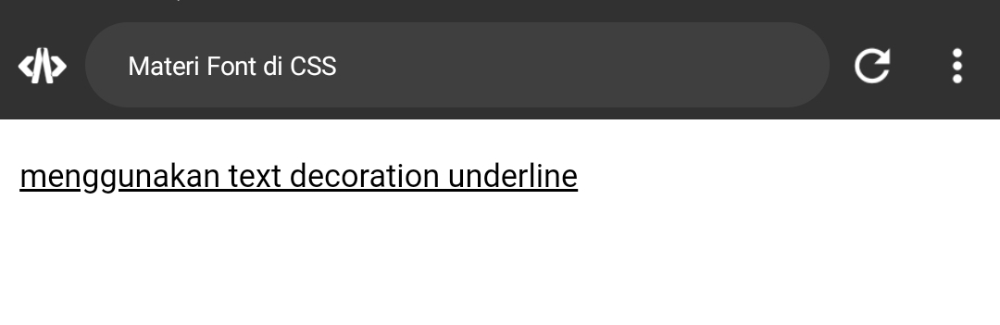

### Kesimpulan
Properti `text-decoration` dalam CSS digunakan untuk mengatur dekorasi visual teks seperti garis bawah, garis atas, atau garis tengah. Nilai yang umum digunakan termasuk `none`, `underline`, `overline`, dan `line-through`, yang memungkinkan pengembang untuk menambahkan efek visual pada teks sesuai kebutuhan desain.

---
## Text-transfrom
### Penjelasan
Properti `text-transform` dalam CSS digunakan untuk mengontrol transformasi teks, seperti mengubah huruf menjadi huruf besar, huruf kecil, atau mengkapitalkan huruf awal setiap kata.

Nilai yang umum digunakan untuk `text-transform` termasuk:

- `none`: Tidak ada transformasi teks.
- `uppercase`: Mengubah semua huruf menjadi huruf besar.
- `lowercase`: Mengubah semua huruf menjadi huruf kecil.
- `capitalize`: Mengkapitalkan huruf awal setiap kata.

Misalnya, dengan menggunakan `text-transform: uppercase;`, semua huruf dalam teks akan diubah menjadi huruf besar. Properti ini berguna untuk menyesuaikan penampilan teks tanpa mengubah struktur teks asli.

### Kode Program
```html
 <p style="text-transform: capitalize;">menggunakan text transform capitalize</p>
```

### Hasil
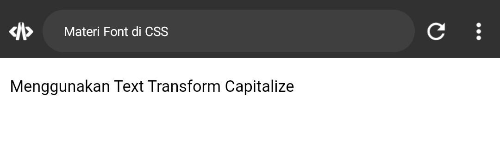

### Kesimpulan
Properti `text-transform` dalam CSS digunakan untuk mengontrol transformasi teks, seperti mengubahnya menjadi huruf besar, huruf kecil, atau mengkapitalkan huruf awal setiap kata. Dengan nilai seperti `uppercase`, `lowercase`, dan `capitalize`, properti ini memungkinkan pengembang untuk menyesuaikan penampilan teks sesuai kebutuhan desain tanpa mengubah struktur teks aslinya.

---
## Text-indent
### Penjelasan
Properti `text-indent` dalam CSS digunakan untuk mengatur jarak indentasi (tab) dari awal teks pada suatu elemen. Dengan properti ini, Anda dapat menentukan seberapa jauh teks akan dimulai dari batas kiri elemen yang diberikan.

Misalnya, menggunakan `text-indent: 20px;` akan membuat teks pada elemen tersebut dimulai 20 piksel dari batas kiri, menciptakan efek indentasi. Properti ini sering digunakan untuk membuat paragraf atau bagian teks tertentu menjadi terindentasi untuk meningkatkan keterbacaan atau untuk tujuan desain tertentu.

### Kode Program
```html
<p style="text-indent: 20px;">menggunakan text indent 20 pixel</p>
```

### Hasil
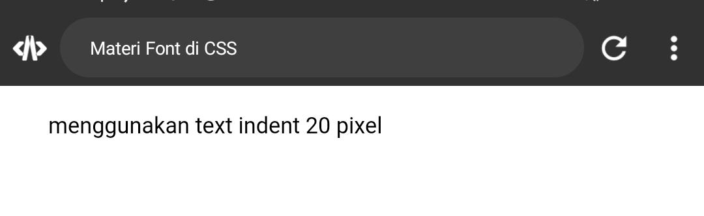

### Kesimpulan
Properti `text-indent` dalam CSS digunakan untuk mengatur jarak indentasi (tab) dari awal teks pada suatu elemen. Dengan menggunakan nilai seperti piksel atau persen, properti ini memungkinkan pengembang untuk mengontrol seberapa jauh teks akan dimulai dari batas kiri elemen yang diberikan, menciptakan efek indentasi. Properti ini sering digunakan untuk meningkatkan keterbacaan teks atau untuk tujuan desain tertentu.

---
## Letter-spacing
### Penjelasan
Properti `letter-spacing` dalam CSS digunakan untuk mengatur jarak antara karakter (huruf) dalam teks. Dengan properti ini, Anda dapat mengatur seberapa jauh atau dekat karakter-karakter tersebut ditempatkan satu sama lain.

Nilai yang umum digunakan untuk `letter-spacing` termasuk:

- Nilai positif: Meningkatkan jarak antara karakter.
- Nilai negatif: Mengurangi jarak antara karakter.

Misalnya, menggunakan `letter-spacing: 5px;` akan menambahkan jarak sebesar 5 piksel di antara setiap karakter dalam teks. Properti ini sering digunakan untuk menyesuaikan penampilan teks, meningkatkan keterbacaan, atau mencapai efek desain tertentu.

### Kode Program
```html
<p style="letter-spacing: 5px;">menggunakan letter spacing 5 pixel</p>
```

### Hasil
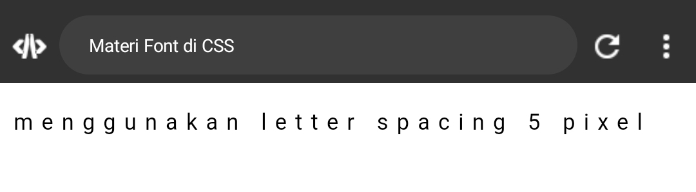

### Kesimpulan
Properti `letter-spacing` dalam CSS digunakan untuk mengatur jarak antara karakter (huruf) dalam teks. Dengan nilai positif untuk meningkatkan jarak dan nilai negatif untuk mengurangi jarak, properti ini memungkinkan pengembang untuk menyesuaikan penampilan teks sesuai kebutuhan desain atau untuk meningkatkan keterbacaan.

---
## Line-height
### Penjelasan
Properti `line-height` dalam CSS digunakan untuk mengatur tinggi baris teks dalam sebuah elemen. Tinggi baris adalah jarak vertikal antara garis dasar satu baris teks dengan garis dasar baris teks berikutnya.

Anda dapat menetapkan `line-height` dengan nilai absolut seperti piksel, atau relatif seperti persen. Nilai relatif seperti `1.5` akan mengalikan tinggi default teks, sementara nilai absolut seperti `20px` akan menetapkan tinggi baris secara langsung.

Menyesuaikan `line-height` dapat mempengaruhi keterbacaan teks dan tata letak halaman web secara keseluruhan. Nilai yang terlalu kecil dapat menyebabkan teks saling bertabrakan, sedangkan nilai yang terlalu besar dapat membuat teks terlihat terpisah-pisah. Sebagian besar desainer web menyesuaikan `line-height` untuk mencapai keseimbangan antara keterbacaan dan estetika.

### Kode Program
```html
<p style="line-height: 50px;">menggunakan line height <br> 50 pixel</p>
```

### Hasil
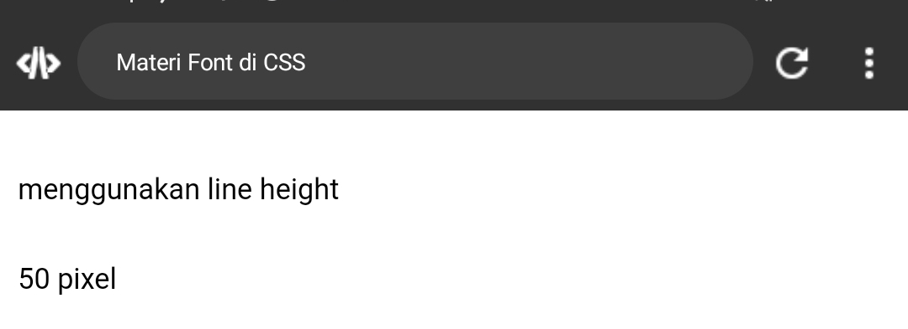

### Kesimpulan
Properti `line-height` dalam CSS digunakan untuk mengatur tinggi baris teks dalam sebuah elemen. Dengan nilai absolut atau relatif, properti ini memungkinkan pengembang untuk menyesuaikan keterbacaan teks dan tata letak halaman web secara keseluruhan dengan mengontrol jarak vertikal antara baris teks.

---
## Word-spacing
### Penjelasan
Properti `word-spacing` dalam CSS digunakan untuk mengatur jarak antara kata-kata dalam teks. Dengan menggunakan properti ini, Anda dapat menentukan seberapa jauh atau dekat kata-kata tersebut ditempatkan satu sama lain dalam sebuah elemen.

Nilai yang umum digunakan untuk `word-spacing` termasuk:

- Nilai positif: Meningkatkan jarak antara kata-kata.
- Nilai negatif: Mengurangi jarak antara kata-kata.

Misalnya, menggunakan `word-spacing: 2px;` akan menambahkan jarak sebesar 2 piksel di antara setiap kata dalam teks. Properti ini sering digunakan untuk menyesuaikan penampilan teks, meningkatkan keterbacaan, atau mencapai efek desain tertentu.

### Kode Program
```html
<p style="word-spacing: 5px;">menggunakan word spacing 5 pixel</p>
```

### Hasil


### Kesimpulan
Properti `word-spacing` dalam CSS digunakan untuk mengatur jarak antara kata-kata dalam teks. Dengan nilai positif untuk meningkatkan jarak dan nilai negatif untuk mengurangi jarak, properti ini memungkinkan pengembang untuk menyesuaikan penampilan teks sesuai kebutuhan desain atau untuk meningkatkan keterbacaan.

---
---
# Materi Background
## Background-image
### Penjelasan
Properti `background-image` dalam CSS digunakan untuk menentukan gambar yang akan digunakan sebagai latar belakang sebuah elemen HTML. Anda cukup menetapkan URL gambar sebagai nilai dari properti ini.

Dengan menetapkan `background-image`, gambar tersebut akan ditampilkan sebagai latar belakang elemen yang terkait. Ini sering digunakan untuk menambahkan elemen visual pada halaman web, seperti gambar latar belakang pada bagian header, div, atau bagian lain dari tata letak halaman.

### Kode Program
```html
<!DOCTYPE html>
<html>
  <head>
    <title>belajar materi background css</title>
    <style>
    p {
      background-image: url('/alter.png');
      height: 100vh;
    }
    </style>
  </head>
  <body>
    <p>ini background image</p>
  </body>
</html>
```
### Hasil


### Kesimpulan
Properti background-image dalam CSS digunakan untuk menentukan gambar yang akan digunakan sebagai latar belakang sebuah elemen HTML. Dengan menetapkan URL gambar sebagai nilai properti ini, Anda dapat menambahkan elemen visual pada halaman web, seperti gambar latar belakang pada bagian header, div, atau bagian lain dari tata letak halaman.

---
## Background-size
### Penjelasan
Properti background-size dalam CSS dapat menggunakan nilai persen untuk mengatur ukuran gambar latar belakang relatif terhadap ukuran elemen HTML yang terkait.

Ketika menggunakan nilai persen, properti background-size akan mengatur ukuran gambar latar belakang relatif terhadap lebar dan tinggi elemen tersebut. Misalnya, nilai 100% 100% akan membuat gambar latar belakang menutupi seluruh area elemen, sedangkan nilai 50% 50% akan membuat gambar latar belakang berukuran setengah dari lebar dan tinggi elemen.

### Kode Program
```html
<!DOCTYPE html>
<html>
  <head>
    <title>belajar materi background css</title>
    <style>
    p {
      background-image: url('/alter.png');
      height: 100vh;
      background-size: 100px 100px;
    }
    </style>
  </head>
  <body>
    <p>ini background image, background size, dan background-repeat</p>
  </body>
</html>
```

### Hasil


### Kesimpulan
Properti background-size dalam CSS digunakan untuk mengatur ukuran gambar latar belakang yang ditetapkan dengan properti background-image, dengan menggunakan nilai persen untuk mengatur ukuran relatif terhadap lebar dan tinggi elemen terkait. Ini memungkinkan penyesuaian responsif terhadap perubahan ukuran elemen atau tata letak halaman.

---
## Background-repeat
### Penjelasan
Properti `background-repeat` dalam CSS dapat menggunakan nilai `repeat` dan `no-repeat` untuk mengontrol apakah gambar latar belakang akan diulang atau tidak.

- `repeat`: Gambar latar belakang akan diulang secara vertikal dan horizontal untuk mengisi seluruh area elemen.
- `no-repeat`: Gambar latar belakang tidak akan diulang, sehingga hanya ditampilkan sekali di area elemen.

Misalnya, menggunakan `background-repeat: repeat;` akan membuat gambar latar belakang diulang secara vertikal dan horizontal untuk mengisi seluruh area elemen yang terkait. Sedangkan `background-repeat: no-repeat;` akan membuat gambar latar belakang hanya ditampilkan sekali tanpa pengulangan.

Ini memungkinkan Anda untuk menciptakan tampilan latar belakang yang berbeda-beda, baik dengan pengulangan gambar untuk membuat pola atau tanpa pengulangan untuk menampilkan gambar tanpa adanya potongan yang terlihat.

### Kode Program
```html
<!DOCTYPE html>
<html>
  <head>
    <title>belajar materi background css</title>
    <style>
    p {
      background-image: url('/alter.png');
      height: 100vh;
      background-size: 100px 100px;
      background-repeat: no-repeat;
    }
    </style>
  </head>
  <body>
    <p>ini background image, background size, dan background-repeat</p>
  </body>
</html>
```

### Hasil
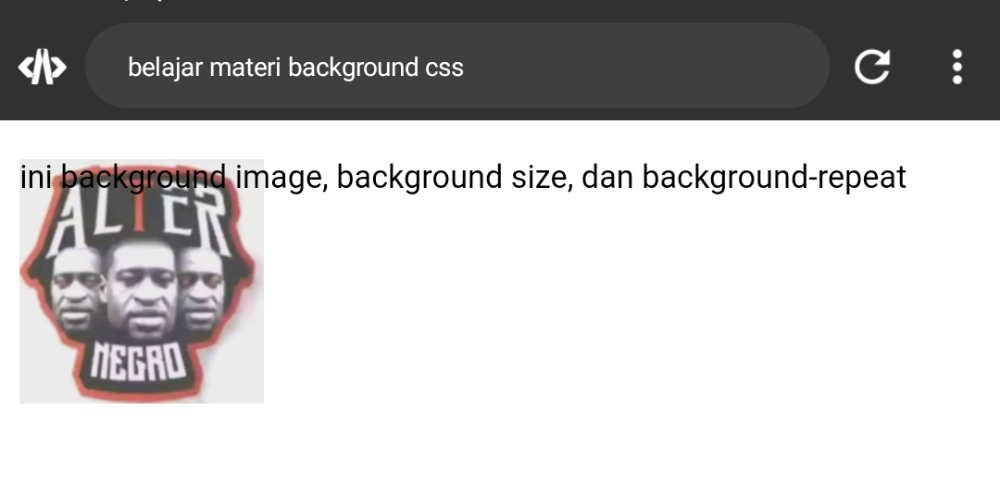

### Kesimpulan
Properti `background-repeat` dalam CSS digunakan untuk mengontrol apakah gambar latar belakang akan diulang atau tidak di dalam area elemen terkait. Dengan menggunakan nilai `repeat`, gambar latar belakang akan diulang secara vertikal dan horizontal untuk mengisi seluruh area elemen, sedangkan dengan nilai `no-repeat`, gambar latar belakang hanya ditampilkan sekali tanpa diulang. Ini memungkinkan penyesuaian yang fleksibel terhadap tampilan latar belakang elemen, baik untuk menciptakan pola dengan pengulangan gambar atau menampilkan gambar tanpa adanya potongan yang terlihat.

---
## Background-attachment
### Penjelasan
Properti `background-attachment` dalam CSS digunakan untuk mengontrol apakah gambar latar belakang akan tetap diam atau bergulir bersama dengan isi halaman saat pengguna menggulir halaman.

Nilai yang umum digunakan untuk `background-attachment` adalah:

- `scroll`: Gambar latar belakang akan bergulir bersama dengan isi halaman saat pengguna menggulir halaman.
- `fixed`: Gambar latar belakang akan tetap diam relatif terhadap jendela browser, sehingga akan tetap terlihat di tempatnya saat pengguna menggulir halaman.

Misalnya, menggunakan `background-attachment: fixed;` akan membuat gambar latar belakang tetap diam relatif terhadap jendela browser, sehingga akan terlihat tetap di tempatnya bahkan saat pengguna menggulir halaman.

Properti ini berguna untuk menciptakan efek visual yang menarik, seperti gambar latar belakang yang tetap berada di latar belakang atau yang bergerak bersama dengan halaman saat digulir.

### Kode Program
```html
<!DOCTYPE html>
<html>
  <head>
    <title>belajar materi background css</title>
    <style>
    p {
      background-image: url('/alter.png');
      height: 100vh;
      background-size: 100px 100px;
      background-repeat: no-repeat;
      background-attachment: scroll;
    }
    </style>
  </head>
  <body>
    <p>ini background image, background size, background-repeat, dan background attachment</p>
    <p>smk 7 makassar</p>
  </body>
</html>
```

### Hasil


### Kesimpulan
Properti background-attachment dalam CSS mengontrol apakah gambar latar belakang akan tetap diam atau bergulir bersama dengan isi halaman saat pengguna menggulir halaman. Dengan nilai fixed, gambar latar belakang akan tetap diam relatif terhadap jendela browser, sementara nilai scroll membuatnya bergulir bersama dengan halaman. Properti ini berguna untuk menciptakan efek visual yang menarik pada tata letak halaman web, seperti gambar latar belakang yang tetap di tempat atau bergerak saat halaman digulir.

---
## Background-position
### Penjelasan
Tentu, berikut adalah penjelasan singkat untuk nilai kata kunci yang umum digunakan pada properti `background-position`:

1. `top`: Menempatkan gambar latar belakang di bagian atas elemen.
2. `bottom`: Menempatkan gambar latar belakang di bagian bawah elemen.
3. `left`: Menempatkan gambar latar belakang di sisi kiri elemen.
4. `right`: Menempatkan gambar latar belakang di sisi kanan elemen.
5. `center`: Menempatkan gambar latar belakang di tengah-tengah elemen.

Anda juga dapat mengombinasikan nilai tersebut untuk menentukan posisi yang lebih spesifik, misalnya `top left` untuk menempatkan gambar latar belakang di sudut kiri atas elemen, atau `center bottom` untuk menempatkannya di tengah bawah elemen.

Dengan menggunakan nilai kata kunci ini, Anda dapat dengan mudah mengatur posisi awal gambar latar belakang sesuai dengan kebutuhan desain halaman web Anda.

### Kode Program
```html
<!DOCTYPE html>
<html>
  <head>
    <title>belajar materi background css</title>
    <style>
    p {
      background-image: url('/alter.png');
      height: 100vh;
      background-size: 100px 100px;
      background-repeat: no-repeat;
      background-attachment: scroll;
      background-position: top;
    }
    </style>
  </head>
  <body>
    <p>ini background image, background size, background-repeat, background attachment,dan background position</p>
  </body>
</html>
```

### Hasil


### Kesimpulan
Properti background-position dalam CSS digunakan untuk mengatur posisi awal atau letak gambar latar belakang di dalam elemen HTML yang terkait. Nilai kata kunci umum seperti top, bottom, left, right, dan center digunakan untuk menentukan posisi relatif gambar latar belakang di dalam elemen. Dengan menggunakan nilai-nilai ini, Anda dapat dengan mudah menyesuaikan posisi gambar latar belakang untuk mencapai tata letak halaman web yang diinginkan.

---
---
# Materi Font

## Font-size
### Penjelasan
Properti `font-size` dalam CSS digunakan untuk mengatur ukuran teks di dalam sebuah elemen HTML. Ukuran teks dapat ditentukan dalam berbagai satuan pengukuran, seperti piksel (px), persentase (%), em, atau rem.

Misalnya, dengan menggunakan `font-size: 16px;`, ukuran teks dalam elemen tersebut akan ditetapkan menjadi 16 piksel. Sedangkan dengan `font-size: 1.2em;`, ukuran teks akan menjadi 1.2 kali ukuran teks yang ditetapkan pada elemen induknya.

Properti `font-size` memungkinkan Anda untuk mengatur ukuran teks sesuai dengan kebutuhan desain halaman web Anda, memberikan fleksibilitas dalam penyesuaian tampilan teks untuk mencapai tata letak yang diinginkan.

### Kode Program
```html
<!DOCTYPE html>
<html>
  <head>
    <title>belajar materi font css</title>
    <style>
    p {
      font-size: 50px;
    }
    </style>
  </head>
  <body>
    <p>hallo world !</p>
  </body>
</html>
```

### Hasil
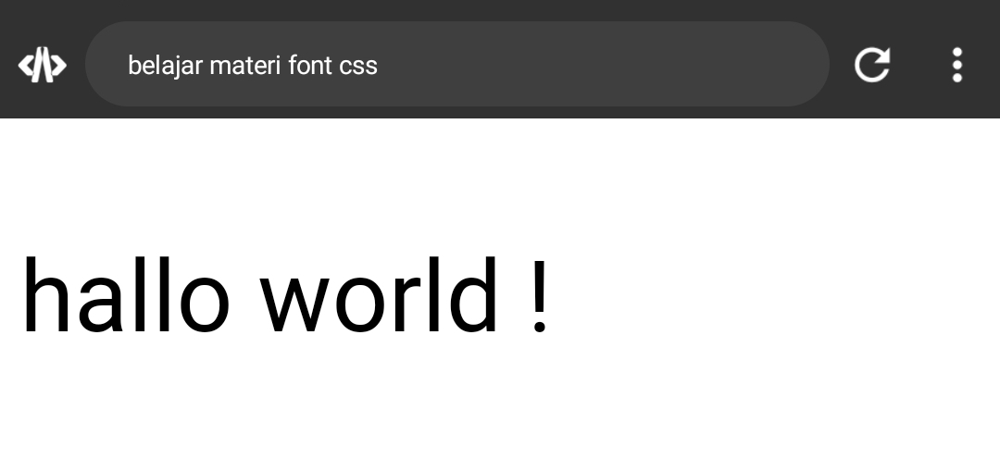

### Kesimpulan 
Properti `font-size` dalam CSS digunakan untuk mengatur ukuran teks di dalam sebuah elemen HTML. Dengan menggunakan nilai seperti piksel (px), persentase (%), em, atau rem, properti ini memungkinkan Anda untuk menyesuaikan ukuran teks sesuai dengan kebutuhan desain halaman web Anda.

---
## Font-style
### Penjelasan
secara konseptual, properti `font-style` dalam CSS digunakan untuk mengatur gaya penulisan teks. 

- `normal`: Ini menampilkan teks dalam gaya standar atau tidak miring.
- `italic`: Ini menampilkan teks dalam gaya miring, memberikan efek kursif pada teks.
- `oblique`: Ini juga menampilkan teks dalam gaya miring, namun cara penampilannya mungkin berbeda tergantung pada font yang digunakan, karena mungkin tidak semua font memiliki gaya oblique.

Dengan memilih salah satu dari nilai ini, Anda dapat menyesuaikan tampilan teks sesuai dengan keinginan desain halaman web Anda, apakah itu teks yang lurus dan berdiri atau teks yang miring untuk memberikan penekanan visual.

### Kode Program
```html
<!DOCTYPE html>
<html>
  <head>
    <title>belajar materi font css</title>
    <style>
    p {
      font-style: italic;
    }
    </style>
  </head>
  <body>
    <p>hallo world !</p>
  </body>
</html>
```

### Hasil
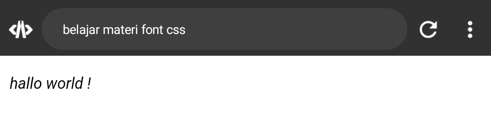

### Kesimpulan
Properti `font-style` dalam CSS digunakan untuk mengatur gaya penulisan teks. Dengan nilai seperti `normal`, `italic`, atau `oblique`, properti ini memungkinkan pengembang untuk menyesuaikan tampilan teks sesuai dengan kebutuhan desain halaman web, baik itu teks yang lurus atau teks yang miring untuk memberikan penekanan visual.

---
## Font-weight
### Penjelasan
Properti `font-weight` dalam CSS digunakan untuk menentukan ketebalan (weight) font teks.

Nilai yang umum digunakan untuk `font-weight` adalah:

- `normal`: Menetapkan teks dalam ketebalan normal.
- `bold`: Menetapkan teks dalam ketebalan tebal.
- Nilai numerik: Anda juga dapat menggunakan nilai numerik seperti `100`, `200`, `300`, ..., `900` untuk menentukan tingkat ketebalan yang spesifik. Nilai ini berjalan dari yang paling ringan (100) hingga yang paling tebal (900).

Dengan aturan di atas, teks di dalam elemen dengan kelas "element" akan ditampilkan dalam ketebalan yang tebal. Ini memungkinkan Anda untuk menyesuaikan tampilan teks sesuai dengan kebutuhan desain halaman web Anda.

### Kode Program
```html
<!DOCTYPE html>
<html>
  <head>
    <title>belajar materi font css</title>
    <style>
    p {
      font-weight: lighter;
    }
    </style>
  </head>
  <body>
    <p>hallo world !</p>
  </body>
</html>
```

### Hasil
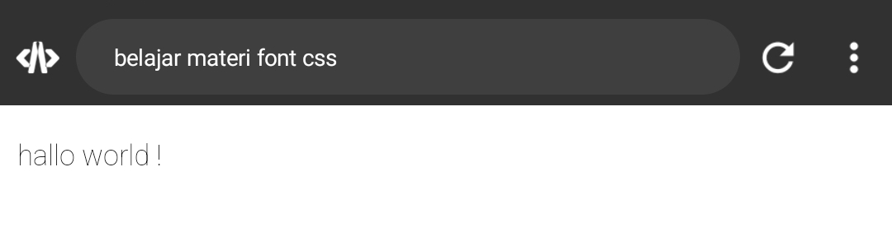

### Kesimpulan
Properti font-weight dalam CSS digunakan untuk menentukan ketebalan font teks. Dengan nilai seperti normal, bold, atau nilai numerik dari 100 hingga 900, properti ini memungkinkan pengembang untuk menyesuaikan tampilan teks dengan ketebalan yang diinginkan sesuai dengan desain halaman web mereka.

---
## Font-family
### Penjelasan
Properti `font-family` dalam CSS digunakan untuk menentukan jenis font atau kumpulan font yang akan digunakan untuk menampilkan teks pada elemen HTML yang terkait.

Anda dapat menetapkan `font-family` dengan menyediakan nama font atau nama kumpulan font sebagai nilai properti tersebut. Jika font yang pertama tidak tersedia di perangkat pengguna, maka browser akan mencoba menggunakan font alternatif yang kedua, dan seterusnya.

Dengan aturan di atas, teks di dalam elemen dengan kelas "element" akan ditampilkan menggunakan font Arial jika tersedia. Jika tidak, maka browser akan mencoba menggunakan font sans-serif sebagai alternatif. Ini memungkinkan Anda untuk memberikan pilihan font yang dapat diakses secara luas untuk menampilkan teks dengan konsistensi dan tampilan yang diinginkan.

### Kode Program
```html
<!DOCTYPE html>
<html>
  <head>
    <title>belajar materi font css</title>
    <style>
    p {
      font-family: Courier;
    }
    </style>
  </head>
  <body>
    <p>hallo world !</p>
  </body>
</html>
```

### Hasil
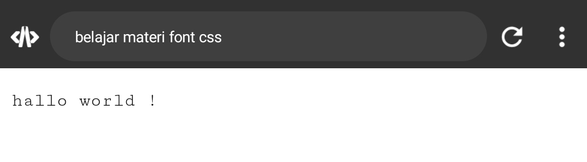

### Kesimpulan
Properti font-family dalam CSS digunakan untuk menentukan jenis font atau kumpulan font yang akan digunakan untuk menampilkan teks pada elemen HTML yang terkait. Dengan menentukan nama font atau kumpulan font sebagai nilai properti ini, Anda dapat memberikan pilihan font yang dapat diakses secara luas untuk menampilkan teks dengan konsistensi dan tampilan yang diinginkan, serta memberikan alternatif jika font utama tidak tersedia.

---
---

# Box Model
## Materi height & width
### Penjelasan
Dalam CSS, model kotak (box model) menggambarkan cara browser menentukan dimensi dan tata letak elemen HTML. Properti `height` dan `width` adalah bagian penting dari model kotak ini.

- `height`: Properti ini digunakan untuk menentukan tinggi (vertikal) dari sebuah elemen. Anda bisa memberikan nilai dalam piksel, persentase, atau nilai lainnya seperti `auto` yang membiarkan browser menentukan tinggi elemen berdasarkan kontennya.
  
- `width`: Properti ini digunakan untuk menentukan lebar (horizontal) dari sebuah elemen. Sama seperti `height`, nilai dapat diberikan dalam piksel, persentase, atau menggunakan nilai seperti `auto` yang mengizinkan browser menentukan lebar elemen berdasarkan kontennya.

### Kode Program
```html
<!DOCTYPE html>
<html>
  <head>
    <title>Materi Box Model CSS</title>
    <style>
    button {
      width: 100px;
      height: 50px;
    }
    </style>
  </head>
  <body>
    <button>Klik Aku!</button>
  </body>
</html>
```

### Hasil
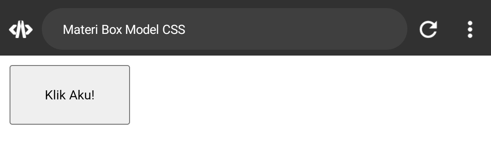

### Kesimpulan
Properti `height` digunakan untuk mengatur tinggi (vertikal) dari sebuah elemen, Properti `width` digunakan untuk mengatur lebar (horizontal) dari sebuah elemen. Keduanya merupakan bagian dari model kotak (box model) yang menentukan tata letak dan dimensi elemen HTML.

## Materi border
### border-width
#### Penjelasan
Properti border-width digunakan untuk mengatur ketebalan (lebar) dari batas (border) pada sebuah elemen HTML. Properti ini merupakan bagian dari model kotak (box model) yang digunakan untuk menentukan tata letak dan dimensi elemen.

Anda dapat menentukan nilai untuk border-width dalam piksel, persentase, atau menggunakan kata kunci seperti thin, medium, atau thick. Nilai ini mengontrol tebalnya batas yang mengelilingi elemen.

#### Kode Program
```html
<!DOCTYPE html>
<html>
  <head>
    <title>Materi Box Model CSS</title>
    <style>
    button {
      border-width: 5px;
    }
    </style>
  </head>
  <body>
    <button>Klik Aku!</button>
  </body>
</html>
```

#### Hasil
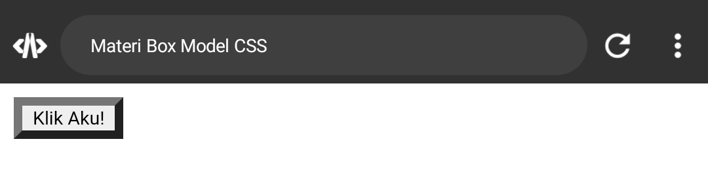

#### Kesimpulan
Properti `border-width` digunakan untuk mengatur ketebalan (lebar) dari batas (border) pada sebuah elemen HTML. Ini memungkinkan pengaturan berbagai ukuran untuk batas elemen seperti garis solid, tebal, atau tipis sesuai kebutuhan desain halaman web.

### border-style
#### Penjelasan
Properti border-style dalam CSS digunakan untuk menentukan jenis garis tepi (border) dari sebuah elemen HTML. Properti ini memiliki beberapa nilai yang dapat digunakan, antara lain:

`none` : Tidak ada garis tepi.
`solid` : Garis tepi berupa garis lurus dan solid.
`dashed`  : Garis tepi berupa garis putus-putus.

#### Kode Program
```html
<!DOCTYPE html>
<html>
  <head>
    <title>Materi Box Model CSS</title>
    <style>
    button {
      border-style: dashed;
    }
    </style>
  </head>
  <body>
    <button>Klik Aku!</button>
  </body>
</html>
```

#### Hasil
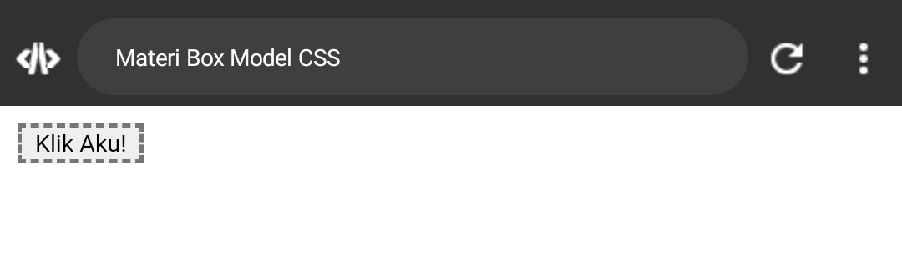

#### Kesimpulan
Secara singkat, dalam CSS, properti `border-style` digunakan untuk menentukan jenis garis tepi (border) dari sebuah elemen HTML. Properti ini mengontrol penampilan visual dari garis tepi dengan nilai seperti `solid`, `dashed`, dan lainnya.

### border-color
#### Penjelasan
Properti border-color dalam CSS digunakan untuk menentukan warna dari tepi (border) sebuah elemen HTML. Properti ini adalah salah satu dari beberapa properti yang terkait dengan border dalam model kotak (box model).

Nilai yang diterima oleh border-color bisa berupa nilai warna seperti nama warna (misalnya, "red", "blue", "green"), nilai RGB (misalnya, "rgb(255, 0, 0)"), nilai HEX (misalnya, "#ff0000"), atau nilai yang relatif seperti "transparent" untuk membuat tepi transparan.

#### Kode Program
```html
<!DOCTYPE html>
<html>
  <head>
    <title>Materi Box Model CSS</title>
    <style>
    button {
      border-color: red;
    }
    </style>
  </head>
  <body>
    <button>Klik Aku!</button>
  </body>
</html>
```

#### Hasil
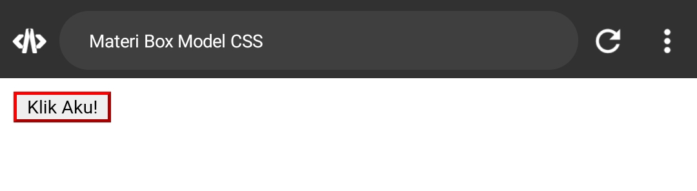

#### Kesimpulan
Properti `border-color` digunakan untuk menentukan warna dari tepi (border) sebuah elemen HTML dalam model kotak (box model). Anda dapat menggunakan nilai warna seperti nama warna, nilai RGB, nilai HEX, atau nilai yang relatif seperti "transparent" untuk membuat tepi transparan.

### border-radius
#### Penjelasan
`border-radius` adalah properti CSS yang digunakan untuk menentukan sudut lengkung dari sudut-sudut sebuah elemen kotak. Dengan menggunakan nilai `10px 10px 10px 10px`, Anda menentukan radius lengkung untuk setiap sudut elemen secara terpisah, yaitu: atas kiri, atas kanan, bawah kanan, dan bawah kiri.
Sudut-sudut `button` akan memiliki radius lengkung sebesar 10 piksel di setiap sudut, sehingga elemen tersebut memiliki tampilan sudut yang bulat.

#### Kode Program
```html
<!DOCTYPE html>
<html>
  <head>
    <title>Materi Box Model CSS</title>
    <style>
    button {
      border-radius: 10px 10px 10px 10px;
    }
    </style>
  </head>
  <body>
    <button>Klik Aku!</button>
  </body>
</html>
```

#### Hasil
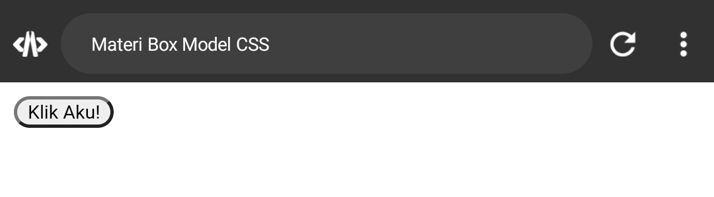

#### Kesimpulan
`border-radius` dengan nilai `10px 10px 10px 10px` mengatur radius lengkung untuk setiap sudut dari sebuah elemen kotak menjadi 10 piksel secara terpisah: atas kiri, atas kanan, bawah kanan, dan bawah kiri.

## Materi padding
### padding-right
#### Penjelasan
`padding-right` adalah properti CSS yang digunakan untuk menentukan jumlah ruang kosong (padding) di sebelah kanan elemen HTML. Padding adalah jarak antara tepi dalam elemen dan kontennya. Dengan menggunakan `padding-right`, Anda dapat membuat ruang kosong di sebelah kanan elemen, yang memungkinkan untuk menciptakan tata letak yang lebih baik dan meningkatkan estetika desain halaman web.

#### Kode Program
```html
<!DOCTYPE html>
<html>
  <head>
    <title>Materi Box Model CSS</title>
    <style>
    button {
      width: 200px ;
      height: 100px;
      padding-right: 100px;
    }
    </style>
  </head>
  <body>
    <button>Klik Aku!</button>
  </body>
</html>
```

#### Hasil
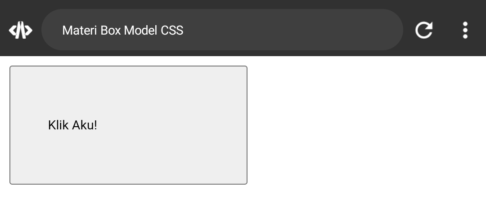

#### Kesimpulan
`padding-right` adalah properti CSS yang digunakan untuk menentukan jumlah ruang kosong di sebelah kanan elemen HTML, yang berguna untuk menciptakan tata letak yang lebih baik dan meningkatkan estetika desain halaman web.

### padding-left
#### Penjelasan
`Padding-left` adalah bagian dari model kotak (box model) di CSS yang mengacu pada jarak antara tepi kiri dari sebuah elemen dan konten di dalamnya. Ini memungkinkan untuk memberikan ruang tambahan di sebelah kiri elemen tanpa mempengaruhi lebar total elemen tersebut. Dengan menggunakan properti padding left, Anda dapat membuat elemen terlihat lebih terpisah dari elemen lain di sekitarnya atau memberikan ruang tambahan untuk menyusun isi elemen dengan lebih baik.

#### Kode Program
```html
<!DOCTYPE html>
<html>
  <head>
    <title>Materi Box Model CSS</title>
    <style>
    button {
      width: 200px ;
      height: 100px;
      padding-left: 100px;
    }
    </style>
  </head>
  <body>
    <button>Klik Aku!</button>
  </body>
</html>
```

#### Hasil
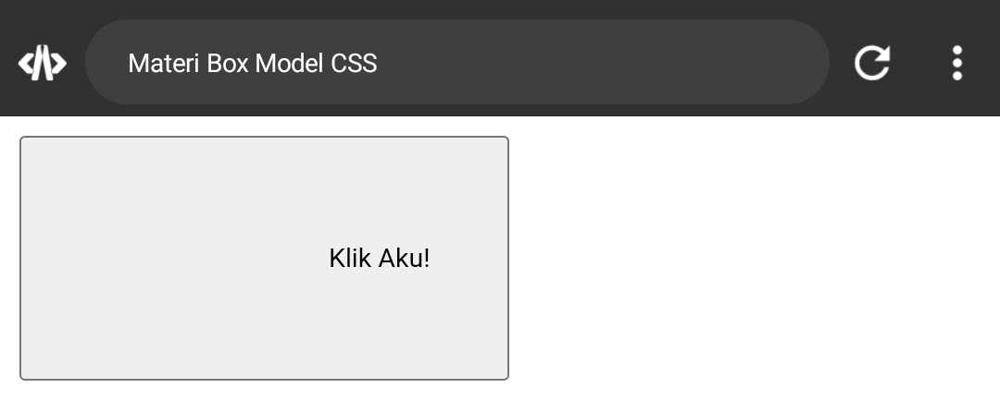

#### Kesimpulan
`Padding-left `adalah jarak antara tepi kiri dari sebuah elemen dan konten di dalamnya dalam model kotak CSS. Ini memungkinkan penambahan ruang di sebelah kiri elemen tanpa memengaruhi lebar total elemen tersebut.

### padding-bottom
#### Penjelasan
`padding-bottom` adalah properti CSS yang digunakan untuk menambahkan ruang polos di bagian bawah dari sebuah elemen HTML. Ini memberikan jarak antara konten dalam elemen dan batas bawah dari elemen tersebut dalam model kotak CSS. Dengan menggunakan `padding-bottom`, Anda dapat mengontrol seberapa jauh konten di dalam elemen tersebut berjarak dari batas bawahnya.

#### Kode Program
```html
<!DOCTYPE html>
<html>
  <head>
    <title>Materi Box Model CSS</title>
    <style>
    button {
      width: 200px ;
      height: 100px;
      padding-bottom: 50px;
    }
    </style>
  </head>
  <body>
    <button>Klik Aku!</button>
  </body>
</html>
```

#### Hasil
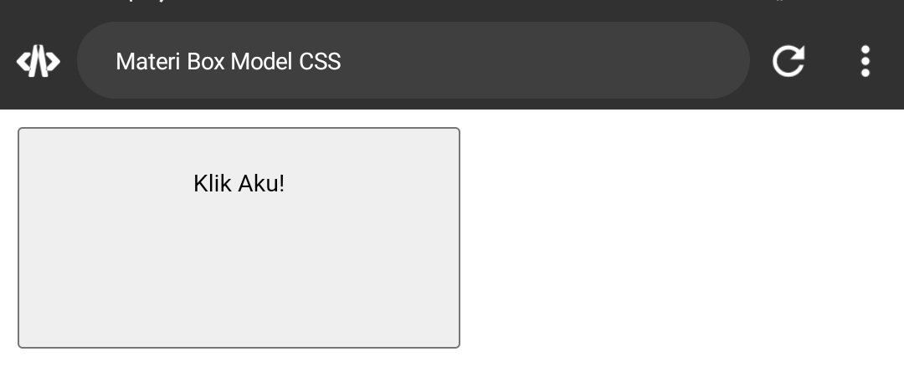

#### Kesimpulan
`padding-bottom` adalah properti yang digunakan untuk menambahkan ruang polos di bagian bawah sebuah elemen HTML, yang memisahkan konten dalam elemen tersebut dari batas bawahnya dalam model kotak CSS.

### padding-top
#### Penjelasan
`padding-top` adalah properti CSS yang digunakan untuk menentukan jumlah ruang polos yang diberikan di bagian atas dari konten sebuah elemen HTML. Ini memungkinkan Anda untuk menambahkan ruang tambahan di bagian atas elemen, antara konten dan batas atasnya. Sebagai bagian dari model kotak (box model) CSS, `padding-top` akan menambahkan jarak antara konten dalam elemen dan tepi atasnya.

#### Kode Program
```html
<!DOCTYPE html>
<html>
  <head>
    <title>Materi Box Model CSS</title>
    <style>
    button {
      width: 200px ;
      height: 100px;
      padding-top: 50px;
    }
    </style>
  </head>
  <body>
    <button>Klik Aku!</button>
  </body>
</html>
```

#### Hasil
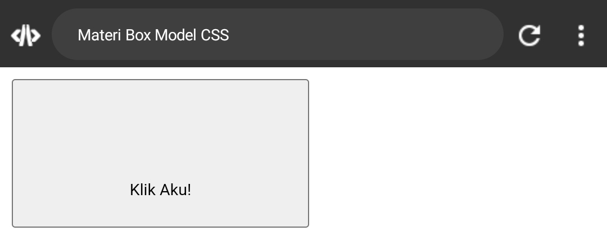

#### Kesimpulan
 `padding-top` dalam CSS digunakan untuk menambahkan ruang di bagian atas konten dalam sebuah elemen HTML, antara konten dan batas atas elemen tersebut.

## Materi margin
### margin-left
#### Penjelasan
`margin-left` adalah properti CSS yang digunakan untuk menentukan jarak (spasi) dari sisi kiri sebuah elemen terhadap elemen sebelumnya dalam tata letak halaman web. Ini memungkinkan Anda untuk mengatur ruang kosong di sebelah kiri elemen, sehingga memengaruhi tata letak keseluruhan halaman web. Semakin besar nilai `margin-left`, semakin besar pula jaraknya dari sisi kiri elemen sebelumnya.

#### Kode Program
```html
<!DOCTYPE html>
<html>
  <head>
    <title>Materi Box Model CSS</title>
    <style>
    button {
      margin-left: 50px;
    }
    </style>
  </head>
  <body>
    <button>Klik Aku!</button>
  </body>
</html>
```

#### Hasil
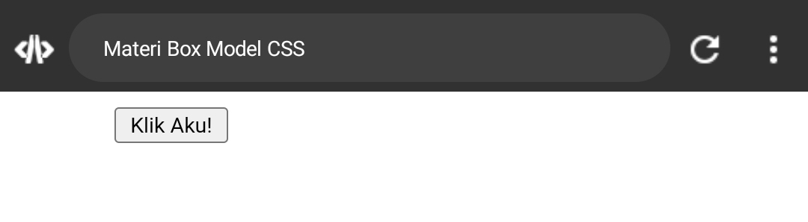

#### Kesimpulan
`margin-left` adalah properti CSS yang digunakan untuk menentukan jarak dari sisi kiri sebuah elemen terhadap elemen sebelumnya dalam tata letak halaman web. Semakin besar nilai `margin-left`, semakin besar pula jaraknya dari sisi kiri elemen sebelumnya.

### marginn-top
#### Penjelasan
`margin-top` adalah properti CSS yang digunakan untuk mengatur jarak antara tepi atas (atas) dari suatu elemen dan elemen sekitarnya dalam model kotak (box model). Dengan properti ini, Anda dapat menentukan seberapa jauh elemen tersebut akan diletakkan dari elemen di atasnya. Nilai yang diberikan bisa dalam bentuk piksel, persentase, atau menggunakan nilai lainnya seperti `auto` untuk menyesuaikan secara otomatis.

#### Kode Program
```html
<!DOCTYPE html>
<html>
  <head>
    <title>Materi Box Model CSS</title>
    <style>
    button {
      margin-top: 50px;
    }
    </style>
  </head>
  <body>
    <button>Klik Aku!</button>
  </body>
</html>
```


#### Hasil
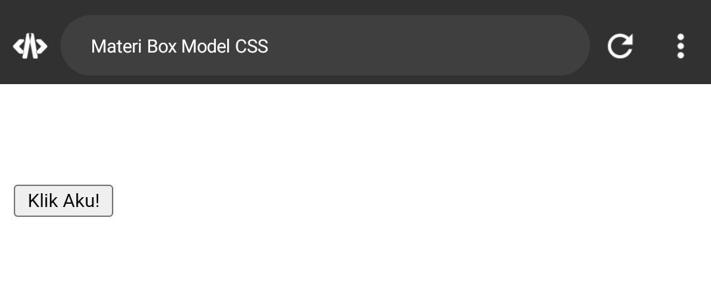

#### Kesimpulan
`margin-top` adalah properti yang digunakan untuk mengatur jarak antara tepi atas (atas) dari suatu elemen dan elemen sekitarnya dalam model kotak (box model).

### margin-right
#### Penjelasan
`margin-right` adalah properti CSS yang digunakan untuk menentukan jarak (margin) antara tepi kanan sebuah elemen dengan elemen lain di sekitarnya. Ini memengaruhi tata letak horizontal dari elemen tersebut di dalam model kotak (box model) CSS.

#### Kode Program
```html
<!DOCTYPE html>
<html>
  <head>
    <title>Materi Box Model CSS</title>
    <style>
    button {
      margin-right: 20px;
    }
    </style>
  </head>
  <body>
    <button>Klik Aku!</button>
    <button>Klik Aku!</button>
  </body>
</html>
```

#### Hasil
**Before**
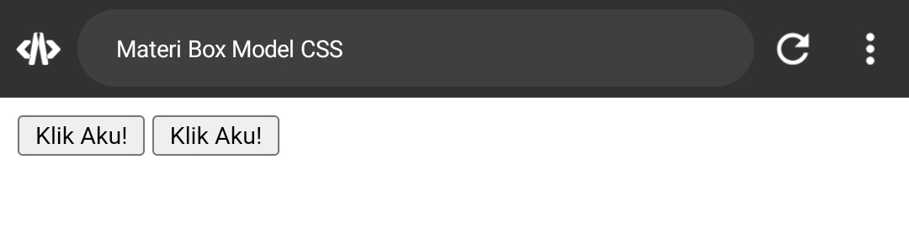

**After**
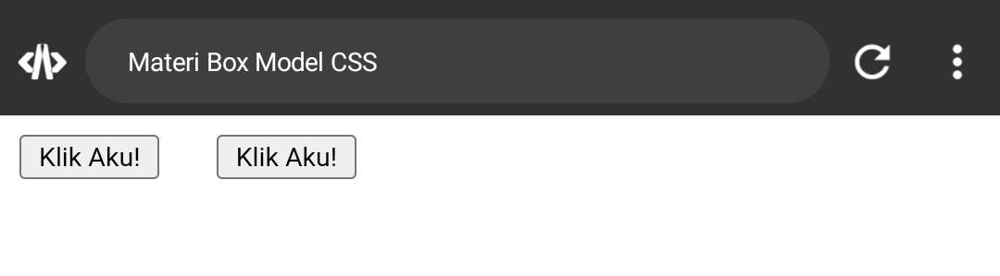

#### Kesimpulan
`margin-right` adalah properti CSS yang digunakan untuk mengatur jarak antara tepi kanan suatu elemen dengan elemen lain di sekitarnya dalam model kotak CSS.

### margin-bottom
#### Penjelasan
`margin-bottom` adalah properti CSS yang digunakan untuk menentukan jarak antara bagian bawah dari sebuah elemen dengan elemen-elemen di sekitarnya. Properti ini adalah bagian dari model kotak (box model) CSS dan digunakan untuk mengatur tata letak dan ruang di antara elemen-elemen pada halaman web. Dengan menggunakan `margin-bottom`, Anda dapat mengontrol ruang di bawah elemen untuk mencapai tata letak yang diinginkan.

#### Kode Program
```html
<!DOCTYPE html>
<html>
  <head>
    <title>Materi Box Model CSS</title>
    <style>
    button {
      margin-top: 20px;
    }
    </style>
  </head>
  <body>
    <button>Klik Aku!</button><br>
    <button>Klik Aku!</button>
    
  </body>
</html>
```

#### Hasil
**Before**
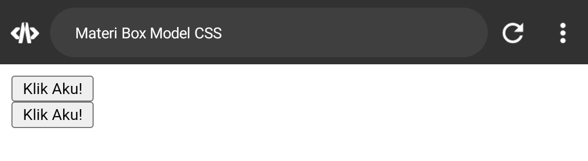

**After**
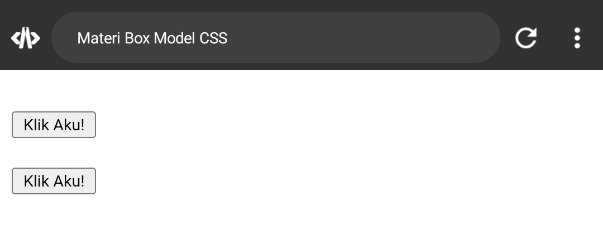

#### Kesimpulan
`margin-bottom` adalah properti CSS yang digunakan untuk menentukan jarak antara bagian bawah dari sebuah elemen dengan elemen-elemen di sekitarnya dalam model kotak (box model) CSS.