# Anatomi CSS

## Selecktor
Selektor dalam CSS adalah pola yang digunakan untuk memilih elemen HTML di mana aturan gaya akan diterapkan, seperti nama elemen, kelas, id, atau atribut lainnya. Ini memungkinkan Anda untuk menargetkan dan memodifikasi tampilan elemen-elemen spesifik pada halaman web Anda.

## Property
Property dalam CSS adalah atribut yang digunakan untuk mengatur tampilan elemen HTML, seperti warna, ukuran, dan tata letak.

## Property Value
Property value dalam CSS adalah nilai yang ditentukan untuk suatu properti CSS, seperti warna, ukuran, atau posisi. Misalnya, untuk properti `color`, property value bisa berupa nama warna (contohnya `red`), kode warna (contohnya `#00FF00`), atau fungsi warna (contohnya `rgb(255, 0, 0)`).

# Pertemuan Pertama
## Penjelasan
Program di bawah merupakan kode HTML dengan sedikit tambahan CSS di dalamnya. `<style>` tag menandakan dimulainya kode CSS. Selector `p` mengarah pada elemen "p" di dalam dokumen HTML, yaitu elemen paragraf. Deklarasi gaya CSS { `color: red;` } menetapkan properti color ke nilai "`red`", sehingga teks dalam elemen paragraf akan ditampilkan dengan warna merah. Tag penutup `</style>` menandai akhir kode CSS. Di dalam `<body>`, terdapat dua elemen paragraf `<p>` dengan teks "Walcome CSS!". Karena telah dideklarasikan di CSS untuk memiliki warna merah, maka teks di dalam kedua elemen paragraf tersebut akan ditampilkan dalam warna merah.

## Kode Program
```html
<!DOCTYPE html>
<html>
  <head>
    <title>Percobaan Pertama CSS</title>
    <style>
    p {
      color: red;
    }
    </style>
  </head>
  <body>
    <p>Walcome CSS!</p>
    <p>Walcome CSS!</p>
  </body>
</html>
```

## Hasil
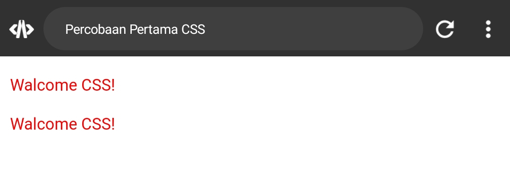

# Percobaan Kedua
## Kode CSS

```css
Button {
width: 150px;
height: 50px;
color: yellow;
background-color: #7949FF;
text-align: left;
font-weight: bold;
}
```

---
## background-color
### Before
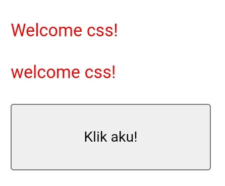

### After
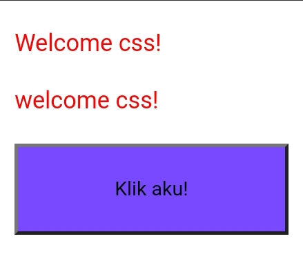

---
## text-align
### Before

### After
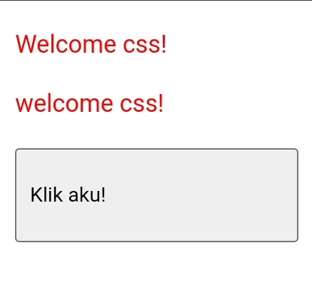

---
## font-wight
### Before

### After
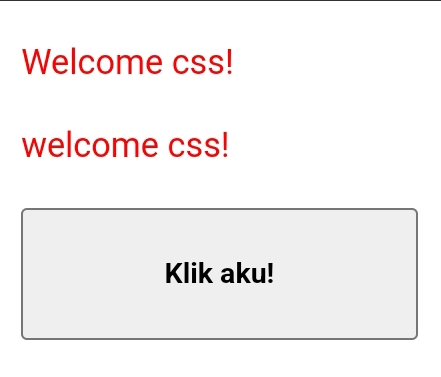

---
# Cara Pemanggilan CSS
## Pemanggilan CSS Eksternal
**Eksternal**: Ini adalah metode yang paling umum dan direkomendasikan. Anda dapat menghubungkan file CSS eksternal ke halaman HTML menggunakan tag `<link>` di dalam bagian `<head>` dari dokumen HTML, seperti yang telah dijelaskan sebelumnya.
### Contoh Kode Program
**Kode HTML**
```html
<!DOCTYPE html>
<html>
  <head>
    <title>belajar panggilan css</title>
    <link rel="stylesheet" href="Style.css">
  </head>
  
  <body>
   <p>ini menggunakan pemanggilan external</p>
  </body>
  
</html>
```
**Kode CSS**
```css
p {
  color: red;
}
```
## Pemanggilan CSS Internal 
**Internal**: Anda juga dapat memasukkan CSS langsung ke dalam dokumen HTML menggunakan tag `<style>` di dalam bagian `<head>` atau langsung di dalam elemen HTML menggunakan atribut `style`. Ini sering digunakan untuk styling yang bersifat lokal dan spesifik untuk satu halaman.
### Contoh Kode Program
```html
<html>
  <head>
    <title>belajar panggilan css</title>
    <style>
    p {
    color : red
    }
    </style>
  </head>
  
  <body>
   <p>ini menggunakan pemanggilan internal</p>
  </body>
  
</html>
```

## Pemanggilan CSS inline
**Inline**: Anda juga dapat menentukan styling langsung di dalam elemen HTML menggunakan atribut `style`. Ini biasanya digunakan untuk styling yang sangat spesifik untuk satu elemen.
### Contoh Kode Program
```html
<!DOCTYPE html>
<html>
  <head>
    <title>belajar panggilan css</title>
  </head>
  
  <body>
   <p style="color:red;">ini menggunakan pemanggilan inline</p>
  </body>
  
</html>
```

# Selector
## Selector Elemen
**Selector Elemen** : Selector ini memilih semua elemen HTML dengan nama elemennya. Misalnya, jika Anda menggunakan `p` sebagai selector, maka semua elemen paragraf dalam dokumen HTML akan dipilih.

## Selector Class
**Selector Kelas** : Digunakan untuk memilih elemen berdasarkan kelas tertentu yang diberikan kepada elemen tersebut. Untuk menggunakan selector kelas, Anda harus menambahkan titik (.) di depan nama kelas. Contoh: `.kelas` akan memilih semua elemen yang memiliki kelas "kelas".

## Selector Id
**Selector ID** : Memilih elemen berdasarkan ID uniknya. Untuk menggunakan selector ID, Anda harus menambahkan tanda pagar (#) di depan nama ID. Contoh: `#id` akan memilih elemen dengan ID "id".

---
# Materi Text
## Text-align
### Penjelasan
Properti `text-align` dalam CSS digunakan untuk mengatur penataan horizontal teks dalam sebuah elemen HTML. Ini memungkinkan Anda untuk mengontrol posisi teks dalam elemen tersebut.

Nilai yang umum digunakan untuk `text-align` termasuk:

- `left`: Alirkan teks ke kiri.
- `right`: Alirkan teks ke kanan.
- `center`: Alirkan teks ke tengah.
- `justify`: Meratakan teks ke kiri dan kanan, dengan menyesuaikan spasi antarkata untuk mengisi lebar elemen.

Misalnya, menggunakan `text-align: right;` akan membuat teks berada di tengah elemen HTML yang sesuai, baik itu div, paragraf, atau elemen teks lainnya.

### Kode Program
```html
<p style="text-align:right;">menggunakan text align right</p>
```

### Hasil
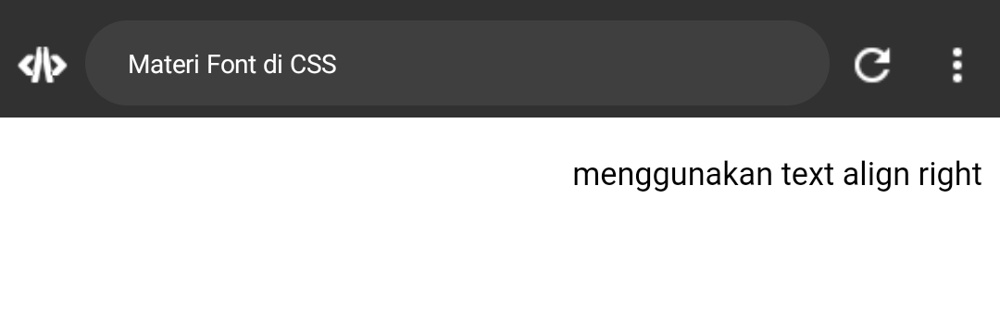

### Kesimpulan
Properti text-align dalam CSS memberikan kemampuan untuk mengatur penataan horizontal teks dalam elemen HTML. Dengan lima nilai yang umum digunakan, yaitu left, right, center, justify, dan justify-all, properti ini memberikan fleksibilitas dalam menyesuaikan posisi teks sesuai dengan kebutuhan desain halaman web. Dengan menggunakan nilai yang sesuai, pengembang dapat menciptakan tata letak yang estetis dan mudah dibaca bagi pengguna.

---

## Text-decoration
### Penjelasan
Properti `text-decoration` dalam CSS digunakan untuk mengatur dekorasi visual teks, seperti garis bawah, garis atas, atau garis tengah pada teks. Ini memungkinkan pengembang web untuk menambahkan efek visual pada teks untuk menyoroti, membedakan, atau memberikan arti khusus.

Beberapa nilai yang umum digunakan untuk `text-decoration` termasuk:

- `none`: Menghapus semua dekorasi teks.
- `underline`: Menambahkan garis bawah pada teks.
- `overline`: Menambahkan garis di atas teks.

Misalnya, menggunakan `text-decoration: underline;` akan menambahkan garis bawah pada teks, yang sering digunakan pada hyperlink untuk menunjukkan bahwa teks tersebut dapat diklik untuk navigasi.

### Kode Program
```html
<p style="text-decoration: underline;">menggunakan text decoration underline</p>
```

### Hasil
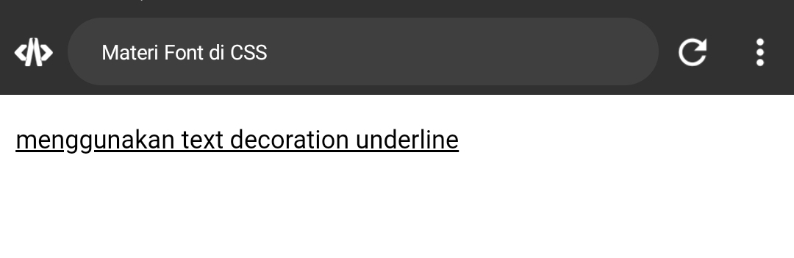

### Kesimpulan
Properti `text-decoration` dalam CSS digunakan untuk mengatur dekorasi visual teks seperti garis bawah, garis atas, atau garis tengah. Nilai yang umum digunakan termasuk `none`, `underline`, `overline`, dan `line-through`, yang memungkinkan pengembang untuk menambahkan efek visual pada teks sesuai kebutuhan desain.

---
## Text-transfrom
### Penjelasan
Properti `text-transform` dalam CSS digunakan untuk mengontrol transformasi teks, seperti mengubah huruf menjadi huruf besar, huruf kecil, atau mengkapitalkan huruf awal setiap kata.

Nilai yang umum digunakan untuk `text-transform` termasuk:

- `none`: Tidak ada transformasi teks.
- `uppercase`: Mengubah semua huruf menjadi huruf besar.
- `lowercase`: Mengubah semua huruf menjadi huruf kecil.
- `capitalize`: Mengkapitalkan huruf awal setiap kata.

Misalnya, dengan menggunakan `text-transform: capitalize;`, semua huruf awal dalam teks akan diubah menjadi huruf besar. Properti ini berguna untuk menyesuaikan penampilan teks tanpa mengubah struktur teks asli.

### Kode Program
```html
 <p style="text-transform: capitalize;">menggunakan text transform capitalize</p>
```

### Hasil
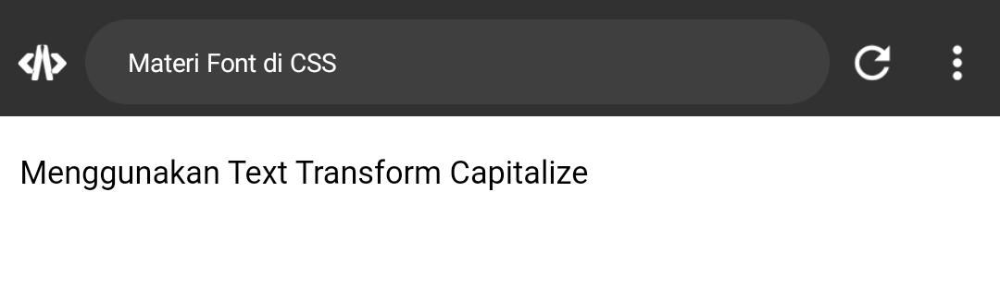

### Kesimpulan
Properti `text-transform` dalam CSS digunakan untuk mengontrol transformasi teks, seperti mengubahnya menjadi huruf besar, huruf kecil, atau mengkapitalkan huruf awal setiap kata. Dengan nilai seperti `uppercase`, `lowercase`, dan `capitalize`, properti ini memungkinkan pengembang untuk menyesuaikan penampilan teks sesuai kebutuhan desain tanpa mengubah struktur teks aslinya.

---
## Text-indent
### Penjelasan
Properti `text-indent` dalam CSS digunakan untuk mengatur jarak indentasi (tab) dari awal teks pada suatu elemen. Dengan properti ini, Anda dapat menentukan seberapa jauh teks akan dimulai dari batas kiri elemen yang diberikan.

Misalnya, menggunakan `text-indent: 20px;` akan membuat teks pada elemen tersebut dimulai 20 piksel dari batas kiri, menciptakan efek indentasi. Properti ini sering digunakan untuk membuat paragraf atau bagian teks tertentu menjadi terindentasi untuk meningkatkan keterbacaan atau untuk tujuan desain tertentu.

### Kode Program
```html
<p style="text-indent: 20px;">menggunakan text indent 20 pixel</p>
```

### Hasil
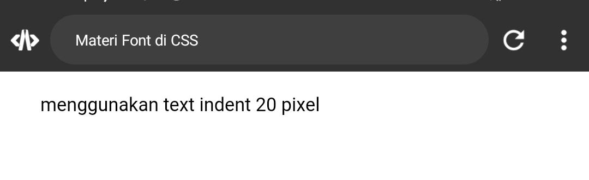

### Kesimpulan
Properti `text-indent` dalam CSS digunakan untuk mengatur jarak indentasi (tab) dari awal teks pada suatu elemen. Dengan menggunakan nilai seperti piksel atau persen, properti ini memungkinkan pengembang untuk mengontrol seberapa jauh teks akan dimulai dari batas kiri elemen yang diberikan, menciptakan efek indentasi. Properti ini sering digunakan untuk meningkatkan keterbacaan teks atau untuk tujuan desain tertentu.

---
## Letter-spacing
### Penjelasan
Properti `letter-spacing` dalam CSS digunakan untuk mengatur jarak antara karakter (huruf) dalam teks. Dengan properti ini, Anda dapat mengatur seberapa jauh atau dekat karakter-karakter tersebut ditempatkan satu sama lain.

Nilai yang umum digunakan untuk `letter-spacing` termasuk:

- Nilai positif: Meningkatkan jarak antara karakter.
- Nilai negatif: Mengurangi jarak antara karakter.

Misalnya, menggunakan `letter-spacing: 5px;` akan menambahkan jarak sebesar 5 piksel di antara setiap karakter dalam teks. Properti ini sering digunakan untuk menyesuaikan penampilan teks, meningkatkan keterbacaan, atau mencapai efek desain tertentu.

### Kode Program
```html
<p style="letter-spacing: 5px;">menggunakan letter spacing 5 pixel</p>
```

### Hasil
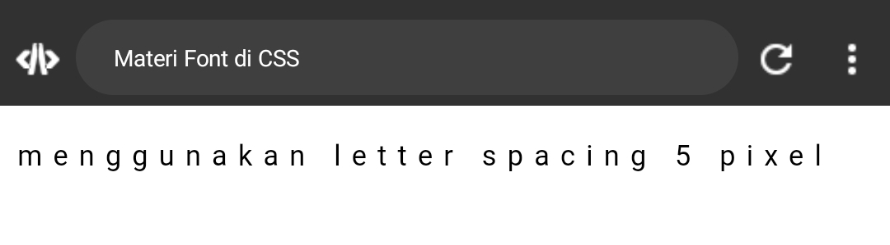

### Kesimpulan
Properti `letter-spacing` dalam CSS digunakan untuk mengatur jarak antara karakter (huruf) dalam teks. Dengan nilai positif untuk meningkatkan jarak dan nilai negatif untuk mengurangi jarak, properti ini memungkinkan pengembang untuk menyesuaikan penampilan teks sesuai kebutuhan desain atau untuk meningkatkan keterbacaan.

---
## Line-height
### Penjelasan
Properti `line-height` dalam CSS digunakan untuk mengatur tinggi baris teks dalam sebuah elemen. Tinggi baris adalah jarak vertikal antara garis dasar satu baris teks dengan garis dasar baris teks berikutnya.

Anda dapat menetapkan `line-height` dengan nilai absolut seperti piksel, atau relatif seperti persen. Nilai relatif seperti `1.5` akan mengalikan tinggi default teks, sementara nilai absolut seperti `20px` akan menetapkan tinggi baris secara langsung.

Menyesuaikan `line-height` dapat mempengaruhi keterbacaan teks dan tata letak halaman web secara keseluruhan. Nilai yang terlalu kecil dapat menyebabkan teks saling bertabrakan, sedangkan nilai yang terlalu besar dapat membuat teks terlihat terpisah-pisah. Sebagian besar desainer web menyesuaikan `line-height` untuk mencapai keseimbangan antara keterbacaan dan estetika.

### Kode Program
```html
<p style="line-height: 50px;">menggunakan line height <br> 50 pixel</p>
```

### Hasil
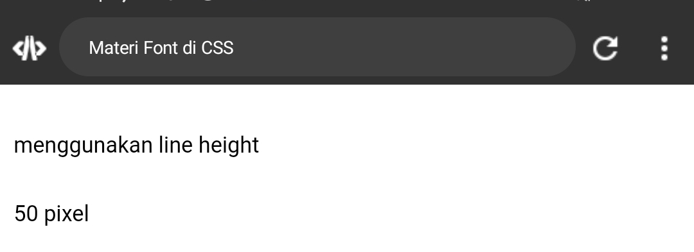

### Kesimpulan
Properti `line-height` dalam CSS digunakan untuk mengatur tinggi baris teks dalam sebuah elemen. Dengan nilai absolut atau relatif, properti ini memungkinkan pengembang untuk menyesuaikan keterbacaan teks dan tata letak halaman web secara keseluruhan dengan mengontrol jarak vertikal antara baris teks.

---
## Word-spacing
### Penjelasan
Properti `word-spacing` dalam CSS digunakan untuk mengatur jarak antara kata-kata dalam teks. Dengan menggunakan properti ini, Anda dapat menentukan seberapa jauh atau dekat kata-kata tersebut ditempatkan satu sama lain dalam sebuah elemen.

Nilai yang umum digunakan untuk `word-spacing` termasuk:

- Nilai positif: Meningkatkan jarak antara kata-kata.
- Nilai negatif: Mengurangi jarak antara kata-kata.

Misalnya, menggunakan `word-spacing: 5px;` akan menambahkan jarak sebesar 5 piksel di antara setiap kata dalam teks. Properti ini sering digunakan untuk menyesuaikan penampilan teks, meningkatkan keterbacaan, atau mencapai efek desain tertentu.

### Kode Program
```html
<p style="word-spacing: 5px;">menggunakan word spacing 5 pixel</p>
```

### Hasil
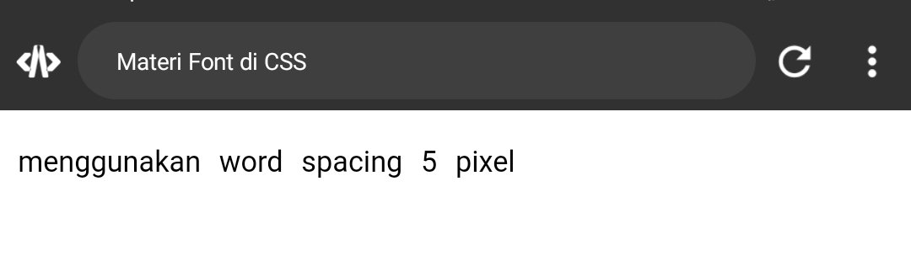

### Kesimpulan
Properti `word-spacing` dalam CSS digunakan untuk mengatur jarak antara kata-kata dalam teks. Dengan nilai positif untuk meningkatkan jarak dan nilai negatif untuk mengurangi jarak, properti ini memungkinkan pengembang untuk menyesuaikan penampilan teks sesuai kebutuhan desain atau untuk meningkatkan keterbacaan.

---
---
# Materi Background
## Background-image
### Penjelasan
Properti `background-image` dalam CSS digunakan untuk menentukan gambar yang akan digunakan sebagai latar belakang sebuah elemen HTML. Anda cukup menetapkan URL gambar sebagai nilai dari properti ini.

Dengan menetapkan `background-image`, gambar tersebut akan ditampilkan sebagai latar belakang elemen yang terkait. Ini sering digunakan untuk menambahkan elemen visual pada halaman web, seperti gambar latar belakang pada bagian header, div, atau bagian lain dari tata letak halaman.

### Kode Program
```html
<!DOCTYPE html>
<html>
  <head>
    <title>belajar materi background css</title>
    <style>
    p {
      background-image: url('/alter.png');
      height: 100vh;
    }
    </style>
  </head>
  <body>
    <p>ini background image</p>
  </body>
</html>
```
### Hasil
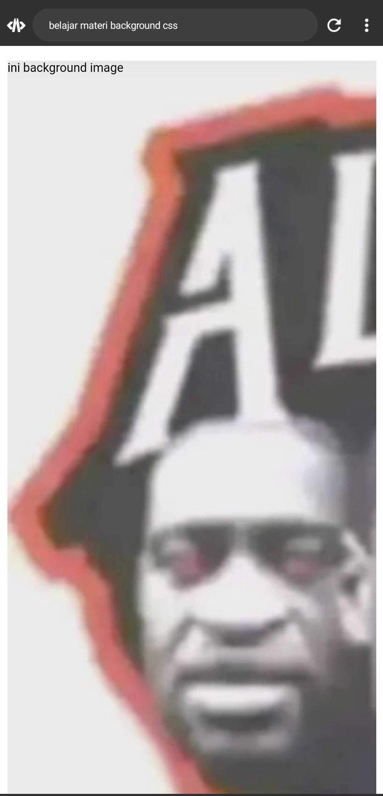

### Kesimpulan
Properti background-image dalam CSS digunakan untuk menentukan gambar yang akan digunakan sebagai latar belakang sebuah elemen HTML. Dengan menetapkan URL gambar sebagai nilai properti ini, Anda dapat menambahkan elemen visual pada halaman web, seperti gambar latar belakang pada bagian header, div, atau bagian lain dari tata letak halaman.

---
## Background-size
### Penjelasan
Properti background-size dalam CSS dapat menggunakan nilai persen untuk mengatur ukuran gambar latar belakang relatif terhadap ukuran elemen HTML yang terkait.

Ketika menggunakan nilai persen, properti background-size akan mengatur ukuran gambar latar belakang relatif terhadap lebar dan tinggi elemen tersebut. Misalnya, nilai 100% 100% akan membuat gambar latar belakang menutupi seluruh area elemen, sedangkan nilai 50% 50% akan membuat gambar latar belakang berukuran setengah dari lebar dan tinggi elemen.

### Kode Program
```html
<!DOCTYPE html>
<html>
  <head>
    <title>belajar materi background css</title>
    <style>
    p {
      background-image: url('/alter.png');
      height: 100vh;
      background-size: 100px 100px;
    }
    </style>
  </head>
  <body>
    <p>ini background image, background size, dan background-repeat</p>
  </body>
</html>
```

### Hasil
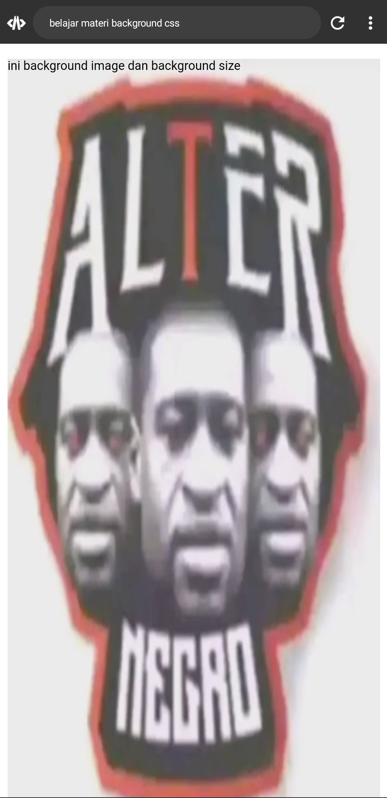

### Kesimpulan
Properti background-size dalam CSS digunakan untuk mengatur ukuran gambar latar belakang yang ditetapkan dengan properti background-image, dengan menggunakan nilai persen untuk mengatur ukuran relatif terhadap lebar dan tinggi elemen terkait. Ini memungkinkan penyesuaian responsif terhadap perubahan ukuran elemen atau tata letak halaman.

---
## Background-repeat
### Penjelasan
Properti `background-repeat` dalam CSS dapat menggunakan nilai `repeat` dan `no-repeat` untuk mengontrol apakah gambar latar belakang akan diulang atau tidak.

- `repeat`: Gambar latar belakang akan diulang secara vertikal dan horizontal untuk mengisi seluruh area elemen.
- `no-repeat`: Gambar latar belakang tidak akan diulang, sehingga hanya ditampilkan sekali di area elemen.

Misalnya, menggunakan `background-repeat: repeat;` akan membuat gambar latar belakang diulang secara vertikal dan horizontal untuk mengisi seluruh area elemen yang terkait. Sedangkan `background-repeat: no-repeat;` akan membuat gambar latar belakang hanya ditampilkan sekali tanpa pengulangan.

Ini memungkinkan Anda untuk menciptakan tampilan latar belakang yang berbeda-beda, baik dengan pengulangan gambar untuk membuat pola atau tanpa pengulangan untuk menampilkan gambar tanpa adanya potongan yang terlihat.

### Kode Program
```html
<!DOCTYPE html>
<html>
  <head>
    <title>belajar materi background css</title>
    <style>
    p {
      background-image: url('/alter.png');
      height: 100vh;
      background-size: 100px 100px;
      background-repeat: no-repeat;
    }
    </style>
  </head>
  <body>
    <p>ini background image, background size, dan background-repeat</p>
  </body>
</html>
```

### Hasil
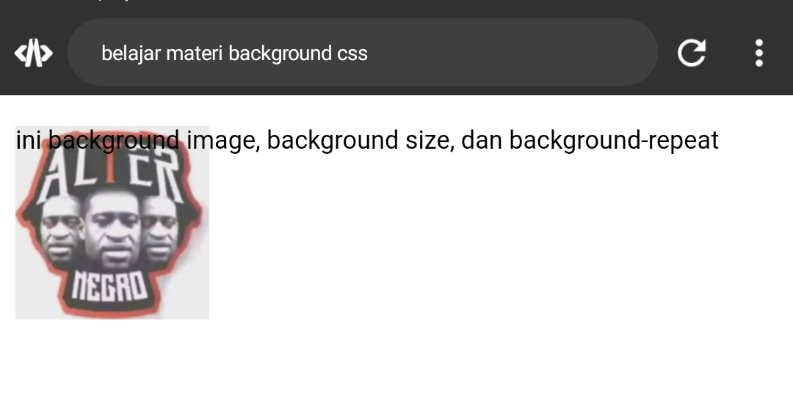

### Kesimpulan
Properti `background-repeat` dalam CSS digunakan untuk mengontrol apakah gambar latar belakang akan diulang atau tidak di dalam area elemen terkait. Dengan menggunakan nilai `repeat`, gambar latar belakang akan diulang secara vertikal dan horizontal untuk mengisi seluruh area elemen, sedangkan dengan nilai `no-repeat`, gambar latar belakang hanya ditampilkan sekali tanpa diulang. Ini memungkinkan penyesuaian yang fleksibel terhadap tampilan latar belakang elemen, baik untuk menciptakan pola dengan pengulangan gambar atau menampilkan gambar tanpa adanya potongan yang terlihat.

---
## Background-attachment
### Penjelasan
Properti `background-attachment` dalam CSS digunakan untuk mengontrol apakah gambar latar belakang akan tetap diam atau bergulir bersama dengan isi halaman saat pengguna menggulir halaman.

Nilai yang umum digunakan untuk `background-attachment` adalah:

- `scroll`: Gambar latar belakang akan bergulir bersama dengan isi halaman saat pengguna menggulir halaman.
- `fixed`: Gambar latar belakang akan tetap diam relatif terhadap jendela browser, sehingga akan tetap terlihat di tempatnya saat pengguna menggulir halaman.

Misalnya, menggunakan `background-attachment: fixed;` akan membuat gambar latar belakang tetap diam relatif terhadap jendela browser, sehingga akan terlihat tetap di tempatnya bahkan saat pengguna menggulir halaman.

Properti ini berguna untuk menciptakan efek visual yang menarik, seperti gambar latar belakang yang tetap berada di latar belakang atau yang bergerak bersama dengan halaman saat digulir.

### Kode Program
```html
<!DOCTYPE html>
<html>
  <head>
    <title>belajar materi background css</title>
    <style>
    p {
      background-image: url('/alter.png');
      height: 100vh;
      background-size: 100px 100px;
      background-repeat: no-repeat;
      background-attachment: scroll;
    }
    </style>
  </head>
  <body>
    <p>ini background image, background size, background-repeat, dan background attachment</p>
    <p>smk 7 makassar</p>
  </body>
</html>
```

### Hasil


### Kesimpulan
Properti background-attachment dalam CSS mengontrol apakah gambar latar belakang akan tetap diam atau bergulir bersama dengan isi halaman saat pengguna menggulir halaman. Dengan nilai fixed, gambar latar belakang akan tetap diam relatif terhadap jendela browser, sementara nilai scroll membuatnya bergulir bersama dengan halaman. Properti ini berguna untuk menciptakan efek visual yang menarik pada tata letak halaman web, seperti gambar latar belakang yang tetap di tempat atau bergerak saat halaman digulir.

---
## Background-position
### Penjelasan
Tentu, berikut adalah penjelasan singkat untuk nilai kata kunci yang umum digunakan pada properti `background-position`:

1. `top`: Menempatkan gambar latar belakang di bagian atas elemen.
2. `bottom`: Menempatkan gambar latar belakang di bagian bawah elemen.
3. `left`: Menempatkan gambar latar belakang di sisi kiri elemen.
4. `right`: Menempatkan gambar latar belakang di sisi kanan elemen.
5. `center`: Menempatkan gambar latar belakang di tengah-tengah elemen.

Anda juga dapat mengombinasikan nilai tersebut untuk menentukan posisi yang lebih spesifik, misalnya `top left` untuk menempatkan gambar latar belakang di sudut kiri atas elemen, atau `center bottom` untuk menempatkannya di tengah bawah elemen.

Dengan menggunakan nilai kata kunci ini, Anda dapat dengan mudah mengatur posisi awal gambar latar belakang sesuai dengan kebutuhan desain halaman web Anda.

### Kode Program
```html
<!DOCTYPE html>
<html>
  <head>
    <title>belajar materi background css</title>
    <style>
    p {
      background-image: url('/alter.png');
      height: 100vh;
      background-size: 100px 100px;
      background-repeat: no-repeat;
      background-attachment: scroll;
      background-position: top;
    }
    </style>
  </head>
  <body>
    <p>ini background image, background size, background-repeat, background attachment,dan background position</p>
  </body>
</html>
```

### Hasil
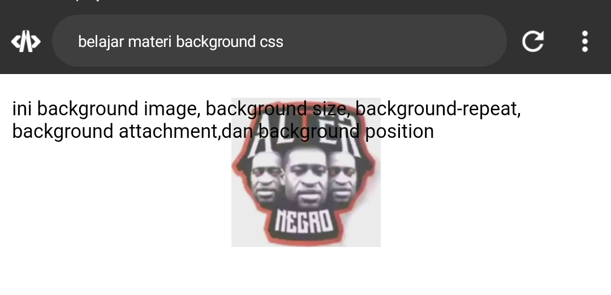

### Kesimpulan
Properti background-position dalam CSS digunakan untuk mengatur posisi awal atau letak gambar latar belakang di dalam elemen HTML yang terkait. Nilai kata kunci umum seperti top, bottom, left, right, dan center digunakan untuk menentukan posisi relatif gambar latar belakang di dalam elemen. Dengan menggunakan nilai-nilai ini, Anda dapat dengan mudah menyesuaikan posisi gambar latar belakang untuk mencapai tata letak halaman web yang diinginkan.

---
---
# Materi Font

## Font-size
### Penjelasan
Properti `font-size` dalam CSS digunakan untuk mengatur ukuran teks di dalam sebuah elemen HTML. Ukuran teks dapat ditentukan dalam berbagai satuan pengukuran, seperti piksel (px), persentase (%), em, atau rem.

Misalnya, dengan menggunakan `font-size: 16px;`, ukuran teks dalam elemen tersebut akan ditetapkan menjadi 16 piksel. Sedangkan dengan `font-size: 1.2em;`, ukuran teks akan menjadi 1.2 kali ukuran teks yang ditetapkan pada elemen induknya.

Properti `font-size` memungkinkan Anda untuk mengatur ukuran teks sesuai dengan kebutuhan desain halaman web Anda, memberikan fleksibilitas dalam penyesuaian tampilan teks untuk mencapai tata letak yang diinginkan.

### Kode Program
```html
<!DOCTYPE html>
<html>
  <head>
    <title>belajar materi font css</title>
    <style>
    p {
      font-size: 50px;
    }
    </style>
  </head>
  <body>
    <p>hallo world !</p>
  </body>
</html>
```

### Hasil
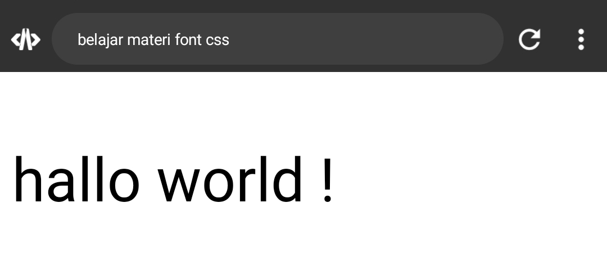

### Kesimpulan 
Properti `font-size` dalam CSS digunakan untuk mengatur ukuran teks di dalam sebuah elemen HTML. Dengan menggunakan nilai seperti piksel (px), persentase (%), em, atau rem, properti ini memungkinkan Anda untuk menyesuaikan ukuran teks sesuai dengan kebutuhan desain halaman web Anda.

---
## Font-style
### Penjelasan
secara konseptual, properti `font-style` dalam CSS digunakan untuk mengatur gaya penulisan teks. 

- `normal`: Ini menampilkan teks dalam gaya standar atau tidak miring.
- `italic`: Ini menampilkan teks dalam gaya miring, memberikan efek kursif pada teks.

Dengan memilih salah satu dari nilai ini, Anda dapat menyesuaikan tampilan teks sesuai dengan keinginan desain halaman web Anda, apakah itu teks yang lurus dan berdiri atau teks yang miring untuk memberikan penekanan visual.

### Kode Program
```html
<!DOCTYPE html>
<html>
  <head>
    <title>belajar materi font css</title>
    <style>
    p {
      font-style: italic;
    }
    </style>
  </head>
  <body>
    <p>hallo world !</p>
  </body>
</html>
```

### Hasil
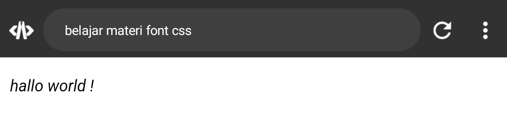

### Kesimpulan
Properti `font-style` dalam CSS digunakan untuk mengatur gaya penulisan teks. Dengan nilai seperti `normal`, `italic`, atau `oblique`, properti ini memungkinkan pengembang untuk menyesuaikan tampilan teks sesuai dengan kebutuhan desain halaman web, baik itu teks yang lurus atau teks yang miring untuk memberikan penekanan visual.

---
## Font-weight
### Penjelasan
Properti `font-weight` dalam CSS digunakan untuk menentukan ketebalan (weight) font teks.

Nilai yang umum digunakan untuk `font-weight` adalah:

- `normal`: Menetapkan teks dalam ketebalan normal.
- `bold`: Menetapkan teks dalam ketebalan tebal.
- Nilai numerik: Anda juga dapat menggunakan nilai numerik seperti `100`, `200`, `300`, ..., `900` untuk menentukan tingkat ketebalan yang spesifik. Nilai ini berjalan dari yang paling ringan (100) hingga yang paling tebal (900).

Dengan aturan di atas, teks di dalam elemen dengan kelas "element" akan ditampilkan dalam ketebalan yang tebal. Ini memungkinkan Anda untuk menyesuaikan tampilan teks sesuai dengan kebutuhan desain halaman web Anda.

### Kode Program
```html
<!DOCTYPE html>
<html>
  <head>
    <title>belajar materi font css</title>
    <style>
    p {
      font-weight: lighter;
    }
    </style>
  </head>
  <body>
    <p>hallo world !</p>
  </body>
</html>
```

### Hasil
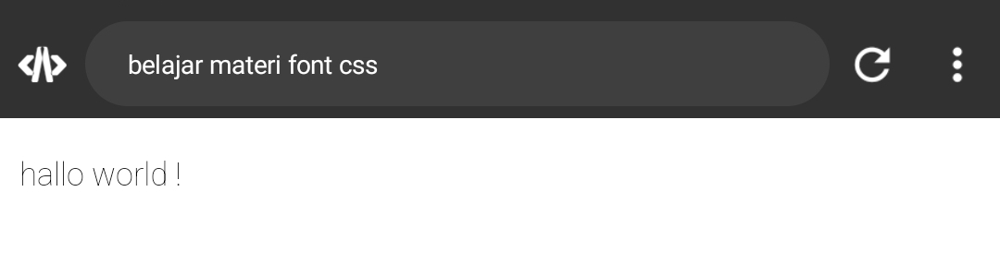

### Kesimpulan
Properti font-weight dalam CSS digunakan untuk menentukan ketebalan font teks. Dengan nilai seperti normal, bold, atau nilai numerik dari 100 hingga 900, properti ini memungkinkan pengembang untuk menyesuaikan tampilan teks dengan ketebalan yang diinginkan sesuai dengan desain halaman web mereka.

---
## Font-family
### Penjelasan
Properti `font-family` dalam CSS digunakan untuk menentukan jenis font atau kumpulan font yang akan digunakan untuk menampilkan teks pada elemen HTML yang terkait.

Anda dapat menetapkan `font-family` dengan menyediakan nama font atau nama kumpulan font sebagai nilai properti tersebut. Jika font yang pertama tidak tersedia di perangkat pengguna, maka browser akan mencoba menggunakan font alternatif yang kedua, dan seterusnya.

Dengan aturan di atas, teks di dalam elemen dengan kelas "element" akan ditampilkan menggunakan font Arial jika tersedia. Jika tidak, maka browser akan mencoba menggunakan font sans-serif sebagai alternatif. Ini memungkinkan Anda untuk memberikan pilihan font yang dapat diakses secara luas untuk menampilkan teks dengan konsistensi dan tampilan yang diinginkan.

### Kode Program
```html
<!DOCTYPE html>
<html>
  <head>
    <title>belajar materi font css</title>
    <style>
    p {
      font-family: Courier;
    }
    </style>
  </head>
  <body>
    <p>hallo world !</p>
  </body>
</html>
```

### Hasil
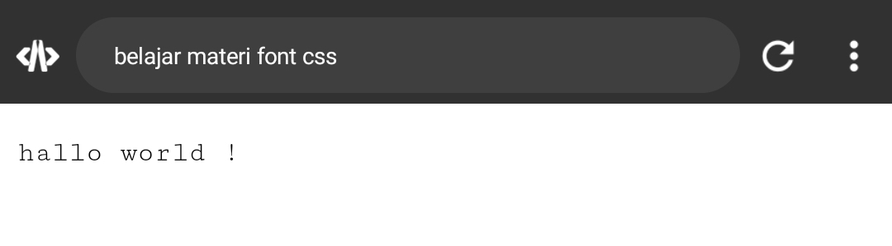

### Kesimpulan
Properti font-family dalam CSS digunakan untuk menentukan jenis font atau kumpulan font yang akan digunakan untuk menampilkan teks pada elemen HTML yang terkait. Dengan menentukan nama font atau kumpulan font sebagai nilai properti ini, Anda dapat memberikan pilihan font yang dapat diakses secara luas untuk menampilkan teks dengan konsistensi dan tampilan yang diinginkan, serta memberikan alternatif jika font utama tidak tersedia.

---
---

# Box Model
## Materi height & width
### Penjelasan
Dalam CSS, model kotak (box model) menggambarkan cara browser menentukan dimensi dan tata letak elemen HTML. Properti `height` dan `width` adalah bagian penting dari model kotak ini.

- `height`: Properti ini digunakan untuk menentukan tinggi (vertikal) dari sebuah elemen. Anda bisa memberikan nilai dalam piksel, persentase, atau nilai lainnya seperti `auto` yang membiarkan browser menentukan tinggi elemen berdasarkan kontennya.
  
- `width`: Properti ini digunakan untuk menentukan lebar (horizontal) dari sebuah elemen. Sama seperti `height`, nilai dapat diberikan dalam piksel, persentase, atau menggunakan nilai seperti `auto` yang mengizinkan browser menentukan lebar elemen berdasarkan kontennya.

### Kode Program
```html
<!DOCTYPE html>
<html>
  <head>
    <title>Materi Box Model CSS</title>
    <style>
    button {
      width: 100px;
      height: 50px;
    }
    </style>
  </head>
  <body>
    <button>Klik Aku!</button>
  </body>
</html>
```

### Hasil
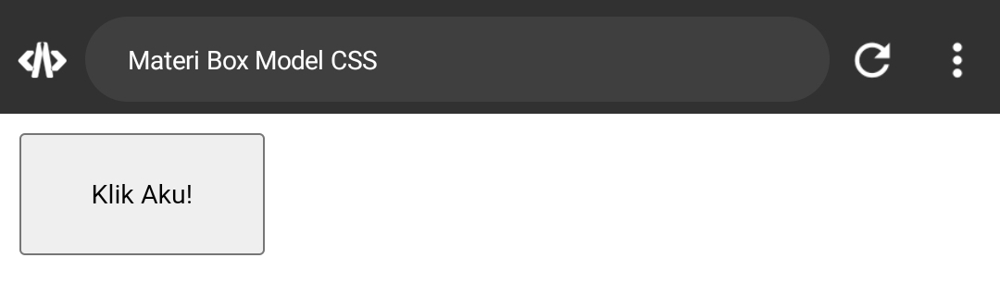

### Kesimpulan
Properti `height` digunakan untuk mengatur tinggi (vertikal) dari sebuah elemen, Properti `width` digunakan untuk mengatur lebar (horizontal) dari sebuah elemen. Keduanya merupakan bagian dari model kotak (box model) yang menentukan tata letak dan dimensi elemen HTML.

## Materi border
### border-width
#### Penjelasan
Properti border-width digunakan untuk mengatur ketebalan (lebar) dari batas (border) pada sebuah elemen HTML. Properti ini merupakan bagian dari model kotak (box model) yang digunakan untuk menentukan tata letak dan dimensi elemen.

Anda dapat menentukan nilai untuk border-width dalam piksel, persentase, atau menggunakan kata kunci seperti thin, medium, atau thick. Nilai ini mengontrol tebalnya batas yang mengelilingi elemen.

#### Kode Program
```html
<!DOCTYPE html>
<html>
  <head>
    <title>Materi Box Model CSS</title>
    <style>
    button {
      border-width: 5px;
    }
    </style>
  </head>
  <body>
    <button>Klik Aku!</button>
  </body>
</html>
```

#### Hasil
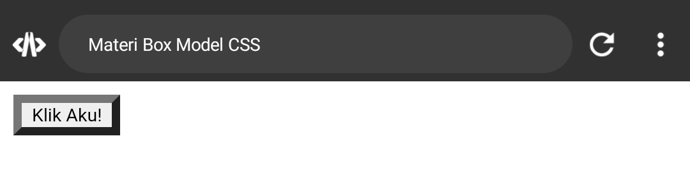

#### Kesimpulan
Properti `border-width` digunakan untuk mengatur ketebalan (lebar) dari batas (border) pada sebuah elemen HTML. Ini memungkinkan pengaturan berbagai ukuran untuk batas elemen seperti garis solid, tebal, atau tipis sesuai kebutuhan desain halaman web.

### border-style
#### Penjelasan
Properti border-style dalam CSS digunakan untuk menentukan jenis garis tepi (border) dari sebuah elemen HTML. Properti ini memiliki beberapa nilai yang dapat digunakan, antara lain:

`none` : Tidak ada garis tepi.
`solid` : Garis tepi berupa garis lurus dan solid.
`dashed`  : Garis tepi berupa garis putus-putus.

#### Kode Program
```html
<!DOCTYPE html>
<html>
  <head>
    <title>Materi Box Model CSS</title>
    <style>
    button {
      border-style: dashed;
    }
    </style>
  </head>
  <body>
    <button>Klik Aku!</button>
  </body>
</html>
```

#### Hasil
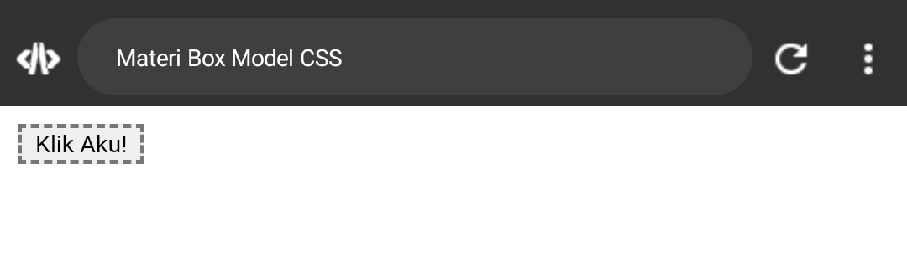

#### Kesimpulan
Secara singkat, dalam CSS, properti `border-style` digunakan untuk menentukan jenis garis tepi (border) dari sebuah elemen HTML. Properti ini mengontrol penampilan visual dari garis tepi dengan nilai seperti `solid`, `dashed`, dan lainnya.

### border-color
#### Penjelasan
Properti border-color dalam CSS digunakan untuk menentukan warna dari tepi (border) sebuah elemen HTML. Properti ini adalah salah satu dari beberapa properti yang terkait dengan border dalam model kotak (box model).

Nilai yang diterima oleh border-color bisa berupa nilai warna seperti nama warna (misalnya, "red", "blue", "green"), nilai RGB (misalnya, "rgb(255, 0, 0)"), nilai HEX (misalnya, "#ff0000"), atau nilai yang relatif seperti "transparent" untuk membuat tepi transparan.

#### Kode Program
```html
<!DOCTYPE html>
<html>
  <head>
    <title>Materi Box Model CSS</title>
    <style>
    button {
      border-color: red;
    }
    </style>
  </head>
  <body>
    <button>Klik Aku!</button>
  </body>
</html>
```

#### Hasil
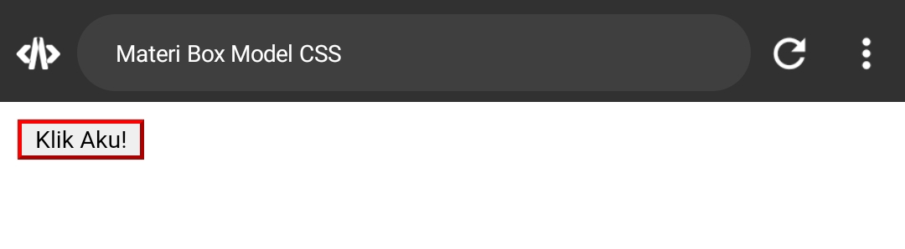

#### Kesimpulan
Properti `border-color` digunakan untuk menentukan warna dari tepi (border) sebuah elemen HTML dalam model kotak (box model). Anda dapat menggunakan nilai warna seperti nama warna, nilai RGB, nilai HEX, atau nilai yang relatif seperti "transparent" untuk membuat tepi transparan.

### border-radius
#### Penjelasan
`border-radius` adalah properti CSS yang digunakan untuk menentukan sudut lengkung dari sudut-sudut sebuah elemen kotak. Dengan menggunakan nilai `10px 10px 10px 10px`, Anda menentukan radius lengkung untuk setiap sudut elemen secara terpisah, yaitu: atas kiri, atas kanan, bawah kanan, dan bawah kiri.
Sudut-sudut `button` akan memiliki radius lengkung sebesar 10 piksel di setiap sudut, sehingga elemen tersebut memiliki tampilan sudut yang bulat.

#### Kode Program
```html
<!DOCTYPE html>
<html>
  <head>
    <title>Materi Box Model CSS</title>
    <style>
    button {
      border-radius: 10px 10px 10px 10px;
    }
    </style>
  </head>
  <body>
    <button>Klik Aku!</button>
  </body>
</html>
```

#### Hasil
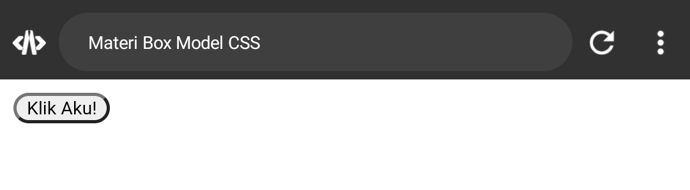

#### Kesimpulan
`border-radius` dengan nilai `10px 10px 10px 10px` mengatur radius lengkung untuk setiap sudut dari sebuah elemen kotak menjadi 10 piksel secara terpisah: atas kiri, atas kanan, bawah kanan, dan bawah kiri.

## Materi padding
### padding-right
#### Penjelasan
`padding-right` adalah properti CSS yang digunakan untuk menentukan jumlah ruang kosong (padding) di sebelah kanan elemen HTML. Padding adalah jarak antara tepi dalam elemen dan kontennya. Dengan menggunakan `padding-right`, Anda dapat membuat ruang kosong di sebelah kanan elemen, yang memungkinkan untuk menciptakan tata letak yang lebih baik dan meningkatkan estetika desain halaman web.

#### Kode Program
```html
<!DOCTYPE html>
<html>
  <head>
    <title>Materi Box Model CSS</title>
    <style>
    button {
      width: 200px ;
      height: 100px;
      padding-right: 100px;
    }
    </style>
  </head>
  <body>
    <button>Klik Aku!</button>
  </body>
</html>
```

#### Hasil
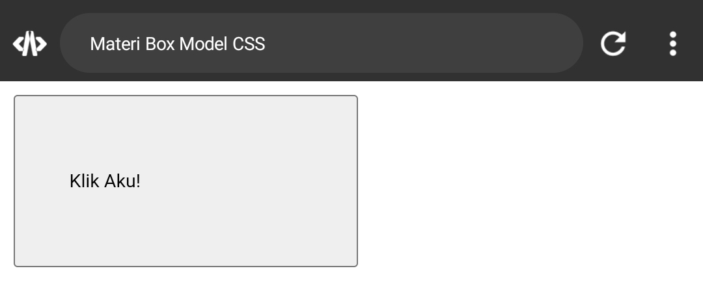

#### Kesimpulan
`padding-right` adalah properti CSS yang digunakan untuk menentukan jumlah ruang kosong di sebelah kanan elemen HTML, yang berguna untuk menciptakan tata letak yang lebih baik dan meningkatkan estetika desain halaman web.

### padding-left
#### Penjelasan
`Padding-left` adalah bagian dari model kotak (box model) di CSS yang mengacu pada jarak antara tepi kiri dari sebuah elemen dan konten di dalamnya. Ini memungkinkan untuk memberikan ruang tambahan di sebelah kiri elemen tanpa mempengaruhi lebar total elemen tersebut. Dengan menggunakan properti padding left, Anda dapat membuat elemen terlihat lebih terpisah dari elemen lain di sekitarnya atau memberikan ruang tambahan untuk menyusun isi elemen dengan lebih baik.

#### Kode Program
```html
<!DOCTYPE html>
<html>
  <head>
    <title>Materi Box Model CSS</title>
    <style>
    button {
      width: 200px ;
      height: 100px;
      padding-left: 100px;
    }
    </style>
  </head>
  <body>
    <button>Klik Aku!</button>
  </body>
</html>
```

#### Hasil
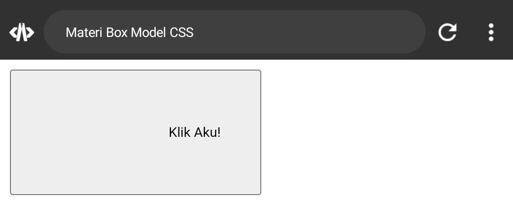

#### Kesimpulan
`Padding-left `adalah jarak antara tepi kiri dari sebuah elemen dan konten di dalamnya dalam model kotak CSS. Ini memungkinkan penambahan ruang di sebelah kiri elemen tanpa memengaruhi lebar total elemen tersebut.

### padding-bottom
#### Penjelasan
`padding-bottom` adalah properti CSS yang digunakan untuk menambahkan ruang polos di bagian bawah dari sebuah elemen HTML. Ini memberikan jarak antara konten dalam elemen dan batas bawah dari elemen tersebut dalam model kotak CSS. Dengan menggunakan `padding-bottom`, Anda dapat mengontrol seberapa jauh konten di dalam elemen tersebut berjarak dari batas bawahnya.

#### Kode Program
```html
<!DOCTYPE html>
<html>
  <head>
    <title>Materi Box Model CSS</title>
    <style>
    button {
      width: 200px ;
      height: 100px;
      padding-bottom: 50px;
    }
    </style>
  </head>
  <body>
    <button>Klik Aku!</button>
  </body>
</html>
```

#### Hasil
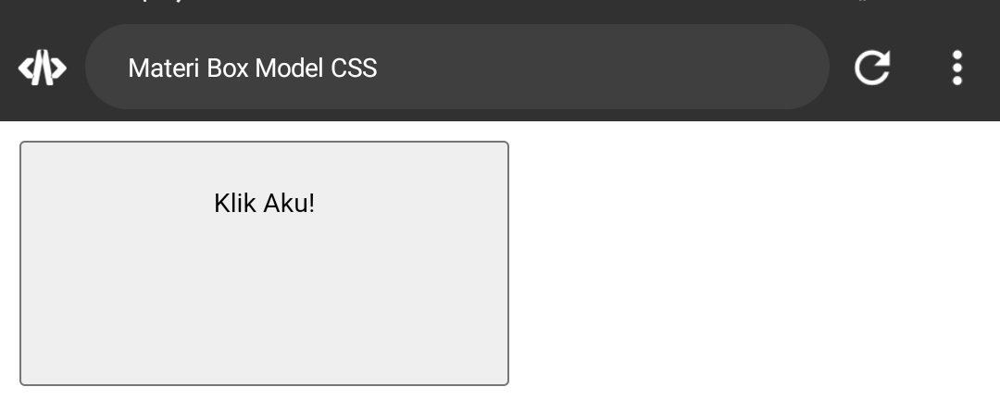

#### Kesimpulan
`padding-bottom` adalah properti yang digunakan untuk menambahkan ruang polos di bagian bawah sebuah elemen HTML, yang memisahkan konten dalam elemen tersebut dari batas bawahnya dalam model kotak CSS.

### padding-top
#### Penjelasan
`padding-top` adalah properti CSS yang digunakan untuk menentukan jumlah ruang polos yang diberikan di bagian atas dari konten sebuah elemen HTML. Ini memungkinkan Anda untuk menambahkan ruang tambahan di bagian atas elemen, antara konten dan batas atasnya. Sebagai bagian dari model kotak (box model) CSS, `padding-top` akan menambahkan jarak antara konten dalam elemen dan tepi atasnya.

#### Kode Program
```html
<!DOCTYPE html>
<html>
  <head>
    <title>Materi Box Model CSS</title>
    <style>
    button {
      width: 200px ;
      height: 100px;
      padding-top: 50px;
    }
    </style>
  </head>
  <body>
    <button>Klik Aku!</button>
  </body>
</html>
```

#### Hasil
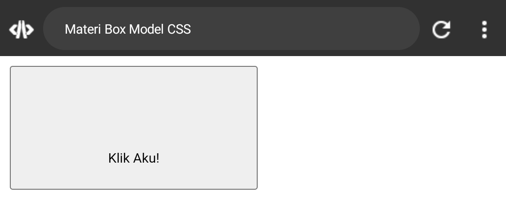

#### Kesimpulan
 `padding-top` dalam CSS digunakan untuk menambahkan ruang di bagian atas konten dalam sebuah elemen HTML, antara konten dan batas atas elemen tersebut.

## Materi margin
### margin-left
#### Penjelasan
`margin-left` adalah properti CSS yang digunakan untuk menentukan jarak (spasi) dari sisi kiri sebuah elemen terhadap elemen sebelumnya dalam tata letak halaman web. Ini memungkinkan Anda untuk mengatur ruang kosong di sebelah kiri elemen, sehingga memengaruhi tata letak keseluruhan halaman web. Semakin besar nilai `margin-left`, semakin besar pula jaraknya dari sisi kiri elemen sebelumnya.

#### Kode Program
```html
<!DOCTYPE html>
<html>
  <head>
    <title>Materi Box Model CSS</title>
    <style>
    button {
      margin-left: 50px;
    }
    </style>
  </head>
  <body>
    <button>Klik Aku!</button>
  </body>
</html>
```

#### Hasil
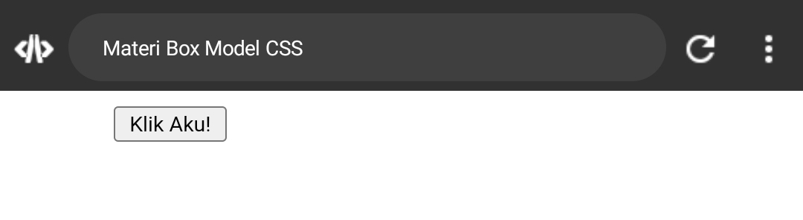

#### Kesimpulan
`margin-left` adalah properti CSS yang digunakan untuk menentukan jarak dari sisi kiri sebuah elemen terhadap elemen sebelumnya dalam tata letak halaman web. Semakin besar nilai `margin-left`, semakin besar pula jaraknya dari sisi kiri elemen sebelumnya.

### marginn-top
#### Penjelasan
`margin-top` adalah properti CSS yang digunakan untuk mengatur jarak antara tepi atas (atas) dari suatu elemen dan elemen sekitarnya dalam model kotak (box model). Dengan properti ini, Anda dapat menentukan seberapa jauh elemen tersebut akan diletakkan dari elemen di atasnya. Nilai yang diberikan bisa dalam bentuk piksel, persentase, atau menggunakan nilai lainnya seperti `auto` untuk menyesuaikan secara otomatis.

#### Kode Program
```html
<!DOCTYPE html>
<html>
  <head>
    <title>Materi Box Model CSS</title>
    <style>
    button {
      margin-top: 50px;
    }
    </style>
  </head>
  <body>
    <button>Klik Aku!</button>
  </body>
</html>
```


#### Hasil
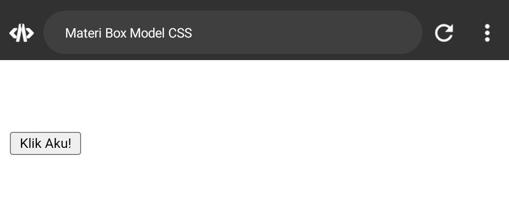

#### Kesimpulan
`margin-top` adalah properti yang digunakan untuk mengatur jarak antara tepi atas (atas) dari suatu elemen dan elemen sekitarnya dalam model kotak (box model).

### margin-right
#### Penjelasan
`margin-right` adalah properti CSS yang digunakan untuk menentukan jarak (margin) antara tepi kanan sebuah elemen dengan elemen lain di sekitarnya. Ini memengaruhi tata letak horizontal dari elemen tersebut di dalam model kotak (box model) CSS.

#### Kode Program
```html
<!DOCTYPE html>
<html>
  <head>
    <title>Materi Box Model CSS</title>
    <style>
    button {
      margin-right: 20px;
    }
    </style>
  </head>
  <body>
    <button>Klik Aku!</button>
    <button>Klik Aku!</button>
  </body>
</html>
```

#### Hasil
**Before**
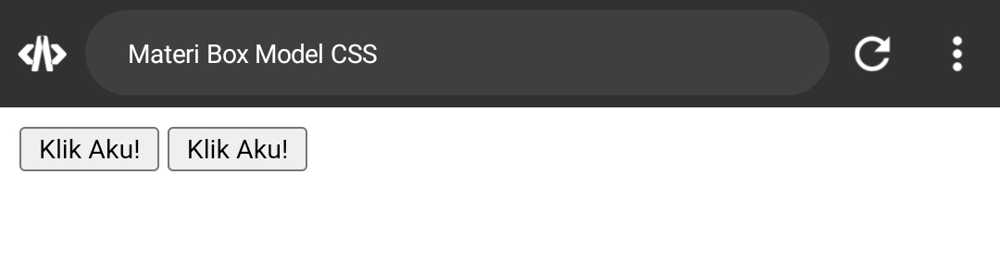

**After**
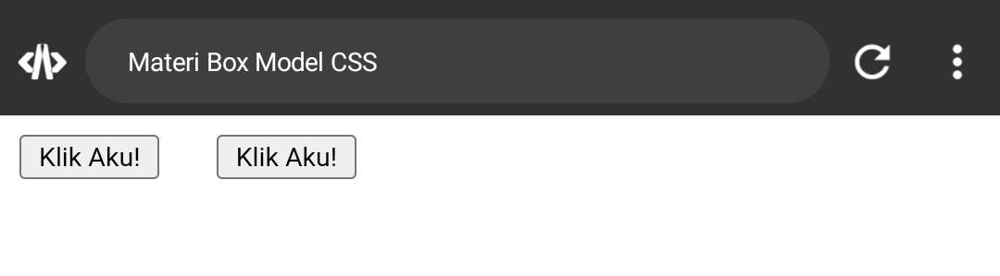

#### Kesimpulan
`margin-right` adalah properti CSS yang digunakan untuk mengatur jarak antara tepi kanan suatu elemen dengan elemen lain di sekitarnya dalam model kotak CSS.

### margin-bottom
#### Penjelasan
`margin-bottom` adalah properti CSS yang digunakan untuk menentukan jarak antara bagian bawah dari sebuah elemen dengan elemen-elemen di sekitarnya. Properti ini adalah bagian dari model kotak (box model) CSS dan digunakan untuk mengatur tata letak dan ruang di antara elemen-elemen pada halaman web. Dengan menggunakan `margin-bottom`, Anda dapat mengontrol ruang di bawah elemen untuk mencapai tata letak yang diinginkan.

#### Kode Program
```html
<!DOCTYPE html>
<html>
  <head>
    <title>Materi Box Model CSS</title>
    <style>
    button {
      margin-top: 20px;
    }
    </style>
  </head>
  <body>
    <button>Klik Aku!</button><br>
    <button>Klik Aku!</button>
    
  </body>
</html>
```

#### Hasil
**Before**
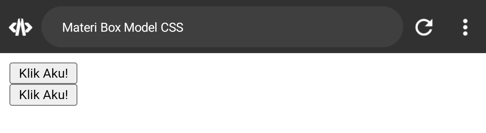

**After**
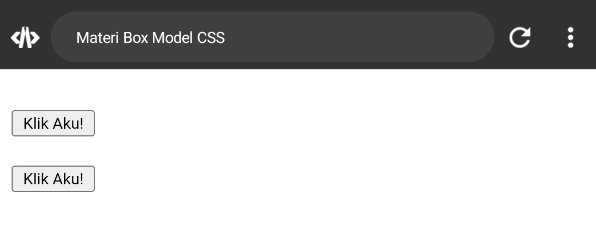

#### Kesimpulan
`margin-bottom` adalah properti CSS yang digunakan untuk menentukan jarak antara bagian bawah dari sebuah elemen dengan elemen-elemen di sekitarnya dalam model kotak (box model) CSS.
## Tantangan Box Model
### Deskripsi
- Terdapat elemen `body` dengan warna latar belakang ungu.
- Latar belakang halaman diatur menjadi warna ungu melalui CSS.
- Sebuah gambar dengan path "alter.png" ditampilkan dengan ukuran 150x150 piksel. Gambar tersebut diberi border putih dengan lebar 10 piksel dan bentuk lingkaran menggunakan properti CSS `border-radius`.
- Teks "Selamat Datang" dan "di Web Rehan!" ditampilkan dalam sebuah paragraf dengan menggunakan font Courier, ukuran 25px, dan warna putih. Teks tersebut diberi jarak menggunakan properti `margin-left` dan `margin-top`.
- Terdapat sebuah tombol dengan teks "Klik disini!" yang memiliki warna latar belakang dan teks oranye, serta border oranye. Tombol tersebut diberi jarak menggunakan properti `margin-top` dan `margin-left`.
### Kode
HTML
```HTML
<!DOCKTYPE html>
<html>
  <head>
    <title></title>
    <link rel="stylesheet" href="Latihan01.css"
  </head>
  <body>
    <span>
    <p>Selamat Datang<br><b>di Web Rehan!</b></p>
    </span>
    <button>Klik disini!</button>
  </body>
</html>
```
CSS
```CSS
body {
    background-color: purple;
}

img {
    border-radius: 100% 100%;
    border-width:10px ;
    border-style: solid;
    border-color: white;
    margin-left: 220px;
    
}

p {
    font-family: courier;
    font-size: 25px;
    color: white;
    margin-left: ;
    margin-top: -150px;
}

button {
    width: 100px;
    height: 50px;
    background-color: purple;
    color: orangered;
    border-color: orangered;
    margin-top: ;
    margin-left: 70px;
}
```
### Hasil


# Pseudo Classes
## Hover
### Penjelasan
`Hover` adalah sebuah keadaan di mana pengguna mengarahkan kursor mouse ke suatu elemen di halaman web, tetapi belum mengkliknya. Ini sering digunakan untuk memberikan respons visual atau interaktif kepada pengguna saat mereka mengarahkan kursor mouse ke atas elemen tersebut. Dalam CSS, Anda dapat menggunakan pseudo-class `:hover` untuk menerapkan gaya tambahan pada elemen ketika pengguna mengarahkan kursor mouse ke atasnya. Ini memungkinkan Anda untuk membuat efek visual seperti perubahan warna, perubahan ukuran, atau efek transisi lainnya untuk meningkatkan interaktivitas dan responsivitas halaman web. 
### Kode Program
```html
<!DOCTYPE html>
<html>
  <head>
    <title>document</title>
    <style>
      button {
        width: 100px;
        height: 50px;
        background-color: aqua;
        color: orangered;
        border:2 solid black;
      }
      button:hover {
        transform: skew(22deg);
      }
    </style>
  </head>
  <body>
    <button>klik aku</button>
  </body>
</html>
```
### Hasil
#### Before
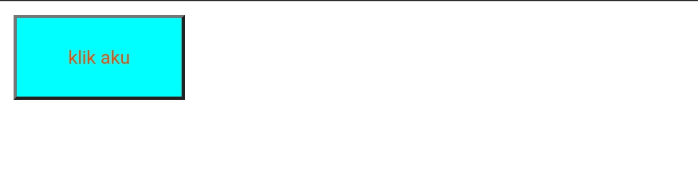
#### After
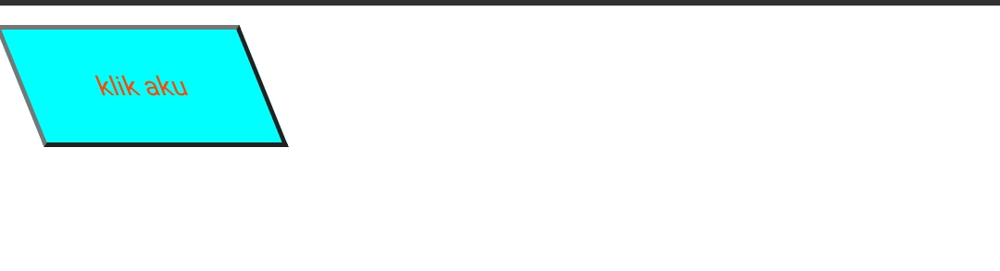
### Kesimpulan
Kesimpulannya, hover adalah keadaan di mana pengguna mengarahkan kursor mouse ke suatu elemen di halaman web tanpa mengkliknya. Ini memungkinkan Anda untuk memberikan respons visual atau interaktif kepada pengguna, seperti mengubah gaya elemen menggunakan pseudo-class `:hover` dalam CSS. Ini merupakan cara yang umum digunakan untuk meningkatkan interaktivitas dan responsivitas halaman web.
## active
### Penjelasan
`active` adalah salah satu dari beberapa pseudo-class dalam CSS yang menerapkan gaya kepada elemen saat elemen tersebut dalam keadaan aktif, yaitu saat pengguna menekan tombol mouse saat mengklik elemen tersebut. Pseudo-class `:active` sering digunakan untuk memberikan respons visual saat pengguna sedang mengklik atau menekan elemen, seperti tombol. Misalnya, Anda dapat mengubah warna latar belakang tombol saat pengguna menekannya, memberikan umpan balik visual bahwa tindakan sedang berlangsung.
### Kode Program
```html
<!DOCTYPE html>
<html>
  <head>
    <title>document</title>
    <style>
      button {
        width: 100px;
        height: 50px;
        background-color: aqua;
        color: orangered;
        border:2 solid black;
      }
      button:active {
        transform: rotate(-22deg);
      }
    </style>
  </head>
  <body>
    <button>klik aku</button>
  </body>
</html>
```
### Hasil
#### Before

#### After
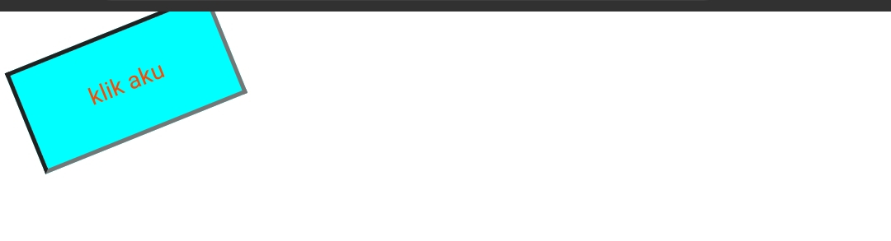
### Kesimpulan
`active` adalah salah satu pseudo-class dalam CSS yang diterapkan pada elemen saat elemen tersebut dalam keadaan aktif, yaitu saat pengguna menekan tombol mouse saat mengklik elemen tersebut. Ini sering digunakan untuk memberikan respons visual saat pengguna sedang mengklik atau menekan elemen, seperti tombol.
## visited
### Penjelasan
`visited` adalah salah satu dari beberapa pseudo-class dalam CSS yang menerapkan gaya kepada elemen yang telah dikunjungi oleh pengguna. Ini berguna untuk memberikan tanda visual kepada pengguna mengenai link yang telah mereka kunjungi sebelumnya. Misalnya, Anda dapat mengubah warna atau gaya lain dari tautan yang telah dikunjungi untuk membedakannya dari tautan yang belum pernah dikunjungi.
### Kode Program
```html
<!DOCTYPE html>
<html>
<head>
<title> Pseudo-class:visited</title>
<style>
a {
  color: red;
}
 a:visited {
  color: purple;
}
</style>
</head>
<body>
<p>Kunjungi tautan di bawah ini:</p>
<ul>
  <li><a href="https://www.example.com">Tautan 1</a></li>
  <li><a href="https://www.example.com">Tautan 2</a></li>
</ul>
</body>
</html>
```
### Hasil
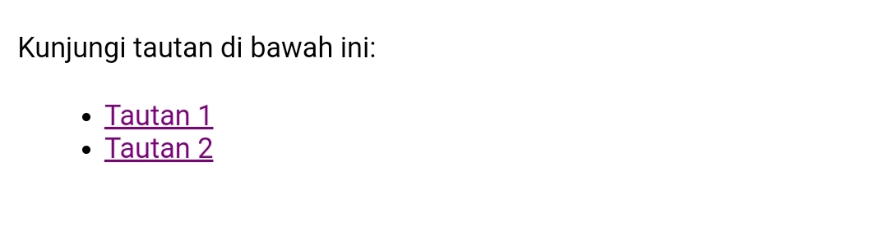
### Kesimpulan
`visited` adalah pseudo-class dalam CSS yang digunakan untuk menerapkan gaya kepada elemen yang telah dikunjungi oleh pengguna, seperti tautan yang telah diklik sebelumnya. Ini memungkinkan Anda untuk memberikan tanda visual kepada pengguna mengenai link yang telah mereka kunjungi sebelumnya, misalnya dengan mengubah warna atau gaya lain dari tautan yang telah dikunjungi.
# Transition
### transition-delay
#### Penjelasan
Property `transition-delay` pada CSS digunakan untuk menentukan waktu penundaan sebelum transisi dimulai. Ini memungkinkan Anda mengatur waktu tunggu antara perubahan properti CSS dan dimulainya animasi atau perubahan tersebut. Dengan menggunakan `transition-delay`, Anda dapat membuat efek transisi yang lebih kompleks dan dinamis, memungkinkan elemen-elemen web berubah secara halus dan terkoordinasi.
#### Kode Program
```html
<!DOCKTYPE html> 
<html>
  <head>
    <title>Transition</title>
    <style>
      button {
        color: red;
        border-color: red;
        border-width: 3px;
        background-color: white;
        font-family: Arial;
        margin-top: 20px;
        margin-left: 20px;
        width: 100px;
        height: 30px;
        border-radius: 100px 100px;
        transition-delay: 0.5s;
      }
      button:hover {
        background-color: blue;
      }
    </style>
  </head>
  <body>
    <button>klik aku</button>
  </body>
</html>
```
#### Hasil
Before
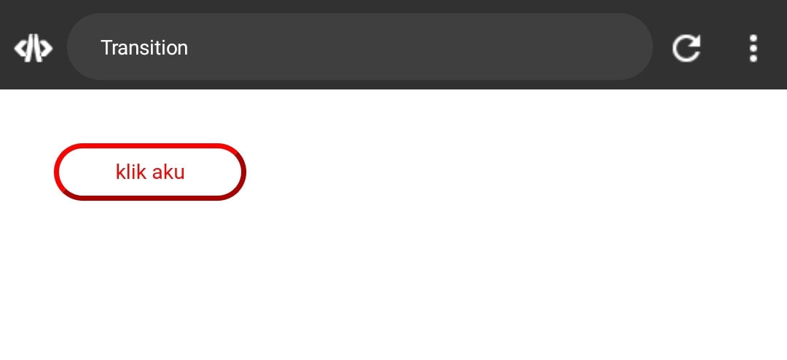
After
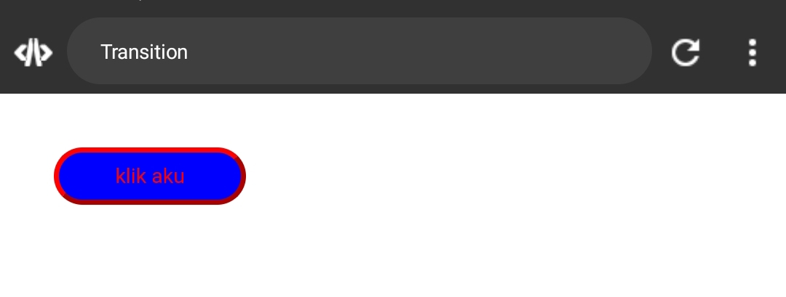
#### Kesimpulan
`transition-delay` pada CSS digunakan untuk menunda dimulainya transisi properti CSS setelah perubahan properti tersebut terjadi. Ini memungkinkan pengaturan waktu penundaan sebelum animasi atau perubahan dimulai, menciptakan efek transisi yang lebih dinamis dan kompleks dalam desain web.
### transition-duration
#### Penjelasan
Property `transition-duration` pada CSS digunakan untuk menentukan durasi waktu yang dibutuhkan untuk menyelesaikan transisi dari satu nilai properti CSS ke nilai yang lainnya. Ini mengatur kecepatan animasi atau perubahan yang terjadi pada elemen saat transisi terjadi. Dengan menggunakan `transition-duration`, Anda dapat mengontrol seberapa cepat atau lambat perubahan tersebut terjadi, menciptakan efek yang lebih halus atau cepat dalam desain web Anda. To
#### Kode Program
```html
<!DOCKTYPE html> 
<html>
  <head>
    <title>Transition</title>
    <style>
      button {
        color: red;
        border-color: red;
        border-width: 3px;
        background-color: white;
        font-family: Arial;
        margin-top: 20px;
        margin-left: 20px;
        width: 100px;
        height: 30px;
        border-radius: 100px 100px;
        transition-duration: 0.5s;
      }
      button:hover {
        background-color: blue;
      }
    </style>
  </head>
  <body>
    <button>klik aku</button>
  </body>
</html>
```
#### Hasil
Before

After
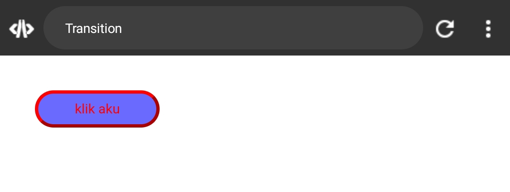
#### Kesimpulan
`transition-duration` pada CSS adalah property yang menentukan durasi waktu yang dibutuhkan untuk menyelesaikan transisi dari satu nilai properti CSS ke nilai yang lainnya. Ini mengatur kecepatan animasi atau perubahan yang terjadi pada elemen saat transisi terjadi, memungkinkan Anda menciptakan efek yang lebih halus atau cepat dalam desain web Anda.
### transition-property
#### Penjelasan
Property `transition-property` pada CSS digunakan untuk menentukan properti mana yang akan mengalami transisi atau animasi ketika nilainya berubah. Dengan menggunakan `transition-property`, Anda dapat menentukan secara tepat properti CSS mana yang akan memiliki efek transisi, seperti warna, ukuran, posisi, atau properti lainnya. Ini memberikan fleksibilitas dalam mengatur transisi hanya pada properti yang diinginkan, sementara properti lainnya tetap tidak berubah.
#### Kode Program
```html
<!DOCKTYPE html> 
<html>
  <head>
    <title>Transition</title>
    <style>
      button {
        color: red;
        border-color: red;
        border-width: 3px;
        background-color: white;
        font-family: Arial;
        margin-top: 20px;
        margin-left: 20px;
        width: 100px;
        height: 30px;
        border-radius: 100px 100px;
        transition-property: background-color, width;
      }
      button:hover {
        background-color: blue;
      }
    </style>
  </head>
  <body>
    <button>klik aku</button>
  </body>
</html>
```
#### Hasil
Before

After
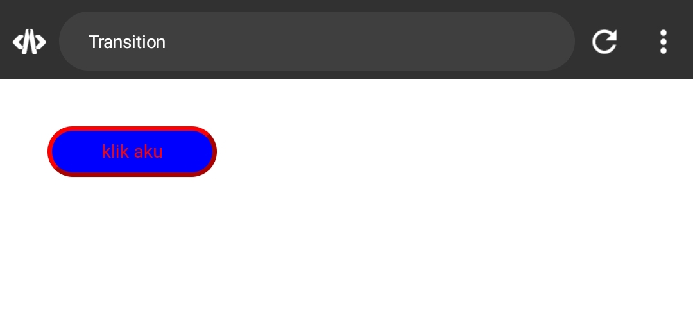
#### Kesimpulan
`transition-property` pada CSS adalah property yang digunakan untuk menentukan properti mana yang akan mengalami transisi atau animasi ketika nilainya berubah. Ini memberikan kontrol tepat terhadap elemen mana yang akan memiliki efek transisi, memungkinkan Anda untuk membuat animasi yang tepat sesuai dengan kebutuhan desain Anda.
### transition-timing-function
#### Penjelasan
Property `transition-timing-function` pada CSS digunakan untuk menentukan bagaimana perubahan properti akan dipercepat atau diperlambat selama periode transisi. Dengan menggunakan `transition-timing-function`, Anda dapat mengatur kurva waktu untuk mengendalikan kecepatan animasi saat transisi berlangsung. Terdapat beberapa nilai yang dapat digunakan, seperti `ease`, `ease-in`, `ease-out`, `ease-in-out`, `linear`, dan nilai kustom menggunakan fungsi kubik-bezier. Ini memberikan fleksibilitas dalam menciptakan efek transisi yang berbeda, dari perubahan mulus hingga perubahan yang lebih tegas.

#### Kode Program
```html
<!DOCKTYPE html> 
<html>
  <head>
    <title>Transition</title>
    <style>
      button {
        color: red;
        border: 3px solid blue;
        background-color: white;
        font-family: Arial;
        margin-top: 20px;
        margin-left: 20px;
        width: 100px;
        height: 30px;
        border-radius: 100px 100px;
        transition-property: width;
        transition-duration: 1s;
        transition-timing-function: ease-in;
      }
      button:hover {
        background-color: brown;
      }
    </style>
  </head>
  <body>
    <button>klik aku</button>
  </body>
</html>
```
#### Hasil
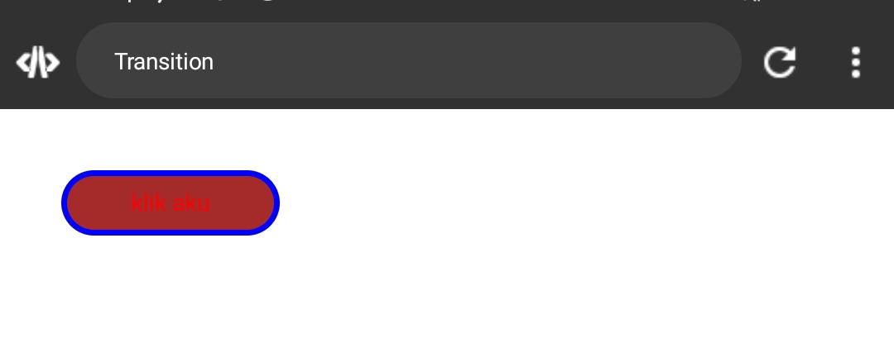
#### Kesimpulan
`transition-timing-function` pada CSS adalah property yang digunakan untuk mengatur kurva waktu yang menentukan bagaimana perubahan properti akan dipercepat atau diperlambat selama periode transisi. Ini memungkinkan Anda untuk menciptakan berbagai efek transisi, mulai dari perubahan yang mulus hingga perubahan yang tajam, sesuai dengan kebutuhan desain Anda.

## Study kasus
### Deskripsi
#### HTML:

1. **DOCTYPE Declaration**:
   ```html
   <!DOCKTYPE html>
   ```
   Ini adalah salah ketik. Seharusnya diganti menjadi `<!DOCTYPE html>` untuk mendeklarasikan jenis dokumen HTML5.

2. **Tag HTML**:
   ```html
   <html>
   ```
   Ini adalah tag pembuka untuk dokumen HTML.

3. **Tag Head**:
   ```html
   <head>
     <title>Belajar CSS</title>
   </head>
   ```
   Bagian ini berisi metadata dan informasi lainnya tentang halaman web, termasuk judul yang ditampilkan di tab browser.

4. **Tag Style**:
   ```html
   <style>
     ...
   </style>
   ```
   Ini adalah bagian di mana aturan CSS untuk halaman web didefinisikan secara internal.

5. **Tag Body**:
   ```html
   <body>
     <div class="box-container">
       <div class="main-container">
         <div class="hero-contaoner">
           <p class="item box-item-2">Selamat Datang<br><b>di Web Ahsan!</b></p>
           <button class="item box-item-3">Klik disini!</button>
         </div>
         
       </div>
     </div>
   </body>
   ```
   Bagian ini berisi konten yang ditampilkan di halaman web. Terdapat beberapa kontainer div yang berturut-turut menyusun struktur tata letak halaman.

#### CSS:

1. **.box-container**:
   ```css
   .box-container {
     height: 250px;
     width: 390px;
     background-color: purple;
     display: flex;
     flex-direction: row;
     align-items: center;
     justify-content: space-around;
   }
   ```
   Ini adalah gaya untuk kontainer utama dengan background ungu, menggunakan flexbox untuk menata isi secara horizontal dengan mengatur ruang sekitar konten.

2. **.main-container**:
   ```css
   .main-container {
     height: 220px;
     width: 360px;
     background-color: transparent;
     display: flex;
     flex-direction: row;
     align-items: center;
     justify-content: space-around;
   }
   ```
   Kontainer ini memiliki background transparan dan juga menggunakan flexbox untuk menata isi secara horizontal dengan mengatur ruang sekitar konten.

3. **.hero-contaoner** (Typo):
   ```css
   .hero-contaoner {
     height: 200px;
     width: 180px;
     background-color: transparent;
     display: flex;
     flex-direction: column;
     align-items: center;
     justify-content: space-around;
   }
   ```
   Kontainer ini memiliki background transparan dan menggunakan flexbox untuk menata isi secara vertikal dengan mengatur ruang sekitar konten.

4. **.box-item-1**:
   ```css
   .box-item-1 {
     background-color: red;
     height: 150px;
     width: 150px;
     border-radius: 100%;
     border: 7px solid white;
   }
   ```
   Gaya untuk gambar (`img`) dengan background merah, lingkaran, dan bingkai putih.

5. **.box-item-2**:
   ```css
   .box-item-2 {
     background-color: transparent;
     font-family: courier;
     font-size: 25px;
     color: white;
     width: 180px;
     height: 75px;
     margin-top: 50px;
   }
   ```
   Gaya untuk paragraf (`p`) dengan font Courier, ukuran 25px, dan warna putih.

6. **.box-item-3**:
   ```css
   .box-item-3 {
     width: 90px;
     height: 45px;
     background-color: transparent;
     color: orangered;
     font-size: 12px;
     border: 1px solid orangered;
     margin-left: 70px;
     margin-bottom: 20px;
   }
   ```
   Gaya untuk tombol (`button`) dengan warna teks oranye merah, border oranye, dan ukuran serta jarak tertentu dari konten sekitarnya.

7. **.box-item-3:hover**:
   ```css
   .box-item-3:hover {
     transform: rotate(360deg);
     background-color: blue;
     height: 205px;
     width: 100px;
     cursor: pointer;
     transition: all 0.4s ease-in-out;
   }
   ```
   Gaya untuk saat tombol diberi hover, dengan efek animasi rotasi, perubahan warna latar belakang menjadi biru, dan perubahan ukuran tombol dengan transisi selama 0.4 detik.

### Kode
```html
<!DOCKTYPE html>
<html>
  <head>
    <title>Belajar CSS </title>
    <style>
      .box-container {
        height: 250px;
        width: 390px;
        background-color:purple;
        display: flex;
        flex-direction: row;
        align-items: center;
        justify-content: space-around;
        
      }
      .main-container{
        height: 220px;
        width: 360px;
        background-color:transparent;
        display: flex;
        flex-direction: row;
        align-items: center;
        justify-content: space-around;
      }
      .hero-contaoner{
        height: 200px;
        width: 180px;
        background-color:transparent;
        display: flex;
        flex-direction: column;
        align-items: center;
        justify-content: space-around;
      }
      .box-item-1 {
        background-color: red;
        height: 105px;
        border-radius: 100% 100%;
        border-width:7px ;
        border-style: solid;
        border-color: white;
        height: 150px;
        width: 150px;
      }
      .box-item-2 {
        background-color: transparent;
        font-family: courier;
        font-size: 25px;
        color: white;
        width: 180px;
        height: 75px;
        margin-top: 50px;
      }
      .box-item-3 {
      width: 90px;
      height: 45px;
      background-color: transparent;
      color: orangered;
      font-size: 12px;
      border-color: orangered;
      margin-left: 70px;
      margin-bottom: 20px;
      }
      .box-item-3:hover {
        transform: rotate(360deg);
        background-color: blue;
        height: 205px;
        width: 100px;
        cursor: pointer;
        transition: all 0.4s ease-in-out;
      }
    </style>
  </head>
  
  <body>
    <div class="box-container">
      <div class="main-container">
        <div class="hero-contaoner">
          <p class="item box-item-2">Selamat Datang<br><b>di Web Ahsan!</b></p>
          <button class="item box-item-3">Klik disini!</button>
        </div>
      
      </div>
    </div>
  </body>
</html>
```
### Hasil
#### Before
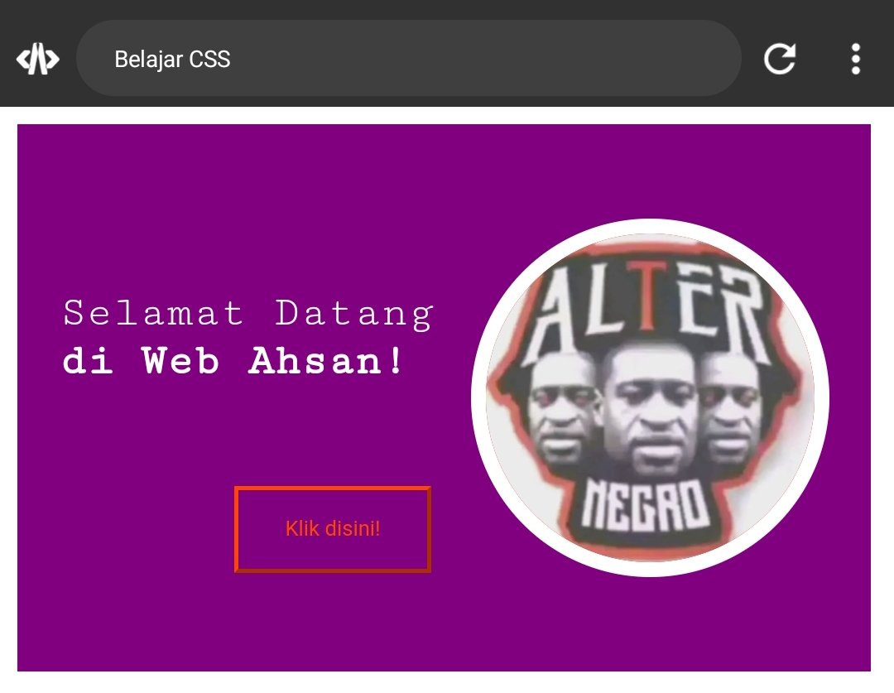
#### After 
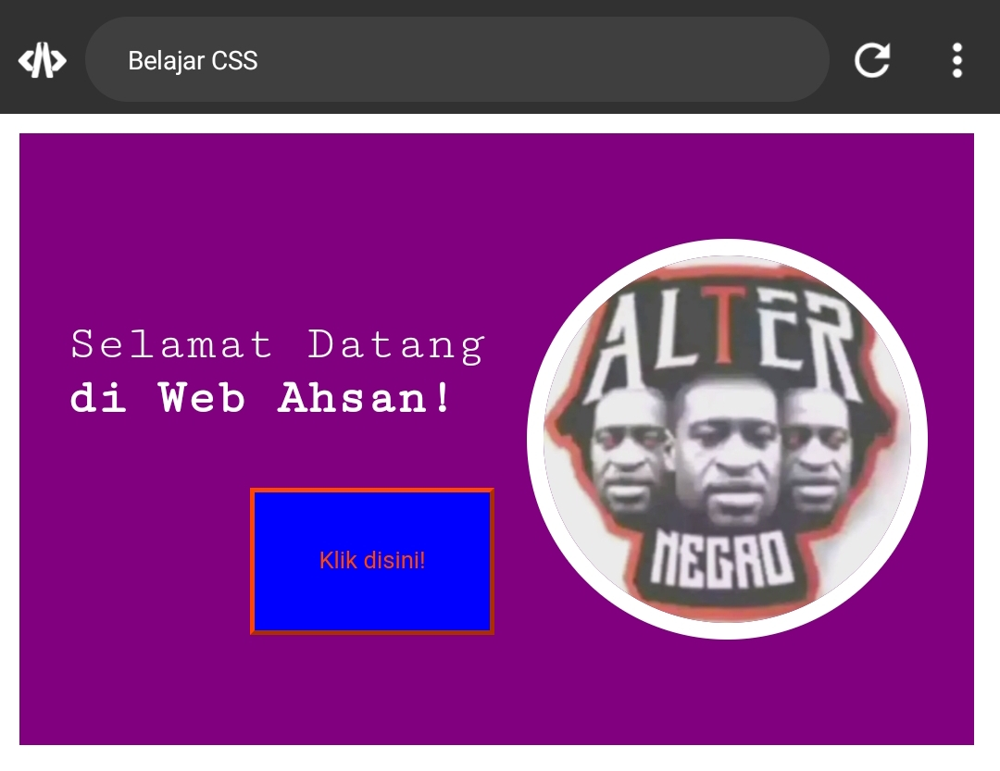
# Transform
## transform: scale
### Penjelasan
`Transform: scale` adalah properti CSS yang memungkinkan Anda untuk mengubah ukuran elemen HTML. Dengan menggunakan nilai yang diberikan, Anda dapat memperbesar atau memperkecil elemen tersebut secara proporsional terhadap ukuran aslinya.
### Kode Program
```html
<!DOCKTYPE html>
<html>
  <head>
    <title>latihan 2</title>
    <style>
      button {
        color: red;
        border-color: red;
        border-width: 3px;
        background-color: white;
        font-family: Arial;
        margin-top: 50px;
        margin-left: 50px;
        width: 100px;
        height: 30px;
        padding-left: 10px;
        padding-right: 10px;
        padding-top: 3px;
        padding-bottom: 3px;
        border-radius: 100px 100px;
        
      }

      button:active {
        transform: scale(0.75);
      }
    </style>
  </head>
  <body>
    <button>klik !</button>
  </body>
</html>
```
### Hasil
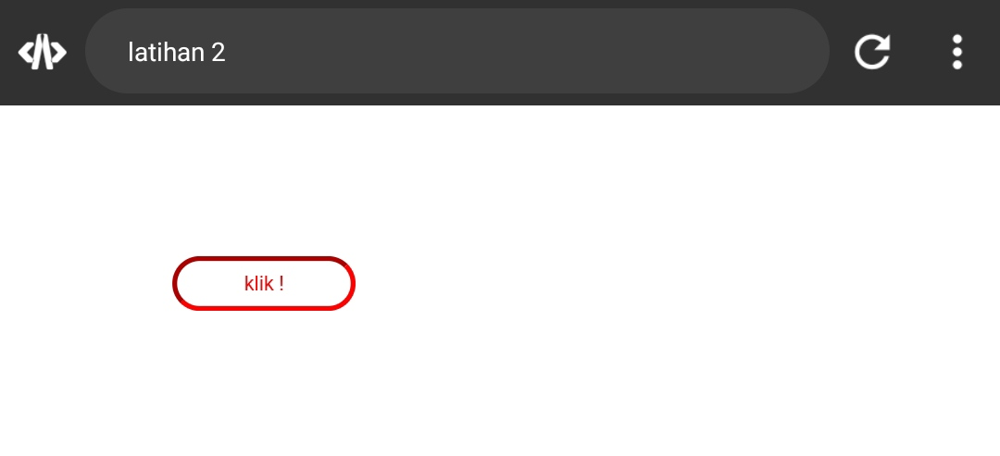
### Kesimpulan
`Transform: scale` adalah properti CSS yang memungkinkan Anda untuk memperbesar atau memperkecil elemen HTML secara proporsional terhadap ukuran aslinya menggunakan nilai tertentu.
## transform: scaleX
### Penjelasan
`transform: scaleX` adalah properti CSS yang digunakan untuk mengubah skala horizontal elemen secara proporsional. Nilai 1 menyatakan ukuran asli, nilai di atas 1 akan memperbesar elemen, dan nilai di bawah 1 akan menyusutkannya.
### Kode Program
```html
<!DOCKTYPE html>
<html>
  <head>
    <title>latihan 2</title>
    <style>
      button {
        color: red;
        border-color: red;
        border-width: 3px;
        background-color: white;
        font-family: Arial;
        margin-top: 50px;
        margin-left: 50px;
        width: 100px;
        height: 30px;
        padding-left: 10px;
        padding-right: 10px;
        padding-top: 3px;
        padding-bottom: 3px;
        border-radius: 100px 100px;
        
      }

      button:active {
        transform: scaleX(0.5);
      }
    </style>
  </head>
  <body>
    <button>klik !</button>
  </body>
</html>
```
### Hasil
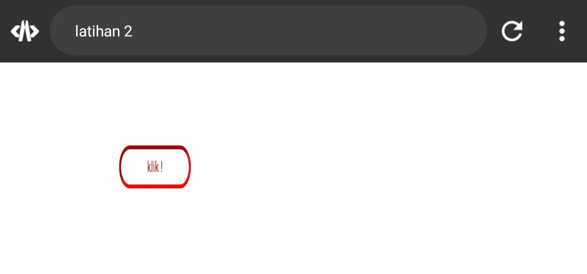
### Kesimpulan
`transform: scaleX` adalah properti CSS untuk mengubah skala horizontal elemen dengan nilai di atas 1 untuk memperbesar dan di bawah 1 untuk menyusutkan.
## transform: rotate
### Penjelasan
`transform: rotate` adalah properti CSS yang digunakan untuk memutar elemen HTML secara relatif terhadap titik tengahnya atau terhadap titik yang ditentukan. Nilai yang diberikan adalah sudut dalam satuan derajat (misalnya `rotate(45deg)` untuk memutar elemen sebesar 45 derajat searah jarum jam). Ini berguna untuk membuat animasi, efek visual, atau tata letak halaman web yang dinamis.
### Kode Program
```html
<!DOCKTYPE html>
<html>
  <head>
    <title>latihan 2</title>
    <style>
      button {
        color: red;
        border-color: red;
        border-width: 3px;
        background-color: white;
        font-family: Arial;
        margin-top: 50px;
        margin-left: 50px;
        width: 100px;
        height: 30px;
        padding-left: 10px;
        padding-right: 10px;
        padding-top: 3px;
        padding-bottom: 3px;
        border-radius: 100px 100px;
        
Ini      }

      button:active {
        transform: rotate(45deg)
      }
    </style>
  </head>
  <body>
    <button>klik !</button>
  </body>
</html>
```
### Hasil
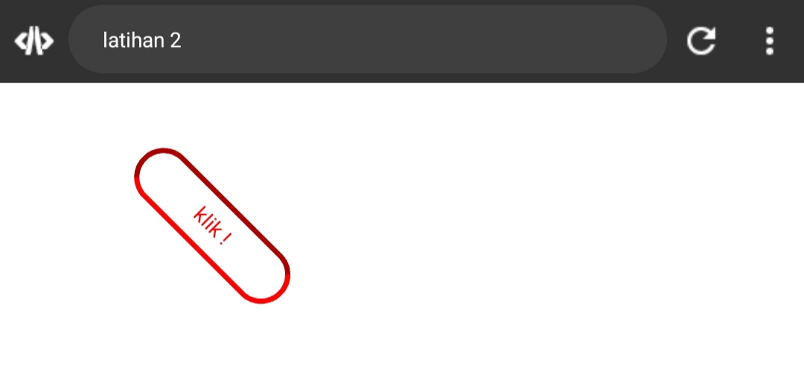
### Kesimpulan
`transform: rotate` adalah properti CSS untuk memutar elemen HTML dengan sudut tertentu searah atau berlawanan arah jarum jam, berguna untuk animasi dan efek visual.
## transform: skewX
### Penjelasan
`Transform: skewX` adalah salah satu properti CSS yang digunakan untuk memiringkan elemen sepanjang sumbu horizontal. Ini membuat elemen terlihat seolah-olah diputar di sekitar sumbu vertikal. Dengan menggunakan nilai derajat yang positif, elemen akan dimiringkan ke kanan, sedangkan nilai negatif akan membuatnya dimiringkan ke kiri.
### Kode Program
```html
<!DOCKTYPE html>
<html>
  <head>
    <title>latihan 2</title>
    <style>
      button {
        color: red;
        border-color: red;
        border-width: 3px;
        background-color: white;
        font-family: Arial;
        margin-top: 50px;
        margin-left: 50px;
        width: 100px;
        height: 30px;
        padding-left: 10px;
        padding-right: 10px;
        padding-top: 3px;
        padding-bottom: 3px;
        border-radius: 100px 100px;
        
      }

      button:active {
        transform: skewX(-25deg)
      }
    </style>
  </head>
  <body>
    <button>klik !</button>
  </body>
</html>
```
### Hasil
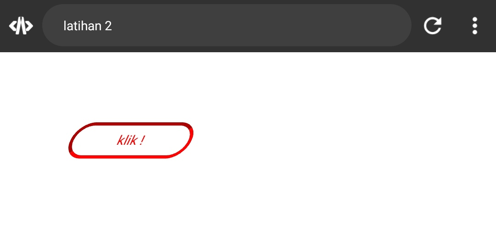
### Kesimpulan
`Transform skewX` adalah properti CSS yang digunakan untuk memiringkan elemen sepanjang sumbu horizontal, menciptakan efek seolah-olah elemen diputar di sekitar sumbu vertikal dengan nilai derajat yang positif membuatnya miring ke kanan dan nilai negatif membuatnya miring ke kiri.
## transform: skew
### Penjelasan
`Transformasi: skew` adalah jenis transformasi geometri dalam grafika komputer yang memiringkan objek sepanjang satu sumbu. Ini dapat dilakukan dalam dua dimensi (2D) atau tiga dimensi (3D), dan mengubah bentuk objek tanpa mengubah ukuran relatif antar objeknya.
### Kode Program
```html
<!DOCKTYPE html>
<html>
  <head>
    <title>latihan 2</title>
    <style>
      button {
        color: red;
        border-color: red;
        border-width: 3px;
        background-color: white;
        font-family: Arial;
        margin-top: 50px;
        margin-left: 50px;
        width: 100px;
        height: 30px;
        padding-left: 10px;
        padding-right: 10px;
        padding-top: 3px;
        padding-bottom: 3px;
        border-radius: 100px 100px;
        
      }

      button:active {
        transform: skew(20deg , 5deg)
      }
    </style>
  </head>
  <body>
    <button>klik !</button>
  </body>
</html>
```
### Hasil
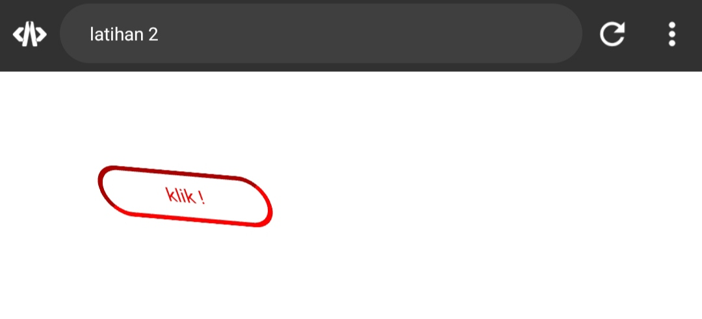
### Kesimpulan
`Transformasi: skew` adalah jenis transformasi geometri yang memiringkan objek sepanjang satu sumbu tanpa mengubah ukuran relatif antar objeknya, digunakan dalam grafika komputer untuk menciptakan efek perspektif dan manipulasi objek.
## transform: translate
### Penjelasan
`Transformasi: translate` adalah proses mengubah posisi suatu objek dalam ruang geometris tanpa mengubah bentuk atau ukurannya. Dalam transformasi ini, setiap titik pada objek digeser sejauh tertentu sesuai dengan vektor tertentu yang ditentukan. Ini sering digunakan dalam grafika komputer dan pemrosesan gambar untuk memindahkan objek dari satu lokasi ke lokasi lain.
### Kode Program
```html
<!DOCKTYPE html>
<html>
  <head>
    <title>latihan 2</title>
    <style>
      button {
        color: red;
        border-color: red;
        border-width: 3px;
        background-color: white;
        font-family: Arial;
        margin-top: 50px;
        margin-left: 50px;
        width: 100px;
        height: 30px;
        padding-left: 10px;
        padding-right: 10px;
        padding-top: 3px;
        padding-bottom: 3px;
        border-radius: 100px 100px;
        
      }

      button:active {
        transform: translate(5px , 12px);
      }
    </style>
  </head>
  <body>
    <button>klik !</button>
  </body>
</html>
```
### Hasil
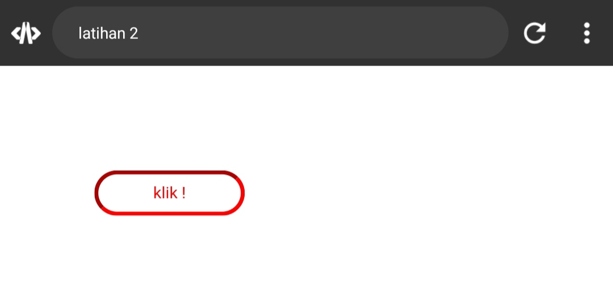
### Kesimpulan
`Transformasi: translate` adalah cara untuk menggeser posisi suatu objek dalam ruang geometris tanpa mengubah bentuk atau ukurannya.
## transform: matrix
### Penjelasan
`Transformasi: matriks` adalah teknik dalam grafika komputer yang digunakan untuk mentransformasikan objek dalam ruang 2D atau 3D. Ini melibatkan penggunaan matriks untuk mengubah posisi, rotasi, dan skala objek. 
### Kode Program
```html
<!DOCKTYPE html>
<html>
  <head>
    <title>latihan 2</title>
    <style>
      button {
        color: red;
        border-color: red;
        border-width: 3px;
        background-color: white;
        font-family: Arial;
        margin-top: 50px;
        margin-left: 50px;
        width: 100px;
        height: 30px;
        padding-left: 10px;
        padding-right: 10px;
        padding-top: 3px;
        padding-bottom: 3px;
        border-radius: 100px 100px;
        
      }

      button:active {
        transform: matrix(0.7, -0.5, 0.5, 0.4, 0.5, 0.7);
      }
    </style>
  </head>
  <body>
    <button>klik !</button>
  </body>
</html>
```
### Hasil
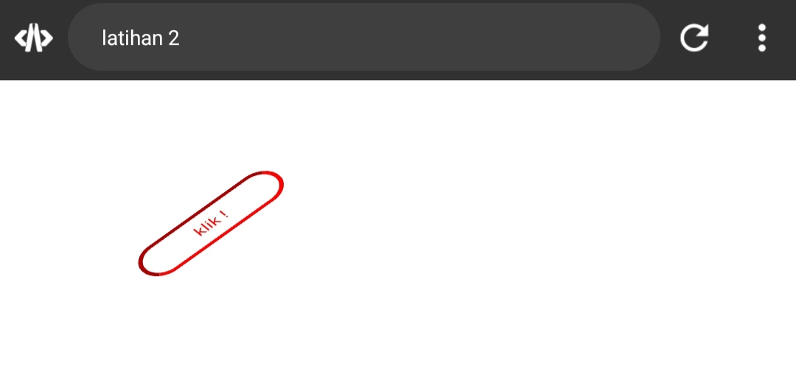
### Kesimpulan
`Transformasi: matriks` adalah teknik untuk mengubah posisi, rotasi, dan skala objek dalam grafika komputer menggunakan matriks. Ini memungkinkan manipulasi efisien objek dalam ruang 2D atau 3D.
# Flexbox
## Flexbox container
### Display Flex
#### Penjelasan
`display: flex;` adalah sebuah properti CSS yang digunakan untuk mengatur sebuah container agar anak-anak elemennya (child elements) menjadi flex items dan mengaktifkan model layout Flexbox. Ini memberikan kontrol yang sangat fleksibel dalam pengaturan tata letak elemen di dalam container, baik secara horizontal maupun vertikal.
#### Kode Program
```html
<!DOCKTYPE html>
<html>
  <head>
    <title>flexbox</title>
    <style>
      h3 {
        display: flex;
        background-color: blue;
      }
    </style>
  </head>
  <body>
    <h3>ini menggunakan display flex</h3>
  </body>
</html>
```
#### Hasil
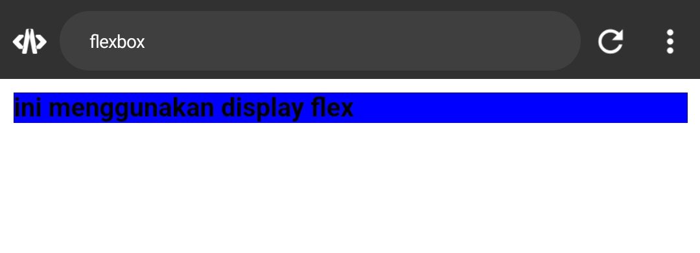
#### Kesimpulan
`display: flex;` mengaktifkan model layout Flexbox di sebuah container CSS, yang memungkinkan pengaturan tata letak yang fleksibel untuk elemen-elemen di dalamnya. 
### flex-direction
#### Penjelasan
`flex-direction` adalah sebuah properti dalam CSS yang digunakan untuk menentukan arah tata letak dari elemen-elemen dalam sebuah flex container. Nilai-nilai yang dapat digunakan antara lain:

1. `row`: Menata elemen-elemen secara horizontal, dari kiri ke kanan.
2. `row-reverse`: Menata elemen-elemen secara horizontal, dari kanan ke kiri.
3. `column`: Menata elemen-elemen secara vertikal, dari atas ke bawah.
4. `column-reverse`: Menata elemen-elemen secara vertikal, dari bawah ke atas.

Misalnya, jika Anda mengatur `flex-direction: row;`, maka elemen-elemen di dalam flex container akan ditata secara horizontal.
#### Kode Program
```html
<!DOCKTYPE html>
<html>
  <head>
    <title>flexbox</title>
    <style>
      .item {
        display: flex;
        flex-direction: column;
        background-color: aqua;
      }
    </style>
  </head>
  <body>
    <div class="item">
      <p>saya</p>
      <p>ahsan</p>
    </div>
  </body>
</html>
```
#### Hasil
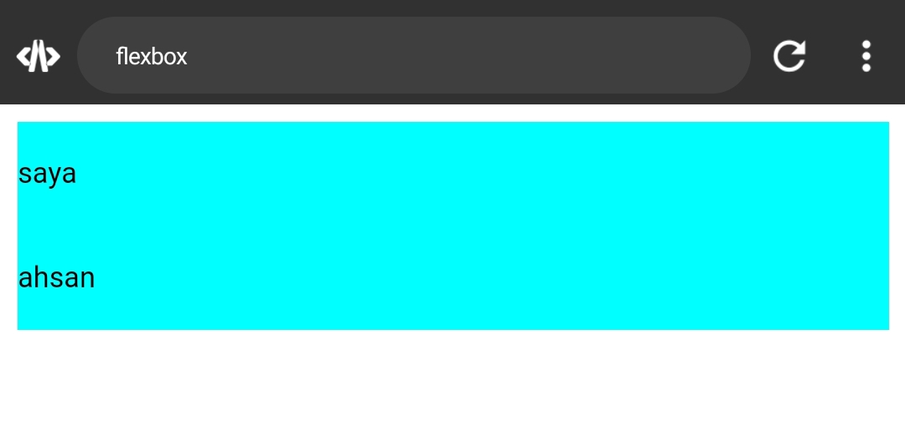
#### Kesimpulan
`flex-direction` adalah properti CSS yang menentukan arah tata letak elemen dalam sebuah flex container. Nilai-nilainya adalah `row`, `row-reverse`, `column`, dan `column-reverse`, yang masing-masing mengatur tata letak elemen secara horizontal dari kiri ke kanan, horizontal dari kanan ke kiri, vertikal dari atas ke bawah, dan vertikal dari bawah ke atas.
### align-items
#### Penjelasan
`align-items` adalah properti CSS yang digunakan dalam konteks flexbox. Properti ini mengontrol bagaimana item-flex (elemen di dalam kontainer flex) akan sejajar di sepanjang sumbu silang (cross-axis) dari kontainer flex.
Beberapa nilai umum untuk `align-items` adalah:
1. `stretch`: Item-flex akan meregang untuk mengisi seluruh ruang sumbu silang kontainer.
2. `flex-start`: Item-flex akan diletakkan di awal kontainer pada sumbu silang.
3. `flex-end`: Item-flex akan diletakkan di akhir kontainer pada sumbu silang.
4. `center`: Item-flex akan diletakkan di tengah kontainer pada sumbu silang.
5. `baseline`: Item-flex akan diletakkan pada garis dasar kontainer pada sumbu silang, yang mengacu pada basis teks dari setiap item.
#### Kode Program
```html
<!DOCKTYPE html>
<html>
  <head>
    <title>flexbox</title>
    <style>
      .item {
        display: flex;
        flex-direction: column;
        background-color: aqua;
        align-items: center;
      }
    </style>
  </head>
  <body>
    <div class="item">
      <p>saya</p>
      <p>ahsan</p>
    </div>
  </body>
</html>
```
#### Hasil
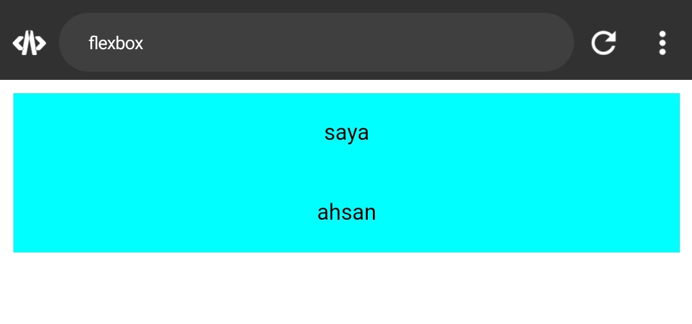
#### Kesimpulan
`align-items` adalah properti CSS dalam flexbox yang mengontrol penataan item-flex secara vertikal di dalam kontainer flex. Ini memungkinkan Anda untuk menyesuaikan posisi item-flex sepanjang sumbu silang, seperti meregangkannya untuk mengisi seluruh ruang atau menempatkannya di tengah, di awal, di akhir, atau pada garis dasar kontainer.
### justify-content
#### Penjelasan
Property `justify-content` digunakan dalam CSS Flexbox untuk mengatur cara konten dalam suatu kontainer sepanjang sumbu utama. Sumbu utama adalah arah utama dari kontainer flex, yang biasanya adalah horizontal (dari kiri ke kanan) untuk tata letak default, tetapi dapat diubah menggunakan `flex-direction`.
Nilai yang dapat digunakan untuk `justify-content` adalah:
1. `flex-start`: Konten diletakkan di awal kontainer.
2. `flex-end`: Konten diletakkan di akhir kontainer.
3. `center`: Konten diletakkan di tengah kontainer.
4. `space-between`: Konten didistribusikan secara merata di sepanjang sumbu utama; jarak antara dua konten berturut-turut adalah sama.
5. `space-around`: Konten didistribusikan secara merata di sepanjang sumbu utama dengan ruang yang sama di sekitar setiap konten.
#### Kode Program
```html
<!DOCKTYPE html>
<html>
  <head>
    <title>flexbox</title>
    <style>
      .container {
        display: flex;
        flex-direction: column;
        background-color: aqua;
        height: 250px;
        width: 500px;
        justify-content: center;
      }
      .item-1 {
        display: flex;
        background-color: red;
        width:100px;
        height: 100px;
        
      }
    </style>
  </head>
  <body>
    <div class="container">
      <div class="item-1"></div>
    </div>
  </body>
</html>
```
#### Hasil
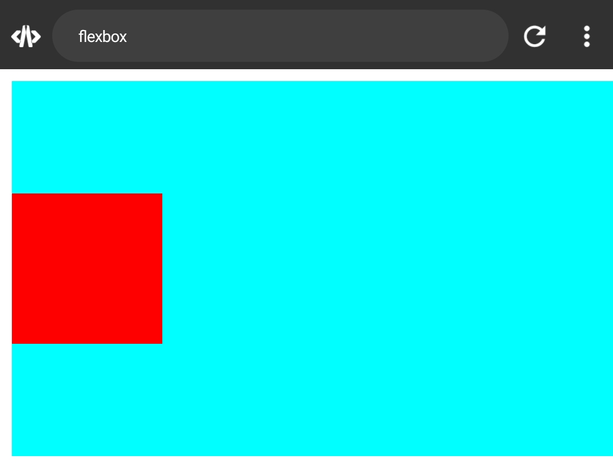
#### Kesimpulan
`justify-content` adalah properti CSS yang digunakan dalam Flexbox untuk mengatur cara konten dalam suatu kontainer sepanjang sumbu utama. Ini memungkinkan Anda untuk mengatur posisi relatif konten dalam kontainer flex, seperti memusatkan konten, menempatkannya di awal atau akhir kontainer, atau mendistribusikan secara merata dengan jarak yang sama di antara konten-konten tersebut.
## flexbox items
### Order
#### Penjelasan
Dalam CSS Flexbox, properti `order` digunakan untuk mengontrol urutan tampilan elemen-elemen di dalam flex container. Secara default, elemen-elemen dalam flex container akan diatur berdasarkan urutan mereka dalam kode HTML. Namun, dengan properti `order`, Anda dapat mengubah urutan tampilan elemen-elemen tersebut tanpa mengubah struktur HTML. Properti `order` digunakan untuk menentukan nilai urutan relatif dari sebuah elemen di dalam flex container. Nilai `order` secara default adalah 0. Nilai yang lebih rendah atau negatif akan menempatkan elemen tersebut lebih awal dalam urutan, sedangkan nilai yang lebih tinggi akan menempatkannya lebih akhir.
#### Kode
```html
<!DOCTYPE html>
<html>
<head>
<title>Order di Flexbox</title>
<style>
  .container {
    display: flex;
  }

  .item {
    width: 100px;
    height: 100px;
    margin: 10px;
    background-color: #ddd;
    display: flex;
    justify-content: center;
    align-items: center;
    font-size: 18px;
    font-weight: bold;
  }

  .item1 {
    order: 3;
  }

  .item2 {
    order: 1;
  }

  .item3 {
    order: 2;
  }
</style>
</head>
<body>
<div class="container">
  <div class="item item1">Item 1</div>
  <div class="item item2">Item 2</div>
  <div class="item item3">Item 3</div>
</div>
</body>
</html>
```
#### Hasil
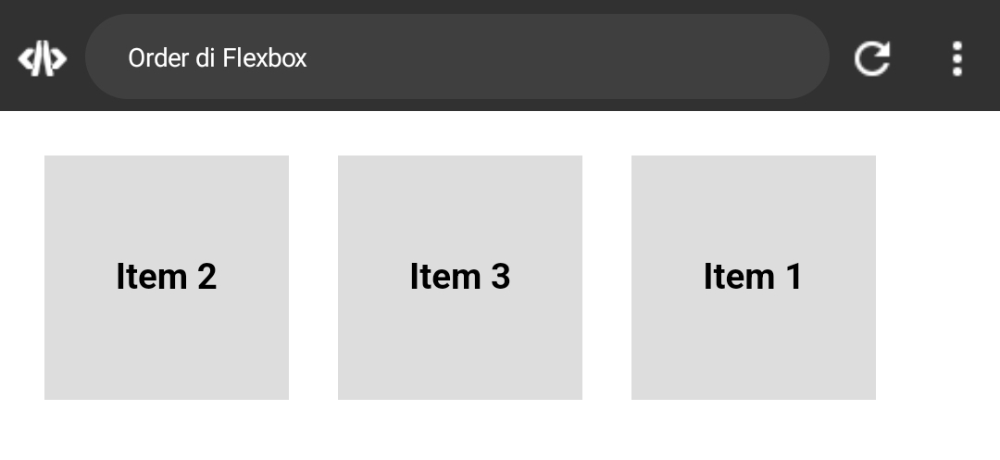
#### Kesimpulan
Properti `order` dalam CSS Flexbox digunakan untuk mengatur urutan tampilan elemen-elemen di dalam flex container. Nilai `order` menentukan urutan relatif elemen-elemen, di mana nilai yang lebih rendah atau negatif akan menempatkan elemen tersebut lebih awal dalam urutan, sedangkan nilai yang lebih tinggi akan menempatkannya lebih akhir. Properti `order` memungkinkan pengaturan urutan tampilan elemen tanpa mengubah struktur HTML, sehingga memberikan fleksibilitas dalam desain tata letak halaman web.
### flex-grow
#### Penjelasan
Properti `flex-grow` dalam CSS Flexbox digunakan untuk menentukan seberapa banyak ruang tambahan yang akan diberikan kepada sebuah item flex jika ada ruang yang tersisa di dalam flex container setelah item-item lain telah mendapatkan ukuran yang sesuai. Nilai `flex-grow` menentukan seberapa besar proporsi dari ruang tambahan tersebut akan dialokasikan kepada item tersebut. Secara default, nilai `flex-grow` adalah 0, yang berarti item tidak akan tumbuh untuk mengisi ruang tambahan. Ketika nilai `flex-grow` diberikan nilai selain 0, item tersebut akan memanfaatkan ruang tambahan sesuai dengan nilai `flex-grow`-nya. Nilai yang lebih tinggi akan memberikan item lebih banyak ruang tambahan untuk tumbuh dibandingkan dengan item lain yang memiliki nilai `flex-grow` lebih rendah.
#### Kode
```html
<!DOCTYPE html>
<html>
<head>
<title>flex-grow di Flexbox</title>
<style>
  .container {
    display: flex;
    width: 300px;
    height: 150px;
    background-color: lightgray;
  }

  .item {
    margin: 10px;
    background-color: #ddd;
    display: flex;
    justify-content: center;
    align-items: center;
    font-size: 18px;
    font-weight: bold;
  }

  .item1 {
    flex-grow: 1;
  }

  .item2 {
    flex-grow: 2;
  }

  .item3 {
    
  }
</style>
</head>
<body>
<div class="container">
  <div class="item item1">Item 1</div>
  <div class="item item2">Item 2</div>
  <div class="item item3">Item 3</div>
</div>
</body>
</html>

```
#### Hasil
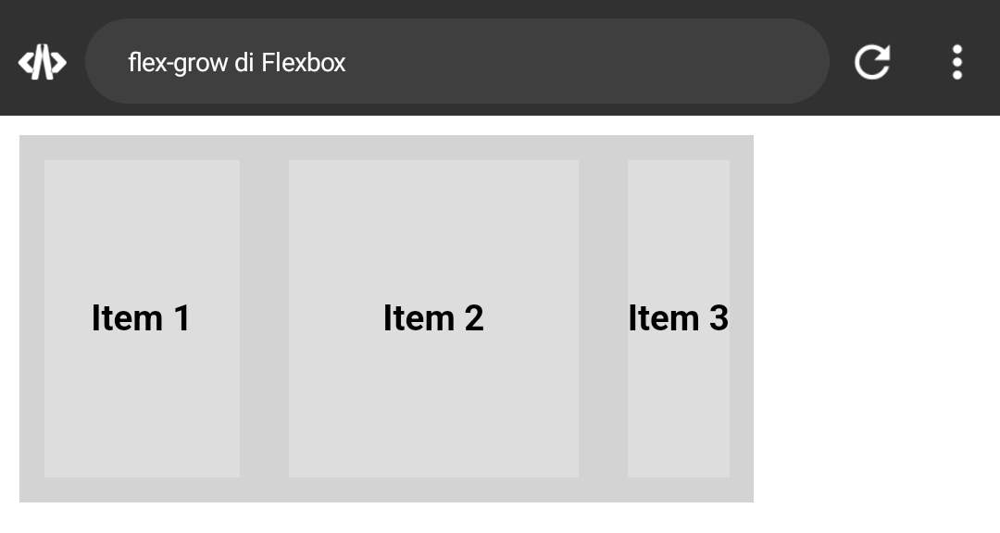
#### Kesimpulan
Properti `flex-grow` dalam CSS Flexbox digunakan untuk menentukan seberapa banyak ruang tambahan yang akan diberikan kepada sebuah item flex jika ada ruang yang tersisa di dalam flex container. Nilai `flex-grow` menentukan proporsi dari ruang tambahan yang akan dialokasikan kepada item tersebut, dengan nilai yang lebih tinggi memberikan item lebih banyak ruang tambahan untuk tumbuh dibandingkan dengan item lain yang memiliki nilai `flex-grow` lebih rendah atau default. Ini memungkinkan pengaturan fleksibilitas dalam tata letak item-item dalam flex container.
### flex-shrink
#### Penjelasan
Properti `flex-shrink` dalam CSS Flexbox digunakan untuk menentukan seberapa besar sebuah item flex dapat mengecil jika ruang kontainer kurang dari total ukuran elemen-elemen di dalamnya. Properti ini memungkinkan kontrol terhadap tingkat pengecilan item ketika ruang tersedia tidak cukup untuk menampung semua item secara keseluruhan. Nilai `flex-shrink` menentukan faktor pengecilan relatif dari sebuah item jika ruang kontainer tidak mencukupi. Nilai default adalah 1, yang berarti item akan mengecil sesuai dengan proporsinya jika ruang tidak mencukupi. Nilai yang lebih tinggi akan memberikan item lebih sedikit ruang untuk mengecil, sementara nilai yang lebih rendah akan memberikan item lebih banyak ruang untuk mengecil.
#### Kode
```html
<!DOCTYPE html>
<html>
<head>
<title>flex-shrink di Flexbox</title>
<style>
  .container {
    display: flex;
    width: 300px;
    height: 150px;
    background-color: lightgray;
  }

  .item {
    margin: 10px;
    background-color: #ddd;
    display: flex;
    justify-content: center;
    align-items: center;
    font-size: 18px;
    font-weight: bold;
  }

  .item1 {
    flex-shrink: 1;
  }

  .item2 {
    flex-shrink: 0;
  }

  .item3 {
    flex-shrink: 2;
  }
</style>
</head>
<body>
<div class="container">
  <div class="item item1">Item 1</div>
  <div class="item item2">Item 2</div>
  <div class="item item3">Item 3</div>
</div>
</body>
</html>

```
#### Hasil
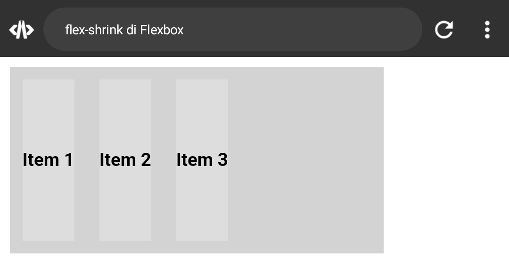
#### Kesimpulan
Properti `flex-shrink` dalam CSS Flexbox digunakan untuk mengatur seberapa besar sebuah item dapat mengecil jika ruang kontainer tidak mencukupi untuk menampung semua item secara keseluruhan. Nilai `flex-shrink` menentukan faktor pengecilan relatif dari sebuah item, dengan nilai default adalah 1. Nilai yang lebih tinggi akan membuat item lebih sedikit mengecil, sementara nilai yang lebih rendah akan membuat item lebih banyak mengecil jika ruang tidak mencukupi. Properti ini memberikan fleksibilitas dalam mengatur responsivitas tata letak item di dalam flex container.
### flex-basis
#### Penjelasan
Properti `flex-basis` dalam CSS Flexbox digunakan untuk menentukan ukuran awal (basis) dari sebuah item flex sebelum item tersebut diperbesar atau diperkecil oleh `flex-grow` atau `flex-shrink`. Properti ini menentukan lebar atau tinggi awal item flex sebelum proporsi ruang tambahan atau kurang diterapkan. Nilai `flex-basis` dapat ditentukan dalam satuan ukuran seperti piksel, persentase, atau nilai absolut lainnya, atau dalam nilai relatif seperti `auto` atau `content`. Nilai default adalah `auto`, yang mengizinkan item untuk menyesuaikan ukurannya berdasarkan konten di dalamnya.
#### Kode
```html
<!DOCTYPE html>
<html>
<head>
<title>flex-basis di Flexbox</title>
<style>
  .container {
    display: flex;
    width: 300px;
    height: 150px;
    background-color: lightgray;
  }

  .item {
    margin: 10px;
    background-color: #ddd;
    display: flex;
    justify-content: center;
    align-items: center;
    font-size: 18px;
    font-weight: bold;
  }

  .item1 {
    flex-basis: 100px; 
  }

  .item2 {
    flex-basis: 50%; 
  }

  .item3 {
    flex-basis: auto;
  }
</style>
</head>
<body>
<div class="container">
  <div class="item item1">Item 1</div>
  <div class="item item2">Item 2</div>
  <div class="item item3">Item 3</div>
</div>
</body>
</html>

```
#### Hasil
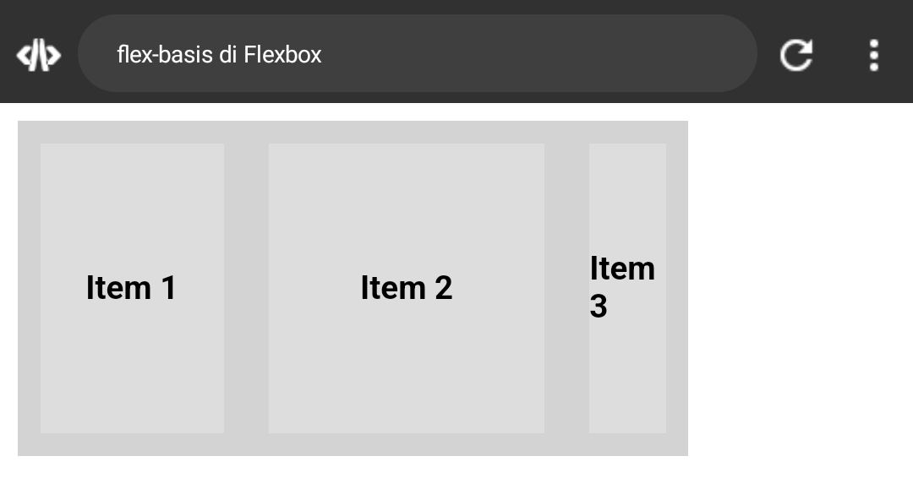
#### Kesimpulan
Properti `flex-basis` dalam CSS Flexbox digunakan untuk menentukan ukuran awal (basis) dari sebuah item flex sebelum item tersebut diperbesar atau diperkecil oleh `flex-grow` atau `flex-shrink`. Properti ini menentukan lebar atau tinggi awal item flex sebelum proporsi ruang tambahan atau kurang diterapkan. Nilai `flex-basis` dapat ditentukan dalam satuan ukuran seperti piksel, persentase, atau nilai absolut lainnya, atau dalam nilai relatif seperti `auto` atau `content`. Properti ini memberikan kontrol atas ukuran awal item flex sebelum dilakukan penyesuaian oleh flex container.
### align-self
#### Penjelasan
Properti `align-self` dalam CSS Flexbox digunakan untuk mengontrol penempatan vertikal (alignment) dari sebuah item flex dalam sumbu lintang (cross-axis) terhadap flex container, menggantikan nilai alignment yang didefinisikan oleh properti `align-items` pada container tersebut. Properti ini memberikan kontrol individual terhadap alignment sebuah item, yang berarti Anda dapat menyesuaikan alignment sebuah item tanpa memengaruhi alignment item lainnya dalam container. Nilai dari `align-self` dapat berupa salah satu dari nilai alignment vertikal seperti `flex-start`, `flex-end`, `center`, `baseline`, atau `stretch`. Nilai defaultnya adalah `auto`, yang akan mewarisi nilai alignment dari container sesuai dengan nilai properti `align-items` di container tersebut.
#### Kode
```html
<!DOCTYPE html>
<html>
<head>

<title>align-self di Flexbox</title>
<style>
  .container {
    display: flex;
    width: 300px;
    height: 200px;
    background-color: lightgray;
    align-items: center; 
  }

  .item {
    margin: 10px;
    background-color: #ddd;
    display: flex;
    justify-content: center;
    align-items: center;
    font-size: 18px;
    font-weight: bold;
  }

  .item1 {
    align-self: flex-start; 
  }

  .item2 {
    align-self: center; 
  }

  .item3 {
    align-self: flex-end; 
  }
</style>
</head>
<body>
<div class="container">
  <div class="item item1">Item 1</div>
  <div class="item item2">Item 2</div>
  <div class="item item3">Item 3</div>
</div>
</body>
</html>

```
#### Hasil
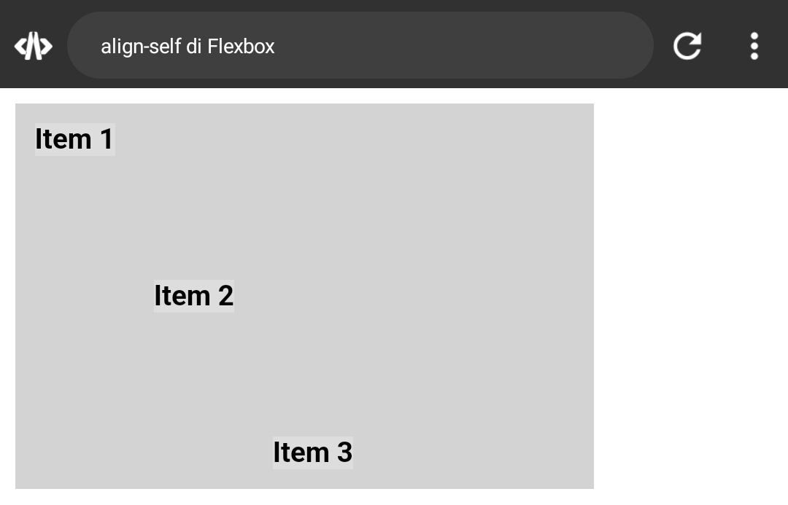
#### Kesimpulan
Properti `align-self` dalam CSS Flexbox digunakan untuk mengontrol penempatan vertikal (alignment) dari sebuah item flex dalam sumbu lintang (cross-axis) terhadap flex container. Properti ini memberikan kontrol individual terhadap alignment sebuah item, yang memungkinkan Anda untuk menyesuaikan alignment sebuah item tanpa memengaruhi alignment item lainnya dalam container. Nilai dari `align-self` dapat berupa salah satu dari nilai alignment vertikal seperti `flex-start`, `flex-end`, `center`, `baseline`, atau `stretch`. Properti ini memberikan fleksibilitas dalam mengatur penempatan vertikal item-item dalam flex container secara individual.
### flex
#### Penjelasan
Mungkin Anda ingin menjelaskan tentang properti `flex` di Flexbox. Properti `flex` adalah singkatan dari tiga properti utama dalam CSS Flexbox: `flex-grow`, `flex-shrink`, dan `flex-basis`. Ini memberikan cara singkat untuk mengatur ukuran, pertumbuhan, dan pengecilan item flex dalam flex container. Gabungan ketiga properti ini dalam satu aturan `flex` memungkinkan Anda untuk mengatur ukuran item flex secara lebih fleksibel dan efisien. Misalnya:

```css
.item {
  flex: 1 0 100px; /* flex-grow: 1; flex-shrink: 0; flex-basis: 100px; */
}
```

Dalam contoh ini, item flex akan memiliki `flex-grow: 1`, yang berarti akan memanfaatkan semua ruang tambahan yang tersedia, tetapi tidak akan mengecil; `flex-shrink: 0`, yang berarti item tidak akan mengecil saat ruang kurang; dan `flex-basis: 100px`, yang menentukan ukuran awal item sebelum tata letak flexbox diterapkan.
#### Kode
```html
<!DOCTYPE html>
<html>
<head>
<title>flex di Flexbox</title>
<style>
  .container {
    display: flex;
    width: 400px;
    height: 200px;
    background-color: lightgray;
  }

  .item {
    margin: 10px;
    background-color: #ddd;
    display: flex;
    justify-content: center;
    align-items: center;
    font-size: 18px;
    font-weight: bold;
  }

  .item1 {
    flex: 1 0 100px; 
  }

  .item2 {
    flex: 2 0 150px; 
  }

  .item3 {
    flex: 1 0 120px; 
  }
</style>
</head>
<body>
<div class="container">
  <div class="item item1">Item 1</div>
  <div class="item item2">Item 2</div>
  <div class="item item3">Item 3</div>
</div>
</body>
</html>

```
#### Hasil
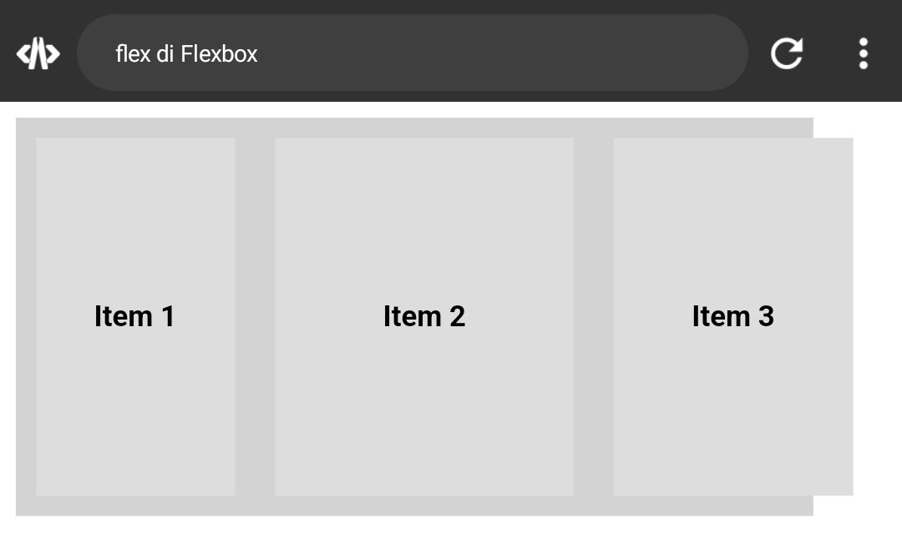
#### Kesimpulan
Properti `flex` dalam CSS Flexbox merupakan singkatan dari tiga properti utama: `flex-grow`, `flex-shrink`, dan `flex-basis`. Ini memberikan cara singkat untuk mengatur ukuran, pertumbuhan, dan pengecilan item flex dalam flex container. Dengan menggunakan properti `flex`, Anda dapat dengan mudah mengatur item-item flex dengan satu aturan CSS, meningkatkan fleksibilitas dan efisiensi dalam tata letak halaman web.
## Tantangan flexbox
### Deskripsi
- Terdapat sebuah kontainer dengan kelas `.box-container`, yang memiliki tinggi 250px dan lebar 390px, dengan latar belakang warna ungu.
- Di dalam `.box-container`, terdapat sebuah kontainer lagi dengan kelas `.main-container`, yang memiliki tinggi 220px dan lebar 360px. Kontainer ini juga memiliki latar belakang transparan.
- `.main-container` memiliki dua elemen anak:
  - Elemen pertama, `.hero-container`, memiliki tinggi 200px dan lebar 180px. Elemen ini berisi sebuah paragraf dengan teks "Selamat Datang di Web Ahsan!" yang ditampilkan dengan font Courier, ukuran 25px, dan warna putih.
  - Elemen kedua, sebuah tombol dengan kelas `.box-item-3`, berisi teks "Klik disini!" yang memiliki warna dan border oranye. Ketika tombol tersebut dihover, ukurannya akan berubah dan tombol akan berputar 360 derajat.
- Di dalam `.main-container`, terdapat juga sebuah gambar dengan kelas `.box-item-1`. Gambar tersebut memiliki latar belakang merah dengan border putih dan border radius lingkaran. Ukurannya adalah 150px x 150px.
- Pengaturan flexbox digunakan untuk menata letak elemen-elemen tersebut secara fleksibel dan responsif, dengan menggunakan properti seperti `display`, `flex-direction`, `align-items`, dan `justify-content`.
### Kode program 
```html
<!DOCKTYPE html>
<html>
  <head>
    <title>Belajar CSS FLEXBOX</title>
    <style>
      .box-container {
        height: 250px;
        width: 390px;
        background-color:purple;
        display: flex;
        flex-direction: row;
        align-items: center;
        justify-content: space-around;
        
      }
      .main-container{
        height: 220px;
        width: 360px;
        background-color:transparent;
        display: flex;
        flex-direction: row;
        align-items: center;
        justify-content: space-around;
      }
      .hero-contaoner{
        height: 200px;
        width: 180px;
        background-color:transparent;
        display: flex;
        flex-direction: column;
        align-items: center;
        justify-content: space-around;
      }
      .box-item-1 {
        background-color: red;
        height: 105px;
        border-radius: 100% 100%;
        border-width:7px ;
        border-style: solid;
        border-color: white;
        height: 150px;
        width: 150px;
      }
      .box-item-2 {
        background-color: transparent;
        font-family: courier;
        font-size: 25px;
        color: white;
        width: 180px;
        height: 75px;
        margin-top: 50px;
      }
      .box-item-3 {
      width: 90px;
      height: 45px;
      background-color: transparent;
      color: orangered;
      font-size: 12px;
      border-color: orangered;
      margin-left: 70px;
      margin-bottom: 20px;
      }
      .box-item-3:hover {
        transform: rotate(360deg);
        background-color: transparent;
        height: 205px;
        width: 100px;
        cursor: pointer;
        transition: all 0.4s ease-in-out;
      }
    </style>
  </head>
  
  <body>
    <div class="box-container">
      <div class="main-container">
        <div class="hero-contaoner">
          <p class="item box-item-2">Selamat Datang<br><b>di Web Ahsan!</b></p>
          <button class="item box-item-3">Klik disini!</button>
        </div>
      
      </div>
    </div>
  </body>
</html>
```
### Hasil
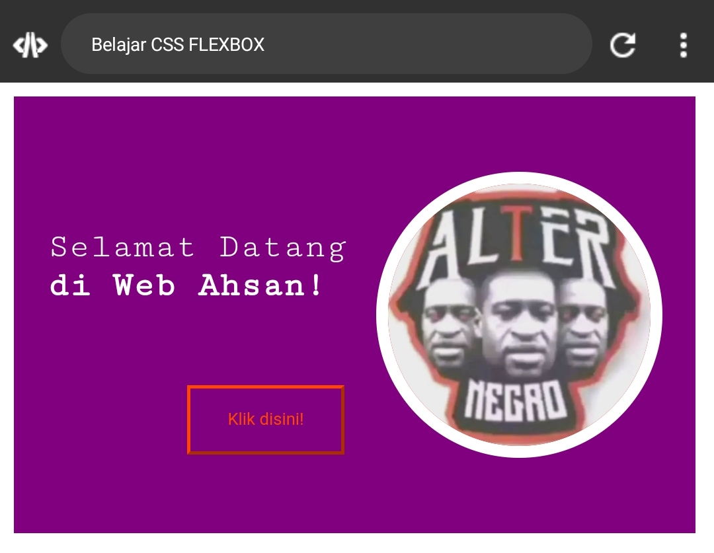


# Position
## Position Relative
### Penjelasan
`position: relative;` adalah salah satu nilai dari property CSS `position`. Ketika Anda mengatur sebuah elemen dengan `position: relative;`, itu akan tetap berada dalam aliran dokumen, tetapi posisinya dapat diatur secara relatif terhadap posisi aslinya di dalam tata letak normal. Ketika Anda memberikan sebuah elemen `position: relative;`, Anda dapat menggunakan properti `top`, `right`, `bottom`, dan `left` untuk menggeser elemen tersebut dari posisi aslinya. Perubahan posisi ini tidak akan memengaruhi posisi elemen-elemen lain di halaman.
### Kode Program
```html
<!DOCKTYPE html>
<html>
  <head>
    <title>tentang position</title>
    <style>
      .container {
        display: flex;
        flex-direction: row;
        background-color: black;
        height: 200px;
        width: 350px;
      }
      .item-1 {
        display: flex;
        background-color: green;
        width:80px;
        height: 80px;
        position: relative;
        top: 70px;
      }
      .item-2 {
        display: flex;
        background-color: red;
        width:80px;
        height: 80px;
      }
    </style>
  </head>
  <body>
    <div class="container">
      <div class="item-1"><p>1</p></div>
      <div class="item-2"><p>2</p></div>
      
    </div>
  </body>
</html>
```
### Hasil
Before
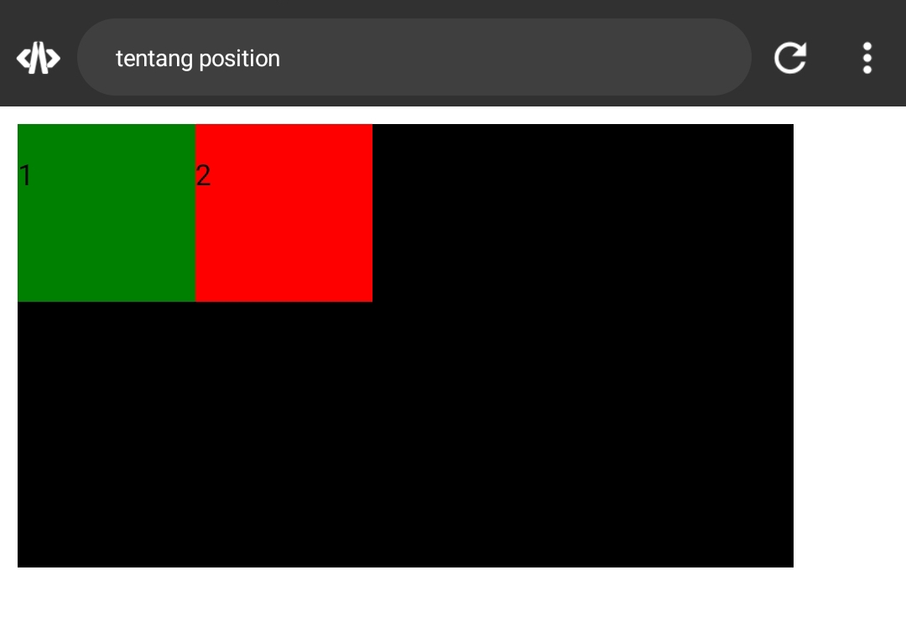

After
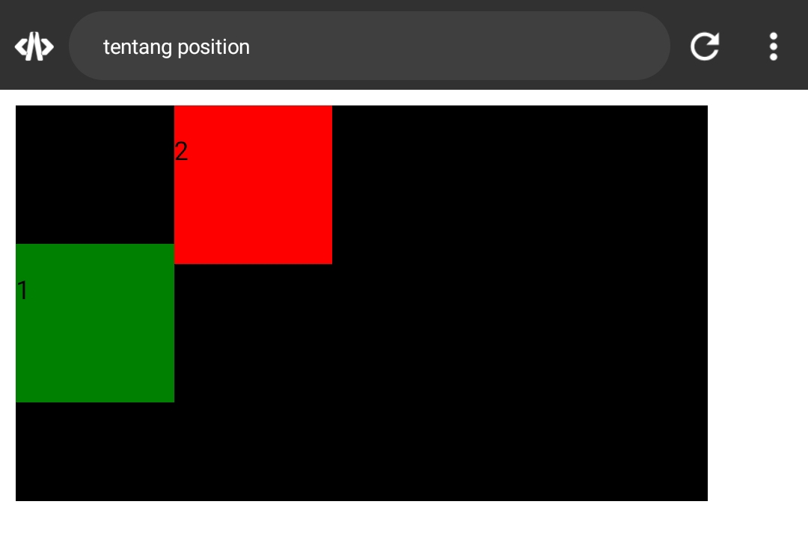
### Kesimpulan
`position: relative;` adalah properti CSS yang mengatur posisi sebuah elemen secara relatif terhadap posisi aslinya di dalam tata letak normal. Ini memungkinkan Anda untuk menggeser elemen secara relatif menggunakan properti `top`, `right`, `bottom`, dan `left`, tanpa memengaruhi posisi elemen-elemen lain di halaman.
## Position Absolute
### Penjelasan
`position: absolute;` adalah salah satu nilai dari property CSS `position`. Ketika Anda mengatur sebuah elemen dengan `position: absolute;`, itu akan dihapus dari aliran dokumen normal dan ditempatkan relatif terhadap elemen induk yang paling dekat yang memiliki properti `position` yang tidak bernilai `static` (yaitu, `relative`, `absolute`, `fixed`, atau `sticky`). Elemen yang memiliki `position: absolute;` tidak lagi memengaruhi posisi elemen-elemen lain di dalam dokumen, dan posisinya dapat diatur secara bebas menggunakan properti `top`, `right`, `bottom`, dan `left`. Hal ini memungkinkan Anda untuk menempatkan elemen di mana saja di dalam dokumen, terlepas dari posisi relatif elemen-elemen lainnya.
### Kode Program
```html
<!DOCKTYPE html>
<html>
  <head>
    <title>tentang position</title>
    <style>
      .container {
        display: flex;
        flex-direction: row;
        background-color: black;
        height: 200px;
        width: 350px;
      }
      .item-1 {
        display: flex;
        background-color: green;
        width:80px;
        height: 80px;
        position: absolute;
        top: 70px;
      }
      .item-2 {
        display: flex;
        background-color: red;
        width:80px;
        height: 80px;
      }
    </style>
  </head>
  <body>
    <div class="container">
      <div class="item-1"><p>1</p></div>
      <div class="item-2"><p>2</p></div>
      
    </div>
  </body>
</html>
```
### Hasil
Before


After
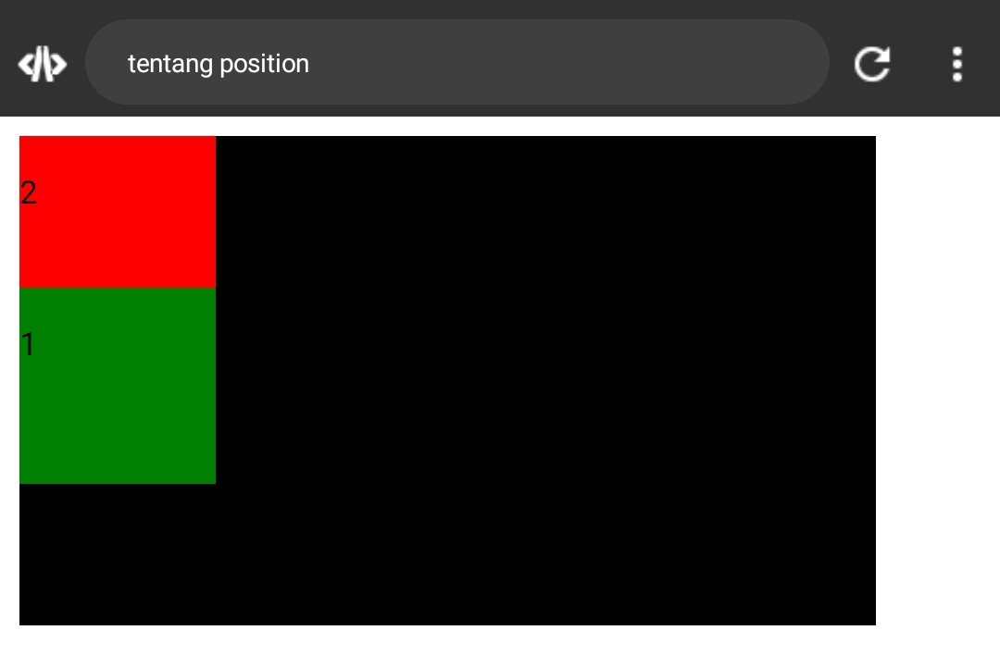
### Kesimpulan
`position: absolute;` adalah properti CSS yang menghapus sebuah elemen dari aliran dokumen normal dan menempatkannya relatif terhadap elemen induk yang memiliki properti `position` yang tidak bernilai `static`. Ini memungkinkan Anda untuk menempatkan elemen di mana saja di dalam dokumen, terlepas dari posisi relatif elemen-elemen lainnya, menggunakan properti `top`, `right`, `bottom`, dan `left`.
## Position Fixed
### Penjelasan
`position: fixed;` adalah salah satu nilai dari property CSS `position`. Ketika Anda mengatur sebuah elemen dengan `position: fixed;`, itu akan dihapus dari aliran dokumen normal dan ditempatkan relatif terhadap viewport browser. Ini berarti elemen akan tetap berada di posisi yang sama di layar bahkan saat Anda menggulir halaman. Elemen yang memiliki `position: fixed;` tidak lagi memengaruhi posisi elemen-elemen lain di dalam dokumen, dan posisinya dapat diatur secara bebas menggunakan properti `top`, `right`, `bottom`, dan `left`.
### Kode Program
```html
<!DOCKTYPE html>
<html>
  <head>
    <title>tentang position</title>
    <style>
      .container {
        display: flex;
        flex-direction: row;
        background-color: black;
        height: 200px;
        width: 350px;
      }
      .item-1 {
        display: flex;
        background-color: green;
        width:80px;
        height: 80px;
        position: fixed;
        top: 70px;
      }
      .item-2 {
        display: flex;
        background-color: red;
        width:80px;
        height: 80px;
      }
    </style>
  </head>
  <body>
    <div class="container">
      <div class="item-1"><p>1</p></div>
      <div class="item-2"><p>2</p></div>
      
    </div>
  </body>
</html>
```
### Analisis
Before


After
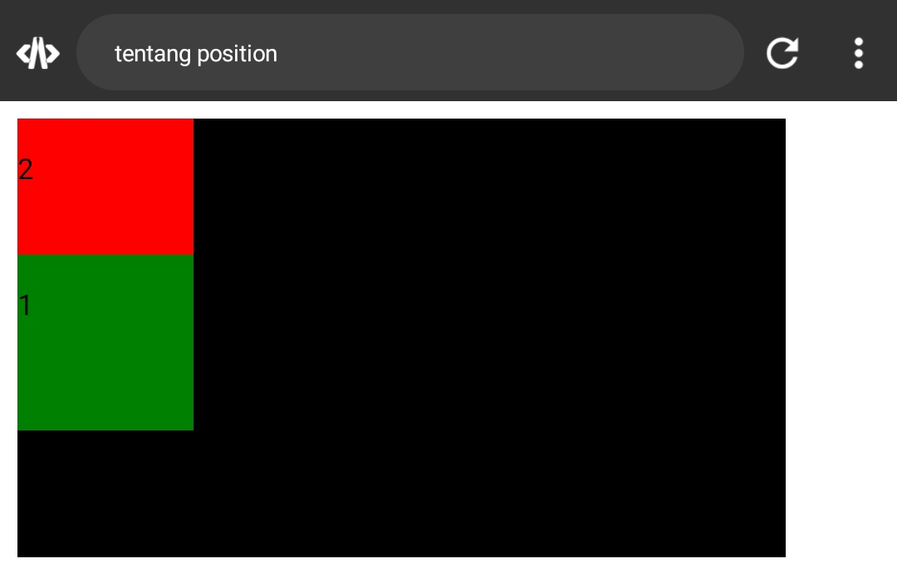
### Kesimpulan
`position: fixed;` adalah properti CSS yang menghapus sebuah elemen dari aliran dokumen normal dan menempatkannya relatif terhadap viewport browser. Ini membuat elemen tetap berada di posisi yang sama di layar bahkan saat pengguna menggulir halaman, dan posisinya dapat diatur menggunakan properti `top`, `right`, `bottom`, dan `left`.
##Position sticky
### Penjelasan
`position: sticky;` adalah salah satu nilai dari property CSS `position`. Ini memungkinkan elemen untuk menempel pada posisi tertentu di dalam kontainer saat pengguna menggulir, dan kemudian berhenti menempel ketika mencapai batas tertentu dalam kontainer. Elemen dengan `position: sticky;` akan berperilaku seperti `position: relative;` sampai titik scroll mencapai batas yang ditentukan (biasanya didefinisikan menggunakan properti `top`, `right`, `bottom`, atau `left`). Setelah mencapai batas tersebut, elemen akan tetap berada pada posisi yang telah ditentukan, terlihat seperti menempel di layar.
### Kode Program
```html
<!DOCKTYPE html>
<html>
  <head>
    <title>tentang position</title>
    <style>
      .container {
        display: flex;
        flex-direction: row;
        background-color: black;
        height: 200px;
        width: 350px;
      }
      .item-1 {
        display: flex;
        background-color: green;
        width:80px;
        height: 80px;
        position: sticky;
        top: 1000px;
      }
      .item-2 {
        display: flex;
        background-color: red;
        width:80px;
        height: 80px;
      }
    </style>
  </head>
  <body>
    <div class="container">
      <div class="item-1"><p>1</p></div>
      <div class="item-2"><p>2</p></div>
      
    </div>
  </body>
</html>
```
### Hasil
Before


After
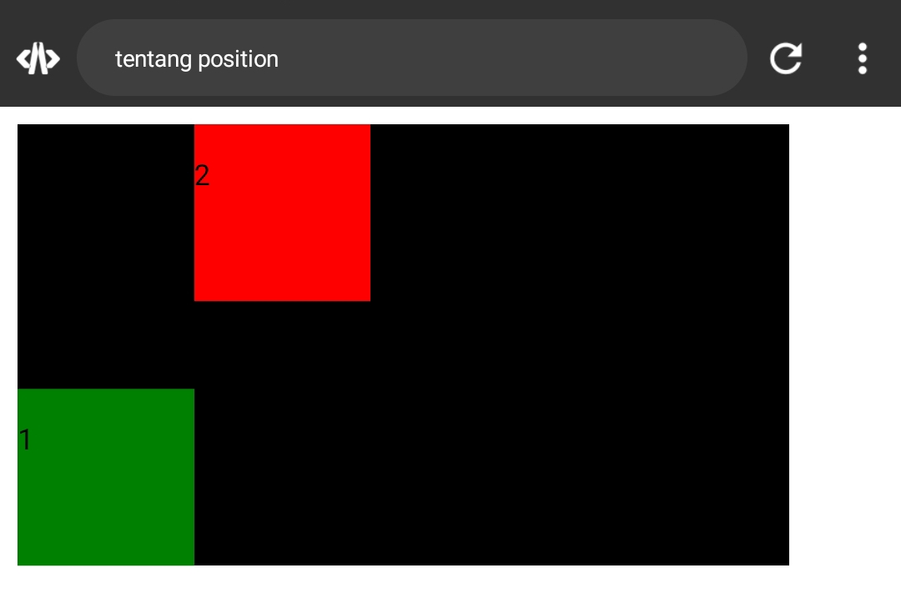
### Kesimpulan
`position: sticky;` adalah properti CSS yang memungkinkan elemen untuk menempel pada posisi tertentu di dalam kontainer saat pengguna menggulir, dan kemudian berhenti menempel ketika mencapai batas tertentu dalam kontainer. Ini berguna untuk membuat elemen tertentu seperti header atau sidebar tetap terlihat saat pengguna menggulir konten di dalam sebuah kontainer.
## Tantangan Position
### Deskripsi
- Terdapat sebuah div dengan kelas `.container` yang mengelompokkan seluruh konten.
- Di dalam `.container`, terdapat tiga elemen utama:
  1. `.item1`: Elemen ini berisi gambar dengan latar belakang merah dan ukuran 300px x 250px. Gambar tersebut diberi border-radius pada sudut atas.
  2. `.item2`: Elemen ini berisi teks yang ditampilkan di tengah-tengah dengan menggunakan justify-content dan align-items center.
  3. `.item3`: Elemen ini merupakan baris horizontal dengan tulisan "Read more" di kiri dan sebuah gambar di kanan. 
- Terdapat juga sebuah tombol yang diberi kelas `.like`, dimana ketika tombol tersebut dihover, ukurannya akan mengecil (scale down) menjadi 75% dari ukuran aslinya.
- Semua elemen tersebut ditata menggunakan CSS position absolute dengan koordinat yang sudah ditentukan untuk posisi relatif terhadap elemen induknya. Misalnya, tombol diberi posisi absolut di bagian kanan atas menggunakan properti top dan right.
### Kode
```html
<!DOCTYPE html>
<html>
<head>
    <title>Tantangan Position</title>
    <style>
        body{
            background-color: blue;
        }
        .container {
            display: flex;
            flex-direction: column;
            background-color: white;
            height: 458px;
            width: 300px;
            border-radius: 10px;
            margin-top: 150px;
            margin-left: 550px;
        }
        .item1{
            background-color: red;
            height: 250px;
            width: 300px;
            border-radius: 10px 10px 0px 0px;
        }
        img {
            width:100%;
            height:100%;
            border-radius: 5px 5px 0px 0px;
        }
        .item2{
            background-color: whitesmoke;
            height: 175px;
            width: 300px;
            justify-content: center;
            align-items: center;
            
        }
        .text1 {
            font-size: small;
            font-family: Arial, Helvetica, sans-serif;
            margin-left: 20px;
        }
        .text2 {
            font-size: 20px;
            font-family: Arial, Helvetica, sans-serif;
            margin-left: 20px;
        }
        .text3 {
            margin-left: 20px;
            font-family: Arial, Helvetica, sans-serif;
            font-size: medium;
        }   
        .item3 {
            display: flex;
            flex-direction: row;
            padding: 2px;
            background-color: bisque;
            border-radius: 0px 0px 5px 5px;
            width: 296px;
            justify-content: space-between;
        }
        .text4 {
            margin-left: 20px;
            font-family: Arial, Helvetica, sans-serif;
        }
        button {
            width: 62px;
            height: 55px;
            background-color: transparent;
            border: none;
            border-radius: 100px 100px 100px 100px;
            position: absolute;
            top: 360px;
            right: 800px;
        }
        .like img {
            border-radius: 100% ;
            
        }
        .item3 img {
            height: 30px;
            width: 30px;
            border-radius: 100% 100% ;
            align-items: center;
            justify-items: center;
            margin-right: 25px;
            margin-top: 10px;
        }
        button:hover {
          transform: scale(0.75);
        }
    </style>
</head>
<body>
    <div class="container">
        <div class="item1">
            
        </div>
        <div class="item2">
            <p class="text1">Thursday,July 16, 2015</p>
            <h4 class="text2">Lorem ipsum dolor sit amet consectetur.</h4>
            <p class="text3">Lorem ipsum dolor sit amet the,  consectetur adipisicing.</p>
        </div>
        <div class="item3">
            <p class="text4">Read more</p>
            
        </div>
          <div class="like">
              <button>
              
            </button>
        </div>
    </div>
</body>
</html>
```
### Hasil
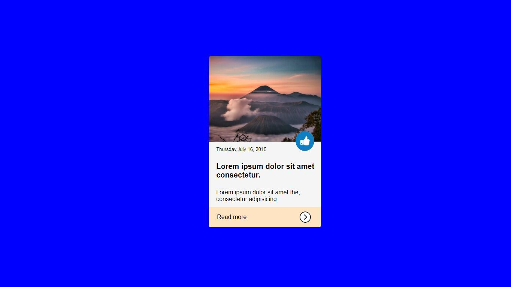