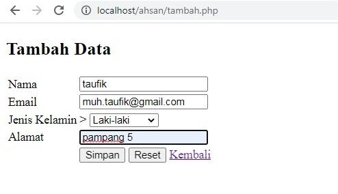
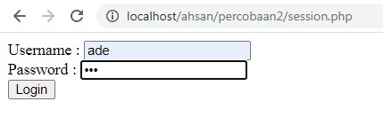

# koneksi database 
## Kode Program
```php
<?php

$koneksi = mysqli_connect('localhost', 'root', '', 'basisdata') or die ('koneksi gagal');

if ($koneksi) {
    echo "<br> koneksi aman <br>";
} else {
    echo "error, tidak bisa koneksi ke database";
}
```
## Hasil

## Analisis
- `$koneksi`: Variabel yang menyimpan hasil koneksi ke database MySQL.
- `'localhost'`: Menentukan server database MySQL yang dijalankan di mesin lokal.
- `'root'`: Nama pengguna (username) untuk mengakses database.
- `''`: Kata sandi (password) untuk mengakses database. Kosong dalam contoh ini, yang sering digunakan untuk konfigurasi lokal.
- `'basisdata'`: Nama basis data (database) yang akan diakses.
- `or die('koneksi gagal')`: Jika koneksi gagal, script akan berhenti eksekusi dan menampilkan pesan 'koneksi gagal'. Ini adalah cara untuk menangani kesalahan koneksi dengan menampilkan pesan kesalahan yang sederhana.
- `if ($koneksi)`: Memeriksa apakah koneksi berhasil. Variabel `$koneksi` akan bernilai `true` jika koneksi berhasil, dan `false` jika tidak.
- `echo "<br> koneksi aman <br>";`: Menampilkan pesan "koneksi aman" jika koneksi berhasil.
- `else`: Bagian else ini sebenarnya tidak pernah dieksekusi karena `or die('koneksi gagal')` pada pernyataan `mysqli_connect` akan menghentikan script jika koneksi gagal.
- `echo "error, tidak bisa koneksi ke database";`: Menampilkan pesan kesalahan jika koneksi gagal. Namun, seperti dijelaskan, bagian ini tidak akan pernah dijalankan karena `or die` sudah menangani kegagalan koneksi.
## Kesimpulan
Kode PHP ini mencoba menghubungkan ke database MySQL dan menampilkan pesan "koneksi aman" jika berhasil. Jika koneksi gagal, script berhenti dan menampilkan pesan "koneksi gagal".
# tampilkan data
## Kode Program
```php
<!DOCTYPE html>
<html lang="en">
<head>
    <meta charset="UTF-8">
    <meta name="viewport" content="width=device-width, initial-scale=1.0">
    <title>index tabel</title>
</head>
<body>
    <h2>Data Siswa Berprestasi</h2>
    <a href="tambah.php">+Tambah Data Baru</a>
    <table border="5">
    <tr>
        <th>id_siswa</th>
        <th>nama</th>
        <th>email</th>
        <th>jenis_kelamin</th>
        <th>alamat</th>
        <th>Aksi</th>
    </tr>

    <?php
    include "koneksi.php";
    $i = 1;
    $query = mysqli_query($koneksi, "SELECT * FROM siswa");
    while ($data = mysqli_fetch_array($query)) {
    ?>

    <tr>
 
        <td><?php echo $i; ?></td>
        <td><?php echo $data['nama']; ?></td>
        <td><?php echo $data['email']; ?></td>
        <td><?php echo $data['jenis_kelamin']; ?></td>
        <td><?php echo $data['alamat']; ?></td>

        <td>
            <a href="ubah.php?id=<?= $data['id_siswa']; ?>">Ubah</a> |
            <a href="hapus.php?id=<?= $data['id_siswa']; ?>">Hapus</a> |
        </td>
    </tr>
    <?php 
    $i++;
    }
    ?>
    </table>
</body>
</html>
```
## Hasil

## Analisis
- `<!DOCTYPE html>`: Menentukan tipe dokumen sebagai HTML5.
- `<html lang="en">`: Elemen root dari dokumen HTML dengan bahasa yang diatur ke Inggris.
- `<head>`: Bagian dokumen yang berisi metadata.
- `<meta charset="UTF-8">`: Menentukan set karakter yang digunakan adalah UTF-8.
- `<meta name="viewport" content="width=device-width, initial-scale=1.0">`: Mengatur viewport agar halaman dapat responsif.
- `<title>index tabel</title>`: Menentukan judul halaman sebagai "index tabel".
- `<body>`: Bagian utama dari dokumen HTML.
- `<h2>Data Siswa Berprestasi</h2>`: Menampilkan judul bagian dengan teks "Data Siswa Berprestasi".
- `<a href="tambah.php">+Tambah Data Baru</a>`: Tautan untuk menambah data baru, mengarahkan ke "tambah.php".
- `<table border="5">`: Membuat tabel dengan border sebesar 5 piksel.
- `<tr>`: Mendefinisikan baris dalam tabel.
- `<th>`: Mendefinisikan header kolom dalam tabel untuk `id_siswa`, `nama`, `email`, `jenis_kelamin`, `alamat`, dan `Aksi`.
- `include "koneksi.php";`: Menghubungkan skrip PHP ke file koneksi database `koneksi.php`.
- `$i = 1;`: Menginisialisasi variabel penghitung untuk nomor baris.
- `$query = mysqli_query($koneksi, "SELECT * FROM siswa");`: Menjalankan query untuk mengambil semua data dari tabel `siswa`.
- `while ($data = mysqli_fetch_array($query))`: Loop untuk mengambil setiap baris data dari hasil query dan menyimpannya dalam variabel `$data`.
- `<td><?php echo $i; ?></td>`: Menampilkan nomor baris.
- `<td><?php echo $data['nama']; ?></td>`: Menampilkan nama siswa.
- `<td><?php echo $data['email']; ?></td>`: Menampilkan email siswa.
- `<td><?php echo $data['jenis_kelamin']; ?></td>`: Menampilkan jenis kelamin siswa.
- `<td><?php echo $data['alamat']; ?></td>`: Menampilkan alamat siswa.
- `<a href="ubah.php?id=<?= $data['id_siswa']; ?>">Ubah</a>`: Tautan untuk mengubah data siswa berdasarkan `id_siswa`.
- `<a href="hapus.php?id=<?= $data['id_siswa']; ?>">Hapus</a>`: Tautan untuk menghapus data siswa berdasarkan `id_siswa`.
- `$i++`: Menambahkan nilai variabel `$i` untuk nomor baris berikutnya.
- `</tr>`: Menutup baris tabel.
- `</table>`: Menutup tabel.
- `</body>`: Menutup bagian body dokumen HTML.
- `</html>`: Menutup dokumen HTML.

## Kesimpulan

Kode ini membuat halaman web yang menampilkan tabel data siswa berprestasi dari database. Data siswa diambil dari database `siswa` dan ditampilkan dalam tabel dengan opsi untuk mengubah dan menghapus data. Tautan untuk menambah data baru juga disediakan.
# tambahkan data
## Kode Program
```php
<!DOCTYPE html>
<html lang="en">
<head>
    <title>Document</title>
</head>
<body>
    <h2>Tambah Data</h2>
    <?php
    include "koneksi.php";
    

    if(isset($_POST['nama'])){
        $nama           = $_POST['nama'];
        $email          = $_POST['email'];
        $jenis_kelamin  = $_POST['jenis_kelamin'];
        $alamat         = $_POST['alamat'];

        $query = mysqli_query($koneksi, "INSERT into siswa(nama,email,jenis_kelamin,alamat) values ('$nama','$email','$jenis_kelamin','$alamat')");
        if($query) {
            echo "<script>
            alert('Tambah data Berhasil')
            window.location.href='table.php'
            </script>";
        }else {
            echo '<script>alert("Tambah data gagal")</script>';
        }
    }


    ?>
    <form method="post" >
        <table>
            <tr>
                <td>Nama</td>
                <td><input type="text" name="nama"></td>
            </tr>
            <tr>
                <td>Email</td>
                <td><input type="text" name="email"></td>
            </tr>
            <tr>
                <td>Jenis Kelamin</td>
                <td>>
                    <select name="jenis_kelamin">
                        <option>Laki-laki</option>
                        <option>Perempuan</option>
                    </select>  
                </td>
            </tr>

            <tr>
                <td>Alamat</td>
                <td><input type="text" name="alamat"></td>
            </tr>

            <tr>
                <td></td>
                <td>
                    <button type="submit">Simpan</button>
                    <button type="reset">Reset</button>
                    <a href="table.php">Kembali</a>
                </td>
            </tr>
        </table>
    </form>
    
</body>
</html>
```
## Hasil





## Analisis
- `<!DOCTYPE html>`: Menentukan tipe dokumen sebagai HTML5.
- `<html lang="en">`: Elemen root dari dokumen HTML dengan bahasa yang diatur ke Inggris.
- `<head>`: Bagian dokumen yang berisi metadata.
- `<title>Document</title>`: Menentukan judul halaman sebagai "Document".
- `<body>`: Bagian utama dari dokumen HTML.
- `<h2>Tambah Data</h2>`: Menampilkan judul bagian dengan teks "Tambah Data".
- `include "koneksi.php";`: Menghubungkan skrip PHP ke file koneksi database `koneksi.php`.
- `if(isset($_POST['nama']))`: Memeriksa apakah form telah dikirim dengan memeriksa keberadaan nilai `nama` dalam array `$_POST`.
- `$nama = $_POST['nama'];`: Mengambil nilai `nama` dari input form dan menyimpannya dalam variabel `$nama`.
- `$email = $_POST['email'];`: Mengambil nilai `email` dari input form dan menyimpannya dalam variabel `$email`.
- `$jenis_kelamin = $_POST['jenis_kelamin'];`: Mengambil nilai `jenis_kelamin` dari input form dan menyimpannya dalam variabel `$jenis_kelamin`.
- `$alamat = $_POST['alamat'];`: Mengambil nilai `alamat` dari input form dan menyimpannya dalam variabel `$alamat`.
- `mysqli_query($koneksi, "INSERT into siswa(nama,email,jenis_kelamin,alamat) values ('$nama','$email','$jenis_kelamin','$alamat')")`: Menjalankan query untuk menambahkan data baru ke tabel `siswa`.
- `if($query)`: Memeriksa apakah query berhasil.
- `echo "<script>alert('Tambah data Berhasil')window.location.href='table.php'</script>";`: Jika query berhasil, menampilkan pesan alert "Tambah data Berhasil" dan mengarahkan pengguna ke halaman `table.php`.
- `else`: Jika query gagal.
- `echo '<script>alert("Tambah data gagal")</script>';`: Menampilkan pesan alert "Tambah data gagal".
- `<form method="post">`: Membuat form dengan metode pengiriman `post`.
- `<table>`: Membuat tabel untuk mengatur elemen form.
- `Nama`: Label untuk input `nama`.
- `<input type="text" name="nama">`: Input teks untuk `nama`.
- `Email`: Label untuk input `email`.
- `<input type="text" name="email">`: Input teks untuk `email.
- `Jenis Kelamin`: Label untuk input `jenis_kelamin`.
- `<select name="jenis_kelamin">`: Dropdown untuk memilih `jenis_kelamin`.
- `<option>Laki-laki</option>`: Pilihan untuk `Laki-laki`.
- `<option>Perempuan</option>`: Pilihan untuk `Perempuan`.
- `Alamat`: Label untuk input `alamat`.
- `<input type="text" name="alamat">`: Input teks untuk `alamat`.
- Tombol `Simpan` untuk mengirim form.
- Tombol `Reset` untuk mengatur ulang form.
- Tautan `Kembali` untuk kembali ke halaman `table.php`
## Kesimpulan

Program ini membuat halaman web untuk menambah data siswa berprestasi. Data siswa dimasukkan melalui form dan disimpan ke database `siswa` dengan menggunakan query `INSERT`. Jika penambahan data berhasil, pengguna akan diarahkan ke halaman `table.php` dengan pesan sukses. Jika gagal, akan muncul pesan kesalahan.
# ubah data
## Kode Program
```php
<!DOCTYPE html>
<html lang="en">
<head>
    <title>Ubah Data</title>
</head>
<body>
    <h2>Ubah Data</h2>
    
    <?php
    include "koneksi.php"; // Ubah nama file koneksi.php sesuai dengan kebutuhan Anda

    // Menerima parameter id siswa dari URL
    $id_siswa = $_GET['id'];

    if(isset($_POST['S'])) {
        // Ambil data dari form
        $nama         = $_POST['nama'];
        $email        = $_POST['email'];
        $jenis_kelamin= $_POST['jenis_kelamin'];
        $alamat       = $_POST['alamat'];
        
        // Query untuk update data siswa
        $query = mysqli_query($koneksi, "UPDATE siswa SET nama='$nama', email='$email', jenis_kelamin='$jenis_kelamin', alamat='$alamat' WHERE id_siswa=$id_siswa");
        
        // Cek apakah query berhasil dijalankan
        if($query) {
            echo "<script>
            alert('Ubah data Berhasil')
            window.location.href='table.php'
            </script>";
        } else {
            echo '<script>alert("Ubah data gagal")</script>';
        }
    }

    // Query untuk mendapatkan data siswa berdasarkan id
    $query = mysqli_query($koneksi, "SELECT * FROM siswa WHERE id_siswa=$id_siswa");
    $data = mysqli_fetch_array($query);
    ?>

    <form method="post">
        <table>
            <tr>
                <td>Nama</td>
                <td><input type="text" name="nama" value="<?php echo $data['nama']; ?>"></td>
            </tr>
            <tr>
                <td>Email</td>
                <td><input type="email" name="email" value="<?php echo $data['email']; ?>"></td>
            </tr>
            <tr>
                <td>Jenis Kelamin</td>
                <td>
                    <select name="jenis_kelamin">
                        <option value="Laki-Laki" <?php if($data['jenis_kelamin'] == "Laki-Laki") echo 'selected'; ?>>Laki-Laki</option>
                        <option value="Perempuan" <?php if($data['jenis_kelamin'] == "Perempuan") echo 'selected'; ?>>Perempuan</option>
                    </select>
                </td>
            </tr>
            <tr>
                <td>Alamat</td>
                <td><input type="text" name="alamat" value="<?php echo $data['alamat']; ?>"></td>
            </tr>
            <tr>
                <td></td>
                <td>
                    <button type="submit" name="S">Simpan</button>
                    <button type="reset">Reset</button>
                    <a href="index.php">Kembali</a>
                </td>
            </tr>
        </table>
    </form>
    
</body>
</html>
```
## Hasil


## Analisis
- `<!DOCTYPE html>`: Menentukan tipe dokumen sebagai HTML5.
- `<html lang="en">`: Elemen root dari dokumen HTML dengan bahasa yang diatur ke Inggris.
- `<head>`: Bagian dokumen yang berisi metadata.
- `<title>Ubah Data</title>`: Menentukan judul halaman sebagai "Ubah Data".
- `<body>`: Bagian utama dari dokumen HTML.
- `<h2>Ubah Data</h2>`: Menampilkan judul bagian dengan teks "Ubah Data".
- `include "koneksi.php";`: Menghubungkan skrip PHP ke file koneksi database `koneksi.php`.
- `$id_siswa = $_GET['id'];`: Mengambil parameter `id` dari URL dan menyimpannya dalam variabel `$id_siswa`.
- `if(isset($_POST['S']))`: Memeriksa apakah form telah dikirim dengan memeriksa keberadaan nilai `S` dalam array `$_POST`.
- `$nama = $_POST['nama'];`: Mengambil nilai `nama` dari input form dan menyimpannya dalam variabel `$nama`.
- `$email = $_POST['email'];`: Mengambil nilai `email` dari input form dan menyimpannya dalam variabel `$email`.
- `$jenis_kelamin = $_POST['jenis_kelamin'];`: Mengambil nilai `jenis_kelamin` dari input form dan menyimpannya dalam variabel `$jenis_kelamin`.
- `$alamat = $_POST['alamat'];`: Mengambil nilai `alamat` dari input form dan menyimpannya dalam variabel `$alamat`.
- `mysqli_query($koneksi, "UPDATE siswa SET nama='$nama', email='$email', jenis_kelamin='$jenis_kelamin', alamat='$alamat' WHERE id_siswa=$id_siswa")`: Menjalankan query untuk mengubah data siswa berdasarkan `id_siswa`.
- `if($query)`: Memeriksa apakah query berhasil.
- `echo "<script>alert('Ubah data Berhasil')window.location.href='table.php'</script>";`: Jika query berhasil, menampilkan pesan alert "Ubah data Berhasil" dan mengarahkan pengguna ke halaman `table.php`.
- `else`: Jika query gagal.
- `echo '<script>alert("Ubah data gagal")</script>';`: Menampilkan pesan alert "Ubah data gagal".
- `mysqli_query($koneksi, "SELECT * FROM siswa WHERE id_siswa=$id_siswa")`: Menjalankan query untuk mendapatkan data siswa berdasarkan `id_siswa`.
- `$data = mysqli_fetch_array($query);`: Mengambil hasil query dan menyimpannya dalam array `$data`.
- `<form method="post">`: Membuat form dengan metode pengiriman `post`.
- `<table>`: Membuat tabel untuk mengatur elemen form.
- `Nama`: Label untuk input `nama`.
- `<input type="text" name="nama" value="<?php echo $data['nama']; ?>">`: Input teks untuk `nama` dengan nilai default dari data siswa.
- `Email`: Label untuk input `email`.
- `<input type="email" name="email" value="<?php echo $data['email']; ?>">`: Input teks untuk `email` dengan nilai default dari data siswa.
- `Jenis Kelamin`: Label untuk input `jenis_kelamin`.
- `<select name="jenis_kelamin">`: Dropdown untuk memilih `jenis_kelamin`.
- `<option value="Laki-Laki" <?php if($data['jenis_kelamin'] == "Laki-Laki") echo 'selected'; ?>>Laki-Laki</option>`: Pilihan untuk `Laki-Laki`, dipilih jika data siswa menunjukkan `Laki-Laki`.
- `<option value="Perempuan" <?php if($data['jenis_kelamin'] == "Perempuan") echo 'selected'; ?>>Perempuan</option>`: Pilihan untuk `Perempuan`, dipilih jika data siswa menunjukkan `Perempuan`.
- `Alamat`: Label untuk input `alamat`.
- `<input type="text" name="alamat" value="<?php echo $data['alamat']; ?>">`: Input teks untuk `alamat` dengan nilai default dari data siswa.
- Tombol `Simpan` untuk mengirim form.
- Tombol `Reset` untuk mengatur ulang form.
- Tautan `Kembali` untuk kembali ke halaman `index.php`.

## Kesimpulan

Program ini membuat halaman web untuk mengubah data siswa berprestasi. Data siswa diambil berdasarkan `id_siswa` yang diterima dari URL, dan ditampilkan dalam form. Setelah perubahan dilakukan, data diupdate ke database `siswa` dengan menggunakan query `UPDATE`. Jika perubahan data berhasil, pengguna akan diarahkan ke halaman `table.php` dengan pesan sukses. Jika gagal, akan muncul pesan kesalahan.
# hapus data
## Kode Program
```php
<?php

include('koneksi.php');

if(isset($_GET['id'])){


    $id = $_GET['id'];

    $query = mysqli_query($koneksi, "DELETE FROM siswa WHERE id_siswa = $id");

   if($query) {
            echo "<script>
            alert('Hapus data Berhasil')
            window.location.href='table.php'
            </script>";
        }else {
            echo '<script>alert("Hapus data gagal")</script>';
        }
}

?>
```
## Hasil


## Analisis
Berikut adalah analisis program PHP yang disediakan:

```php
<?php

include('koneksi.php');

if(isset($_GET['id'])){

    $id = $_GET['id'];

    $query = mysqli_query($koneksi, "DELETE FROM siswa WHERE id_siswa = $id");

   if($query) {
            echo "<script>
            alert('Hapus data Berhasil')
            window.location.href='table.php'
            </script>";
        }else {
            echo '<script>alert("Hapus data gagal")</script>';
        }
}

?>
```

### Analisis Program
- `<?php`: Awal dari blok kode PHP.
- `include('koneksi.php');`: Menghubungkan skrip PHP ke file koneksi database `koneksi.php`. 
- `if(isset($_GET['id']))`: Memeriksa apakah parameter `id` ada dalam URL. Jika ada, blok kode di dalamnya akan dieksekusi.
- `$id = $_GET['id'];`: Mengambil nilai `id` dari URL dan menyimpannya dalam variabel `$id`.
- `mysqli_query($koneksi, "DELETE FROM siswa WHERE id_siswa = $id")`: Menjalankan query untuk menghapus data siswa dari tabel `siswa` berdasarkan `id_siswa`.
- `if($query)`: Memeriksa apakah query berhasil dijalankan. Jika berhasil, blok kode di dalamnya akan dieksekusi.
- `alert('Hapus data Berhasil')`: Menampilkan pesan alert "Hapus data Berhasil".
- `window.location.href='table.php'`: Mengarahkan pengguna ke halaman `table.php`.
- `else`: Jika query gagal dijalankan, blok kode di dalamnya akan dieksekusi.
- `echo '<script>alert("Hapus data gagal")</script>';`: Menampilkan pesan alert "Hapus data gagal".
- `}`: Menutup blok `if(isset($_GET['id']))`.
- `?>`: Akhir dari blok kode PHP.

### Kesimpulan

Program ini adalah skrip PHP yang menghapus data siswa dari database berdasarkan `id_siswa` yang diterima dari URL. Jika penghapusan data berhasil, akan muncul pesan alert "Hapus data Berhasil" dan pengguna akan diarahkan ke halaman `table.php`. Jika penghapusan data gagal, akan muncul pesan alert "Hapus data gagal". Program ini mengandalkan file `koneksi.php` untuk menghubungkan ke database.
# session/login
## Session
### Kode Program
```php
<?php

session_start();

if (isset ($_POST ['submit'])) {
    //var_dump($_POST);
    $username = $_POST['username'];
    $password = $_POST['password'];

    $koneksi = mysqli_connect('localhost', 'root', '', 'xi_rpl_1') or die('error koneksi');
    $result = mysqli_query($koneksi, "SELECT * FROM user WHERE username = '$username' AND password = '$password'");

    $data = mysqli_fetch_assoc($result);

    if(isset($data)){
        $_SESSION['username'] = $data['username'];
        $_SESSION['nama'] = $data['nama'];
        $_SESSION['status'] = 'login';
        header('Location: user.php');
    }else{
        echo "Username dan Pasword Salah";
    }
}

?>

<!DOCTYPE html>
<html>
<head>
    <title>Login Session</title>
</head>
<body>
    <form method="post">
        <label>Username :</label>
        <input type="text" name="username">
        <br>
        <label for="">Password :</label>
        <input type="password" name="password">
        <br>
        <button type="submit" name="submit">Login</button>
    </form>
</body>
</html>
```
### Hasil

### Analisis
 - `session_start()`: Memulai atau melanjutkan sesi yang ada.
- `if (isset($_POST['submit']))`: Memeriksa apakah form telah disubmit dengan mengecek keberadaan elemen `submit` dalam array `$_POST`.
- `$username = $_POST['username'];`: Mengambil nilai yang dimasukkan ke dalam input dengan atribut `name="username"`.
- `$password = $_POST['password'];`: Mengambil nilai yang dimasukkan ke dalam input dengan atribut `name="password"`.
- `mysqli_connect('localhost', 'root', '', 'xi_rpl_1')`: Membuat koneksi ke database MySQL dengan host `localhost`, username `root`, password kosong, dan database `xi_rpl_1`.
- `mysqli_query($koneksi, "SELECT * FROM user WHERE username = '$username' AND password = '$password'")`: Melakukan query untuk mencari data pengguna berdasarkan `username` dan `password` yang dimasukkan.
- `mysqli_fetch_assoc($result)`: Mengambil hasil query sebagai array asosiatif yang berisi data pengguna jika ditemukan.
- `$_SESSION['username']`, `$_SESSION['nama']`, `$_SESSION['status']`: Menyimpan data pengguna ke dalam session setelah berhasil login.
- `header('Location: user.php');`: Mengarahkan pengguna ke halaman `user.php` setelah berhasil login.
- Jika username atau password tidak sesuai dengan yang ada di database, akan menampilkan pesan "Username dan Password Salah".
- `<form method="post">`: Membuat form dengan metode `POST` untuk mengirimkan data login.
- `<input type="text" name="username">`: Input teks untuk memasukkan `username`.
- `<input type="password" name="password">`: Input password untuk memasukkan `password`.
- `<button type="submit" name="submit">Login</button>`: Tombol untuk mengirimkan form login.

### Kesimpulan:

Program ini merupakan halaman login sederhana yang menggunakan PHP untuk memvalidasi login pengguna berdasarkan data yang ada dalam database MySQL (`xi_rpl_1`). Jika login berhasil, pengguna akan diarahkan ke halaman `user.php` dan data pengguna disimpan dalam session. Jika login gagal, akan ditampilkan pesan kesalahan "Username dan Password Salah".
## User
### Kode Program
```php
<?php
session_start();

if ($_SESSION['status'] == 'login' && $_SESSION['username'] == 'Admin') {
    header("Location: admin.php");
}

if ($_SESSION['status'] != 'login') {
    header('Location: session.php');
}

?>
<!DOCTYPE html>
<html lang="en">

<head>
    <title>Document</title>
</head>

<body>
    <h1>Halaman User</h1>

    <h1>Halo, <?= $_SESSION['nama'] ?></h1>
    <a href="logout.php">Logout</a>

</body>

</html>
```
### Hasil
>




### Analisis
- Memulai atau melanjutkan sesi yang ada. Hal ini penting karena kita menggunakan variabel `$_SESSION` untuk menyimpan dan mengambil data sesi pengguna.
- `$_SESSION['status'] == 'login' && $_SESSION['username'] == 'Admin'`: Pengecekan apakah pengguna sudah login dan memiliki status 'login'. Jika pengguna adalah 'Admin', maka akan diarahkan ke halaman `admin.php` menggunakan `header("Location: admin.php")`.
- Jika pengguna bukan 'Admin' tetapi sudah login, mereka akan tetap di halaman ini.
- `$_SESSION['status'] != 'login'`: Jika pengguna belum login (status sesi bukan 'login'), maka akan diarahkan ke halaman `session.php` menggunakan `header('Location: session.php')`.
- `<title>Document</title>`: Menetapkan judul halaman menjadi "Document".
- `<h1>Halaman User</h1>`: Menampilkan judul utama halaman untuk pengguna.
- `<h1>Halo, <?= $_SESSION['nama'] ?></h1>`: Menampilkan pesan menyapa pengguna berdasarkan nama yang tersimpan dalam sesi.
- `<a href="logout.php">Logout</a>`: Menampilkan tautan untuk logout yang mengarahkan pengguna ke halaman `logout.php` saat diklik.

### Kesimpulan:

Program ini dirancang untuk menangani halaman pengguna yang terproteksi dengan sesi. Jika pengguna tidak login atau bukan Admin, mereka akan diarahkan kembali ke halaman `session.php`. Halaman ini menunjukkan penggunaan sesi PHP (`$_SESSION`) untuk menyimpan informasi login, serta mengatur akses berdasarkan status pengguna yang terotentikasi.
## Admin
### Kode Program
```php
<?php
session_start();    

if ($_SESSION['status'] == 'login' && $_SESSION['username'] != 'Admin') {
    header("Location: user.php");
}

if ($_SESSION['status'] != 'login') {
    header('Location: session.php');
}

?>
<!DOCTYPE html>
<html lang="en">

<head>
    <title>Document</title>
</head>

<body>  
    <h1>Halaman Admin</h1>

    <h1>Halo, <?= $_SESSION['nama'] ?></h1>
    <a href="logout.php">Logout</a>

</body>

</html>
```
### Hasil
>


### Analisis
 - Memulai atau melanjutkan sesi yang ada. Ini penting untuk menggunakan variabel `$_SESSION` untuk menyimpan dan mengambil data sesi pengguna.
- `$_SESSION['status'] == 'login' && $_SESSION['username'] != 'Admin'`: Pengecekan apakah pengguna sudah login dan bukan 'Admin'. Jika kondisi ini terpenuhi, pengguna akan diarahkan ke halaman `user.php` menggunakan `header("Location: user.php")`.
- Ini menunjukkan bahwa halaman ini hanya boleh diakses oleh pengguna yang sudah login dan bukan 'Admin'.
- `$_SESSION['status'] != 'login'`: Jika pengguna belum login (status sesi bukan 'login'), maka akan diarahkan ke halaman `session.php` menggunakan `header('Location: session.php')`.
- `<title>Document</title>`: Menetapkan judul halaman menjadi "Document".
- `<h1>Halaman Admin</h1>`: Menampilkan judul utama halaman untuk admin.
- `<h1>Halo, <?= $_SESSION['nama'] ?></h1>`: Menampilkan pesan menyapa admin berdasarkan nama yang tersimpan dalam sesi.
- `<a href="logout.php">Logout</a>`: Menampilkan tautan untuk logout yang mengarahkan admin ke halaman `logout.php` saat diklik.

### Kesimpulan:

Program ini mengimplementasikan sistem otentikasi sederhana di halaman admin. Penggunaan variabel `$_SESSION` digunakan untuk menyimpan informasi login pengguna, seperti nama dan status. Pengecekan dilakukan di awal file PHP untuk memastikan bahwa pengguna memiliki sesi yang valid sebelum mereka dapat mengakses halaman admin. Jika kondisi sesuai, admin akan diarahkan ke halaman admin dengan pesan sambutan, dan jika tidak, mereka akan diarahkan kembali ke halaman login (`session.php`).
## Logout
### Kode Program
```php
<?php
session_start();

session_destroy();
session_unset();

header('Location: session.php');
```
### Hasil


### Analisis
- `session_start()`: Memulai atau melanjutkan sesi yang ada. Ini perlu dilakukan untuk mengakses dan mengelola variabel `$_SESSION`.
- `session_destroy()`: Fungsi ini menghapus semua data yang terkait dengan sesi yang sedang berjalan di server. Ini termasuk menghapus variabel-variabel yang telah disimpan dalam `$_SESSION`.
- `session_unset()`: Fungsi ini mengosongkan semua variabel sesi yang sudah ada. Ini memastikan bahwa semua data dalam `$_SESSION` benar-benar kosong setelah fungsi `session_destroy()` dipanggil.
- `header('Location: session.php');`: Setelah menghancurkan sesi dan mengosongkan variabel-variabel sesi, pengguna diarahkan kembali ke halaman `session.php`. Penggunaan fungsi `header()` dengan parameter `Location` digunakan untuk mengarahkan (redirect) pengguna ke halaman lain setelah operasi sebelumnya selesai dilakukan.

### Kesimpulan:

Program PHP di atas bertujuan untuk mengakhiri sesi pengguna dan mengarahkannya kembali ke halaman `session.php`. Langkah-langkahnya adalah menghancurkan (destroy) sesi, mengosongkan semua variabel sesi, dan kemudian melakukan redirect ke halaman login (`session.php`). Hal ini biasanya digunakan saat pengguna melakukan logout dari aplikasi untuk memastikan bahwa tidak ada informasi sesi yang tersimpan lagi setelah logout berhasil dilakukan.
## Cek_User_Admin
### Kode Program
```php
<?php

if ($_SESSION['status'] == 'login' && $_SESSION['username'] != 'Admin') {
    header("Location: user.php");
} else if ($_SESSION['status'] == 'login' && $_SESSION['username'] == 'Admin') {
    header("Location: admin.php");
}else{
    header("Location: session.php");
}
```
### Hasil


### Analisis
- `if ($_SESSION['status'] == 'login' && $_SESSION['username'] != 'Admin')`: Memeriksa apakah pengguna memiliki sesi yang sudah login dan bukan sebagai 'Admin'. Jika kondisi ini terpenuhi, pengguna akan diarahkan ke halaman `user.php`.
- Ini menunjukkan bahwa halaman `user.php` adalah untuk pengguna yang login tetapi bukan admin.
- `else if ($_SESSION['status'] == 'login' && $_SESSION['username'] == 'Admin')`: Jika pengguna memiliki sesi yang sudah login dan username adalah 'Admin', mereka akan diarahkan ke halaman `admin.php`.
- Ini menunjukkan bahwa halaman `admin.php` adalah untuk admin yang sudah login.
- `else`: Jika tidak ada sesi yang aktif (tidak ada status 'login'), maka pengguna akan diarahkan ke halaman `session.php`.
- Ini menangani kasus di mana pengguna belum login atau sesi mereka telah berakhir.

### Kesimpulan
Program ini efektif dalam mengelola pengalihan pengguna berdasarkan status login dan username mereka. Penggunaan `header("Location: ...")` digunakan untuk mengarahkan pengguna ke halaman yang sesuai setelah dilakukan pengecekan kondisi tertentu. Hal ini umum digunakan dalam aplikasi web untuk mengendalikan akses ke berbagai bagian dari aplikasi berdasarkan peran atau status pengguna.
# upload dan download
## Upload 
### Kode Program
```php
<!DOCTYPE html>
<html lang="en">
<head>
    <title>Document</title>
</head>
<body>
    <h2>Tambah Data</h2>
    <?php
    include "koneksi.php";

    // UPLOAD
    function upload(): string
    {
        $nameImage = $_FILES['gambar']['name'];
        $directoryFile = $_FILES['gambar']['tmp_name'];
        $errorImage = intval($_FILES['gambar']['error']);
        $sizeFile = $_FILES['gambar']['size'];

        // cek apakah gambar ada
        if ($errorImage === 4) {
            echo "<script>alert('Anda Belum Upload Gambar')</script>";
            return false;
        }

        // mengambil ekstensi file
        $validType = ['svg', 'jpg', 'png', 'jpeg', 'webp'];
        $extensionFile = explode(".", $nameImage);
        $extensionValid = strtolower(end($extensionFile));

        // cek apakah yang diupload gambar atau bukan
        if (!in_array($extensionValid, $validType)) {
            echo "<script>alert('yang anda Upload bukan gambar')</script>";
            return false;
        }

        // cek size file
        if ($sizeFile > 3_000_000) {
            echo "<script>alert('Ukuran File Terlalu Besar!!(Maks 3MB)')</script>";
            return false;
        }

        // upload file
        $nameImage = uniqid() . "." . $extensionValid;
        move_uploaded_file($directoryFile, "img/{$nameImage}");
        // mengembalikan namafile yg sudah divalidasi
       return $nameImage;
    }
        // UPLOAD SELESAI

    if (isset($_POST['simpan'])) {
        $nama = $_POST['nama'];
        $email = $_POST['email'];
        $jenis_kelamin = $_POST['jenis_kelamin'];
        $alamat = $_POST['alamat'];
        $gambar = upload();
        if (!$gambar) {
            return false;
        }

        // * true / false
        $query = mysqli_query($koneksi, "INSERT into siswa(nama,email,jenis_kelamin,alamat,gambar)
        values ('$nama','$email','$jenis_kelamin','$alamat', '$gambar')");

        if ($query == true) {
            echo "<script>
            alert('Tambah data Berhasil')
            window.location.href='table.php'
            </script>";
        } else {
            echo '<script>alert("Tambah data gagal")</script>';
        }
    }
    ?>
    <form method="post" enctype="multipart/form-data">
        <table>
            <tr>
                <td>Nama</td>
                <td><input type="text" name="nama"></td>
            </tr>
            <tr>
                <td>Email</td>
                <td><input type="text" name="email"></td>
            </tr>
            <tr>
                <td>Jenis Kelamin</td>
                <td>>
                    <select name="jenis_kelamin">
                        <option>Laki-laki</option>
                        <option>Perempuan</option>
                    </select>
                </td>
            </tr>
            
            <tr>
                <td>Alamat</td>
                <td><input type="text" name="alamat"></td>
            </tr>

            <tr>
                <td>Gambar</td>
                <td><input type="file" name="gambar"></td>
            </tr>

            <tr>
                <td></td>
                <td>
                    <button name="simpan" type="submit">Simpan</button>
                    <button type="reset">Reset</button>
                    <a href="table.php">Kembali</a>
                </td>
            </tr>
        </table>
    </form>
</body>
</html>
```
### Hasil


### Analisis
- HTML Boilerplate: Bagian ini merupakan struktur dasar HTML yang mencakup deklarasi dokumen, bahasa, dan elemen `head` serta `body`.
- Judul dan Heading: Menetapkan judul dokumen dan menampilkan heading "Tambah Data" di halaman.
- Koneksi ke Database: Menggunakan `include` untuk menyertakan file `koneksi.php` yang berisi detail koneksi ke database MySQL.
- Deklarasi Fungsi Upload: Fungsi `upload` menangani proses upload file gambar dengan beberapa langkah validasi.
- Cek Keberadaan Gambar: Mengecek apakah gambar sudah di-upload.
- Ekstensi File: Mengecek apakah file yang di-upload memiliki ekstensi yang valid (svg, jpg, png, jpeg, webp).
- Ukuran File: Mengecek apakah ukuran file tidak melebihi 3MB.
- Proses Upload: Jika semua validasi berhasil, file akan dipindahkan ke direktori `img` dengan nama unik.
- Mengecek Submit: Mengecek apakah tombol "Simpan" diklik.
- Mengambil Data dari Form: Mengambil data dari form (nama, email, jenis kelamin, alamat).
- Memanggil Fungsi Upload: Memanggil fungsi `upload` untuk mengupload gambar. Jika upload gagal, proses akan berhenti.
- Insert Data ke Database: Menjalankan query `INSERT` untuk menambahkan data ke tabel `siswa` di database.
- Notifikasi dan Redirect: Menampilkan notifikasi menggunakan JavaScript dan mengarahkan pengguna ke halaman `table.php` jika berhasil, atau menampilkan pesan kesalahan jika gagal.
- Atribut `enctype`: Mengatur `enctype` ke `multipart/form-data` untuk mengizinkan upload file.
- Input Fields: Mengandung input untuk nama, email, jenis kelamin, alamat, dan gambar.
- Buttons: Tombol untuk menyimpan, mereset form, dan link kembali ke halaman `table.php`.

### Kesimpulan
Program ini adalah aplikasi sederhana untuk menambah data siswa ke dalam database MySQL, termasuk upload gambar. Ini mencakup validasi dan pengecekan pada proses upload file untuk memastikan hanya file gambar yang diterima dan ukurannya tidak terlalu besar. Setelah data ditambahkan, pengguna diberi notifikasi dan diarahkan ke halaman lain untuk melihat data yang sudah diinput.

## Download
### Kode Program
```php
<?php
include "koneksi.php";

$query = mysqli_query($koneksi, 'SELECT * FROM siswa');

$data = [];
$data[] = ["ID", "Nama", "Email" ,"Jenis Kelamin", "Alamat"];
while ($row = mysqli_fetch_assoc($query)) {
    $data[] = [
        $row['id_siswa'],
        $row['nama'],
        $row['email'],
        $row['jenis_kelamin'],
        $row['alamat']
    ];
}

$namafile = "excel_data.xls";
header("Content-Type: application/vnd.ms-excel");
header("Content-Disposition: attachment;filename=\"$namafile\"");
header("Cache-Control: max-age=0");

$output = fopen("php://output", "w");

foreach ($data as $row) {
    fputcsv($output, $row, "\t");
}

fclose($output);
exit;<?php
include "koneksi.php";

$query = mysqli_query($koneksi, 'SELECT * FROM siswa');

$data = [];
$data[] = ["ID", "Nama", "Email" ,"Jenis Kelamin", "Alamat"];
while ($row = mysqli_fetch_assoc($query)) {
    $data[] = [
        $row['id_siswa'],
        $row['nama'],
        $row['email'],
        $row['jenis_kelamin'],
        $row['alamat']
    ];
}

$namafile = "excel_data.xls";
header("Content-Type: application/vnd.ms-excel");
header("Content-Disposition: attachment;filename=\"$namafile\"");
header("Cache-Control: max-age=0");

$output = fopen("php://output", "w");

foreach ($data as $row) {
    fputcsv($output, $row, "\t");
}

fclose($output);
exit;
```
### Hasil


### Analisis
- `include "koneksi.php";`: Menyertakan file koneksi untuk menghubungkan ke database MySQL.
- `mysqli_query($koneksi, 'SELECT * FROM siswa');`: Menjalankan query SQL untuk mengambil semua data dari tabel `siswa`.
- `$data = [];`: Mendeklarasikan array kosong untuk menyimpan data.
- `$data[] = ["ID", "Nama", "Email" ,"Jenis Kelamin", "Alamat"];`: Menambahkan header kolom ke array data.
- `while ($row = mysqli_fetch_assoc($query)) { ... }`: Looping melalui setiap baris hasil query dan menambahkan data ke array `$data`.
- `$namafile = "excel_data.xls";`: Menetapkan nama file untuk file yang akan diekspor.
- `header("Content-Type: application/vnd.ms-excel");`: Menetapkan tipe konten file menjadi Excel.
- `header("Content-Disposition: attachment;filename=\"$namafile\"");`: Menetapkan bahwa file yang akan dihasilkan adalah sebuah lampiran dengan nama file yang telah ditentukan.
- `header("Cache-Control: max-age=0");`: Mencegah caching agar file yang dihasilkan selalu terbaru.
- `$output = fopen("php://output", "w");`: Membuka stream keluaran untuk menulis data.
- `foreach ($data as $row) { ... }`: Melakukan iterasi pada setiap baris data.
- `fputcsv($output, $row, "\t");`: Menulis setiap baris data ke file dengan pemisah tab (`"\t"`), format yang sesuai untuk file Excel.
- `fclose($output);`: Menutup stream keluaran.
- `exit;`: Menghentikan eksekusi skrip.
### Kesimpulan
Program ini menyediakan cara yang efisien untuk mengekspor data dari database MySQL ke file Excel dengan menggunakan PHP. Ini sangat berguna untuk membuat laporan atau backup data dalam format yang mudah dibaca dan diproses lebih lanjut.