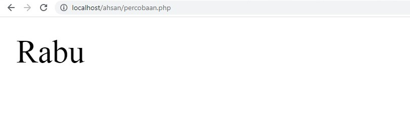
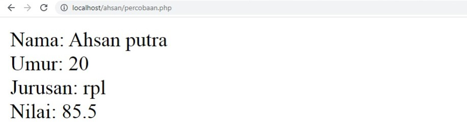

# Apa itu web dinamis dan PHP?
- Sebuah website dinamis adalah situs web yang kontennya dapat berubah secara dinamis berdasarkan input pengguna, interaksi, atau data yang diterima dari sumber eksternal. 
- PHP adalah bahasa pemrograman server-side yang sering digunakan untuk membuat website dinamis. Dengan PHP, Anda dapat membuat halaman web yang dapat berinteraksi dengan database, menghasilkan konten secara dinamis, dan melakukan berbagai tugas pemrosesan data lainnya.
# Echo & commentar
"Echo" dalam konteks PHP adalah perintah yang digunakan untuk menampilkan teks atau variabel ke dalam halaman web. Ini digunakan untuk menghasilkan output yang terlihat oleh pengguna.

Contoh penggunaan "echo" dalam PHP:
```php
<?php
echo "Hello, world!";
?>
```

Sementara itu, "commentar" (kemungkinan maksudnya adalah "comment" atau "komentar") adalah bagian dari kode yang tidak dieksekusi oleh interpreter, tetapi digunakan untuk memberikan penjelasan atau dokumentasi tentang bagian kode tersebut. Di PHP, komentar bisa ditulis menggunakan dua cara:

1. Komentar satu baris dengan tanda dua garis miring:
```php
// Ini adalah komentar satu baris
```

2. Komentar multi-baris dengan tanda slash dan asterisk:
```php
/*
Ini adalah
komentar multi-baris
*/
```
# Variable, const, operator
Variabel adalah suatu simbol yang digunakan untuk menyimpan nilai yang dapat berubah selama proses eksekusi program. Di PHP, variabel dideklarasikan dengan menggunakan tanda dollar ($) diikuti dengan nama variabelnya.

Contoh:
```php
$nama = "John";
$umur = 25;
```

Konstanta, di sisi lain, adalah nilai yang tidak dapat berubah selama eksekusi program. Mereka didefinisikan menggunakan fungsi `define()` dan tidak dapat diubah nilai atau nilai kembali setelah didefinisikan.

Contoh:
```php
define("PI", 3.14);
```

Operator adalah simbol atau kata kunci yang digunakan untuk melakukan operasi pada variabel dan nilai. Di PHP, operator dibagi menjadi beberapa jenis, seperti operator aritmatika (+, -, *, /), operator perbandingan (==, !=, <, >), operator logika (&&, ||, !), dan banyak lagi.

Contoh:
```php
$a = 10;
$b = 5;

// Operator aritmatika
$jumlah = $a + $b; // Hasilnya 15

// Operator perbandingan
if ($a > $b) {
    echo "Nilai a lebih besar dari b";
}

// Operator logika
if ($a > 0 && $b > 0) {
    echo "Kedua nilai positif";
}
```

# Operator
## Aritmatika
### Penjelasan
Operator aritmatika digunakan untuk melakukan operasi matematika pada bilangan. Berikut adalah beberapa operator aritmatika yang tersedia:
1. **Penjumlahan (+)**: Digunakan untuk menambahkan dua nilai bersama-sama.
   Contoh: `$hasil = $nilai1 + $nilai2;`
2. **Pengurangan (-)**: Digunakan untuk mengurangkan nilai kedua dari nilai pertama.
   Contoh: `$hasil = $nilai1 - $nilai2;`
3. **Perkalian (\*)**: Digunakan untuk mengalikan dua nilai bersama-sama.
   Contoh: `$hasil = $nilai1 * $nilai2;`
4. **Pembagian (/)**: Digunakan untuk membagi nilai pertama dengan nilai kedua.
   Contoh: `$hasil = $nilai1 / $nilai2;`
5. **Modulus (%)**: Mengembalikan sisa pembagian dari nilai pertama dengan nilai kedua.
   Contoh: `$hasil = $nilai1 % $nilai2;`
6. **Pangkat (\*\*)**: Digunakan untuk menghitung pangkat dari suatu nilai.
   Contoh: `$hasil = $nilai1 ** $nilai2;`
### Struktur
```php
<?php
$a = nilai_a;
$b = nilai_b;

$jumlah = $a + $b; // Pertambahan
$kurang = $a - $b; // Pengurangan
$kali = $a * $b; // Perkalian
$bagi = $a / $b; // Pembagian
$modulus = $a % $b; // Modulus (sisa pembagian)
$pangkat = $a ** $b; // Perpangkatan

echo "Pertambahan: " . $jumlah . "<br>";
echo "Pengurangan: " . $kurang . "<br>";
echo "Perkalian: " . $kali . "<br>";
echo "Pembagian: " . $bagi . "<br>";
echo "Modulus: " . $modulus . "<br>";
echo "Perpangkatan: " . $pangkat . "<br>";
?>
```
### Program
```php
<?php
$a = 5;
$b = 3;

$jumlah = $a + $b; 
$kurang = $a - $b; 
$kali = $a * $b; 
$bagi = $a / $b; 
$modulus = $a % $b; 
$pangkat = $a ** $b; 

echo "Pertambahan: " . $jumlah . "<br>";
echo "Pengurangan: " . $kurang . "<br>";
echo "Perkalian: " . $kali . "<br>";
echo "Pembagian: " . $bagi . "<br>";
echo "Modulus: " . $modulus . "<br>";
echo "Perpangkatan: " . $pangkat . "<br>";
?>
```
### Hasil

### Analisis
1. `<?php`: Tag pembuka untuk memulai blok kode PHP.
2. `$a = 5; $b = 3;`: Mendefinisikan dua variabel, `$a` dan `$b`, dengan nilai masing-masing adalah 5 dan 3.
3. `$jumlah = $a + $b;`: Menghitung jumlah dari variabel `$a` dan `$b` dan menyimpan hasilnya dalam variabel `$jumlah`.
4. `$kurang = $a - $b;`: Menghitung selisih dari variabel `$a` dan `$b` dan menyimpan hasilnya dalam variabel `$kurang`.
5. `$kali = $a * $b;`: Menghitung hasil perkalian dari variabel `$a` dan `$b` dan menyimpan hasilnya dalam variabel `$kali`.
6. `$bagi = $a / $b;`: Menghitung hasil pembagian dari variabel `$a` dan `$b` dan menyimpan hasilnya dalam variabel `$bagi`.
7. `$modulus = $a % $b;`: Menghitung sisa pembagian dari variabel `$a` dibagi dengan `$b` dan menyimpan hasilnya dalam variabel `$modulus`.
8. `$pangkat = $a ** $b;`: Menghitung hasil perpangkatan dari variabel `$a` dengan pangkat `$b` dan menyimpan hasilnya dalam variabel `$pangkat`.
9. `echo "Pertambahan: " . $jumlah . "<br>";`: Mencetak hasil pertambahan variabel `$a` dan `$b`, diikuti dengan tag break `<br>` untuk membuat baris baru dalam tampilan.
10. `echo "Pengurangan: " . $kurang . "<br>";`: Mencetak hasil pengurangan variabel `$a` dan `$b`.
11. `echo "Perkalian: " . $kali . "<br>";`: Mencetak hasil perkalian variabel `$a` dan `$b`.
12. `echo "Pembagian: " . $bagi . "<br>";`: Mencetak hasil pembagian variabel `$a` dan `$b`.
13. `echo "Modulus: " . $modulus . "<br>";`: Mencetak sisa pembagian variabel `$a` dengan `$b`.
14. `echo "Perpangkatan: " . $pangkat . "<br>";`: Mencetak hasil perpangkatan variabel `$a` dengan pangkat `$b`.
15. `?>`: Tag penutup untuk mengakhiri blok kode PHP.
### Kesimpulan Program
Program tersebut melakukan operasi aritmatika dasar antara dua variabel `$a` dan `$b`, yaitu pertambahan, pengurangan, perkalian, pembagian, modulus, dan perpangkatan. Hasil dari setiap operasi tersebut disimpan dalam variabel yang sesuai (`$jumlah`, `$kurang`, `$kali`, `$bagi`, `$modulus`, dan `$pangkat`). Setelah itu, program mencetak hasil dari masing-masing operasi tersebut dengan menggunakan pernyataan `echo`. Jadi, kesimpulan dari program ini adalah bahwa ia melakukan operasi aritmatika dasar dan mencetak hasilnya menggunakan PHP.
## Perbandingan
### Penjelasan
Operator perbandingan digunakan untuk membandingkan dua nilai dan menghasilkan nilai boolean yang menunjukkan apakah perbandingan tersebut benar atau salah. Berikut adalah beberapa operator perbandingan yang tersedia:
1. **Sama dengan (=)(=)**: Memeriksa apakah dua nilai sama.
   Contoh: `$hasil = ($nilai1 == $nilai2);`
2. **Tidak sama dengan (!=)**: Memeriksa apakah dua nilai tidak sama.
   Contoh: `$hasil = ($nilai1 != $nilai2);`
3. **Lebih besar dari (>)**: Memeriksa apakah nilai pertama lebih besar dari nilai kedua.
   Contoh: `$hasil = ($nilai1 > $nilai2);`
4. **Lebih kecil dari (<)**: Memeriksa apakah nilai pertama lebih kecil dari nilai kedua.
   Contoh: `$hasil = ($nilai1 < $nilai2);`
5. **Lebih besar atau sama dengan (>=)**: Memeriksa apakah nilai pertama lebih besar dari atau sama dengan nilai kedua.
   Contoh: `$hasil = ($nilai1 >= $nilai2);`
6. **Lebih kecil atau sama dengan (<=)**: Memeriksa apakah nilai pertama lebih kecil dari atau sama dengan nilai kedua.
   Contoh: `$hasil = ($nilai1 <= $nilai2);`
### Struktur
```php
<?php
$a = nilai_a;
$b = nilai_b;

$sama_dengan = $a == $b; // Sama dengan
$tidak_sama_dengan = $a != $b; // Tidak sama dengan
$lebih_besar = $a > $b; // Lebih besar
$lebih_kecil = $a < $b; // Lebih kecil
$lebih_besar_sama_dengan = $a >= $b; // Lebih besar atau sama dengan
$lebih_kecil_sama_dengan = $a <= $b; // Lebih kecil atau sama dengan

// Output
echo "Apakah \$a sama dengan \$b? " . ($sama_dengan ? 'Ya' : 'Tidak') . "<br>";
echo "Apakah \$a tidak sama dengan \$b? " . ($tidak_sama_dengan ? 'Ya' : 'Tidak') . "<br>";
echo "Apakah \$a lebih besar dari \$b? " . ($lebih_besar ? 'Ya' : 'Tidak') . "<br>";
echo "Apakah \$a lebih kecil dari \$b? " . ($lebih_kecil ? 'Ya' : 'Tidak') . "<br>";
echo "Apakah \$a lebih besar atau sama dengan \$b? " . ($lebih_besar_sama_dengan ? 'Ya' : 'Tidak') . "<br>";
echo "Apakah \$a lebih kecil atau sama dengan \$b? " . ($lebih_kecil_sama_dengan ? 'Ya' : 'Tidak') . "<br>";
?>
```
### Program
```php
<?php
$a = 5;
$b = 3;

$sama_dengan = $a == $b; 
$tidak_sama_dengan = $a != $b;
$lebih_besar = $a > $b; 
$lebih_kecil = $a < $b; 
$lebih_besar_sama_dengan = $a >= $b; 
$lebih_kecil_sama_dengan = $a <= $b; 

echo 'Apakah $a sama dengan $b ? ' . ($sama_dengan ? 'Ya' : 'Tidak') . "<br>";
echo 'Apakah $a tidak sama dengan $b ? ' . ($tidak_sama_dengan ? 'Ya' : 'Tidak') . "<br>";
echo 'Apakah $a lebih besar dari $b ? ' . ($lebih_besar ? 'Ya' : 'Tidak') . "<br>";
echo 'Apakah $a lebih kecil dari $b ? ' . ($lebih_kecil ? 'Ya' : 'Tidak') . "<br>";
echo 'Apakah $a lebih besar atau sama dengan $b ? ' . ($lebih_besar_sama_dengan ? 'Ya' : 'Tidak') . "<br>";
echo 'Apakah $a lebih kecil atau sama dengan $b ? ' . ($lebih_kecil_sama_dengan ? 'Ya' : 'Tidak') . "<br>";
?>
```
### Hasil

### Analisis
1. `<?php`: Tag pembuka untuk memulai blok kode PHP.
2. `$a = 5; $b = 3;`: Mendefinisikan dua variabel, `$a` dan `$b`, dengan nilai masing-masing adalah 5 dan 3.
3. `$sama_dengan = $a == $b;`: Memeriksa apakah nilai variabel `$a` sama dengan nilai variabel `$b`, dan hasilnya disimpan dalam variabel `$sama_dengan`. Jika benar, variabel ini akan bernilai `true`, jika tidak, variabel ini akan bernilai `false`.
4. `$tidak_sama_dengan = $a != $b;`: Memeriksa apakah nilai variabel `$a` tidak sama dengan nilai variabel `$b`, dan hasilnya disimpan dalam variabel `$tidak_sama_dengan`.
5. `$lebih_besar = $a > $b;`: Memeriksa apakah nilai variabel `$a` lebih besar dari nilai variabel `$b`, dan hasilnya disimpan dalam variabel `$lebih_besar`.
6. `$lebih_kecil = $a < $b;`: Memeriksa apakah nilai variabel `$a` lebih kecil dari nilai variabel `$b`, dan hasilnya disimpan dalam variabel `$lebih_kecil`.
7. `$lebih_besar_sama_dengan = $a >= $b;`: Memeriksa apakah nilai variabel `$a` lebih besar atau sama dengan nilai variabel `$b`, dan hasilnya disimpan dalam variabel `$lebih_besar_sama_dengan`.
8. `$lebih_kecil_sama_dengan = $a <= $b;`: Memeriksa apakah nilai variabel `$a` lebih kecil atau sama dengan nilai variabel `$b`, dan hasilnya disimpan dalam variabel `$lebih_kecil_sama_dengan`.
9. `echo 'Apakah $a sama dengan $b ? ' . ($sama_dengan ? 'Ya' : 'Tidak') . "<br>";`: Mencetak hasil dari pengecekan apakah nilai variabel `$a` sama dengan nilai variabel `$b`, dengan menggunakan operator ternary (`? :`) untuk menampilkan "Ya" jika benar dan "Tidak" jika salah.
10. `echo 'Apakah $a tidak sama dengan $b ? ' a. ($tidak_sama_dengan ? 'Ya' : 'Tidak') . "<br>";`: Mencetak hasil dari pengecekan apakah nilai variabel `$a` tidak sama dengan nilai variabel `$b`.
11. `echo 'Apakah $a lebih besar dari $b ? ' . ($lebih_besar ? 'Ya' : 'Tidak') . "<br>";`: Mencetak hasil dari pengecekan apakah nilai variabel `$a` lebih besar dari nilai variabel `$b`.
12. `echo 'Apakah $a lebih kecil dari $b ? ' . ($lebih_kecil ? 'Ya' : 'Tidak') . "<br>";`: Mencetak hasil dari pengecekan apakah nilai variabel `$a` lebih kecil dari nilai variabel `$b`.
13. `echo 'Apakah $a lebih besar atau sama dengan $b ? ' . ($lebih_besar_sama_dengan ? 'Ya' : 'Tidak') . "<br>";`: Mencetak hasil dari pengecekan apakah nilai variabel `$a` lebih besar atau sama dengan nilai variabel `$b`.
14. `echo 'Apakah $a lebih kecil atau sama dengan $b ? ' . ($lebih_kecil_sama_dengan ? 'Ya' : 'Tidak') . "<br>";`: Mencetak hasil dari pengecekan apakah nilai variabel `$a` lebih kecil atau sama dengan nilai variabel `$b`.
15. `?>`: Tag penutup untuk mengakhiri blok kode PHP.
### Kesimpulan Program
Program tersebut melakukan beberapa pengecekan logika antara dua variabel `$a` dan `$b`, seperti apakah mereka sama dengan, tidak sama dengan, lebih besar, lebih kecil, lebih besar atau sama dengan, dan lebih kecil atau sama dengan. Setiap hasil pengecekan kemudian dicetak dengan menggunakan pernyataan `echo`, yang dibungkus dengan operator ternary (`? :`) untuk menampilkan "Ya" jika benar dan "Tidak" jika salah. Jadi, kesimpulan dari program ini adalah bahwa ia melakukan pengecekan logika antara dua variabel dan mencetak hasilnya menggunakan PHP.
## Logika
### Penjelasan
Operator logika digunakan untuk menggabungkan dan memanipulasi nilai-nilai boolean. Berikut adalah beberapa operator logika yang tersedia:
1. **AND (&&)**: Operator `&&` menghasilkan nilai true jika kedua operan bernilai true.
   Contoh: `$hasil = ($nilai1 && $nilai2);`
2. **OR (||)**: Operator `||` menghasilkan nilai true jika salah satu atau kedua operan bernilai true.
   Contoh: `$hasil = ($nilai1 || $nilai2);`
3. **NOT (!)**: Operator `!` mengubah nilai operand menjadi kebalikannya. Jika operand awalnya true, menjadi false, dan sebaliknya.
   Contoh: `$hasil = !$nilai;`
### Struktur
```php
<?php
$abc = nilai_abc;
$def = nilai_def;
$ghi = nilai_ghi;

$and = ($abc < $def) && ($def < $ghi); // Operator AND
$or = ($abc < $def) || ($def < $ghi); // Operator OR
$not = !($abc < $def); // Operator NOT

echo "Apakah $abc lebih kecil dari $def dan $def lebih kecil dari $ghi ? " . ($and ? 'Ya' : 'Tidak') . "<br>";
echo "Apakah $abc lebih kecil dari $def atau $def lebih kecil dari $ghi ? " . ($or ? 'Ya' : 'Tidak') . "<br>";
echo "Apakah $abc tidak lebih kecil dari $def ? " . ($not ? 'Ya' : 'Tidak') . "<br>";
?>
```
### Program
```php
<?php
$a = 5;
$b = 3;
$c = 7;

$and = ($a < $b) && ($b < $c); 
$or = ($a < $b) || ($b < $c); 
$not = !($a < $b); 

echo "Apakah $a lebih kecil dari $b dan $b lebih kecil dari $c ? " . ($and ? 'Ya' : 'Tidak') . "<br>";
echo "Apakah $a lebih kecil dari $b atau $b lebih kecil dari $c ? " . ($or ? 'Ya' : 'Tidak') . "<br>";
echo "Apakah $a tidak lebih kecil dari $b ? " . ($not ? 'Ya' : 'Tidak') . "<br>";
?>
```
### Hasil

### Analisis
1. `<?php`: Tag pembuka untuk memulai blok kode PHP.
2. `$a = 5; $b = 3; $c = 7;`: Mendefinisikan tiga variabel, `$a`, `$b`, dan `$c`, dengan nilai masing-masing adalah 5, 3, dan 7.
3. `$and = ($a < $b) && ($b < $c);`: Menggunakan operator logika `&&` (AND) untuk memeriksa apakah nilai `$a` kurang dari `$b` dan nilai `$b` kurang dari `$c`. Hasilnya disimpan dalam variabel `$and`.
4. `$or = ($a < $b) || ($b < $c);`: Menggunakan operator logika `||` (OR) untuk memeriksa apakah nilai `$a` kurang dari `$b` atau nilai `$b` kurang dari `$c`. Hasilnya disimpan dalam variabel `$or`.
5. `$not = !($a < $b);`: Menggunakan operator logika `!` (NOT) untuk memeriksa apakah nilai `$a` tidak kurang dari `$b`. Hasilnya disimpan dalam variabel `$not`.
6. `echo "Apakah $a lebih kecil dari $b dan $b lebih kecil dari $c ? " . ($and ? 'Ya' : 'Tidak') . "<br>";`: Mencetak hasil dari pengecekan logika `AND` antara nilai-nilai variabel `$a`, `$b`, dan `$c`.
7. `echo "Apakah $a lebih kecil dari $b atau $b lebih kecil dari $c ? " . ($or ? 'Ya' : 'Tidak') . "<br>";`: Mencetak hasil dari pengecekan logika `OR` antara nilai-nilai variabel `$a`, `$b`, dan `$c`.
8. `echo "Apakah $a tidak lebih kecil dari $b ? " . ($not ? 'Ya' : 'Tidak') . "<br>";`: Mencetak hasil dari pengecekan logika `NOT` antara nilai-nilai variabel `$a` dan `$b`.
9. `?>`: Tag penutup untuk mengakhiri blok kode PHP.
### Kesimpulan Program
Program tersebut melakukan beberapa operasi logika antara tiga variabel `$a`, `$b`, dan `$c`, seperti operasi `AND`, `OR`, dan `NOT`. Setiap hasil dari operasi tersebut kemudian dicetak dengan menggunakan pernyataan `echo`, yang dibungkus dengan operator ternary (`? :`) untuk menampilkan "Ya" jika benar dan "Tidak" jika salah. Jadi, kesimpulan dari program ini adalah bahwa ia melakukan operasi logika antara variabel-variabel dan mencetak hasilnya menggunakan PHP.
# ==Conditional Statement==
## IF
### Penjelasan
`if` adalah sebuah pernyataan kontrol alur program yang digunakan untuk menjalankan blok kode tertentu jika suatu kondisi bernilai benar (true).
### Struktur
```php
if (kondisi) {
    // blok kode yang akan dieksekusi jika kondisi benar
}
```
### Program
```php
<?php
$angka = 10;
if ($angka > 0) {
    echo "Angka adalah positif";
}
?>
```
### Hasil

### Analisis
1. `<?php`: Ini adalah tag pembuka untuk memulai blok kode PHP.
2. `$angka = 10;`: Ini mendefinisikan sebuah variabel bernama `$angka` dan menginisialisasinya dengan nilai 10.
3. `if ($angka > 0) {`: Ini adalah struktur pengendali keputusan. Kondisi yang diberikan adalah `$angka > 0`, yang akan dievaluasi sebagai benar jika nilai variabel `$angka` lebih besar dari 0.
4. `echo "Angka adalah positif";`: Jika kondisi dalam pernyataan `if` terpenuhi (nilai `$angka` lebih besar dari 0), maka pernyataan ini akan dieksekusi, mencetak teks "Angka adalah positif".
5. `}`: Ini menutup blok dari pernyataan `if`.
6. `?>`: Ini adalah tag penutup untuk mengakhiri blok kode PHP. 
### Kesimpulan Program
Program tersebut menginisialisasi variabel `$angka` dengan nilai 10, kemudian memeriksa apakah nilai variabel tersebut lebih besar dari 0. Jika ya, maka mencetak teks "Angka adalah positif". Jadi, kesimpulan dari program ini adalah bahwa karena nilai `$angka` adalah 10 (yang memenuhi kondisi), maka program akan mencetak "Angka adalah positif".
## IF-ELSE
### Penjelasan
`if-else` pada PHP digunakan untuk memberikan alternatif eksekusi kode jika suatu kondisi tidak terpenuhi. Ini memungkinkan program untuk melakukan sesuatu jika kondisi tertentu bernilai benar (true) dan melakukan sesuatu yang berbeda jika kondisi tersebut bernilai salah (false).
### Struktur
```php
if (kondisi) {
    // blok kode yang akan dieksekusi jika kondisi benar
} else {
    // blok kode yang akan dieksekusi jika kondisi salah
}
```
### Program
```php
<?php
$angka = -10;
if ($angka > 0) {
    echo "Angka adalah positif";
} else {
    echo "Angka adalah negatif atau nol";
}
?>
```
### Hasil

### Analisis
1. `<?php`: Tag pembuka untuk memulai blok kode PHP.
2. `$angka = -10;`: Mendefinisikan variabel `$angka` dan memberinya nilai -10.
3. `if ($angka > 0) {`: Struktur pengendali keputusan. Kondisi yang diberikan adalah `$angka > 0`, yang akan dievaluasi sebagai benar jika nilai variabel `$angka` lebih besar dari 0.
4. `echo "Angka adalah positif";`: Jika kondisi dalam pernyataan `if` terpenuhi (nilai `$angka` lebih besar dari 0), maka pernyataan ini akan dieksekusi, mencetak teks "Angka adalah positif".
5. `} else {`: Bagian `else` dari struktur pengendali keputusan. Jika kondisi dalam pernyataan `if` tidak terpenuhi, maka blok kode dalam bagian `else` akan dieksekusi.
6. `echo "Angka adalah negatif atau nol";`: Jika kondisi dalam pernyataan `if` tidak terpenuhi (nilai `$angka` tidak lebih besar dari 0), maka pernyataan ini akan dieksekusi, mencetak teks "Angka adalah negatif atau nol".
7. `?>`: Tag penutup untuk mengakhiri blok kode PHP.
### Kesimpulan Program
Program tersebut menginisialisasi variabel `$angka` dengan nilai -10, kemudian memeriksa apakah nilai variabel tersebut lebih besar dari 0. Jika ya, maka mencetak teks "Angka adalah positif". Namun, karena nilai `$angka` adalah -10 (yang tidak memenuhi kondisi), maka program akan mencetak "Angka adalah negatif atau nol". Jadi, kesimpulan dari program ini adalah bahwa karena nilai `$angka` adalah -10 (yang kurang dari 0), maka program mencetak "Angka adalah negatif atau nol".
## IF-ELSE IF-ELSE
### Penjelasan
`if-else if-else` pada PHP digunakan untuk mengevaluasi beberapa kondisi secara berurutan. Ini memungkinkan program untuk memilih satu dari beberapa blok kode yang akan dieksekusi berdasarkan kondisi yang memenuhi syarat.
### Struktur
```php
if (kondisi1) {
    // blok kode yang akan dieksekusi jika kondisi1 benar
} elseif (kondisi2) {
    // blok kode yang akan dieksekusi jika kondisi2 benar
} else {
    // blok kode yang akan dieksekusi jika tidak ada kondisi yang benar
}


```
### Program
```php
<?php
$angka = 75;
if ($angka > 80) {
    echo "Nilai A";
} elseif ($angka > 70) {
    echo "Nilai B";
} elseif ($angka > 60) {
    echo "Nilai C";
} else {
    echo "Nilai D";
}
?>
```
### Hasil

### Analisis
1. `<?php`: Ini adalah tag pembuka untuk memulai blok kode PHP.
2. `$angka = 75;`: Ini mendefinisikan sebuah variabel bernama `$angka` dan menginisialisasinya dengan nilai 75.
3. `if ($angka > 80) {`: Ini adalah struktur pengendali keputusan pertama. Kondisi yang diberikan adalah `$angka > 80`, yang akan dievaluasi sebagai benar jika nilai variabel `$angka` lebih besar dari 80.
4. `echo "Nilai A";`: Jika kondisi dalam pernyataan `if` terpenuhi (nilai `$angka` lebih besar dari 80), maka pernyataan ini akan dieksekusi, mencetak teks "Nilai A".
5. `elseif ($angka > 70) {`: Ini adalah bagian kedua dari struktur pengendali keputusan. Jika kondisi pada `if` sebelumnya tidak terpenuhi, maka kondisi ini akan diperiksa. Kondisi yang diberikan adalah `$angka > 70`, yang akan dievaluasi sebagai benar jika nilai variabel `$angka` lebih besar dari 70.
6. `echo "Nilai B";`: Jika kondisi dalam pernyataan `elseif` terpenuhi (nilai `$angka` lebih besar dari 70), maka pernyataan ini akan dieksekusi, mencetak teks "Nilai B".
7. `elseif ($angka > 60) {`: Bagian ketiga dari struktur pengendali keputusan. Jika kondisi pada `if` dan `elseif` sebelumnya tidak terpenuhi, maka kondisi ini akan diperiksa. Kondisi yang diberikan adalah `$angka > 60`, yang akan dievaluasi sebagai benar jika nilai variabel `$angka` lebih besar dari 60.
8. `echo "Nilai C";`: Jika kondisi dalam pernyataan `elseif` terpenuhi (nilai `$angka` lebih besar dari 60), maka pernyataan ini akan dieksekusi, mencetak teks "Nilai C".
9. `else {`: Bagian `else` dari struktur pengendali keputusan. Jika tidak ada kondisi sebelumnya yang terpenuhi, maka blok kode dalam bagian `else` akan dieksekusi.
10. `echo "Nilai D";`: Jika tidak ada kondisi sebelumnya yang terpenuhi (nilai `$angka` kurang dari atau sama dengan 60), maka pernyataan ini akan dieksekusi, mencetak teks "Nilai D".
11. `?>`: Ini adalah tag penutup untuk mengakhiri blok kode PHP.
### Kesimpulan Program
Program tersebut mengevaluasi nilai variabel `$angka` dan mencetak kategori nilai yang sesuai dengan rentang tertentu. Rentang kategori nilai adalah sebagai berikut:
- "Nilai A" jika nilai `$angka` lebih besar dari 80.
- "Nilai B" jika nilai `$angka` lebih besar dari 70.
- "Nilai C" jika nilai `$angka` lebih besar dari 60.
- "Nilai D" jika tidak memenuhi kondisi sebelumnya.
Dalam kasus ini, karena nilai `$angka` adalah 75 (lebih besar dari 70 tetapi kurang dari 80), program mencetak "Nilai B".
## SWITCH CASE
### Penjelasan
`switch` digunakan untuk memilih satu dari banyak blok kode yang akan dieksekusi. Ini sering digunakan sebagai alternatif untuk `if-elseif-else` ketika terdapat banyak kondisi yang harus dievaluasi.
### Struktur
```php
switch (ekspresi) {
    case nilai1:
        // blok kode yang akan dieksekusi jika ekspresi sama dengan nilai1
        break;
    case nilai2:
        // blok kode yang akan dieksekusi jika ekspresi sama dengan nilai2
        break;
    default:
        // blok kode yang akan dieksekusi jika tidak ada case yang sesuai
}
```
### Program
```php
<?php
$hari = 3;
switch ($hari) {
    case 1:
        echo "Senin";
        break;
    case 2:
        echo "Selasa";
        break;
    case 3:
        echo "Rabu";
        break;
    case 4:
        echo "Kamis";
        break;
    case 5:
        echo "Jumat";
        break;
    case 6:
        echo "Sabtu";
        break;
    case 7:
        echo "Minggu";
        break;
    default:
        echo "Hari tidak valid";
}
?>
```
### Hasil

### Analisis
1. `<?php`: Tag pembuka untuk memulai blok kode PHP.
2. `$hari = 3;`: Mendefinisikan variabel `$hari` dan memberinya nilai 3.
3. `switch ($hari) {`: Ini adalah struktur pengendali percabangan `switch` yang memeriksa nilai dari variabel `$hari`.
4. `case 1:`: Kasus pertama dalam percabangan `switch`, yang akan dieksekusi jika nilai variabel `$hari` sama dengan 1.
5. `echo "Senin";`: Jika kasus pertama terpenuhi (nilai `$hari` sama dengan 1), maka pernyataan ini akan dieksekusi, mencetak "Senin".
6. `break;`: Ini menghentikan eksekusi percabangan `switch` setelah satu kasus terpenuhi.
7. `case 2:`: Kasus kedua dalam percabangan `switch`, yang akan dieksekusi jika nilai variabel `$hari` sama dengan 2.
8. `echo "Selasa";`: Jika kasus kedua terpenuhi (nilai `$hari` sama dengan 2), maka pernyataan ini akan dieksekusi, mencetak "Selasa".
9. `break;`: Ini menghentikan eksekusi percabangan `switch` setelah satu kasus terpenuhi.
10. (dan seterusnya untuk case 3 sampai case 7): Ini adalah kasus-kasus berikutnya yang menentukan aksi yang akan diambil jika nilai variabel `$hari` cocok dengan nilai yang ditentukan.
11. `default:`: Ini adalah bagian akhir dari percabangan `switch` yang dieksekusi jika tidak ada kasus yang cocok.
12. `echo "Hari tidak valid";`: Jika tidak ada kasus sebelumnya yang cocok (nilai variabel `$hari` tidak sama dengan 1, 2, 3, 4, 5, 6, atau 7), maka pernyataan ini akan dieksekusi, mencetak "Hari tidak valid".
13. `}`: Ini menutup blok dari percabangan `switch`.
14. `?>`: Tag penutup untuk mengakhiri blok kode PHP.
### Kesimpulan Program
Program tersebut menggunakan struktur pengendali percabangan `switch` untuk mencetak hari berdasarkan nilai variabel `$hari`. Setiap nilai dari variabel `$hari` memiliki kasus sendiri di dalam struktur `switch`, dan program akan mencetak hari yang sesuai dengan nilai variabel `$hari`. Jika nilai tidak cocok dengan salah satu kasus yang ditentukan, program akan mencetak "Hari tidak valid". Dalam kasus ini, karena nilai `$hari` adalah 3, maka program akan mencetak "Rabu".
# ==Array==
## Array 1 dimensi
### Penjelasan
Array satu dimensi dalam PHP adalah struktur data yang digunakan untuk menyimpan satu set nilai, di mana setiap nilai memiliki indeks numerik yang unik yang dimulai dari 0. Array ini mirip dengan daftar atau himpunan nilai.
### Struktur
```php
<?php
// Mendefinisikan array satu dimensi
$nama_array = array(nilai1, nilai2, nilai3, ...);

// Mengakses nilai dalam array
$nilai_pertama = $nama_array[0];
$nilai_kedua = $nama_array[1];
// dan seterusnya...

// Menambahkan nilai baru ke dalam array
$nama_array[] = nilai_baru;

// Mengakses nilai baru dalam array
$nilai_baru = $nama_array[indeks_terakhir];
?>
```
### Program
```php
<?php
$buah = array("Apel", "Pisang", "Jeruk", "Anggur");

echo "Buah pertama: " . $buah[0] . "<br>";
echo "Buah kedua: " . $buah[1] . "<br>";
echo "Buah ketiga: " . $buah[2] . "<br>";
echo "Buah keempat: " . $buah[3] . "<br>";

$buah[] = "Mangga";

echo "Buah kelima: " . $buah[4];
?>
```
### Hasil

### Analisis
1. `<?php`: Tag pembuka untuk memulai blok kode PHP.
2. `$buah = array("Apel", "Pisang", "Jeruk", "Anggur");`: Mendefinisikan sebuah array bernama `$buah` yang berisi empat elemen: "Apel", "Pisang", "Jeruk", dan "Anggur".
3. `echo "Buah pertama: " . $buah[0] . "<br>";`: Mencetak elemen pertama dari array `$buah`, yaitu "Apel", diikuti dengan tag break `<br>` untuk membuat baris baru.
4. `echo "Buah kedua: " . $buah[1] . "<br>";`: Mencetak elemen kedua dari array `$buah`, yaitu "Pisang", diikuti dengan tag break `<br>`.
5. `echo "Buah ketiga: " . $buah[2] . "<br>";`: Mencetak elemen ketiga dari array `$buah`, yaitu "Jeruk", diikuti dengan tag break `<br>`.
6. `echo "Buah keempat: " . $buah[3] . "<br>";`: Mencetak elemen keempat dari array `$buah`, yaitu "Anggur", diikuti dengan tag break `<br>`.
7. `$buah[] = "Mangga";`: Menambahkan elemen "Mangga" ke array `$buah`, tanpa menentukan indeksnya secara eksplisit. Karena tidak ada indeks yang ditentukan, PHP secara otomatis akan menetapkan indeks berikutnya untuk elemen tersebut, dalam hal ini adalah indeks ke-4.
8. `echo "Buah kelima: " . $buah[4];`: Mencetak elemen kelima dari array `$buah`, yaitu "Mangga".
9. `?>`: Tag penutup untuk mengakhiri blok kode PHP.
### Kesimpulan Program
Program tersebut menggunakan array untuk menyimpan daftar buah. Awalnya, array tersebut memiliki empat elemen: "Apel", "Pisang", "Jeruk", dan "Anggur". Setiap elemen diakses menggunakan indeks array. Selanjutnya, program menambahkan elemen "Mangga" ke array menggunakan sintaks `$buah[] = "Mangga"`, dan kemudian mencetak elemen "Mangga" yang baru ditambahkan. Jadi, kesimpulan dari program ini adalah bahwa ia mengelola dan mencetak daftar buah menggunakan array di PHP.
## Array Asosiatif
### Penjelasan
Array asosiatif dalam PHP adalah jenis array di mana setiap elemen memiliki kunci atau label yang ditentukan oleh pengguna. Berbeda dengan array numerik, di mana kunci elemen secara otomatis ditentukan berdasarkan indeks numerik, array asosiatif memungkinkan pengguna untuk menentukan kunci sendiri untuk setiap elemen.
### Struktur
```php
<?php
// Mendefinisikan array asosiatif
$nama_array = array(
    "kunci1" => nilai1,
    "kunci2" => nilai2,
    "kunci3" => nilai3,
    // dan seterusnya...
);

// Mengakses nilai dalam array asosiatif
$nilai_kunci1 = $nama_array["kunci1"];
$nilai_kunci2 = $nama_array["kunci2"];
// dan seterusnya...

// Menambahkan pasangan kunci-nilai baru ke dalam array asosiatif
$nama_array["kunci_baru"] = nilai_baru;

// Mengakses nilai baru dalam array asosiatif
$nilai_baru = $nama_array["kunci_baru"];
?>
```
### Program
```php
<?php
$siswa = array(
    "nama" => "Ahsan putra",
    "umur" => 20,
    "jurusan" => "rpl",
    "nilai" => 85.5
);

echo "Nama: " . $siswa["nama"] . "<br>";
echo "Umur: " . $siswa["umur"] . "<br>";
echo "Jurusan: " . $siswa["jurusan"] . "<br>";
echo "Nilai: " . $siswa["nilai"];
?>
```
### Hasil

### Analisis
1. `<?php`: Tag pembuka untuk memulai blok kode PHP.
2. `$siswa = array(`: Mendefinisikan sebuah array bernama `$siswa` yang berisi beberapa informasi tentang seorang siswa. Informasi tersebut disimpan dalam bentuk pasangan kunci-nilai, di mana kunci adalah label yang mengidentifikasi setiap informasi, seperti "nama", "umur", "jurusan", dan "nilai".
3. `"nama" => "Ahsan putra",`: Pasangan kunci-nilai pertama dalam array `$siswa`, dengan kunci "nama" dan nilai "Ahsan putra".
4. `"umur" => 20,`: Pasangan kunci-nilai kedua dalam array `$siswa`, dengan kunci "umur" dan nilai 20.
5. `"jurusan" => "rpl",`: Pasangan kunci-nilai ketiga dalam array `$siswa`, dengan kunci "jurusan" dan nilai "rpl".
6. `"nilai" => 85.5`: Pasangan kunci-nilai keempat dalam array `$siswa`, dengan kunci "nilai" dan nilai 85.5.
7. `);`: Penutup array.
8. `echo "Nama: " . $siswa["nama"] . "<br>";`: Mencetak nilai yang terkait dengan kunci "nama" dari array `$siswa`, yaitu "Ahsan putra", diikuti dengan tag break `<br>` untuk membuat baris baru.
9. `echo "Umur: " . $siswa["umur"] . "<br>";`: Mencetak nilai yang terkait dengan kunci "umur" dari array `$siswa`, yaitu 20, diikuti dengan tag break `<br>`.
10. `echo "Jurusan: " . $siswa["jurusan"] . "<br>";`: Mencetak nilai yang terkait dengan kunci "jurusan" dari array `$siswa`, yaitu "rpl", diikuti dengan tag break `<br>`.
11. `echo "Nilai: " . $asiswa["nilai"];`: Mencetak nilai yang terkait dengan kunci "nilai" dari array `$asiswa`. Perlu diperhatikan bahwa ada kesalahan penulisan di sini (`$asiswa` seharusnya `$siswa`), yang akan menghasilkan kesalahan ketika kode dieksekusi.
12. `?>`: Tag penutup untuk mengakhiri blok kode PHP.
### Kesimpulan Program
Program tersebut menggunakan array asosiatif untuk menyimpan informasi tentang seorang siswa, termasuk nama, umur, jurusan, dan nilai. Setiap informasi disimpan dalam bentuk pasangan kunci-nilai, di mana kunci adalah label yang mengidentifikasi informasi yang terkait. Kemudian, program mencetak setiap informasi siswa menggunakan kunci yang sesuai dari array. Namun, ada kesalahan penulisan pada bagian mencetak nilai, di mana `$asiswa` seharusnya `$siswa`. Jadi, kesimpulan dari program ini adalah bahwa ia mengelola dan mencetak informasi tentang seorang siswa menggunakan array asosiatif di PHP.
## Array Multidimensi 
### Penjelasan
Array multidimensi dalam PHP adalah array yang memiliki satu atau lebih array di dalamnya. Ini berarti setiap elemen dalam array utama adalah array itu sendiri. Dengan array multidimensi, kita dapat mengorganisir data dalam struktur yang lebih kompleks, seperti matriks atau tabel.
### Struktur
```php
<?php
// Mendefinisikan array multidimensi
$nama_array = array(
    array(nilai11, nilai12, nilai13, ...),
    array(nilai21, nilai22, nilai23, ...),
    array(nilai31, nilai32, nilai33, ...),
    // dan seterusnya...
);

// Mengakses nilai dalam array multidimensi
$nilai_baris1_kolom1 = $nama_array[0][0];
$nilai_baris2_kolom3 = $nama_array[1][2];
// dan seterusnya...
?>
```
### Program
```php
<?php
$nilai_siswa = array(
    array("Nama", "Umur", "Nilai"),
    array("Ahsan", 16, 85.5),
    array("Taufik", 17, 90.2),
    array("Fatur", 18, 78.9)
);

echo "Nama: " . $nilai_siswa[1][0] . ", Umur: " . $nilai_siswa[1][1] . ", Nilai: " . $nilai_siswa[1][2] . "<br>";
echo "Nama: " . $nilai_siswa[2][0] . ", Umur: " . $nilai_siswa[2][1] . ", Nilai: " . $nilai_siswa[2][2] . "<br>";
echo "Nama: " . $nilai_siswa[3][0] . ", Umur: " . $nilai_siswa[3][1] . ", Nilai: " . $nilai_siswa[3][2];
?>
```
### Hasil

### Analisis
1. `<?php`: Tag pembuka untuk memulai blok kode PHP.
2. `$nilai_siswa = array(`: Mendefinisikan sebuah array multidimensi bernama `$nilai_siswa`. Array ini terdiri dari beberapa array di dalamnya, di mana setiap array di dalamnya mewakili informasi tentang seorang siswa, seperti nama, umur, dan nilai.
3. `array("Nama", "Umur", "Nilai"),`: Mendefinisikan array pertama dalam array multidimensi `$nilai_siswa`, yang berisi label kolom: "Nama", "Umur", dan "Nilai".
4. `array("Ahsan", 16, 85.5),`: Mendefinisikan array kedua dalam array multidimensi `$nilai_siswa`, yang berisi informasi tentang siswa pertama: nama "Ahsan", umur 16, dan nilai 85.5.
5. `array("Taufik", 17, 90.2),`: Mendefinisikan array ketiga dalam array multidimensi `$nilai_siswa`, yang berisi informasi tentang siswa kedua: nama "Taufik", umur 17, dan nilai 90.2.
6. `array("Fatur", 18, 78.9)`: Mendefinisikan array keempat dalam array multidimensi `$nilai_siswa`, yang berisi informasi tentang siswa ketiga: nama "Fatur", umur 18, dan nilai 78.9.
7. `);`: Penutup array.
8. `echo "Nama: " . $nilai_siswa[1][0] . ", Umur: " . $nilai_siswa[1][1] . ", Nilai: " . $nilai_siswa[1][2] . "<br>";`: Mencetak informasi tentang siswa pertama dari array multidimensi `$nilai_siswa`. Indeks luar `[1]` digunakan untuk memilih array yang berisi informasi tentang siswa pertama, dan indeks dalam array tersebut digunakan untuk memilih nilai spesifik dari informasi tersebut.
9. `echo "Nama: " . $nilai_siswa[2][0] . ", Umur: " . $nilai_siswa[2][1] . ", Nilai: " . $nilai_siswa[2][2] . "<br>";`: Mencetak informasi tentang siswa kedua dari array multidimensi `$nilai_siswa`.
10. `echo "Nama: " . $nilai_siswa[3][0] . ", Umur: " . $nilai_siswa[3][1] . ", Nilai: " . $nilai_siswa[3][2];`: Mencetak informasi tentang siswa ketiga dari array multidimensi `$nilai_siswa`.
11. `?>`: Tag penutup untuk mengakhiri blok kode PHP.
### Kesimpulan Program
Program tersebut menggunakan array multidimensi untuk menyimpan informasi tentang beberapa siswa, termasuk nama, umur, dan nilai. Setiap siswa direpresentasikan oleh sebuah array di dalam array utama `$nilai_siswa`. Setiap elemen dalam array tersebut mewakili nilai yang terkait dengan atribut siswa tertentu, seperti "Nama", "Umur", dan "Nilai". Program kemudian mencetak informasi tentang setiap siswa dengan mengakses nilai dari array multidimensi tersebut menggunakan indeks yang sesuai. Jadi, kesimpulan dari program ini adalah bahwa ia mengelola dan mencetak informasi tentang beberapa siswa menggunakan array multidimensi di PHP.
# Var_dump

# ==Looping (Perulangan)==
## `For`
### Penjelasan
perulangan `for` digunakan untuk mengulangi serangkaian pernyataan sejumlah tertentu kali. Strukturnya terdiri dari tiga bagian: inisialisasi, kondisi, dan perubahan.
### Struktur
```php
<?php
for ($i = nilai_awal; $i <= nilai_akhir; $i++) {
    // Blok kode yang akan diulang
}
?>
```
### Program
```php
<?php
for ($i = 1; $i <= 5; $i++) {
    echo $i . "<br>";
}
?>
```
### Hasil

### Analisis
1. `<?php`: Tag pembuka untuk memulai blok kode PHP.
2. `for ($i = 1; $i <= 5; $i++) {`: Memulai perulangan `for` dengan inisialisasi variabel `$i` diatur ke 1. Perulangan akan terus berlangsung selama nilai `$i` kurang dari atau sama dengan 5. Setiap iterasi, nilai `$i` akan ditambah 1.
3. `echo $i . "<br>";`: Mencetak nilai variabel `$i`, diikuti dengan tag break `<br>` untuk membuat baris baru setelah setiap nilai `$i` dicetak.
4. `}`: Tutup blok perulangan `for`.
5. `?>`: Tag penutup untuk mengakhiri blok kode PHP.
### Kesimpulan Program
Program tersebut menggunakan perulangan `for` untuk mencetak angka dari 1 hingga 5, masing-masing diikuti dengan tag break `<br>` untuk membuat baris baru dalam tampilan. Perulangan dieksekusi lima kali dengan nilai variabel iterasi `$i` mulai dari 1 dan bertambah satu setiap iterasi hingga mencapai 5, sehingga mencetak angka 1, 2, 3, 4, dan 5. Jadi, kesimpulan dari program ini adalah bahwa ia mencetak angka dari 1 hingga 5 dalam format yang terstruktur menggunakan perulangan `for` di PHP.
## `While` 
### Penjelasan
Perulangan `while` dalam PHP digunakan untuk mengeksekusi serangkaian pernyataan selama suatu kondisi bernilai benar (true). Pada setiap iterasi, kondisi diuji terlebih dahulu, dan jika kondisi tersebut benar, blok kode di dalamnya dieksekusi.
### Struktur
```php
<?php
$nilai_awal = nilai_awal;
while (kondisi) {
    // Blok kode yang akan diulang
    pernyataan_pengubah_nilai;
}
?>
```
### Program
```php
<?php
$i = 1;
while ($i <= 6) {
    echo $i . "<br>";
    $i++;
}
?>
```
### Hasil

### Analisis
1. `<?php`: Tag pembuka untuk memulai blok kode PHP.
2. `$i = 1;`: Mendefinisikan variabel `$i` dan menginisialisasinya dengan nilai 1.
3. `while ($i <= 6) {`: Memulai perulangan `while`. Perulangan akan terus berlanjut selama nilai variabel `$i` kurang dari atau sama dengan 6.
4. `echo $i . "<br>";`: Mencetak nilai variabel `$i`, diikuti dengan tag break `<br>` untuk membuat baris baru setelah setiap nilai `$i` dicetak.
5. `$i++;`: Menginkrementasikan nilai variabel `$i` dengan 1 setiap kali perulangan dilakukan. Ini penting untuk menghindari perulangan tak terbatas dan membuat perulangan mencapai batas kondisi yang ditentukan.
6. `}`: Tutup blok perulangan `while`.
7. `?>`: Tag penutup untuk mengakhiri blok kode PHP.
### Kesimpulan Program
Program tersebut menggunakan perulangan `while` untuk mencetak angka dari 1 hingga 6, masing-masing diikuti dengan tag break `<br>` untuk membuat baris baru dalam tampilan. Perulangan akan terus berlanjut selama nilai variabel `$i` kurang dari atau sama dengan 6. Setiap kali iterasi, nilai variabel `$i` akan ditambah satu menggunakan operator increment `$i++`. Jadi, kesimpulan dari program ini adalah bahwa ia mencetak angka dari 1 hingga 6 dalam format yang terstruktur menggunakan perulangan `while` di PHP.
## `Do-while`
### Penjelasan
Perulangan `do-while` dalam PHP hampir mirip dengan `while`, namun dengan struktur yang sedikit berbeda. Dalam perulangan `Do-while`, blok kode dieksekusi terlebih dahulu, dan kemudian kondisi dievaluasi. Jika kondisi masih bernilai benar, perulangan akan terus berlanjut.
### Struktur
```php
<?php
$nilai_awal = nilai_awal;
do {
    // Blok kode yang akan diulang
    pernyataan_pengubah_nilai;
} while (kondisi);
?>
```
### Program
```php
<?php
$i = 1;
do {
    echo $i . "<br>";
    $i++;
} while ($i <= 7);
?>
```
### Hasil

### Analisis
1. `<?php`: Tag pembuka untuk memulai blok kode PHP.
2. `$i = 1;`: Mendefinisikan variabel `$i` dan menginisialisasinya dengan nilai 1.
3. `do {`: Memulai blok perulangan `do-while`. Ini berarti bahwa blok kode di dalamnya akan dieksekusi setidaknya sekali, bahkan jika kondisi yang diberikan tidak terpenuhi.
4. `echo $i . "<br>";`: Mencetak nilai variabel `$i`, diikuti dengan tag break `<br>` untuk membuat baris baru setelah setiap nilai `$i` dicetak.
5. `$i++;`: Menginkrementasikan nilai variabel `$i` dengan 1 setiap kali perulangan dilakukan. Ini penting untuk mencegah perulangan tak terbatas.
6. `} while ($i <= 7);`: Tutup blok perulangan `do-while`. Setelah blok kode dieksekusi sekali, kondisi yang diberikan akan diperiksa. Jika kondisi masih terpenuhi (nilai variabel `$i` kurang dari atau sama dengan 7), maka perulangan akan terus berlanjut.
7. `?>`: Tag penutup untuk mengakhiri blok kode PHP.
### Kesimpulan Program
Program tersebut menggunakan perulangan `do-while` untuk mencetak angka dari 1 hingga 7, masing-masing diikuti dengan tag break `<br>` untuk membuat baris baru dalam tampilan. Blok kode di dalam perulangan `do-while` akan dieksekusi setidaknya sekali, bahkan jika kondisi yang diberikan tidak terpenuhi. Setelah itu, kondisi yang diberikan akan diperiksa. Jika kondisi masih terpenuhi (nilai variabel `$i` kurang dari atau sama dengan 7), maka perulangan akan terus berlanjut. Jadi, kesimpulan dari program ini adalah bahwa ia mencetak angka dari 1 hingga 7 dalam format yang terstruktur menggunakan perulangan `do-while` di PHP.
## `Foreach`
### Penjelasan
Perulangan `foreach` dalam PHP digunakan khusus untuk mengulangi setiap elemen dalam sebuah array. Ini memungkinkan kita untuk mengakses setiap nilai dalam array secara langsung tanpa menggunakan indeks.
### Struktur
```php
<?php
foreach ($array as $nilai) {
    // Blok kode yang akan diulang untuk setiap elemen dalam $array
}
?>
```
### Program
```php
<?php
$buah = array("Apel", "Pisang", "Jeruk", "Anggur");
foreach ($buah as $nilai) {
    echo $nilai . "<br>";
}
?>
```
### Hasil

### Analisis
1. `<?php`: Tag pembuka untuk memulai blok kode PHP.
2. `$buah = array("Apel", "Pisang", "Jeruk", "Anggur");`: Mendefinisikan sebuah array `$buah` yang berisi beberapa jenis buah: "Apel", "Pisang", "Jeruk", dan "Anggur".
3. `foreach ($buah as $nilai) {`: Memulai perulangan `foreach`. Perulangan ini akan mengulang setiap elemen dalam array `$buah` dan menyimpan nilai setiap elemen ke variabel `$nilai`.
4. `echo $nilai . "<br>";`: Mencetak nilai dari setiap elemen buah, diikuti dengan tag break `<br>` untuk membuat baris baru setelah setiap nilai buah dicetak.
5. `}`: Tutup blok perulangan `foreach`.
6. `?>`: Tag penutup untuk mengakhiri blok kode PHP.
### Kesimpulan Program
Program tersebut menggunakan perulangan `foreach` untuk mencetak setiap elemen dalam array `$buah`. Setiap elemen dalam array diakses secara bergantian dan disimpan dalam variabel `$nilai`, yang kemudian dicetak menggunakan pernyataan `echo`. Setiap elemen buah dicetak diikuti dengan tag break `<br>` untuk membuat baris baru dalam tampilan. Jadi, kesimpulan dari program ini adalah bahwa ia mencetak setiap elemen dalam array `$buah` menggunakan perulangan `foreach` di PHP.
# Function

# PHPForm
## GET Method
### Penjelasan
### Struktur
### Program
### Hasil
### Analisis
### Kesimpulan Program
## POST Method
### Penjelasan
### Struktur
### Program
### Hasil
### Analisis
### Kesimpulan Program