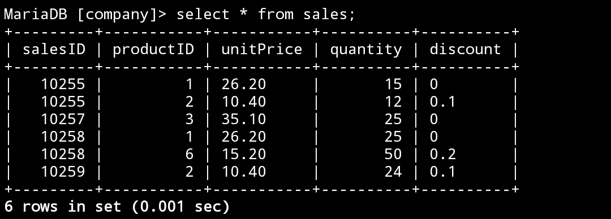

# nomor 7
## Query 
```mysql
SELECT productID FROM productsdumy
EXCEPT
SELECT productID FROM sales; 
```
## Hasil query

## Analisis
`SELECT` : untuk memilih kolom mana saja yang ingin ditampilkan / digabung.
`productID` : nama kolom yang dipilih untuk digabungkan.
`FROM productsdumy` : untuk memilih dari tabel mana saja yang data kolomnya akan digabungkan.
`EXCEPT` : untuk menampilkan gabungan dari productsdumy dan sales tapi hanya data yang tidak sama.
`SELECT` : untuk memilih kolom mana saja yang ingin ditampilkan / digabung.
`productID` : nama kolom yang dipilih untuk digabungkan.
`FROM sales` : untuk memilih dari tabel mana saja yang data kolomnya akan di gabung.
HASILNYA : hanya 4 yang tidak memiliki data yang sama.
## TABEL productsdumy

## TABEL Sales

# nomor 8
## Query
```mysql
SELECT pegawai.ID, pegawai.Nama, departemen.IdDep, departemen.Departemen
FROM pegawai
CROSS JOIN departemen
ORDER BY pegawai.ID ASC;
```
## Hasil query

## Analisis
`SELECT` : untuk memilih kolom mana saja yang ingin ditampilkan / digabung.
`pegawai.ID, pegawai.Nama` : kolom ID dan nama dari tabel pegawai dipilih.
`departemen.IdDep, departemen.Departemen` : kolom IdDep dan Departemen dari tabel departemen dipilih untuk digabungkan.
`FROM pegawai` : untuk memilih dari tabel mana data kolomnya dipilih yaitu pegawai.
`CROSS JOIN` : untuk menggabung data kolom secara bersilang (masing-masing kolom digabungkan).
`departemen` : nama kabel yang digabung. 
`ORDER BY pegawai.ID ASC` : untuk mengurutkan data berdasarkan kolom ID dari pegawai secara (Ascending) terkecil ke terbesar.
HASILNYA : masing-masing data kolom digabung satu sama lain, Jeijo dengan HRD dan Marketing, Gianna dengan HRD dan Marketing.
## TABEL pegawai

## TABEL departemen

