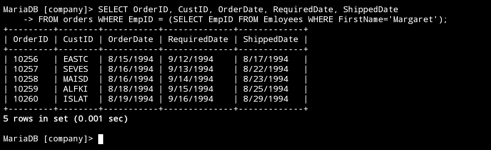
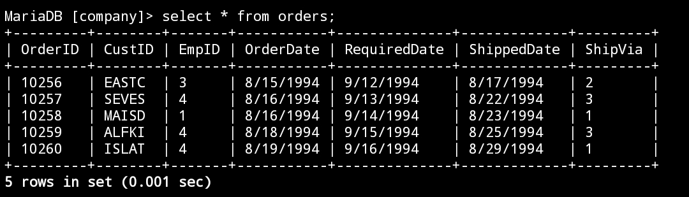
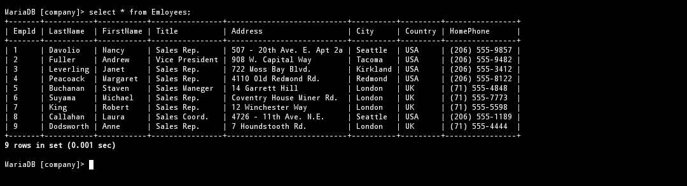

# nomor 1
## Query
```mysql
SELECT OrderID, CustID, OrderDate, RequiredDate, ShippedDate
FROM orders WHERE EmpID = (SELECT EmpID FROM Emloyees WHERE FirstName='Margaret');
```
## Hasil query

## Analisis
- `SELECT` : untuk memilih kolam mana saja yang ingin ditampilkan. 
- `OrderID, CustID, OrderDate, RequiredDate, ShippedDate` : merupakan nama-nama kolom yang dipilih untuk ditampilkan.
- `FROM orders` : untuk memilih dari tabel mana kolom tersebut dipilih. `orders` adalah nama dari tabel yang dipilih
- `EmpID = (SELECT EmpID FROM Emloyees WHERE FirstName='Margaret')` : merupakan kondisi dari WHERE yang harus dipenuhi.
- HASILNYA : jadi dalam query ada subquery ya itu pada bagian kondisi `WHERE` ada lagi `SELECT` yang kedua, dalam situ dia memilih kolom `EmpID` dari tabel `Employees` yang kolom `FirstName` nya berisi `Margaret`. Kondisinya ada lah mereka hanya menampilkan data yang kolom `EmpID` nya memiliki data yang sama dengan kolom `EmpID` pada tabel `Employees` yang kolom `FirstName` nya `Margaret`. Iya itu 5. Jadi barisan data yang memiliki `EmpID` 5 yang akan ditampilkan yaitu barisan data `EASTC` , `SEVES` , `MAISD` , `ALFKI` , dan `ISLAT`
## tabel orders

## tabel employees
